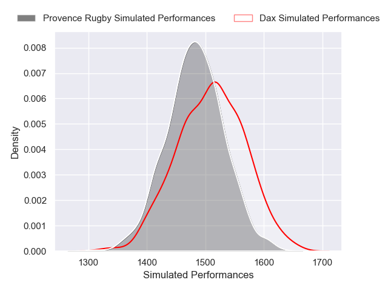
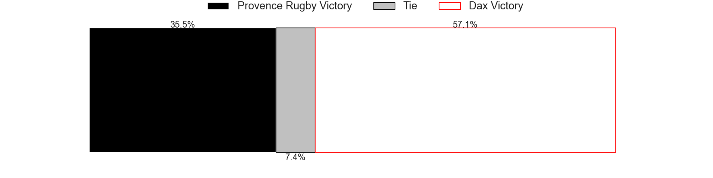
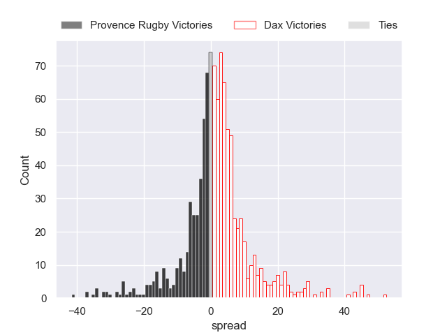

---  
title: "Pro D2 2024 Status"  
date: 2024-12-06 6:00:00 -0500  
categories: model review projection  
layout: article  
aside:  
    toc: true  
---
# Current Team Rankings

# Standings

## Current Standings

| Club                       |   Played |   Wins |   Point Differential |   Losing Bonus Points |   Try Bonus Points |   Competition Points |
|:---------------------------|---------:|-------:|---------------------:|----------------------:|-------------------:|---------------------:|
| Grenoble                   |       12 |      9 |                  110 |                     1 |                  4 |                   41 |
| Brive                      |       12 |      8 |                   73 |                     2 |                  5 |                   39 |
| Montauban                  |       12 |      8 |                   15 |                     2 |                  4 |                   38 |
| Beziers                    |       12 |      7 |                   75 |                     5 |                  4 |                   37 |
| Provence Rugby             |       13 |      7 |                   30 |                     3 |                  4 |                   37 |
| Biarritz Olympique         |       12 |      8 |                   57 |                     1 |                  2 |                   35 |
| Dax                        |       12 |      7 |                    9 |                     2 |                  3 |                   33 |
| Soyaux-Angouleme           |       12 |      7 |                  -10 |                     1 |                  3 |                   32 |
| Colomiers                  |       13 |      6 |                  -72 |                     3 |                  2 |                   31 |
| Mont-de-Marsan             |       12 |      5 |                   -6 |                     4 |                  2 |                   26 |
| Agen                       |       12 |      4 |                  -19 |                     6 |                  3 |                   25 |
| Aurillac                   |       12 |      5 |                  -36 |                     2 |                  2 |                   24 |
| Valence Romans Drome Rugby |       12 |      4 |                  -27 |                     5 |                  1 |                   22 |
| Nevers                     |       12 |      4 |                  -88 |                     4 |                  2 |                   22 |
| Oyonnax                    |       12 |      4 |                  -24 |                     4 |                  1 |                   21 |
| Nice                       |       12 |      3 |                  -87 |                     5 |                  2 |                   19 |

## Projected Remaining Table

| Club                       |   Matches Remaining |   Wins |   Point Differential |   Losing Bonus Points |   Try Bonus Points |   Competition Points |
|:---------------------------|--------------------:|-------:|---------------------:|----------------------:|-------------------:|---------------------:|
| Grenoble                   |                  18 |   12.4 |             76.237   |                   3.7 |                5.6 |                 58.9 |
| Brive                      |                  18 |   11.9 |             65.6051  |                   4   |                4.1 |                 55.6 |
| Oyonnax                    |                  18 |   11.1 |             46.8344  |                   4.5 |                4.1 |                 53   |
| Beziers                    |                  18 |   10.7 |             40.1605  |                   4.5 |                5.1 |                 52.4 |
| Provence Rugby             |                  17 |   10.3 |             35.2848  |                   4.4 |                5.1 |                 50.5 |
| Mont-de-Marsan             |                  18 |    9.7 |             13.8808  |                   5.2 |                4.9 |                 48.8 |
| Dax                        |                  18 |    8.8 |             -3.94781 |                   5.7 |                5   |                 46.1 |
| Biarritz Olympique         |                  18 |    8.3 |            -11.3247  |                   5.9 |                4.7 |                 43.8 |
| Agen                       |                  18 |    7.8 |            -22.3878  |                   6.2 |                5.2 |                 42.7 |
| Nevers                     |                  18 |    7.7 |            -30.4567  |                   5.6 |                4.6 |                 41.2 |
| Soyaux-Angouleme           |                  18 |    8.3 |            -13.8504  |                   5.8 |                1.6 |                 40.7 |
| Valence Romans Drome Rugby |                  18 |    7.5 |            -35.2542  |                   5.7 |                4.3 |                 40.2 |
| Colomiers                  |                  17 |    7.4 |            -21.3962  |                   5.8 |                3.7 |                 39.2 |
| Montauban                  |                  18 |    7.4 |            -35.6272  |                   5.9 |                3.3 |                 38.9 |
| Aurillac                   |                  18 |    6.9 |            -48.5416  |                   6   |                3.2 |                 36.7 |
| Nice                       |                  18 |    6.7 |            -55.2159  |                   5.8 |                4   |                 36.4 |

## Projected Total Table

| Club                       |   Total Matches |   Wins |   Point Differential |   Losing Bonus Points |   Try Bonus Points |   Competition Points |
|:---------------------------|----------------:|-------:|---------------------:|----------------------:|-------------------:|---------------------:|
| Grenoble                   |              30 |   21.4 |            186.237   |                   4.7 |                9.6 |                 99.9 |
| Brive                      |              30 |   19.9 |            138.605   |                   6   |                9.1 |                 94.6 |
| Beziers                    |              30 |   17.7 |            115.16    |                   9.5 |                9.1 |                 89.4 |
| Provence Rugby             |              30 |   17.3 |             65.2848  |                   7.4 |                9.1 |                 87.5 |
| Dax                        |              30 |   15.8 |              5.05219 |                   7.7 |                8   |                 79.1 |
| Biarritz Olympique         |              30 |   16.3 |             45.6753  |                   6.9 |                6.7 |                 78.8 |
| Montauban                  |              30 |   15.4 |            -20.6272  |                   7.9 |                7.3 |                 76.9 |
| Mont-de-Marsan             |              30 |   14.7 |              7.88077 |                   9.2 |                6.9 |                 74.8 |
| Oyonnax                    |              30 |   15.1 |             22.8344  |                   8.5 |                5.1 |                 74   |
| Soyaux-Angouleme           |              30 |   15.3 |            -23.8504  |                   6.8 |                4.6 |                 72.7 |
| Colomiers                  |              30 |   13.4 |            -93.3962  |                   8.8 |                5.7 |                 70.2 |
| Agen                       |              30 |   11.8 |            -41.3878  |                  12.2 |                8.2 |                 67.7 |
| Nevers                     |              30 |   11.7 |           -118.457   |                   9.6 |                6.6 |                 63.2 |
| Valence Romans Drome Rugby |              30 |   11.5 |            -62.2542  |                  10.7 |                5.3 |                 62.2 |
| Aurillac                   |              30 |   11.9 |            -84.5416  |                   8   |                5.2 |                 60.7 |
| Nice                       |              30 |    9.7 |           -142.216   |                  10.8 |                6   |                 55.4 |

# Completed Match Review

| Model | Percent Correct Predictions | Spread Error |
| ------ | ------ | ------ |
| Club Level | 62.9% | 10.2 |
| Player Level: Lineup | 64.4% | 11.7 |
| Player Level: Minutes | 71.1% | 11.4 |

# Future Predictions

## Week 14

### Nice V Nevers on 2024/12/06

Average Margin: Nice by 2.8

Average Scoreline: 21-18

### Montauban V Soyaux-Angouleme on 2024/12/06

Average Margin: Montauban by 2.8

Average Scoreline: 17-14

### Dax V Biarritz Olympique on 2024/12/06

Average Margin: Dax by 3.7

Average Scoreline: 28-24

### Agen V Oyonnax on 2024/12/06

Average Margin: Agen by 0.1

Average Scoreline: 23-23

### Mont-de-Marsan V Grenoble on 2024/12/06

Average Margin: Grenoble by 0.4

Average Scoreline: 22-21

### Aurillac V Valence Romans Drome Rugby on 2024/12/06

Average Margin: Aurillac by 3.1

Average Scoreline: 28-25

### Brive V Beziers on 2024/12/06

Average Margin: Brive by 5.6

Average Scoreline: 27-21

## Week 15

### Dax V Provence Rugby on 2024/12/12

Average Margin: Dax by 1.8

Average Scoreline: 24-23

### Agen V Aurillac on 2024/12/13

Average Margin: Agen by 5.0

Average Scoreline: 24-19

### Oyonnax V Soyaux-Angouleme on 2024/12/13

Average Margin: Oyonnax by 7.2

Average Scoreline: 27-19

### Biarritz Olympique V Nice on 2024/12/13

Average Margin: Biarritz Olympique by 6.2

Average Scoreline: 25-19

### Grenoble V Brive on 2024/12/13

Average Margin: Grenoble by 3.8

Average Scoreline: 25-21

### Beziers V Montauban on 2024/12/13

Average Margin: Beziers by 7.8

Average Scoreline: 25-18

### Valence Romans Drome Rugby V Mont-de-Marsan on 2024/12/13

Average Margin: Valence Romans Drome Rugby by 0.6

Average Scoreline: 23-23

### Nevers V Colomiers on 2024/12/13

Average Margin: Nevers by 3.9

Average Scoreline: 25-22

## Week 16

### Brive V Agen on 2024/12/19

Average Margin: Brive by 9.1

Average Scoreline: 28-19

### Soyaux-Angouleme V Nevers on 2024/12/20

Average Margin: Soyaux-Angouleme by 5.0

Average Scoreline: 21-16

### Colomiers V Biarritz Olympique on 2024/12/20

Average Margin: Colomiers by 2.8

Average Scoreline: 20-17

### Montauban V Oyonnax on 2024/12/20

Average Margin: Oyonnax by 0.9

Average Scoreline: 24-23

### Provence Rugby V Valence Romans Drome Rugby on 2024/12/20

Average Margin: Provence Rugby by 7.5

Average Scoreline: 28-21

### Nice V Grenoble on 2024/12/20

Average Margin: Grenoble by 3.7

Average Scoreline: 24-21

### Aurillac V Dax on 2024/12/20

Average Margin: Aurillac by 1.2

Average Scoreline: 29-28

### Mont-de-Marsan V Beziers on 2024/12/20

Average Margin: Mont-de-Marsan by 3.1

Average Scoreline: 22-19

## Week 17

### Grenoble V Montauban on 2025/01/09

Average Margin: Grenoble by 9.5

Average Scoreline: 32-22

### Biarritz Olympique V Soyaux-Angouleme on 2025/01/10

Average Margin: Biarritz Olympique by 4.1

Average Scoreline: 23-19

### Agen V Provence Rugby on 2025/01/10

Average Margin: Agen by 0.6

Average Scoreline: 23-22

### Dax V Brive on 2025/01/10

Average Margin: Brive by 0.0

Average Scoreline: 21-21

### Oyonnax V Aurillac on 2025/01/10

Average Margin: Oyonnax by 8.5

Average Scoreline: 26-18

### Beziers V Nice on 2025/01/10

Average Margin: Beziers by 8.8

Average Scoreline: 25-17

### Valence Romans Drome Rugby V Colomiers on 2025/01/10

Average Margin: Valence Romans Drome Rugby by 3.5

Average Scoreline: 21-18

### Nevers V Mont-de-Marsan on 2025/01/10

Average Margin: Nevers by 2.0

Average Scoreline: 23-21

## Week 18

### Nice V Oyonnax on 2025/01/17

Average Margin: Oyonnax by 1.8

Average Scoreline: 21-19

### Colomiers V Dax on 2025/01/17

Average Margin: Colomiers by 3.2

Average Scoreline: 25-22

### Brive V Nevers on 2025/01/17

Average Margin: Brive by 9.0

Average Scoreline: 25-16

### Agen V Biarritz Olympique on 2025/01/17

Average Margin: Agen by 3.5

Average Scoreline: 23-19

### Aurillac V Mont-de-Marsan on 2025/01/17

Average Margin: Mont-de-Marsan by 0.4

Average Scoreline: 23-22

### Soyaux-Angouleme V Beziers on 2025/01/17

Average Margin: Soyaux-Angouleme by 1.0

Average Scoreline: 21-20

### Provence Rugby V Grenoble on 2025/01/17

Average Margin: Provence Rugby by 1.9

Average Scoreline: 27-25

### Montauban V Valence Romans Drome Rugby on 2025/01/17

Average Margin: Montauban by 3.2

Average Scoreline: 22-18

## Week 19

### Aurillac V Provence Rugby on 2025/01/24

Average Margin: Provence Rugby by 1.2

Average Scoreline: 25-23

### Soyaux-Angouleme V Dax on 2025/01/24

Average Margin: Soyaux-Angouleme by 2.5

Average Scoreline: 20-17

### Valence Romans Drome Rugby V Nice on 2025/01/24

Average Margin: Valence Romans Drome Rugby by 4.5

Average Scoreline: 22-18

### Nevers V Agen on 2025/01/24

Average Margin: Nevers by 3.9

Average Scoreline: 22-18

### Grenoble V Biarritz Olympique on 2025/01/24

Average Margin: Grenoble by 8.7

Average Scoreline: 28-20

### Oyonnax V Brive on 2025/01/24

Average Margin: Oyonnax by 2.4

Average Scoreline: 21-19

### Beziers V Colomiers on 2025/01/24

Average Margin: Beziers by 7.9

Average Scoreline: 28-20

### Mont-de-Marsan V Montauban on 2025/01/24

Average Margin: Mont-de-Marsan by 7.1

Average Scoreline: 28-20

## Week 20

### Biarritz Olympique V Mont-de-Marsan on 2025/02/07

Average Margin: Biarritz Olympique by 2.3

Average Scoreline: 28-25

### Beziers V Oyonnax on 2025/02/07

Average Margin: Beziers by 4.0

Average Scoreline: 24-20

### Brive V Soyaux-Angouleme on 2025/02/07

Average Margin: Brive by 8.1

Average Scoreline: 27-19

### Provence Rugby V Nevers on 2025/02/07

Average Margin: Provence Rugby by 7.4

Average Scoreline: 30-23

### Nice V Aurillac on 2025/02/07

Average Margin: Nice by 4.2

Average Scoreline: 28-24

### Colomiers V Grenoble on 2025/02/07

Average Margin: Grenoble by 1.8

Average Scoreline: 31-29

### Dax V Valence Romans Drome Rugby on 2025/02/07

Average Margin: Dax by 5.4

Average Scoreline: 27-22

### Montauban V Agen on 2025/02/07

Average Margin: Montauban by 3.3

Average Scoreline: 24-21

## Week 21

### Soyaux-Angouleme V Colomiers on 2025/02/14

Average Margin: Soyaux-Angouleme by 4.5

Average Scoreline: 24-20

### Mont-de-Marsan V Provence Rugby on 2025/02/14

Average Margin: Mont-de-Marsan by 2.4

Average Scoreline: 27-25

### Montauban V Nevers on 2025/02/14

Average Margin: Montauban by 3.4

Average Scoreline: 24-21

### Agen V Beziers on 2025/02/14

Average Margin: Beziers by 0.1

Average Scoreline: 26-26

### Valence Romans Drome Rugby V Biarritz Olympique on 2025/02/14

Average Margin: Valence Romans Drome Rugby by 2.5

Average Scoreline: 24-22

### Brive V Nice on 2025/02/14

Average Margin: Brive by 10.7

Average Scoreline: 29-18

### Oyonnax V Dax on 2025/02/14

Average Margin: Oyonnax by 6.7

Average Scoreline: 26-19

### Grenoble V Aurillac on 2025/02/14

Average Margin: Grenoble by 10.6

Average Scoreline: 30-19

## Week 22

### Colomiers V Mont-de-Marsan on 2025/02/21

Average Margin: Colomiers by 0.8

Average Scoreline: 27-27

### Provence Rugby V Soyaux-Angouleme on 2025/02/21

Average Margin: Provence Rugby by 7.1

Average Scoreline: 27-20

### Nevers V Oyonnax on 2025/02/21

Average Margin: Nevers by 0.5

Average Scoreline: 22-22

### Dax V Grenoble on 2025/02/21

Average Margin: Grenoble by 0.2

Average Scoreline: 24-24

### Biarritz Olympique V Brive on 2025/02/21

Average Margin: Brive by 0.2

Average Scoreline: 23-22

### Aurillac V Agen on 2025/02/21

Average Margin: Aurillac by 2.9

Average Scoreline: 26-23

### Nice V Montauban on 2025/02/21

Average Margin: Nice by 2.6

Average Scoreline: 27-24

### Beziers V Valence Romans Drome Rugby on 2025/02/21

Average Margin: Beziers by 8.1

Average Scoreline: 27-19

## Week 23

### Montauban V Provence Rugby on 2025/02/28

Average Margin: Provence Rugby by 0.2

Average Scoreline: 24-24

### Soyaux-Angouleme V Aurillac on 2025/02/28

Average Margin: Soyaux-Angouleme by 5.8

Average Scoreline: 26-20

### Colomiers V Brive on 2025/02/28

Average Margin: Brive by 1.0

Average Scoreline: 26-25

### Grenoble V Beziers on 2025/02/28

Average Margin: Grenoble by 5.7

Average Scoreline: 31-25

### Oyonnax V Biarritz Olympique on 2025/02/28

Average Margin: Oyonnax by 6.6

Average Scoreline: 27-21

### Mont-de-Marsan V Nice on 2025/02/28

Average Margin: Mont-de-Marsan by 7.6

Average Scoreline: 27-20

### Dax V Nevers on 2025/02/28

Average Margin: Dax by 4.9

Average Scoreline: 26-22

### Agen V Valence Romans Drome Rugby on 2025/02/28

Average Margin: Agen by 4.0

Average Scoreline: 25-21

## Week 24

### Valence Romans Drome Rugby V Aurillac on 2025/03/07

Average Margin: Valence Romans Drome Rugby by 5.4

Average Scoreline: 26-21

### Oyonnax V Montauban on 2025/03/07

Average Margin: Oyonnax by 8.4

Average Scoreline: 30-22

### Nice V Agen on 2025/03/07

Average Margin: Nice by 2.9

Average Scoreline: 27-24

### Provence Rugby V Colomiers on 2025/03/07

Average Margin: Provence Rugby by 7.0

Average Scoreline: 31-24

### Biarritz Olympique V Dax on 2025/03/07

Average Margin: Biarritz Olympique by 3.9

Average Scoreline: 24-20

### Soyaux-Angouleme V Grenoble on 2025/03/07

Average Margin: Grenoble by 0.9

Average Scoreline: 22-21

### Brive V Mont-de-Marsan on 2025/03/07

Average Margin: Brive by 6.2

Average Scoreline: 26-20

### Beziers V Nevers on 2025/03/07

Average Margin: Beziers by 7.4

Average Scoreline: 25-18

## Week 25

### Aurillac V Biarritz Olympique on 2025/03/28

Average Margin: Aurillac by 1.9

Average Scoreline: 25-23

### Valence Romans Drome Rugby V Provence Rugby on 2025/03/28

Average Margin: Provence Rugby by 0.1

Average Scoreline: 24-23

### Colomiers V Oyonnax on 2025/03/28

Average Margin: Oyonnax by 0.3

Average Scoreline: 27-27

### Montauban V Brive on 2025/03/28

Average Margin: Brive by 2.1

Average Scoreline: 24-22

### Nevers V Nice on 2025/03/28

Average Margin: Nevers by 5.1

Average Scoreline: 24-19

### Mont-de-Marsan V Soyaux-Angouleme on 2025/03/28

Average Margin: Mont-de-Marsan by 5.1

Average Scoreline: 25-20

### Dax V Beziers on 2025/03/28

Average Margin: Dax by 1.5

Average Scoreline: 25-24

### Agen V Grenoble on 2025/03/28

Average Margin: Grenoble by 1.3

Average Scoreline: 24-23

## Week 26

### Oyonnax V Agen on 2025/04/04

Average Margin: Oyonnax by 7.2

Average Scoreline: 31-24

### Grenoble V Mont-de-Marsan on 2025/04/04

Average Margin: Grenoble by 7.3

Average Scoreline: 35-28

### Colomiers V Nevers on 2025/04/04

Average Margin: Colomiers by 3.3

Average Scoreline: 31-28

### Beziers V Aurillac on 2025/04/04

Average Margin: Beziers by 8.6

Average Scoreline: 26-17

### Soyaux-Angouleme V Nice on 2025/04/04

Average Margin: Soyaux-Angouleme by 5.7

Average Scoreline: 26-21

### Provence Rugby V Dax on 2025/04/04

Average Margin: Provence Rugby by 6.1

Average Scoreline: 31-25

### Brive V Valence Romans Drome Rugby on 2025/04/04

Average Margin: Brive by 9.4

Average Scoreline: 27-18

### Biarritz Olympique V Montauban on 2025/04/04

Average Margin: Biarritz Olympique by 5.6

Average Scoreline: 26-21

## Week 27

### Montauban V Dax on 2025/04/11

Average Margin: Montauban by 2.0

Average Scoreline: 27-25

### Aurillac V Colomiers on 2025/04/11

Average Margin: Aurillac by 2.8

Average Scoreline: 28-26

### Provence Rugby V Beziers on 2025/04/11

Average Margin: Provence Rugby by 3.7

Average Scoreline: 30-26

### Valence Romans Drome Rugby V Grenoble on 2025/04/11

Average Margin: Grenoble by 2.3

Average Scoreline: 27-25

### Nevers V Soyaux-Angouleme on 2025/04/11

Average Margin: Nevers by 3.3

Average Scoreline: 23-20

### Nice V Biarritz Olympique on 2025/04/11

Average Margin: Nice by 1.5

Average Scoreline: 28-27

### Agen V Brive on 2025/04/11

Average Margin: Brive by 1.1

Average Scoreline: 23-22

### Mont-de-Marsan V Oyonnax on 2025/04/11

Average Margin: Mont-de-Marsan by 2.6

Average Scoreline: 25-23

## Week 28

### Beziers V Mont-de-Marsan on 2025/04/18

Average Margin: Beziers by 4.8

Average Scoreline: 26-22

### Grenoble V Nice on 2025/04/18

Average Margin: Grenoble by 10.2

Average Scoreline: 34-24

### Colomiers V Agen on 2025/04/18

Average Margin: Colomiers by 4.2

Average Scoreline: 33-29

### Oyonnax V Valence Romans Drome Rugby on 2025/04/18

Average Margin: Oyonnax by 7.7

Average Scoreline: 32-24

### Soyaux-Angouleme V Montauban on 2025/04/18

Average Margin: Soyaux-Angouleme by 5.1

Average Scoreline: 23-18

### Brive V Provence Rugby on 2025/04/18

Average Margin: Brive by 5.6

Average Scoreline: 28-22

### Dax V Aurillac on 2025/04/18

Average Margin: Dax by 6.2

Average Scoreline: 28-21

### Nevers V Biarritz Olympique on 2025/04/18

Average Margin: Nevers by 2.1

Average Scoreline: 26-24

## Week 29

### Grenoble V Oyonnax on 2025/04/25

Average Margin: Grenoble by 5.9

Average Scoreline: 35-29

### Valence Romans Drome Rugby V Nevers on 2025/04/25

Average Margin: Valence Romans Drome Rugby by 2.9

Average Scoreline: 23-20

### Mont-de-Marsan V Dax on 2025/04/25

Average Margin: Mont-de-Marsan by 4.6

Average Scoreline: 27-23

### Montauban V Colomiers on 2025/04/25

Average Margin: Montauban by 3.4

Average Scoreline: 28-25

### Aurillac V Brive on 2025/04/25

Average Margin: Brive by 2.8

Average Scoreline: 25-22

### Biarritz Olympique V Beziers on 2025/04/25

Average Margin: Biarritz Olympique by 1.0

Average Scoreline: 26-25

### Agen V Soyaux-Angouleme on 2025/04/25

Average Margin: Agen by 3.3

Average Scoreline: 23-20

### Nice V Provence Rugby on 2025/04/25

Average Margin: Provence Rugby by 1.1

Average Scoreline: 29-28

## Week 30

### Soyaux-Angouleme V Oyonnax on 2025/05/09

Average Margin: Soyaux-Angouleme by 1.3

Average Scoreline: 24-23

### Dax V Agen on 2025/05/09

Average Margin: Dax by 4.5

Average Scoreline: 29-25

### Montauban V Beziers on 2025/05/09

Average Margin: Beziers by 1.1

Average Scoreline: 28-27

### Nevers V Aurillac on 2025/05/09

Average Margin: Nevers by 4.9

Average Scoreline: 29-25

### Provence Rugby V Biarritz Olympique on 2025/05/09

Average Margin: Provence Rugby by 5.7

Average Scoreline: 32-26

### Brive V Grenoble on 2025/05/09

Average Margin: Brive by 4.0

Average Scoreline: 28-24

### Colomiers V Nice on 2025/05/09

Average Margin: Colomiers by 5.0

Average Scoreline: 32-27

### Mont-de-Marsan V Valence Romans Drome Rugby on 2025/05/09

Average Margin: Mont-de-Marsan by 6.7

Average Scoreline: 31-24

## Week 31

### Valence Romans Drome Rugby V Soyaux-Angouleme on 2025/05/16

Average Margin: Valence Romans Drome Rugby by 2.8

Average Scoreline: 24-21

### Beziers V Brive on 2025/05/16

Average Margin: Beziers by 3.1

Average Scoreline: 27-24

### Grenoble V Nevers on 2025/05/16

Average Margin: Grenoble by 10.0

Average Scoreline: 36-26

### Oyonnax V Provence Rugby on 2025/05/16

Average Margin: Oyonnax by 3.5

Average Scoreline: 31-27

### Nice V Dax on 2025/05/16

Average Margin: Nice by 1.3

Average Scoreline: 25-24

### Agen V Mont-de-Marsan on 2025/05/16

Average Margin: Agen by 1.4

Average Scoreline: 27-25

### Biarritz Olympique V Colomiers on 2025/05/16

Average Margin: Biarritz Olympique by 4.8

Average Scoreline: 29-24

### Aurillac V Montauban on 2025/05/16

Average Margin: Aurillac by 3.3

Average Scoreline: 26-23

