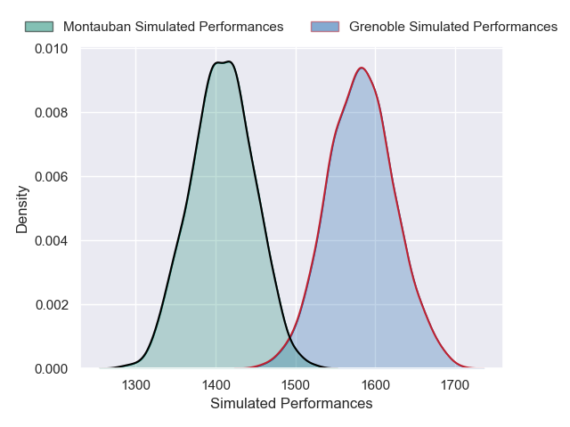
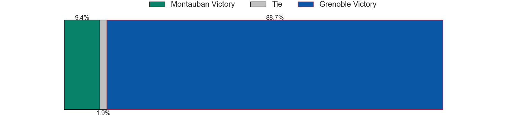
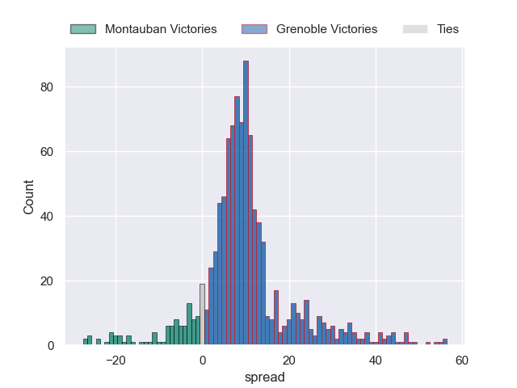

---  
title: "Pro D2 2024 Status"  
date: 2024-12-30 6:00:00 -0500  
categories: model review projection  
layout: article  
aside:  
    toc: true  
---
# Current Team Rankings

# Standings

## Current Standings

| Club                       |   Played |   Wins |   Point Differential |   Losing Bonus Points |   Try Bonus Points |   Competition Points |
|:---------------------------|---------:|-------:|---------------------:|----------------------:|-------------------:|---------------------:|
| Grenoble                   |       15 |     11 |                  149 |                     2 |                  6 |                   52 |
| Brive                      |       15 |     10 |                   80 |                     2 |                  6 |                   48 |
| Beziers                    |       15 |      8 |                   69 |                     6 |                  6 |                   44 |
| Provence Rugby             |       15 |      8 |                   39 |                     4 |                  5 |                   43 |
| Dax                        |       15 |      9 |                   11 |                     3 |                  3 |                   42 |
| Soyaux-Angouleme           |       15 |      9 |                  -21 |                     1 |                  4 |                   41 |
| Biarritz Olympique         |       15 |      9 |                   58 |                     2 |                  2 |                   40 |
| Montauban                  |       15 |      8 |                   -9 |                     4 |                  4 |                   40 |
| Mont-de-Marsan             |       15 |      7 |                    8 |                     5 |                  3 |                   36 |
| Colomiers                  |       15 |      7 |                  -71 |                     3 |                  3 |                   36 |
| Agen                       |       15 |      6 |                    7 |                     6 |                  5 |                   35 |
| Aurillac                   |       15 |      7 |                  -52 |                     2 |                  2 |                   32 |
| Nevers                     |       15 |      6 |                  -99 |                     4 |                  3 |                   31 |
| Oyonnax                    |       15 |      6 |                    8 |                     4 |                  2 |                   30 |
| Valence Romans Drome Rugby |       15 |      5 |                  -37 |                     6 |                  2 |                   28 |
| Nice                       |       15 |      3 |                 -140 |                     6 |                  3 |                   21 |

## Projected Remaining Table

| Club                       |   Matches Remaining |   Wins |   Point Differential |   Losing Bonus Points |   Try Bonus Points |   Competition Points |
|:---------------------------|--------------------:|-------:|---------------------:|----------------------:|-------------------:|---------------------:|
| Agen                       |                  15 |   11.5 |             78.253   |                   2.2 |               10.6 |                 59   |
| Grenoble                   |                  15 |   10.5 |             64.811   |                   2.9 |                9.9 |                 54.7 |
| Mont-de-Marsan             |                  15 |    9.2 |             34.7027  |                   3.8 |                6.7 |                 47.1 |
| Biarritz Olympique         |                  15 |    8.2 |             12.1786  |                   4.2 |                9.1 |                 46.1 |
| Beziers                    |                  15 |    8.2 |             14.1755  |                   4.2 |                8.9 |                 45.8 |
| Soyaux-Angouleme           |                  15 |    8.9 |             29.7481  |                   3.9 |                6.2 |                 45.7 |
| Nice                       |                  15 |    7.8 |              6.46923 |                   4.5 |                9.1 |                 44.8 |
| Oyonnax                    |                  15 |    7.9 |              4.44453 |                   4.2 |                8.1 |                 44   |
| Valence Romans Drome Rugby |                  15 |    7.4 |             -1.04442 |                   4.7 |                8.3 |                 42.5 |
| Brive                      |                  15 |    7.2 |             -3.41952 |                   5   |                8.4 |                 42.2 |
| Provence Rugby             |                  15 |    6.4 |            -19.2516  |                   5.2 |                7.9 |                 38.8 |
| Colomiers                  |                  15 |    6.2 |            -21.265   |                   5.6 |                7.2 |                 37.6 |
| Montauban                  |                  15 |    6.4 |            -27.8452  |                   4.6 |                5.8 |                 36.1 |
| Aurillac                   |                  15 |    5.9 |            -35.1669  |                   5.2 |                6.8 |                 35.6 |
| Dax                        |                  15 |    5.6 |            -33.5999  |                   5.6 |                7.3 |                 35.3 |
| Nevers                     |                  15 |    2.7 |           -103.19    |                   5.5 |                5.2 |                 21.7 |

## Projected Total Table

| Club                       |   Total Matches |   Wins |   Point Differential |   Losing Bonus Points |   Try Bonus Points |   Competition Points |
|:---------------------------|----------------:|-------:|---------------------:|----------------------:|-------------------:|---------------------:|
| Grenoble                   |              30 |   21.5 |            213.811   |                   4.9 |               15.9 |                106.7 |
| Agen                       |              30 |   17.5 |             85.253   |                   8.2 |               15.6 |                 94   |
| Brive                      |              30 |   17.2 |             76.5805  |                   7   |               14.4 |                 90.2 |
| Beziers                    |              30 |   16.2 |             83.1755  |                  10.2 |               14.9 |                 89.8 |
| Soyaux-Angouleme           |              30 |   17.9 |              8.74814 |                   4.9 |               10.2 |                 86.7 |
| Biarritz Olympique         |              30 |   17.2 |             70.1786  |                   6.2 |               11.1 |                 86.1 |
| Mont-de-Marsan             |              30 |   16.2 |             42.7027  |                   8.8 |                9.7 |                 83.1 |
| Provence Rugby             |              30 |   14.4 |             19.7484  |                   9.2 |               12.9 |                 81.8 |
| Dax                        |              30 |   14.6 |            -22.5999  |                   8.6 |               10.3 |                 77.3 |
| Montauban                  |              30 |   14.4 |            -36.8452  |                   8.6 |                9.8 |                 76.1 |
| Oyonnax                    |              30 |   13.9 |             12.4445  |                   8.2 |               10.1 |                 74   |
| Colomiers                  |              30 |   13.2 |            -92.265   |                   8.6 |               10.2 |                 73.6 |
| Valence Romans Drome Rugby |              30 |   12.4 |            -38.0444  |                  10.7 |               10.3 |                 70.5 |
| Aurillac                   |              30 |   12.9 |            -87.1669  |                   7.2 |                8.8 |                 67.6 |
| Nice                       |              30 |   10.8 |           -133.531   |                  10.5 |               12.1 |                 65.8 |
| Nevers                     |              30 |    8.7 |           -202.19    |                   9.5 |                8.2 |                 52.7 |

# Completed Match Review

| Model | Percent Correct Predictions | Spread Error |
| ------ | ------ | ------ |
| Club Level | 67.5% | 10.0 |
| Player Level: Lineup | 72.5% | 11.1 |
| Player Level: Minutes | 74.2% | 10.9 |

# Future Predictions

## Week 16

### Grenoble V Montauban on 2025/01/09

Average Margin: Grenoble by 10.0

Average Scoreline: 36-26

### Oyonnax V Aurillac on 2025/01/10

Average Margin: Oyonnax by 6.3

Average Scoreline: 44-37

### Beziers V Nice on 2025/01/10

Average Margin: Beziers by 3.8

Average Scoreline: 26-22

### Biarritz Olympique V Soyaux-Angouleme on 2025/01/10

Average Margin: Biarritz Olympique by 3.7

Average Scoreline: 36-32

### Agen V Provence Rugby on 2025/01/10

Average Margin: Agen by 9.6

Average Scoreline: 45-36

### Dax V Brive on 2025/01/10

Average Margin: Dax by 1.9

Average Scoreline: 31-29

### Nevers V Mont-de-Marsan on 2025/01/10

Average Margin: Mont-de-Marsan by 5.1

Average Scoreline: 30-25

### Valence Romans Drome Rugby V Colomiers on 2025/01/10

Average Margin: Valence Romans Drome Rugby by 4.5

Average Scoreline: 37-32

## Week 17

### Provence Rugby V Grenoble on 2025/01/17

Average Margin: Grenoble by 1.0

Average Scoreline: 29-28

### Soyaux-Angouleme V Beziers on 2025/01/17

Average Margin: Soyaux-Angouleme by 5.2

Average Scoreline: 43-38

### Brive V Nevers on 2025/01/17

Average Margin: Brive by 10.4

Average Scoreline: 36-25

### Nice V Oyonnax on 2025/01/17

Average Margin: Nice by 4.9

Average Scoreline: 32-27

### Agen V Biarritz Olympique on 2025/01/17

Average Margin: Agen by 7.9

Average Scoreline: 48-40

### Colomiers V Dax on 2025/01/17

Average Margin: Colomiers by 4.0

Average Scoreline: 37-33

### Aurillac V Mont-de-Marsan on 2025/01/17

Average Margin: Mont-de-Marsan by 0.6

Average Scoreline: 36-35

### Montauban V Valence Romans Drome Rugby on 2025/01/17

Average Margin: Montauban by 2.6

Average Scoreline: 30-28

## Week 18

### Mont-de-Marsan V Montauban on 2025/01/24

Average Margin: Mont-de-Marsan by 8.5

Average Scoreline: 32-23

### Valence Romans Drome Rugby V Nice on 2025/01/24

Average Margin: Valence Romans Drome Rugby by 3.2

Average Scoreline: 35-31

### Aurillac V Provence Rugby on 2025/01/24

Average Margin: Aurillac by 3.0

Average Scoreline: 35-32

### Oyonnax V Brive on 2025/01/24

Average Margin: Oyonnax by 3.7

Average Scoreline: 30-27

### Grenoble V Biarritz Olympique on 2025/01/24

Average Margin: Grenoble by 7.0

Average Scoreline: 42-35

### Beziers V Colomiers on 2025/01/24

Average Margin: Beziers by 5.9

Average Scoreline: 35-29

### Nevers V Agen on 2025/01/24

Average Margin: Agen by 6.7

Average Scoreline: 33-27

### Soyaux-Angouleme V Dax on 2025/01/24

Average Margin: Soyaux-Angouleme by 7.2

Average Scoreline: 41-34

## Week 19

### Provence Rugby V Nevers on 2025/02/07

Average Margin: Provence Rugby by 8.9

Average Scoreline: 43-34

### Biarritz Olympique V Mont-de-Marsan on 2025/02/07

Average Margin: Biarritz Olympique by 2.6

Average Scoreline: 36-33

### Beziers V Oyonnax on 2025/02/07

Average Margin: Beziers by 4.5

Average Scoreline: 34-29

### Brive V Soyaux-Angouleme on 2025/02/07

Average Margin: Brive by 2.9

Average Scoreline: 44-41

### Nice V Aurillac on 2025/02/07

Average Margin: Nice by 6.7

Average Scoreline: 42-36

### Montauban V Agen on 2025/02/07

Average Margin: Agen by 2.6

Average Scoreline: 31-29

### Colomiers V Grenoble on 2025/02/07

Average Margin: Grenoble by 2.1

Average Scoreline: 31-29

### Dax V Valence Romans Drome Rugby on 2025/02/07

Average Margin: Dax by 2.3

Average Scoreline: 34-32

## Week 20

### Valence Romans Drome Rugby V Biarritz Olympique on 2025/02/14

Average Margin: Valence Romans Drome Rugby by 2.7

Average Scoreline: 25-22

### Oyonnax V Dax on 2025/02/14

Average Margin: Oyonnax by 5.5

Average Scoreline: 44-38

### Montauban V Nevers on 2025/02/14

Average Margin: Montauban by 8.0

Average Scoreline: 43-35

### Mont-de-Marsan V Provence Rugby on 2025/02/14

Average Margin: Mont-de-Marsan by 6.8

Average Scoreline: 43-37

### Grenoble V Aurillac on 2025/02/14

Average Margin: Grenoble by 9.5

Average Scoreline: 45-35

### Brive V Nice on 2025/02/14

Average Margin: Brive by 3.2

Average Scoreline: 34-31

### Soyaux-Angouleme V Colomiers on 2025/02/14

Average Margin: Soyaux-Angouleme by 7.1

Average Scoreline: 40-33

### Agen V Beziers on 2025/02/14

Average Margin: Agen by 7.7

Average Scoreline: 46-38

## Week 21

### Provence Rugby V Soyaux-Angouleme on 2025/02/21

Average Margin: Provence Rugby by 1.3

Average Scoreline: 34-32

### Nice V Montauban on 2025/02/21

Average Margin: Nice by 6.3

Average Scoreline: 38-32

### Biarritz Olympique V Brive on 2025/02/21

Average Margin: Biarritz Olympique by 5.0

Average Scoreline: 38-33

### Colomiers V Mont-de-Marsan on 2025/02/21

Average Margin: Mont-de-Marsan by 0.5

Average Scoreline: 35-34

### Beziers V Valence Romans Drome Rugby on 2025/02/21

Average Margin: Beziers by 4.8

Average Scoreline: 33-28

### Nevers V Oyonnax on 2025/02/21

Average Margin: Oyonnax by 2.9

Average Scoreline: 30-27

### Aurillac V Agen on 2025/02/21

Average Margin: Agen by 2.3

Average Scoreline: 32-30

### Dax V Grenoble on 2025/02/21

Average Margin: Grenoble by 2.2

Average Scoreline: 31-29

## Week 22

### Montauban V Provence Rugby on 2025/02/28

Average Margin: Montauban by 2.7

Average Scoreline: 35-32

### Mont-de-Marsan V Nice on 2025/02/28

Average Margin: Mont-de-Marsan by 5.9

Average Scoreline: 38-32

### Soyaux-Angouleme V Aurillac on 2025/02/28

Average Margin: Soyaux-Angouleme by 7.5

Average Scoreline: 39-32

### Grenoble V Beziers on 2025/02/28

Average Margin: Grenoble by 6.7

Average Scoreline: 46-39

### Colomiers V Brive on 2025/02/28

Average Margin: Colomiers by 1.8

Average Scoreline: 34-33

### Oyonnax V Biarritz Olympique on 2025/02/28

Average Margin: Oyonnax by 3.3

Average Scoreline: 36-33

### Agen V Valence Romans Drome Rugby on 2025/02/28

Average Margin: Agen by 8.5

Average Scoreline: 42-34

### Dax V Nevers on 2025/02/28

Average Margin: Dax by 7.3

Average Scoreline: 42-35

## Week 23

### Brive V Mont-de-Marsan on 2025/03/07

Average Margin: Brive by 1.8

Average Scoreline: 40-39

### Nice V Agen on 2025/03/07

Average Margin: Agen by 0.1

Average Scoreline: 28-28

### Valence Romans Drome Rugby V Aurillac on 2025/03/07

Average Margin: Valence Romans Drome Rugby by 5.3

Average Scoreline: 39-34

### Biarritz Olympique V Dax on 2025/03/07

Average Margin: Biarritz Olympique by 6.7

Average Scoreline: 42-36

### Oyonnax V Montauban on 2025/03/07

Average Margin: Oyonnax by 6.1

Average Scoreline: 36-30

### Beziers V Nevers on 2025/03/07

Average Margin: Beziers by 11.1

Average Scoreline: 45-33

### Provence Rugby V Colomiers on 2025/03/07

Average Margin: Provence Rugby by 4.0

Average Scoreline: 39-35

### Soyaux-Angouleme V Grenoble on 2025/03/07

Average Margin: Soyaux-Angouleme by 2.1

Average Scoreline: 30-28

## Week 24

### Montauban V Brive on 2025/03/28

Average Margin: Montauban by 2.1

Average Scoreline: 34-32

### Colomiers V Oyonnax on 2025/03/28

Average Margin: Colomiers by 2.5

Average Scoreline: 35-32

### Valence Romans Drome Rugby V Provence Rugby on 2025/03/28

Average Margin: Valence Romans Drome Rugby by 4.3

Average Scoreline: 37-33

### Nevers V Nice on 2025/03/28

Average Margin: Nice by 3.4

Average Scoreline: 33-30

### Mont-de-Marsan V Soyaux-Angouleme on 2025/03/28

Average Margin: Mont-de-Marsan by 4.5

Average Scoreline: 36-32

### Aurillac V Biarritz Olympique on 2025/03/28

Average Margin: Aurillac by 0.7

Average Scoreline: 37-36

### Dax V Beziers on 2025/03/28

Average Margin: Dax by 1.6

Average Scoreline: 37-35

### Agen V Grenoble on 2025/03/28

Average Margin: Agen by 4.4

Average Scoreline: 37-32

## Week 25

### Colomiers V Nevers on 2025/04/04

Average Margin: Colomiers by 8.5

Average Scoreline: 36-28

### Oyonnax V Agen on 2025/04/04

Average Margin: Agen by 1.4

Average Scoreline: 34-33

### Brive V Valence Romans Drome Rugby on 2025/04/04

Average Margin: Brive by 4.0

Average Scoreline: 36-32

### Grenoble V Mont-de-Marsan on 2025/04/04

Average Margin: Grenoble by 5.2

Average Scoreline: 42-37

### Biarritz Olympique V Montauban on 2025/04/04

Average Margin: Biarritz Olympique by 7.0

Average Scoreline: 40-33

### Soyaux-Angouleme V Nice on 2025/04/04

Average Margin: Soyaux-Angouleme by 4.8

Average Scoreline: 37-32

### Provence Rugby V Dax on 2025/04/04

Average Margin: Provence Rugby by 4.5

Average Scoreline: 37-33

### Beziers V Aurillac on 2025/04/04

Average Margin: Beziers by 6.2

Average Scoreline: 42-36

## Week 26

### Mont-de-Marsan V Oyonnax on 2025/04/11

Average Margin: Mont-de-Marsan by 6.3

Average Scoreline: 37-30

### Nice V Biarritz Olympique on 2025/04/11

Average Margin: Nice by 3.4

Average Scoreline: 39-35

### Montauban V Dax on 2025/04/11

Average Margin: Montauban by 3.8

Average Scoreline: 42-38

### Agen V Brive on 2025/04/11

Average Margin: Agen by 9.2

Average Scoreline: 40-31

### Nevers V Soyaux-Angouleme on 2025/04/11

Average Margin: Soyaux-Angouleme by 3.8

Average Scoreline: 35-31

### Aurillac V Colomiers on 2025/04/11

Average Margin: Aurillac by 3.4

Average Scoreline: 38-35

### Valence Romans Drome Rugby V Grenoble on 2025/04/11

Average Margin: Valence Romans Drome Rugby by 0.2

Average Scoreline: 27-27

### Provence Rugby V Beziers on 2025/04/11

Average Margin: Provence Rugby by 2.4

Average Scoreline: 35-32

## Week 27

### Dax V Aurillac on 2025/04/18

Average Margin: Dax by 3.9

Average Scoreline: 36-32

### Beziers V Mont-de-Marsan on 2025/04/18

Average Margin: Beziers by 2.2

Average Scoreline: 40-38

### Brive V Provence Rugby on 2025/04/18

Average Margin: Brive by 4.3

Average Scoreline: 39-35

### Grenoble V Nice on 2025/04/18

Average Margin: Grenoble by 7.0

Average Scoreline: 38-31

### Nevers V Biarritz Olympique on 2025/04/18

Average Margin: Biarritz Olympique by 3.4

Average Scoreline: 37-33

### Soyaux-Angouleme V Montauban on 2025/04/18

Average Margin: Soyaux-Angouleme by 7.3

Average Scoreline: 39-31

### Oyonnax V Valence Romans Drome Rugby on 2025/04/18

Average Margin: Oyonnax by 4.8

Average Scoreline: 36-31

### Colomiers V Agen on 2025/04/18

Average Margin: Agen by 2.7

Average Scoreline: 31-29

## Week 28

### Aurillac V Brive on 2025/04/25

Average Margin: Aurillac by 2.2

Average Scoreline: 35-32

### Nice V Provence Rugby on 2025/04/25

Average Margin: Nice by 5.6

Average Scoreline: 37-32

### Mont-de-Marsan V Dax on 2025/04/25

Average Margin: Mont-de-Marsan by 7.9

Average Scoreline: 43-35

### Biarritz Olympique V Beziers on 2025/04/25

Average Margin: Biarritz Olympique by 4.1

Average Scoreline: 41-36

### Agen V Soyaux-Angouleme on 2025/04/25

Average Margin: Agen by 6.5

Average Scoreline: 39-32

### Valence Romans Drome Rugby V Nevers on 2025/04/25

Average Margin: Valence Romans Drome Rugby by 10.4

Average Scoreline: 41-31

### Montauban V Colomiers on 2025/04/25

Average Margin: Montauban by 3.3

Average Scoreline: 40-37

### Grenoble V Oyonnax on 2025/04/25

Average Margin: Grenoble by 7.8

Average Scoreline: 39-31

## Week 29

### Dax V Agen on 2025/05/09

Average Margin: Agen by 2.5

Average Scoreline: 29-26

### Brive V Grenoble on 2025/05/09

Average Margin: Brive by 0.4

Average Scoreline: 31-31

### Nevers V Aurillac on 2025/05/09

Average Margin: Aurillac by 0.1

Average Scoreline: 36-36

### Provence Rugby V Biarritz Olympique on 2025/05/09

Average Margin: Provence Rugby by 1.6

Average Scoreline: 36-34

### Soyaux-Angouleme V Oyonnax on 2025/05/09

Average Margin: Soyaux-Angouleme by 5.5

Average Scoreline: 38-33

### Mont-de-Marsan V Valence Romans Drome Rugby on 2025/05/09

Average Margin: Mont-de-Marsan by 6.6

Average Scoreline: 44-38

### Colomiers V Nice on 2025/05/09

Average Margin: Colomiers by 1.9

Average Scoreline: 35-33

### Montauban V Beziers on 2025/05/09

Average Margin: Montauban by 1.1

Average Scoreline: 34-33

## Week 30

### Nice V Dax on 2025/05/16

Average Margin: Nice by 6.3

Average Scoreline: 42-36

### Biarritz Olympique V Colomiers on 2025/05/16

Average Margin: Biarritz Olympique by 6.4

Average Scoreline: 42-35

### Agen V Mont-de-Marsan on 2025/05/16

Average Margin: Agen by 6.2

Average Scoreline: 42-36

### Oyonnax V Provence Rugby on 2025/05/16

Average Margin: Oyonnax by 4.8

Average Scoreline: 40-36

### Aurillac V Montauban on 2025/05/16

Average Margin: Aurillac by 3.8

Average Scoreline: 40-36

### Grenoble V Nevers on 2025/05/16

Average Margin: Grenoble by 13.2

Average Scoreline: 48-34

### Beziers V Brive on 2025/05/16

Average Margin: Beziers by 4.5

Average Scoreline: 36-31

### Valence Romans Drome Rugby V Soyaux-Angouleme on 2025/05/16

Average Margin: Valence Romans Drome Rugby by 1.9

Average Scoreline: 40-38

