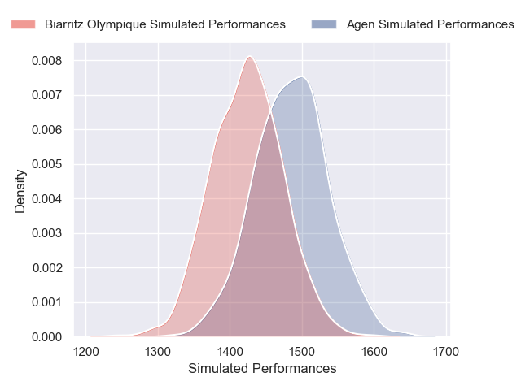
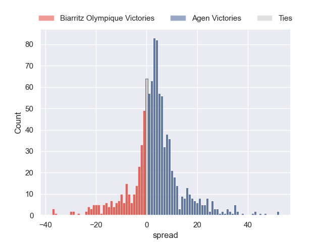

---  
title: "Pro D2 2024 Status"  
date: 2025-01-16 6:00:00 -0500  
categories: model review projection  
layout: article  
aside:  
    toc: true  
---
# Current Team Rankings

# Standings

## Current Standings

| Club                       |   Played |   Wins |   Point Differential |   Losing Bonus Points |   Try Bonus Points |   Competition Points |
|:---------------------------|---------:|-------:|---------------------:|----------------------:|-------------------:|---------------------:|
| Grenoble                   |       16 |     12 |                  169 |                     2 |                  7 |                   57 |
| Beziers                    |       16 |      9 |                  102 |                     6 |                  7 |                   49 |
| Brive                      |       16 |     10 |                   67 |                     2 |                  6 |                   48 |
| Provence Rugby             |       16 |      9 |                   46 |                     4 |                  5 |                   47 |
| Dax                        |       16 |     10 |                   24 |                     3 |                  3 |                   46 |
| Soyaux-Angouleme           |       16 |     10 |                   -6 |                     1 |                  5 |                   46 |
| Colomiers                  |       16 |      8 |                  -66 |                     3 |                  4 |                   41 |
| Biarritz Olympique         |       16 |      9 |                   43 |                     2 |                  2 |                   40 |
| Montauban                  |       16 |      8 |                  -29 |                     4 |                  4 |                   40 |
| Agen                       |       16 |      6 |                    0 |                     7 |                  5 |                   36 |
| Mont-de-Marsan             |       16 |      7 |                  -26 |                     5 |                  3 |                   36 |
| Nevers                     |       16 |      7 |                  -65 |                     4 |                  4 |                   36 |
| Oyonnax                    |       16 |      7 |                   23 |                     4 |                  2 |                   34 |
| Aurillac                   |       16 |      7 |                  -67 |                     2 |                  2 |                   32 |
| Valence Romans Drome Rugby |       16 |      5 |                  -42 |                     7 |                  2 |                   29 |
| Nice                       |       16 |      3 |                 -173 |                     6 |                  3 |                   21 |

## Projected Remaining Table

| Club                       |   Matches Remaining |   Wins |   Point Differential |   Losing Bonus Points |   Try Bonus Points |   Competition Points |
|:---------------------------|--------------------:|-------:|---------------------:|----------------------:|-------------------:|---------------------:|
| Grenoble                   |                  14 |   10   |             70.233   |                   2.7 |                8.4 |                 51.1 |
| Provence Rugby             |                  14 |    9.1 |             41.3862  |                   3.2 |                6   |                 45.6 |
| Brive                      |                  14 |    9.3 |             49.7612  |                   3.1 |                4.9 |                 45.1 |
| Oyonnax                    |                  14 |    8.5 |             33.118   |                   3.6 |                5.9 |                 43.4 |
| Beziers                    |                  14 |    8.3 |             29.32    |                   3.6 |                5.7 |                 42.7 |
| Mont-de-Marsan             |                  14 |    7.5 |              9.5931  |                   3.9 |                4.8 |                 38.6 |
| Dax                        |                  14 |    6.9 |              1.33502 |                   4.5 |                5.6 |                 37.7 |
| Soyaux-Angouleme           |                  14 |    7.4 |             10.1311  |                   4.1 |                3   |                 36.6 |
| Colomiers                  |                  14 |    6.5 |             -9.62755 |                   4.6 |                4.9 |                 35.5 |
| Agen                       |                  14 |    6.1 |            -15.9798  |                   5   |                5.1 |                 34.6 |
| Nevers                     |                  14 |    6.2 |            -17.2301  |                   4.3 |                4.7 |                 33.9 |
| Biarritz Olympique         |                  14 |    5.9 |            -25.8198  |                   4.6 |                4.9 |                 33   |
| Valence Romans Drome Rugby |                  14 |    5.5 |            -32.8316  |                   4.6 |                4.6 |                 31.2 |
| Montauban                  |                  14 |    5.5 |            -31.9302  |                   4.9 |                4.1 |                 31.1 |
| Aurillac                   |                  14 |    5   |            -46.3272  |                   4.7 |                3   |                 27.5 |
| Nice                       |                  14 |    4.3 |            -65.1314  |                   4.6 |                4.1 |                 26   |

## Projected Total Table

| Club                       |   Total Matches |   Wins |   Point Differential |   Losing Bonus Points |   Try Bonus Points |   Competition Points |
|:---------------------------|----------------:|-------:|---------------------:|----------------------:|-------------------:|---------------------:|
| Grenoble                   |              30 |   22   |            239.233   |                   4.7 |               15.4 |                108.1 |
| Brive                      |              30 |   19.3 |            116.761   |                   5.1 |               10.9 |                 93.1 |
| Provence Rugby             |              30 |   18.1 |             87.3862  |                   7.2 |               11   |                 92.6 |
| Beziers                    |              30 |   17.3 |            131.32    |                   9.6 |               12.7 |                 91.7 |
| Dax                        |              30 |   16.9 |             25.335   |                   7.5 |                8.6 |                 83.7 |
| Soyaux-Angouleme           |              30 |   17.4 |              4.13113 |                   5.1 |                8   |                 82.6 |
| Oyonnax                    |              30 |   15.5 |             56.118   |                   7.6 |                7.9 |                 77.4 |
| Colomiers                  |              30 |   14.5 |            -75.6275  |                   7.6 |                8.9 |                 76.5 |
| Mont-de-Marsan             |              30 |   14.5 |            -16.4069  |                   8.9 |                7.8 |                 74.6 |
| Biarritz Olympique         |              30 |   14.9 |             17.1802  |                   6.6 |                6.9 |                 73   |
| Montauban                  |              30 |   13.5 |            -60.9302  |                   8.9 |                8.1 |                 71.1 |
| Agen                       |              30 |   12.1 |            -15.9798  |                  12   |               10.1 |                 70.6 |
| Nevers                     |              30 |   13.2 |            -82.2301  |                   8.3 |                8.7 |                 69.9 |
| Valence Romans Drome Rugby |              30 |   10.5 |            -74.8316  |                  11.6 |                6.6 |                 60.2 |
| Aurillac                   |              30 |   12   |           -113.327   |                   6.7 |                5   |                 59.5 |
| Nice                       |              30 |    7.3 |           -238.131   |                  10.6 |                7.1 |                 47   |

# Completed Match Review

| Model | Percent Correct Predictions | Spread Error |
| ------ | ------ | ------ |
| Club Level | 67.2% | 10.3 |
| Player Level: Lineup | 66.7% | 11.1 |
| Player Level: Minutes | 70.4% | 11.3 |

# Future Predictions

## Week 17

### Agen V Biarritz Olympique on 2025/01/16

Average Margin: Agen by 3.7

Average Scoreline: 19-15

### Provence Rugby V Grenoble on 2025/01/17

Average Margin: Provence Rugby by 1.5

Average Scoreline: 20-18

### Soyaux-Angouleme V Beziers on 2025/01/17

Average Margin: Soyaux-Angouleme by 1.8

Average Scoreline: 22-20

### Brive V Nevers on 2025/01/17

Average Margin: Brive by 8.1

Average Scoreline: 24-16

### Aurillac V Mont-de-Marsan on 2025/01/17

Average Margin: Aurillac by 0.6

Average Scoreline: 18-18

### Colomiers V Dax on 2025/01/17

Average Margin: Colomiers by 2.0

Average Scoreline: 23-21

### Nice V Oyonnax on 2025/01/17

Average Margin: Oyonnax by 3.4

Average Scoreline: 21-17

### Montauban V Valence Romans Drome Rugby on 2025/01/17

Average Margin: Montauban by 3.0

Average Scoreline: 22-19

## Week 18

### Oyonnax V Brive on 2025/01/23

Average Margin: Oyonnax by 3.5

Average Scoreline: 23-20

### Valence Romans Drome Rugby V Nice on 2025/01/24

Average Margin: Valence Romans Drome Rugby by 5.8

Average Scoreline: 25-19

### Aurillac V Provence Rugby on 2025/01/24

Average Margin: Provence Rugby by 2.6

Average Scoreline: 22-20

### Nevers V Agen on 2025/01/24

Average Margin: Nevers by 4.1

Average Scoreline: 26-22

### Grenoble V Biarritz Olympique on 2025/01/24

Average Margin: Grenoble by 10.0

Average Scoreline: 29-19

### Soyaux-Angouleme V Dax on 2025/01/24

Average Margin: Soyaux-Angouleme by 3.7

Average Scoreline: 24-20

### Beziers V Colomiers on 2025/01/24

Average Margin: Beziers by 6.9

Average Scoreline: 31-24

### Mont-de-Marsan V Montauban on 2025/01/24

Average Margin: Mont-de-Marsan by 7.0

Average Scoreline: 27-20

## Week 19

### Biarritz Olympique V Mont-de-Marsan on 2025/02/06

Average Margin: Biarritz Olympique by 1.9

Average Scoreline: 22-21

### Colomiers V Grenoble on 2025/02/07

Average Margin: Grenoble by 2.4

Average Scoreline: 25-22

### Montauban V Agen on 2025/02/07

Average Margin: Montauban by 2.1

Average Scoreline: 23-21

### Brive V Soyaux-Angouleme on 2025/02/07

Average Margin: Brive by 7.0

Average Scoreline: 22-15

### Nice V Aurillac on 2025/02/07

Average Margin: Nice by 2.4

Average Scoreline: 20-18

### Beziers V Oyonnax on 2025/02/07

Average Margin: Beziers by 3.8

Average Scoreline: 22-18

### Dax V Valence Romans Drome Rugby on 2025/02/07

Average Margin: Dax by 6.3

Average Scoreline: 25-19

### Provence Rugby V Nevers on 2025/02/07

Average Margin: Provence Rugby by 7.5

Average Scoreline: 27-19

## Week 20

### Oyonnax V Dax on 2025/02/14

Average Margin: Oyonnax by 6.0

Average Scoreline: 26-20

### Soyaux-Angouleme V Colomiers on 2025/02/14

Average Margin: Soyaux-Angouleme by 5.3

Average Scoreline: 25-20

### Mont-de-Marsan V Provence Rugby on 2025/02/14

Average Margin: Mont-de-Marsan by 2.7

Average Scoreline: 25-22

### Agen V Beziers on 2025/02/14

Average Margin: Beziers by 0.1

Average Scoreline: 22-22

### Grenoble V Aurillac on 2025/02/14

Average Margin: Grenoble by 11.0

Average Scoreline: 32-21

### Montauban V Nevers on 2025/02/14

Average Margin: Montauban by 1.9

Average Scoreline: 21-19

### Valence Romans Drome Rugby V Biarritz Olympique on 2025/02/14

Average Margin: Valence Romans Drome Rugby by 2.6

Average Scoreline: 21-18

### Brive V Nice on 2025/02/14

Average Margin: Brive by 11.7

Average Scoreline: 29-17

## Week 21

### Colomiers V Mont-de-Marsan on 2025/02/21

Average Margin: Colomiers by 2.4

Average Scoreline: 26-24

### Beziers V Valence Romans Drome Rugby on 2025/02/21

Average Margin: Beziers by 8.7

Average Scoreline: 28-20

### Biarritz Olympique V Brive on 2025/02/21

Average Margin: Brive by 0.8

Average Scoreline: 23-22

### Dax V Grenoble on 2025/02/21

Average Margin: Grenoble by 0.7

Average Scoreline: 22-21

### Nice V Montauban on 2025/02/21

Average Margin: Nice by 2.9

Average Scoreline: 24-21

### Nevers V Oyonnax on 2025/02/21

Average Margin: Nevers by 0.9

Average Scoreline: 20-19

### Aurillac V Agen on 2025/02/21

Average Margin: Aurillac by 1.8

Average Scoreline: 21-19

### Provence Rugby V Soyaux-Angouleme on 2025/02/21

Average Margin: Provence Rugby by 6.8

Average Scoreline: 23-16

## Week 22

### Montauban V Provence Rugby on 2025/02/28

Average Margin: Provence Rugby by 2.1

Average Scoreline: 25-23

### Colomiers V Brive on 2025/02/28

Average Margin: Brive by 0.6

Average Scoreline: 23-22

### Oyonnax V Biarritz Olympique on 2025/02/28

Average Margin: Oyonnax by 7.3

Average Scoreline: 28-20

### Grenoble V Beziers on 2025/02/28

Average Margin: Grenoble by 6.7

Average Scoreline: 26-20

### Soyaux-Angouleme V Aurillac on 2025/02/28

Average Margin: Soyaux-Angouleme by 7.4

Average Scoreline: 25-17

### Dax V Nevers on 2025/02/28

Average Margin: Dax by 4.4

Average Scoreline: 24-19

### Agen V Valence Romans Drome Rugby on 2025/02/28

Average Margin: Agen by 5.0

Average Scoreline: 24-19

### Mont-de-Marsan V Nice on 2025/02/28

Average Margin: Mont-de-Marsan by 8.7

Average Scoreline: 28-19

## Week 23

### Oyonnax V Montauban on 2025/03/07

Average Margin: Oyonnax by 9.3

Average Scoreline: 32-23

### Soyaux-Angouleme V Grenoble on 2025/03/07

Average Margin: Grenoble by 0.7

Average Scoreline: 27-26

### Brive V Mont-de-Marsan on 2025/03/07

Average Margin: Brive by 6.2

Average Scoreline: 26-20

### Biarritz Olympique V Dax on 2025/03/07

Average Margin: Biarritz Olympique by 2.7

Average Scoreline: 26-24

### Provence Rugby V Colomiers on 2025/03/07

Average Margin: Provence Rugby by 7.5

Average Scoreline: 29-22

### Valence Romans Drome Rugby V Aurillac on 2025/03/07

Average Margin: Valence Romans Drome Rugby by 5.1

Average Scoreline: 27-22

### Beziers V Nevers on 2025/03/07

Average Margin: Beziers by 6.4

Average Scoreline: 27-21

### Nice V Agen on 2025/03/07

Average Margin: Nice by 0.8

Average Scoreline: 20-19

## Week 24

### Montauban V Brive on 2025/03/28

Average Margin: Brive by 2.5

Average Scoreline: 24-21

### Dax V Beziers on 2025/03/28

Average Margin: Dax by 2.0

Average Scoreline: 21-19

### Nevers V Nice on 2025/03/28

Average Margin: Nevers by 8.1

Average Scoreline: 28-20

### Aurillac V Biarritz Olympique on 2025/03/28

Average Margin: Aurillac by 1.9

Average Scoreline: 22-20

### Colomiers V Oyonnax on 2025/03/28

Average Margin: Colomiers by 0.1

Average Scoreline: 27-26

### Agen V Grenoble on 2025/03/28

Average Margin: Grenoble by 2.6

Average Scoreline: 27-24

### Valence Romans Drome Rugby V Provence Rugby on 2025/03/28

Average Margin: Provence Rugby by 1.3

Average Scoreline: 20-19

### Mont-de-Marsan V Soyaux-Angouleme on 2025/03/28

Average Margin: Mont-de-Marsan by 4.0

Average Scoreline: 24-20

## Week 25

### Provence Rugby V Dax on 2025/04/04

Average Margin: Provence Rugby by 6.1

Average Scoreline: 27-21

### Brive V Valence Romans Drome Rugby on 2025/04/04

Average Margin: Brive by 9.1

Average Scoreline: 29-20

### Biarritz Olympique V Montauban on 2025/04/04

Average Margin: Biarritz Olympique by 5.7

Average Scoreline: 33-28

### Oyonnax V Agen on 2025/04/04

Average Margin: Oyonnax by 7.8

Average Scoreline: 33-25

### Colomiers V Nevers on 2025/04/04

Average Margin: Colomiers by 3.7

Average Scoreline: 25-21

### Beziers V Aurillac on 2025/04/04

Average Margin: Beziers by 9.8

Average Scoreline: 32-22

### Soyaux-Angouleme V Nice on 2025/04/04

Average Margin: Soyaux-Angouleme by 9.1

Average Scoreline: 28-19

### Grenoble V Mont-de-Marsan on 2025/04/04

Average Margin: Grenoble by 8.4

Average Scoreline: 34-26

## Week 26

### Nevers V Soyaux-Angouleme on 2025/04/11

Average Margin: Nevers by 3.0

Average Scoreline: 22-19

### Provence Rugby V Beziers on 2025/04/11

Average Margin: Provence Rugby by 4.3

Average Scoreline: 25-21

### Aurillac V Colomiers on 2025/04/11

Average Margin: Aurillac by 1.4

Average Scoreline: 23-22

### Valence Romans Drome Rugby V Grenoble on 2025/04/11

Average Margin: Grenoble by 3.5

Average Scoreline: 30-26

### Montauban V Dax on 2025/04/11

Average Margin: Montauban by 0.6

Average Scoreline: 19-19

### Agen V Brive on 2025/04/11

Average Margin: Brive by 0.4

Average Scoreline: 22-21

### Nice V Biarritz Olympique on 2025/04/11

Average Margin: Nice by 0.8

Average Scoreline: 19-18

### Mont-de-Marsan V Oyonnax on 2025/04/11

Average Margin: Mont-de-Marsan by 3.0

Average Scoreline: 27-24

## Week 27

### Brive V Provence Rugby on 2025/04/18

Average Margin: Brive by 4.0

Average Scoreline: 24-20

### Nevers V Biarritz Olympique on 2025/04/18

Average Margin: Nevers by 4.8

Average Scoreline: 24-19

### Beziers V Mont-de-Marsan on 2025/04/18

Average Margin: Beziers by 5.0

Average Scoreline: 26-21

### Soyaux-Angouleme V Montauban on 2025/04/18

Average Margin: Soyaux-Angouleme by 7.2

Average Scoreline: 27-20

### Oyonnax V Valence Romans Drome Rugby on 2025/04/18

Average Margin: Oyonnax by 8.3

Average Scoreline: 32-24

### Grenoble V Nice on 2025/04/18

Average Margin: Grenoble by 12.7

Average Scoreline: 38-25

### Dax V Aurillac on 2025/04/18

Average Margin: Dax by 7.5

Average Scoreline: 31-24

### Colomiers V Agen on 2025/04/18

Average Margin: Colomiers by 4.0

Average Scoreline: 27-23

## Week 28

### Biarritz Olympique V Beziers on 2025/04/25

Average Margin: Biarritz Olympique by 0.4

Average Scoreline: 23-23

### Valence Romans Drome Rugby V Nevers on 2025/04/25

Average Margin: Valence Romans Drome Rugby by 3.1

Average Scoreline: 23-20

### Montauban V Colomiers on 2025/04/25

Average Margin: Montauban by 1.5

Average Scoreline: 21-19

### Mont-de-Marsan V Dax on 2025/04/25

Average Margin: Mont-de-Marsan by 4.4

Average Scoreline: 26-22

### Agen V Soyaux-Angouleme on 2025/04/25

Average Margin: Agen by 2.8

Average Scoreline: 23-20

### Aurillac V Brive on 2025/04/25

Average Margin: Brive by 2.9

Average Scoreline: 24-21

### Nice V Provence Rugby on 2025/04/25

Average Margin: Provence Rugby by 3.8

Average Scoreline: 24-20

### Grenoble V Oyonnax on 2025/04/25

Average Margin: Grenoble by 6.3

Average Scoreline: 36-30

## Week 29

### Colomiers V Nice on 2025/05/09

Average Margin: Colomiers by 7.5

Average Scoreline: 29-22

### Brive V Grenoble on 2025/05/09

Average Margin: Brive by 2.5

Average Scoreline: 25-22

### Montauban V Beziers on 2025/05/09

Average Margin: Beziers by 1.2

Average Scoreline: 23-22

### Provence Rugby V Biarritz Olympique on 2025/05/09

Average Margin: Provence Rugby by 8.1

Average Scoreline: 33-25

### Mont-de-Marsan V Valence Romans Drome Rugby on 2025/05/09

Average Margin: Mont-de-Marsan by 6.3

Average Scoreline: 30-23

### Nevers V Aurillac on 2025/05/09

Average Margin: Nevers by 6.4

Average Scoreline: 29-23

### Dax V Agen on 2025/05/09

Average Margin: Dax by 6.0

Average Scoreline: 32-26

### Soyaux-Angouleme V Oyonnax on 2025/05/09

Average Margin: Soyaux-Angouleme by 1.8

Average Scoreline: 28-26

## Week 30

### Valence Romans Drome Rugby V Soyaux-Angouleme on 2025/05/16

Average Margin: Valence Romans Drome Rugby by 2.0

Average Scoreline: 22-20

### Nice V Dax on 2025/05/16

Average Margin: Dax by 1.3

Average Scoreline: 24-22

### Aurillac V Montauban on 2025/05/16

Average Margin: Aurillac by 3.1

Average Scoreline: 28-25

### Oyonnax V Provence Rugby on 2025/05/16

Average Margin: Oyonnax by 3.5

Average Scoreline: 23-20

### Biarritz Olympique V Colomiers on 2025/05/16

Average Margin: Biarritz Olympique by 3.7

Average Scoreline: 27-23

### Beziers V Brive on 2025/05/16

Average Margin: Beziers by 2.6

Average Scoreline: 21-18

### Agen V Mont-de-Marsan on 2025/05/16

Average Margin: Agen by 2.2

Average Scoreline: 32-29

### Grenoble V Nevers on 2025/05/16

Average Margin: Grenoble by 9.4

Average Scoreline: 38-28

