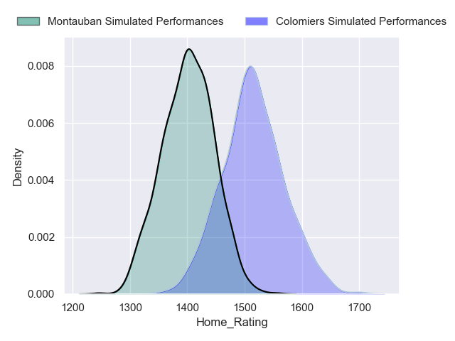
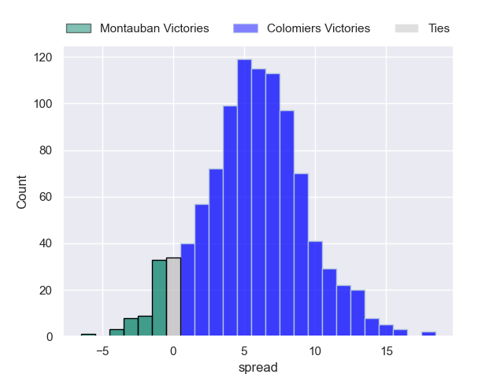
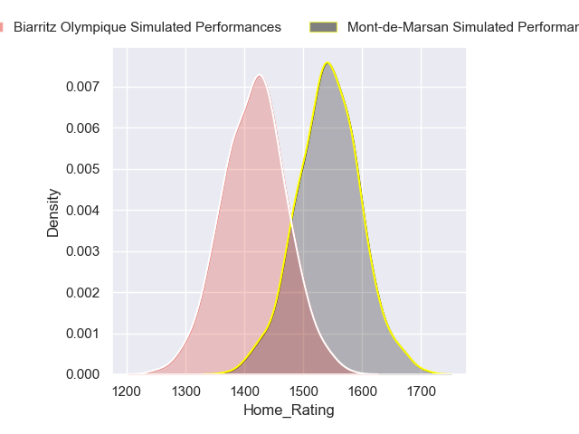
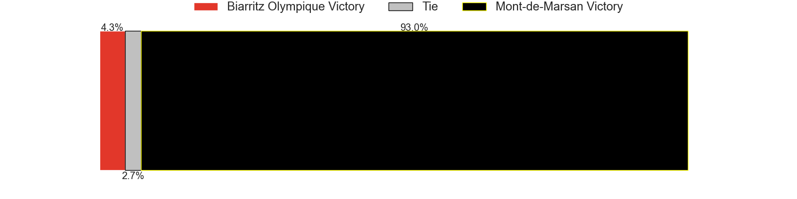
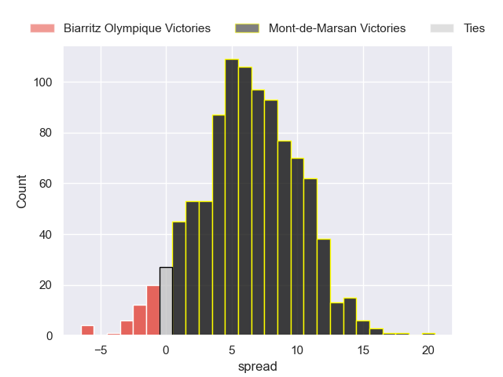
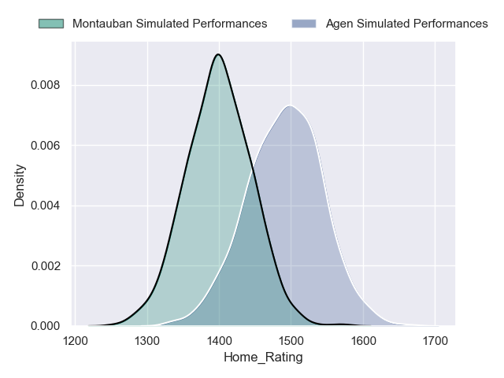
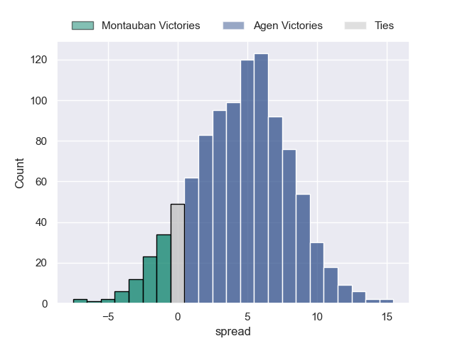

---  
title: "Pro D2 2024 Status"  
date: 2024-10-25 6:00:00 -0500  
categories: model review projection  
layout: article  
aside:  
    toc: true  
---
# Current Team Rankings

# Standings

## Current Standings

| Club                       |   Played |   Wins |   Point Differential |   Losing Bonus Points |   Try Bonus Points |   Competition Points |
|:---------------------------|---------:|-------:|---------------------:|----------------------:|-------------------:|---------------------:|
| Montauban                  |        8 |      6 |                   23 |                     1 |                nan |                   28 |
| Biarritz Olympique         |        7 |      5 |                   15 |                     1 |                  1 |                   22 |
| Grenoble                   |        8 |      5 |                   -8 |                     1 |                nan |                   22 |
| Brive                      |        7 |      4 |                   35 |                     2 |                  3 |                   21 |
| Provence Rugby             |        7 |      4 |                   23 |                     1 |                  1 |                   20 |
| Colomiers                  |        7 |      4 |                   16 |                     2 |                nan |                   20 |
| Agen                       |        7 |      3 |                   17 |                     4 |                nan |                   18 |
| Soyaux-Angouleme           |        7 |      4 |                   14 |                     1 |                nan |                   18 |
| Beziers                    |        7 |      3 |                   17 |                     4 |                  1 |                   17 |
| Dax                        |        7 |      4 |                    5 |                     1 |                nan |                   17 |
| Mont-de-Marsan             |        7 |      3 |                   18 |                     3 |                nan |                   16 |
| Oyonnax                    |        7 |      3 |                   -5 |                     1 |                  1 |                   14 |
| Nice                       |        7 |      3 |                  -62 |                     1 |                nan |                   13 |
| Nevers                     |        7 |      2 |                  -34 |                     3 |                  0 |                   11 |
| Aurillac                   |        7 |      2 |                  -37 |                     2 |                  1 |                   11 |
| Valence Romans Drome Rugby |        7 |      1 |                  -37 |                     5 |                nan |                    9 |

## Projected Remaining Table

| Club                       |   Matches Remaining |   Wins |   Point Differential |   Losing Bonus Points |   Try Bonus Points |   Competition Points |
|:---------------------------|--------------------:|-------:|---------------------:|----------------------:|-------------------:|---------------------:|
| Oyonnax                    |                  23 |   17.3 |             82.6535  |                   5.5 |                8.3 |                 82.9 |
| Brive                      |                  23 |   17.8 |             87.9189  |                   4.9 |                4.9 |                 81   |
| Provence Rugby             |                  23 |   15.8 |             60.1721  |                   6.5 |                6.5 |                 76.3 |
| Grenoble                   |                  22 |   14.6 |             52.4739  |                   6.6 |                9.2 |                 74.4 |
| Mont-de-Marsan             |                  23 |   13.4 |             29.4535  |                   8.3 |                5.5 |                 67.2 |
| Beziers                    |                  23 |   12.7 |             17.8845  |                   8.4 |                6.3 |                 65.5 |
| Nevers                     |                  23 |   11.8 |              4.44751 |                   9.3 |                6.6 |                 62.9 |
| Colomiers                  |                  23 |   11.8 |              2.06424 |                   9.4 |                5.3 |                 61.9 |
| Soyaux-Angouleme           |                  23 |   11.5 |             -2.88899 |                   8.9 |                1.8 |                 56.6 |
| Agen                       |                  23 |    9.7 |            -23.1727  |                  10.3 |                5.3 |                 54.4 |
| Dax                        |                  23 |    9.7 |            -24.1295  |                  10.2 |                5.4 |                 54.3 |
| Biarritz Olympique         |                  23 |    9   |            -35.3873  |                  10.4 |                5.5 |                 52.1 |
| Nice                       |                  23 |    8.3 |            -43.6234  |                  10.5 |                5.4 |                 49.3 |
| Valence Romans Drome Rugby |                  23 |    6.7 |            -68.0256  |                  11.2 |                4.9 |                 42.8 |
| Montauban                  |                  22 |    7   |            -57.5698  |                  10.5 |                4.3 |                 42.7 |
| Aurillac                   |                  23 |    5.9 |            -82.2709  |                  10.9 |                4.4 |                 39   |

## Projected Total Table

| Club                       |   Total Matches |   Wins |   Point Differential |   Losing Bonus Points |   Try Bonus Points |   Competition Points |
|:---------------------------|----------------:|-------:|---------------------:|----------------------:|-------------------:|---------------------:|
| Brive                      |              30 |   21.8 |            122.919   |                   6.9 |                7.9 |                102   |
| Oyonnax                    |              30 |   20.3 |             77.6535  |                   6.5 |                9.3 |                 96.9 |
| Grenoble                   |              30 |   19.6 |             44.4739  |                   7.6 |                9.2 |                 96.4 |
| Provence Rugby             |              30 |   19.8 |             83.1721  |                   7.5 |                7.5 |                 96.3 |
| Mont-de-Marsan             |              30 |   16.4 |             47.4535  |                  11.3 |                5.5 |                 83.2 |
| Beziers                    |              30 |   15.7 |             34.8845  |                  12.4 |                7.3 |                 82.5 |
| Colomiers                  |              30 |   15.8 |             18.0642  |                  11.4 |                5.3 |                 81.9 |
| Soyaux-Angouleme           |              30 |   15.5 |             11.111   |                   9.9 |                1.8 |                 74.6 |
| Biarritz Olympique         |              30 |   14   |            -20.3873  |                  11.4 |                6.5 |                 74.1 |
| Nevers                     |              30 |   13.8 |            -29.5525  |                  12.3 |                6.6 |                 73.9 |
| Agen                       |              30 |   12.7 |             -6.17271 |                  14.3 |                5.3 |                 72.4 |
| Dax                        |              30 |   13.7 |            -19.1295  |                  11.2 |                5.4 |                 71.3 |
| Montauban                  |              30 |   13   |            -34.5698  |                  11.5 |                4.3 |                 70.7 |
| Nice                       |              30 |   11.3 |           -105.623   |                  11.5 |                5.4 |                 62.3 |
| Valence Romans Drome Rugby |              30 |    7.7 |           -105.026   |                  16.2 |                4.9 |                 51.8 |
| Aurillac                   |              30 |    7.9 |           -119.271   |                  12.9 |                5.4 |                 50   |

# Completed Match Review

| Model | Percent Correct Predictions | Spread Error |
| ------ | ------ | ------ |
| Club Level | 54.4% | 9.1 |
| Player Level: Lineup | 66.7% | 11.9 |
| Player Level: Minutes | 71.4% | 9.8 |

# Future Predictions

## Week 9

### Soyaux-Angouleme V Biarritz Olympique on 2024/10/25

Average Margin: Soyaux-Angouleme by 4.5

Average Scoreline: 25-21

### Nice V Valence Romans Drome Rugby on 2024/10/25

Average Margin: Nice by 4.1

Average Scoreline: 26-22

### Oyonnax V Beziers on 2024/10/25

Average Margin: Oyonnax by 5.8

Average Scoreline: 25-19

### Brive V Dax on 2024/10/25

Average Margin: Brive by 7.5

Average Scoreline: 26-18

### Nevers V Provence Rugby on 2024/10/25

Average Margin: Nevers by 0.8

Average Scoreline: 22-21

### Mont-de-Marsan V Aurillac on 2024/10/25

Average Margin: Mont-de-Marsan by 8.0

Average Scoreline: 28-20

### Agen V Colomiers on 2024/10/25

Average Margin: Agen by 2.2

Average Scoreline: 27-25

## Week 10

### Colomiers V Montauban on 2024/10/31

Average Margin: Colomiers by 5.7

Average Scoreline: 27-21

### Grenoble V Agen on 2024/11/01

Average Margin: Grenoble by 6.4

Average Scoreline: 34-27

### Beziers V Soyaux-Angouleme on 2024/11/01

Average Margin: Beziers by 4.5

Average Scoreline: 27-23

### Valence Romans Drome Rugby V Brive on 2024/11/01

Average Margin: Brive by 2.3

Average Scoreline: 21-18

### Biarritz Olympique V Nevers on 2024/11/01

Average Margin: Biarritz Olympique by 1.9

Average Scoreline: 25-23

### Provence Rugby V Mont-de-Marsan on 2024/11/01

Average Margin: Provence Rugby by 4.2

Average Scoreline: 22-18

### Aurillac V Oyonnax on 2024/11/01

Average Margin: Oyonnax by 3.0

Average Scoreline: 27-24

### Dax V Nice on 2024/11/01

Average Margin: Dax by 4.0

Average Scoreline: 24-20

## Week 11

### Mont-de-Marsan V Biarritz Olympique on 2024/11/07

Average Margin: Mont-de-Marsan by 6.3

Average Scoreline: 28-21

### Nevers V Valence Romans Drome Rugby on 2024/11/08

Average Margin: Nevers by 5.8

Average Scoreline: 25-20

### Beziers V Dax on 2024/11/08

Average Margin: Beziers by 4.9

Average Scoreline: 27-22

### Montauban V Nice on 2024/11/08

Average Margin: Montauban by 2.8

Average Scoreline: 28-25

### Brive V Colomiers on 2024/11/08

Average Margin: Brive by 6.5

Average Scoreline: 26-20

### Oyonnax V Grenoble on 2024/11/08

Average Margin: Oyonnax by 4.2

Average Scoreline: 24-20

### Provence Rugby V Aurillac on 2024/11/08

Average Margin: Provence Rugby by 9.0

Average Scoreline: 31-22

### Soyaux-Angouleme V Agen on 2024/11/08

Average Margin: Soyaux-Angouleme by 3.9

Average Scoreline: 24-20

## Week 12

### Agen V Montauban on 2024/11/14

Average Margin: Agen by 4.6

Average Scoreline: 24-20

### Colomiers V Beziers on 2024/11/15

Average Margin: Colomiers by 2.5

Average Scoreline: 26-24

### Aurillac V Nevers on 2024/11/15

Average Margin: Aurillac by 0.1

Average Scoreline: 22-22

### Grenoble V Soyaux-Angouleme on 2024/11/15

Average Margin: Grenoble by 5.9

Average Scoreline: 30-24

### Valence Romans Drome Rugby V Oyonnax on 2024/11/15

Average Margin: Oyonnax by 2.4

Average Scoreline: 24-21

### Nice V Brive on 2024/11/15

Average Margin: Brive by 1.5

Average Scoreline: 24-23

### Dax V Mont-de-Marsan on 2024/11/15

Average Margin: Dax by 1.1

Average Scoreline: 23-22

### Biarritz Olympique V Provence Rugby on 2024/11/15

Average Margin: Provence Rugby by 0.4

Average Scoreline: 24-23

## Week 13

### Soyaux-Angouleme V Valence Romans Drome Rugby on 2024/11/29

Average Margin: Soyaux-Angouleme by 5.5

Average Scoreline: 26-21

### Beziers V Agen on 2024/11/29

Average Margin: Beziers by 5.1

Average Scoreline: 29-24

### Provence Rugby V Nice on 2024/11/29

Average Margin: Provence Rugby by 7.5

Average Scoreline: 28-20

### Biarritz Olympique V Aurillac on 2024/11/29

Average Margin: Biarritz Olympique by 5.1

Average Scoreline: 25-20

### Nevers V Dax on 2024/11/29

Average Margin: Nevers by 4.3

Average Scoreline: 24-20

### Brive V Montauban on 2024/11/29

Average Margin: Brive by 9.1

Average Scoreline: 27-18

### Oyonnax V Mont-de-Marsan on 2024/11/29

Average Margin: Oyonnax by 5.1

Average Scoreline: 22-17

### Grenoble V Colomiers on 2024/11/29

Average Margin: Grenoble by 5.4

Average Scoreline: 32-26

## Week 14

### Mont-de-Marsan V Grenoble on 2024/12/06

Average Margin: Mont-de-Marsan by 2.6

Average Scoreline: 30-27

### Agen V Oyonnax on 2024/12/06

Average Margin: Oyonnax by 0.7

Average Scoreline: 21-20

### Dax V Biarritz Olympique on 2024/12/06

Average Margin: Dax by 4.1

Average Scoreline: 25-21

### Aurillac V Valence Romans Drome Rugby on 2024/12/06

Average Margin: Aurillac by 2.7

Average Scoreline: 23-20

### Brive V Beziers on 2024/12/06

Average Margin: Brive by 6.0

Average Scoreline: 26-20

### Colomiers V Provence Rugby on 2024/12/06

Average Margin: Colomiers by 1.1

Average Scoreline: 24-23

### Nice V Nevers on 2024/12/06

Average Margin: Nice by 1.5

Average Scoreline: 24-23

### Montauban V Soyaux-Angouleme on 2024/12/06

Average Margin: Montauban by 1.3

Average Scoreline: 20-19

## Week 15

### Oyonnax V Soyaux-Angouleme on 2024/12/13

Average Margin: Oyonnax by 6.8

Average Scoreline: 28-21

### Grenoble V Brive on 2024/12/13

Average Margin: Grenoble by 2.2

Average Scoreline: 22-20

### Biarritz Olympique V Nice on 2024/12/13

Average Margin: Biarritz Olympique by 3.5

Average Scoreline: 25-22

### Agen V Aurillac on 2024/12/13

Average Margin: Agen by 5.6

Average Scoreline: 26-20

### Dax V Provence Rugby on 2024/12/13

Average Margin: Dax by 0.3

Average Scoreline: 22-21

### Nevers V Colomiers on 2024/12/13

Average Margin: Nevers by 3.2

Average Scoreline: 24-21

### Valence Romans Drome Rugby V Mont-de-Marsan on 2024/12/13

Average Margin: Mont-de-Marsan by 0.6

Average Scoreline: 21-20

### Beziers V Montauban on 2024/12/13

Average Margin: Beziers by 6.3

Average Scoreline: 28-21

## Week 16

### Montauban V Oyonnax on 2024/12/20

Average Margin: Oyonnax by 2.0

Average Scoreline: 24-22

### Mont-de-Marsan V Beziers on 2024/12/20

Average Margin: Mont-de-Marsan by 4.1

Average Scoreline: 25-21

### Nice V Grenoble on 2024/12/20

Average Margin: Grenoble by 0.5

Average Scoreline: 24-23

### Provence Rugby V Valence Romans Drome Rugby on 2024/12/20

Average Margin: Provence Rugby by 8.1

Average Scoreline: 29-21

### Colomiers V Biarritz Olympique on 2024/12/20

Average Margin: Colomiers by 4.8

Average Scoreline: 25-21

### Aurillac V Dax on 2024/12/20

Average Margin: Aurillac by 0.9

Average Scoreline: 19-18

### Brive V Agen on 2024/12/20

Average Margin: Brive by 7.7

Average Scoreline: 27-20

### Soyaux-Angouleme V Nevers on 2024/12/20

Average Margin: Soyaux-Angouleme by 3.0

Average Scoreline: 23-20

## Week 17

### Valence Romans Drome Rugby V Colomiers on 2025/01/10

Average Margin: Valence Romans Drome Rugby by 0.6

Average Scoreline: 26-25

### Beziers V Nice on 2025/01/10

Average Margin: Beziers by 5.9

Average Scoreline: 28-22

### Nevers V Mont-de-Marsan on 2025/01/10

Average Margin: Nevers by 2.0

Average Scoreline: 26-24

### Dax V Brive on 2025/01/10

Average Margin: Brive by 0.9

Average Scoreline: 25-24

### Agen V Provence Rugby on 2025/01/10

Average Margin: Provence Rugby by 0.0

Average Scoreline: 23-23

### Grenoble V Montauban on 2025/01/10

Average Margin: Grenoble by 7.9

Average Scoreline: 34-26

### Biarritz Olympique V Soyaux-Angouleme on 2025/01/10

Average Margin: Biarritz Olympique by 2.1

Average Scoreline: 22-20

### Oyonnax V Aurillac on 2025/01/10

Average Margin: Oyonnax by 9.6

Average Scoreline: 34-24

## Week 18

### Aurillac V Mont-de-Marsan on 2025/01/17

Average Margin: Mont-de-Marsan by 1.3

Average Scoreline: 26-25

### Brive V Nevers on 2025/01/17

Average Margin: Brive by 6.8

Average Scoreline: 25-19

### Colomiers V Dax on 2025/01/17

Average Margin: Colomiers by 4.2

Average Scoreline: 24-20

### Provence Rugby V Grenoble on 2025/01/17

Average Margin: Provence Rugby by 3.5

Average Scoreline: 30-26

### Nice V Oyonnax on 2025/01/17

Average Margin: Oyonnax by 1.4

Average Scoreline: 23-22

### Montauban V Valence Romans Drome Rugby on 2025/01/17

Average Margin: Montauban by 3.3

Average Scoreline: 27-24

### Agen V Biarritz Olympique on 2025/01/17

Average Margin: Agen by 4.0

Average Scoreline: 25-21

### Soyaux-Angouleme V Beziers on 2025/01/17

Average Margin: Soyaux-Angouleme by 2.3

Average Scoreline: 24-22

## Week 19

### Oyonnax V Brive on 2025/01/24

Average Margin: Oyonnax by 3.3

Average Scoreline: 26-22

### Valence Romans Drome Rugby V Nice on 2025/01/24

Average Margin: Valence Romans Drome Rugby by 2.4

Average Scoreline: 28-25

### Grenoble V Biarritz Olympique on 2025/01/24

Average Margin: Grenoble by 6.9

Average Scoreline: 34-27

### Beziers V Colomiers on 2025/01/24

Average Margin: Beziers by 4.0

Average Scoreline: 26-22

### Mont-de-Marsan V Montauban on 2025/01/24

Average Margin: Mont-de-Marsan by 7.0

Average Scoreline: 28-21

### Soyaux-Angouleme V Dax on 2025/01/24

Average Margin: Soyaux-Angouleme by 3.8

Average Scoreline: 23-19

### Aurillac V Provence Rugby on 2025/01/24

Average Margin: Provence Rugby by 2.2

Average Scoreline: 26-24

### Nevers V Agen on 2025/01/24

Average Margin: Nevers by 4.4

Average Scoreline: 25-20

## Week 20

### Biarritz Olympique V Mont-de-Marsan on 2025/02/07

Average Margin: Biarritz Olympique by 0.6

Average Scoreline: 25-25

### Provence Rugby V Nevers on 2025/02/07

Average Margin: Provence Rugby by 5.6

Average Scoreline: 23-18

### Beziers V Oyonnax on 2025/02/07

Average Margin: Beziers by 1.0

Average Scoreline: 25-24

### Montauban V Agen on 2025/02/07

Average Margin: Montauban by 2.0

Average Scoreline: 26-24

### Nice V Aurillac on 2025/02/07

Average Margin: Nice by 5.0

Average Scoreline: 28-23

### Dax V Valence Romans Drome Rugby on 2025/02/07

Average Margin: Dax by 5.2

Average Scoreline: 26-21

### Brive V Soyaux-Angouleme on 2025/02/07

Average Margin: Brive by 7.0

Average Scoreline: 26-19

### Colomiers V Grenoble on 2025/02/07

Average Margin: Colomiers by 1.4

Average Scoreline: 30-29

## Week 21

### Valence Romans Drome Rugby V Biarritz Olympique on 2025/02/14

Average Margin: Valence Romans Drome Rugby by 2.3

Average Scoreline: 25-22

### Grenoble V Aurillac on 2025/02/14

Average Margin: Grenoble by 8.8

Average Scoreline: 40-31

### Mont-de-Marsan V Provence Rugby on 2025/02/14

Average Margin: Mont-de-Marsan by 2.4

Average Scoreline: 26-23

### Soyaux-Angouleme V Colomiers on 2025/02/14

Average Margin: Soyaux-Angouleme by 3.1

Average Scoreline: 25-22

### Oyonnax V Dax on 2025/02/14

Average Margin: Oyonnax by 7.4

Average Scoreline: 33-26

### Brive V Nice on 2025/02/14

Average Margin: Brive by 8.3

Average Scoreline: 28-19

### Agen V Beziers on 2025/02/14

Average Margin: Agen by 1.7

Average Scoreline: 27-25

### Montauban V Nevers on 2025/02/14

Average Margin: Montauban by 1.0

Average Scoreline: 24-23

## Week 22

### Colomiers V Mont-de-Marsan on 2025/02/21

Average Margin: Colomiers by 2.2

Average Scoreline: 26-24

### Nice V Montauban on 2025/02/21

Average Margin: Nice by 4.0

Average Scoreline: 29-25

### Dax V Grenoble on 2025/02/21

Average Margin: Dax by 0.4

Average Scoreline: 28-28

### Aurillac V Agen on 2025/02/21

Average Margin: Aurillac by 1.2

Average Scoreline: 21-20

### Biarritz Olympique V Brive on 2025/02/21

Average Margin: Brive by 1.3

Average Scoreline: 23-21

### Beziers V Valence Romans Drome Rugby on 2025/02/21

Average Margin: Beziers by 6.4

Average Scoreline: 29-22

### Nevers V Oyonnax on 2025/02/21

Average Margin: Nevers by 0.3

Average Scoreline: 24-24

### Provence Rugby V Soyaux-Angouleme on 2025/02/21

Average Margin: Provence Rugby by 6.0

Average Scoreline: 26-20

## Week 23

### Colomiers V Brive on 2025/02/28

Average Margin: Colomiers by 0.1

Average Scoreline: 22-22

### Oyonnax V Biarritz Olympique on 2025/02/28

Average Margin: Oyonnax by 7.8

Average Scoreline: 34-26

### Montauban V Provence Rugby on 2025/02/28

Average Margin: Provence Rugby by 1.3

Average Scoreline: 25-24

### Agen V Valence Romans Drome Rugby on 2025/02/28

Average Margin: Agen by 4.9

Average Scoreline: 25-20

### Grenoble V Beziers on 2025/02/28

Average Margin: Grenoble by 4.9

Average Scoreline: 33-28

### Mont-de-Marsan V Nice on 2025/02/28

Average Margin: Mont-de-Marsan by 6.4

Average Scoreline: 27-21

### Dax V Nevers on 2025/02/28

Average Margin: Dax by 2.4

Average Scoreline: 28-26

### Soyaux-Angouleme V Aurillac on 2025/02/28

Average Margin: Soyaux-Angouleme by 6.3

Average Scoreline: 26-20

## Week 24

### Nice V Agen on 2025/03/07

Average Margin: Nice by 2.8

Average Scoreline: 27-24

### Beziers V Nevers on 2025/03/07

Average Margin: Beziers by 4.2

Average Scoreline: 28-24

### Soyaux-Angouleme V Grenoble on 2025/03/07

Average Margin: Soyaux-Angouleme by 0.8

Average Scoreline: 30-29

### Provence Rugby V Colomiers on 2025/03/07

Average Margin: Provence Rugby by 5.4

Average Scoreline: 28-22

### Oyonnax V Montauban on 2025/03/07

Average Margin: Oyonnax by 8.8

Average Scoreline: 35-26

### Valence Romans Drome Rugby V Aurillac on 2025/03/07

Average Margin: Valence Romans Drome Rugby by 4.1

Average Scoreline: 28-24

### Biarritz Olympique V Dax on 2025/03/07

Average Margin: Biarritz Olympique by 2.8

Average Scoreline: 29-27

### Brive V Mont-de-Marsan on 2025/03/07

Average Margin: Brive by 5.3

Average Scoreline: 29-23

## Week 25

### Aurillac V Biarritz Olympique on 2025/03/28

Average Margin: Aurillac by 1.5

Average Scoreline: 29-28

### Agen V Grenoble on 2025/03/28

Average Margin: Agen by 0.2

Average Scoreline: 33-32

### Dax V Beziers on 2025/03/28

Average Margin: Dax by 1.7

Average Scoreline: 24-22

### Montauban V Brive on 2025/03/28

Average Margin: Brive by 2.3

Average Scoreline: 28-26

### Mont-de-Marsan V Soyaux-Angouleme on 2025/03/28

Average Margin: Mont-de-Marsan by 4.9

Average Scoreline: 26-21

### Valence Romans Drome Rugby V Provence Rugby on 2025/03/28

Average Margin: Provence Rugby by 1.4

Average Scoreline: 22-21

### Nevers V Nice on 2025/03/28

Average Margin: Nevers by 5.0

Average Scoreline: 28-23

### Colomiers V Oyonnax on 2025/03/28

Average Margin: Colomiers by 0.5

Average Scoreline: 28-28

## Week 26

### Beziers V Aurillac on 2025/04/04

Average Margin: Beziers by 7.4

Average Scoreline: 33-26

### Soyaux-Angouleme V Nice on 2025/04/04

Average Margin: Soyaux-Angouleme by 4.5

Average Scoreline: 24-19

### Grenoble V Mont-de-Marsan on 2025/04/04

Average Margin: Grenoble by 4.2

Average Scoreline: 35-31

### Provence Rugby V Dax on 2025/04/04

Average Margin: Provence Rugby by 6.5

Average Scoreline: 30-24

### Oyonnax V Agen on 2025/04/04

Average Margin: Oyonnax by 7.4

Average Scoreline: 34-26

### Colomiers V Nevers on 2025/04/04

Average Margin: Colomiers by 3.5

Average Scoreline: 28-25

### Brive V Valence Romans Drome Rugby on 2025/04/04

Average Margin: Brive by 9.2

Average Scoreline: 30-21

### Biarritz Olympique V Montauban on 2025/04/04

Average Margin: Biarritz Olympique by 4.2

Average Scoreline: 28-24

## Week 27

### Agen V Brive on 2025/04/11

Average Margin: Brive by 0.8

Average Scoreline: 24-23

### Nice V Biarritz Olympique on 2025/04/11

Average Margin: Nice by 3.1

Average Scoreline: 26-23

### Valence Romans Drome Rugby V Grenoble on 2025/04/11

Average Margin: Grenoble by 1.4

Average Scoreline: 31-29

### Montauban V Dax on 2025/04/11

Average Margin: Montauban by 1.9

Average Scoreline: 24-22

### Nevers V Soyaux-Angouleme on 2025/04/11

Average Margin: Nevers by 3.8

Average Scoreline: 32-28

### Mont-de-Marsan V Oyonnax on 2025/04/11

Average Margin: Mont-de-Marsan by 1.6

Average Scoreline: 29-27

### Aurillac V Colomiers on 2025/04/11

Average Margin: Colomiers by 0.0

Average Scoreline: 26-26

### Provence Rugby V Beziers on 2025/04/11

Average Margin: Provence Rugby by 4.9

Average Scoreline: 28-23

## Week 28

### Oyonnax V Valence Romans Drome Rugby on 2025/04/18

Average Margin: Oyonnax by 8.8

Average Scoreline: 38-29

### Colomiers V Agen on 2025/04/18

Average Margin: Colomiers by 4.2

Average Scoreline: 29-25

### Dax V Aurillac on 2025/04/18

Average Margin: Dax by 5.8

Average Scoreline: 30-24

### Nevers V Biarritz Olympique on 2025/04/18

Average Margin: Nevers by 4.7

Average Scoreline: 30-25

### Soyaux-Angouleme V Montauban on 2025/04/18

Average Margin: Soyaux-Angouleme by 5.4

Average Scoreline: 25-19

### Beziers V Mont-de-Marsan on 2025/04/18

Average Margin: Beziers by 2.7

Average Scoreline: 28-25

### Grenoble V Nice on 2025/04/18

Average Margin: Grenoble by 7.2

Average Scoreline: 37-30

### Brive V Provence Rugby on 2025/04/18

Average Margin: Brive by 4.3

Average Scoreline: 27-23

## Week 29

### Aurillac V Brive on 2025/04/25

Average Margin: Brive by 3.2

Average Scoreline: 30-27

### Grenoble V Oyonnax on 2025/04/25

Average Margin: Grenoble by 2.6

Average Scoreline: 30-27

### Nice V Provence Rugby on 2025/04/25

Average Margin: Provence Rugby by 0.6

Average Scoreline: 26-26

### Agen V Soyaux-Angouleme on 2025/04/25

Average Margin: Agen by 2.7

Average Scoreline: 28-26

### Mont-de-Marsan V Dax on 2025/04/25

Average Margin: Mont-de-Marsan by 5.3

Average Scoreline: 29-24

### Biarritz Olympique V Beziers on 2025/04/25

Average Margin: Biarritz Olympique by 1.3

Average Scoreline: 27-26

### Valence Romans Drome Rugby V Nevers on 2025/04/25

Average Margin: Valence Romans Drome Rugby by 0.9

Average Scoreline: 25-24

### Montauban V Colomiers on 2025/04/25

Average Margin: Montauban by 0.9

Average Scoreline: 24-23

## Week 30

### Dax V Agen on 2025/05/09

Average Margin: Dax by 3.5

Average Scoreline: 28-25

### Nevers V Aurillac on 2025/05/09

Average Margin: Nevers by 6.6

Average Scoreline: 34-28

### Colomiers V Nice on 2025/05/09

Average Margin: Colomiers by 5.1

Average Scoreline: 27-22

### Soyaux-Angouleme V Oyonnax on 2025/05/09

Average Margin: Soyaux-Angouleme by 0.1

Average Scoreline: 31-31

### Montauban V Beziers on 2025/05/09

Average Margin: Montauban by 0.3

Average Scoreline: 23-22

### Provence Rugby V Biarritz Olympique on 2025/05/09

Average Margin: Provence Rugby by 7.0

Average Scoreline: 32-25

### Mont-de-Marsan V Valence Romans Drome Rugby on 2025/05/09

Average Margin: Mont-de-Marsan by 7.4

Average Scoreline: 29-22

### Brive V Grenoble on 2025/05/09

Average Margin: Brive by 4.5

Average Scoreline: 33-29

## Week 31

### Beziers V Brive on 2025/05/16

Average Margin: Beziers by 0.8

Average Scoreline: 24-23

### Biarritz Olympique V Colomiers on 2025/05/16

Average Margin: Biarritz Olympique by 1.8

Average Scoreline: 26-24

### Oyonnax V Provence Rugby on 2025/05/16

Average Margin: Oyonnax by 4.3

Average Scoreline: 33-29

### Agen V Mont-de-Marsan on 2025/05/16

Average Margin: Agen by 1.0

Average Scoreline: 28-27

### Nice V Dax on 2025/05/16

Average Margin: Nice by 2.4

Average Scoreline: 24-22

### Grenoble V Nevers on 2025/05/16

Average Margin: Grenoble by 5.6

Average Scoreline: 33-28

### Aurillac V Montauban on 2025/05/16

Average Margin: Aurillac by 2.4

Average Scoreline: 33-31

### Valence Romans Drome Rugby V Soyaux-Angouleme on 2025/05/16

Average Margin: Valence Romans Drome Rugby by 1.2

Average Scoreline: 24-23

