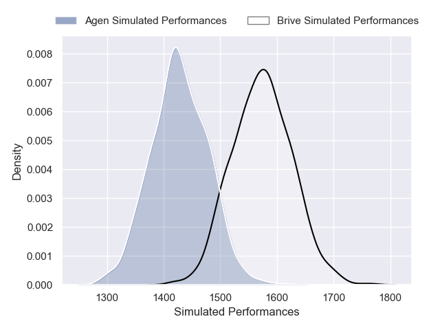
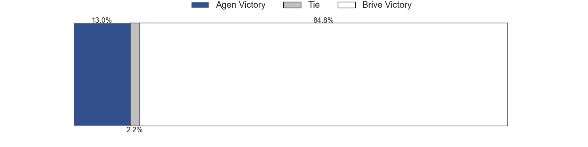
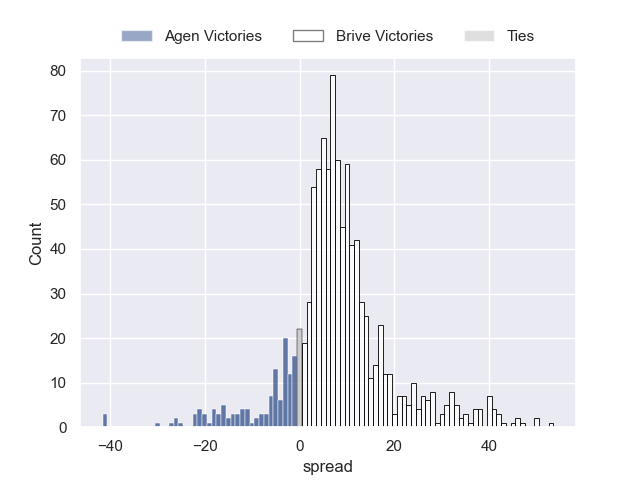

---  
title: "Pro D2 2024 Status"  
date: 2024-12-19 6:00:00 -0500  
categories: model review projection  
layout: article  
aside:  
    toc: true  
---
# Current Team Rankings

# Standings

## Current Standings

| Club                       |   Played |   Wins |   Point Differential |   Losing Bonus Points |   Try Bonus Points |   Competition Points |
|:---------------------------|---------:|-------:|---------------------:|----------------------:|-------------------:|---------------------:|
| Grenoble                   |       14 |     10 |                  118 |                     2 |                  5 |                   47 |
| Beziers                    |       14 |      8 |                   84 |                     6 |                  5 |                   43 |
| Brive                      |       14 |      9 |                   66 |                     2 |                  5 |                   43 |
| Dax                        |       14 |      9 |                   16 |                     2 |                  3 |                   41 |
| Biarritz Olympique         |       14 |      9 |                   67 |                     2 |                  2 |                   40 |
| Montauban                  |       14 |      8 |                   -6 |                     3 |                  4 |                   39 |
| Provence Rugby             |       14 |      7 |                   29 |                     4 |                  4 |                   38 |
| Soyaux-Angouleme           |       14 |      8 |                  -46 |                     1 |                  3 |                   36 |
| Agen                       |       14 |      6 |                   21 |                     6 |                  5 |                   35 |
| Mont-de-Marsan             |       14 |      6 |                   -7 |                     5 |                  2 |                   31 |
| Nevers                     |       14 |      6 |                  -74 |                     4 |                  3 |                   31 |
| Colomiers                  |       14 |      6 |                  -80 |                     3 |                  2 |                   31 |
| Aurillac                   |       14 |      6 |                  -57 |                     2 |                  2 |                   28 |
| Valence Romans Drome Rugby |       14 |      5 |                  -27 |                     6 |                  1 |                   27 |
| Oyonnax                    |       14 |      5 |                    5 |                     4 |                  2 |                   26 |
| Nice                       |       14 |      3 |                 -109 |                     6 |                  3 |                   21 |

## Projected Remaining Table

| Club                       |   Matches Remaining |   Wins |   Point Differential |   Losing Bonus Points |   Try Bonus Points |   Competition Points |
|:---------------------------|--------------------:|-------:|---------------------:|----------------------:|-------------------:|---------------------:|
| Grenoble                   |                  16 |   11.4 |             76.6859  |                   3   |                8.4 |                 57.2 |
| Brive                      |                  16 |   10.7 |             58.1668  |                   3.6 |                3.1 |                 49.3 |
| Provence Rugby             |                  16 |   10   |             41.0764  |                   3.9 |                5.2 |                 49.1 |
| Oyonnax                    |                  16 |    9.8 |             38.6959  |                   3.9 |                5.6 |                 48.8 |
| Beziers                    |                  16 |    9.6 |             39.7566  |                   4.2 |                5   |                 47.7 |
| Mont-de-Marsan             |                  16 |    8.7 |             13.8379  |                   4.6 |                4.7 |                 44   |
| Dax                        |                  16 |    7.6 |             -6.06513 |                   5.4 |                4.5 |                 40.1 |
| Biarritz Olympique         |                  16 |    7.6 |             -8.90499 |                   5.2 |                4.7 |                 40.1 |
| Colomiers                  |                  16 |    7.1 |            -17.4207  |                   5.4 |                4.6 |                 38.5 |
| Agen                       |                  16 |    7   |            -20.1958  |                   5.5 |                4.7 |                 38.4 |
| Soyaux-Angouleme           |                  16 |    7.7 |             -8.05979 |                   4.9 |                2   |                 37.8 |
| Nevers                     |                  16 |    6.9 |            -22.0426  |                   5.1 |                4.5 |                 37.3 |
| Valence Romans Drome Rugby |                  16 |    6.7 |            -30.2905  |                   5.1 |                4.2 |                 35.9 |
| Montauban                  |                  16 |    6.3 |            -38.0582  |                   5.5 |                3.4 |                 34   |
| Aurillac                   |                  16 |    5.7 |            -54.3982  |                   5.5 |                3.1 |                 31.2 |
| Nice                       |                  16 |    5.2 |            -62.7835  |                   5.4 |                4   |                 30.3 |

## Projected Total Table

| Club                       |   Total Matches |   Wins |   Point Differential |   Losing Bonus Points |   Try Bonus Points |   Competition Points |
|:---------------------------|----------------:|-------:|---------------------:|----------------------:|-------------------:|---------------------:|
| Grenoble                   |              30 |   21.4 |           194.686    |                   5   |               13.4 |                104.2 |
| Brive                      |              30 |   19.7 |           124.167    |                   5.6 |                8.1 |                 92.3 |
| Beziers                    |              30 |   17.6 |           123.757    |                  10.2 |               10   |                 90.7 |
| Provence Rugby             |              30 |   17   |            70.0764   |                   7.9 |                9.2 |                 87.1 |
| Dax                        |              30 |   16.6 |             9.93487  |                   7.4 |                7.5 |                 81.1 |
| Biarritz Olympique         |              30 |   16.6 |            58.095    |                   7.2 |                6.7 |                 80.1 |
| Mont-de-Marsan             |              30 |   14.7 |             6.83792  |                   9.6 |                6.7 |                 75   |
| Oyonnax                    |              30 |   14.8 |            43.6959   |                   7.9 |                7.6 |                 74.8 |
| Soyaux-Angouleme           |              30 |   15.7 |           -54.0598   |                   5.9 |                5   |                 73.8 |
| Agen                       |              30 |   13   |             0.804209 |                  11.5 |                9.7 |                 73.4 |
| Montauban                  |              30 |   14.3 |           -44.0582   |                   8.5 |                7.4 |                 73   |
| Colomiers                  |              30 |   13.1 |           -97.4207   |                   8.4 |                6.6 |                 69.5 |
| Nevers                     |              30 |   12.9 |           -96.0426   |                   9.1 |                7.5 |                 68.3 |
| Valence Romans Drome Rugby |              30 |   11.7 |           -57.2905   |                  11.1 |                5.2 |                 62.9 |
| Aurillac                   |              30 |   11.7 |          -111.398    |                   7.5 |                5.1 |                 59.2 |
| Nice                       |              30 |    8.2 |          -171.784    |                  11.4 |                7   |                 51.3 |

# Completed Match Review

| Model | Percent Correct Predictions | Spread Error |
| ------ | ------ | ------ |
| Club Level | 66.1% | 10.0 |
| Player Level: Lineup | 66.7% | 11.1 |
| Player Level: Minutes | 73.2% | 11.0 |

# Future Predictions

## Week 15

### Brive V Agen on 2024/12/19

Average Margin: Brive by 8.4

Average Scoreline: 26-18

### Soyaux-Angouleme V Nevers on 2024/12/20

Average Margin: Soyaux-Angouleme by 4.0

Average Scoreline: 24-20

### Aurillac V Dax on 2024/12/20

Average Margin: Aurillac by 0.4

Average Scoreline: 24-23

### Montauban V Oyonnax on 2024/12/20

Average Margin: Oyonnax by 1.6

Average Scoreline: 26-25

### Colomiers V Biarritz Olympique on 2024/12/20

Average Margin: Colomiers by 2.9

Average Scoreline: 32-29

### Provence Rugby V Valence Romans Drome Rugby on 2024/12/20

Average Margin: Provence Rugby by 7.8

Average Scoreline: 26-18

### Nice V Grenoble on 2024/12/20

Average Margin: Grenoble by 4.0

Average Scoreline: 20-16

### Mont-de-Marsan V Beziers on 2024/12/20

Average Margin: Mont-de-Marsan by 2.9

Average Scoreline: 23-20

## Week 16

### Grenoble V Montauban on 2025/01/09

Average Margin: Grenoble by 10.5

Average Scoreline: 33-23

### Oyonnax V Aurillac on 2025/01/10

Average Margin: Oyonnax by 9.5

Average Scoreline: 29-20

### Valence Romans Drome Rugby V Colomiers on 2025/01/10

Average Margin: Valence Romans Drome Rugby by 3.0

Average Scoreline: 27-24

### Dax V Brive on 2025/01/10

Average Margin: Brive by 0.1

Average Scoreline: 24-24

### Biarritz Olympique V Soyaux-Angouleme on 2025/01/10

Average Margin: Biarritz Olympique by 5.1

Average Scoreline: 25-20

### Nevers V Mont-de-Marsan on 2025/01/10

Average Margin: Nevers by 2.3

Average Scoreline: 26-24

### Agen V Provence Rugby on 2025/01/10

Average Margin: Agen by 0.9

Average Scoreline: 24-23

### Beziers V Nice on 2025/01/10

Average Margin: Beziers by 10.2

Average Scoreline: 29-18

## Week 17

### Colomiers V Dax on 2025/01/17

Average Margin: Colomiers by 2.9

Average Scoreline: 30-27

### Montauban V Valence Romans Drome Rugby on 2025/01/17

Average Margin: Montauban by 2.8

Average Scoreline: 25-22

### Nice V Oyonnax on 2025/01/17

Average Margin: Oyonnax by 2.9

Average Scoreline: 24-21

### Provence Rugby V Grenoble on 2025/01/17

Average Margin: Provence Rugby by 2.4

Average Scoreline: 24-22

### Soyaux-Angouleme V Beziers on 2025/01/17

Average Margin: Soyaux-Angouleme by 0.7

Average Scoreline: 25-25

### Agen V Biarritz Olympique on 2025/01/17

Average Margin: Agen by 2.8

Average Scoreline: 27-24

### Aurillac V Mont-de-Marsan on 2025/01/17

Average Margin: Mont-de-Marsan by 0.4

Average Scoreline: 25-25

### Brive V Nevers on 2025/01/17

Average Margin: Brive by 8.7

Average Scoreline: 25-16

## Week 18

### Mont-de-Marsan V Montauban on 2025/01/24

Average Margin: Mont-de-Marsan by 6.8

Average Scoreline: 29-22

### Oyonnax V Brive on 2025/01/24

Average Margin: Oyonnax by 2.7

Average Scoreline: 24-22

### Aurillac V Provence Rugby on 2025/01/24

Average Margin: Provence Rugby by 2.1

Average Scoreline: 25-23

### Valence Romans Drome Rugby V Nice on 2025/01/24

Average Margin: Valence Romans Drome Rugby by 6.0

Average Scoreline: 25-19

### Beziers V Colomiers on 2025/01/24

Average Margin: Beziers by 8.3

Average Scoreline: 28-19

### Nevers V Agen on 2025/01/24

Average Margin: Nevers by 4.0

Average Scoreline: 27-23

### Grenoble V Biarritz Olympique on 2025/01/24

Average Margin: Grenoble by 9.1

Average Scoreline: 32-23

### Soyaux-Angouleme V Dax on 2025/01/24

Average Margin: Soyaux-Angouleme by 3.1

Average Scoreline: 23-20

## Week 19

### Colomiers V Grenoble on 2025/02/07

Average Margin: Grenoble by 2.2

Average Scoreline: 29-27

### Montauban V Agen on 2025/02/07

Average Margin: Montauban by 2.3

Average Scoreline: 25-23

### Beziers V Oyonnax on 2025/02/07

Average Margin: Beziers by 4.2

Average Scoreline: 26-21

### Dax V Valence Romans Drome Rugby on 2025/02/07

Average Margin: Dax by 5.6

Average Scoreline: 29-23

### Biarritz Olympique V Mont-de-Marsan on 2025/02/07

Average Margin: Biarritz Olympique by 2.9

Average Scoreline: 27-24

### Provence Rugby V Nevers on 2025/02/07

Average Margin: Provence Rugby by 6.9

Average Scoreline: 26-19

### Brive V Soyaux-Angouleme on 2025/02/07

Average Margin: Brive by 8.3

Average Scoreline: 25-17

### Nice V Aurillac on 2025/02/07

Average Margin: Nice by 3.5

Average Scoreline: 25-22

## Week 20

### Grenoble V Aurillac on 2025/02/14

Average Margin: Grenoble by 10.9

Average Scoreline: 36-25

### Valence Romans Drome Rugby V Biarritz Olympique on 2025/02/14

Average Margin: Valence Romans Drome Rugby by 2.1

Average Scoreline: 25-23

### Brive V Nice on 2025/02/14

Average Margin: Brive by 10.4

Average Scoreline: 26-16

### Montauban V Nevers on 2025/02/14

Average Margin: Montauban by 2.6

Average Scoreline: 25-22

### Agen V Beziers on 2025/02/14

Average Margin: Agen by 0.3

Average Scoreline: 27-26

### Mont-de-Marsan V Provence Rugby on 2025/02/14

Average Margin: Mont-de-Marsan by 3.0

Average Scoreline: 24-21

### Oyonnax V Dax on 2025/02/14

Average Margin: Oyonnax by 5.9

Average Scoreline: 27-21

### Soyaux-Angouleme V Colomiers on 2025/02/14

Average Margin: Soyaux-Angouleme by 4.0

Average Scoreline: 24-20

## Week 21

### Biarritz Olympique V Brive on 2025/02/21

Average Margin: Biarritz Olympique by 0.2

Average Scoreline: 24-24

### Colomiers V Mont-de-Marsan on 2025/02/21

Average Margin: Colomiers by 1.8

Average Scoreline: 29-27

### Dax V Grenoble on 2025/02/21

Average Margin: Grenoble by 0.8

Average Scoreline: 30-29

### Nevers V Oyonnax on 2025/02/21

Average Margin: Nevers by 1.7

Average Scoreline: 25-23

### Nice V Montauban on 2025/02/21

Average Margin: Nice by 2.8

Average Scoreline: 22-19

### Provence Rugby V Soyaux-Angouleme on 2025/02/21

Average Margin: Provence Rugby by 7.1

Average Scoreline: 27-20

### Aurillac V Agen on 2025/02/21

Average Margin: Aurillac by 1.1

Average Scoreline: 25-24

### Beziers V Valence Romans Drome Rugby on 2025/02/21

Average Margin: Beziers by 7.6

Average Scoreline: 27-20

## Week 22

### Agen V Valence Romans Drome Rugby on 2025/02/28

Average Margin: Agen by 4.6

Average Scoreline: 23-18

### Oyonnax V Biarritz Olympique on 2025/02/28

Average Margin: Oyonnax by 6.0

Average Scoreline: 30-24

### Montauban V Provence Rugby on 2025/02/28

Average Margin: Provence Rugby by 1.1

Average Scoreline: 25-24

### Mont-de-Marsan V Nice on 2025/02/28

Average Margin: Mont-de-Marsan by 7.8

Average Scoreline: 26-19

### Colomiers V Brive on 2025/02/28

Average Margin: Brive by 1.4

Average Scoreline: 27-26

### Soyaux-Angouleme V Aurillac on 2025/02/28

Average Margin: Soyaux-Angouleme by 6.1

Average Scoreline: 23-17

### Grenoble V Beziers on 2025/02/28

Average Margin: Grenoble by 6.1

Average Scoreline: 28-22

### Dax V Nevers on 2025/02/28

Average Margin: Dax by 4.8

Average Scoreline: 29-24

## Week 23

### Biarritz Olympique V Dax on 2025/03/07

Average Margin: Biarritz Olympique by 3.4

Average Scoreline: 26-23

### Beziers V Nevers on 2025/03/07

Average Margin: Beziers by 7.4

Average Scoreline: 26-18

### Provence Rugby V Colomiers on 2025/03/07

Average Margin: Provence Rugby by 7.2

Average Scoreline: 30-23

### Soyaux-Angouleme V Grenoble on 2025/03/07

Average Margin: Grenoble by 1.6

Average Scoreline: 25-24

### Nice V Agen on 2025/03/07

Average Margin: Nice by 1.5

Average Scoreline: 25-23

### Brive V Mont-de-Marsan on 2025/03/07

Average Margin: Brive by 5.9

Average Scoreline: 27-21

### Valence Romans Drome Rugby V Aurillac on 2025/03/07

Average Margin: Valence Romans Drome Rugby by 5.6

Average Scoreline: 27-22

### Oyonnax V Montauban on 2025/03/07

Average Margin: Oyonnax by 8.8

Average Scoreline: 29-20

## Week 24

### Dax V Beziers on 2025/03/28

Average Margin: Dax by 1.9

Average Scoreline: 26-24

### Montauban V Brive on 2025/03/28

Average Margin: Brive by 1.9

Average Scoreline: 24-22

### Nevers V Nice on 2025/03/28

Average Margin: Nevers by 6.2

Average Scoreline: 28-22

### Agen V Grenoble on 2025/03/28

Average Margin: Grenoble by 2.3

Average Scoreline: 28-26

### Aurillac V Biarritz Olympique on 2025/03/28

Average Margin: Aurillac by 0.9

Average Scoreline: 24-23

### Valence Romans Drome Rugby V Provence Rugby on 2025/03/28

Average Margin: Valence Romans Drome Rugby by 0.2

Average Scoreline: 24-23

### Mont-de-Marsan V Soyaux-Angouleme on 2025/03/28

Average Margin: Mont-de-Marsan by 6.1

Average Scoreline: 28-21

### Colomiers V Oyonnax on 2025/03/28

Average Margin: Colomiers by 0.5

Average Scoreline: 28-27

## Week 25

### Beziers V Aurillac on 2025/04/04

Average Margin: Beziers by 9.1

Average Scoreline: 34-24

### Provence Rugby V Dax on 2025/04/04

Average Margin: Provence Rugby by 6.7

Average Scoreline: 28-22

### Oyonnax V Agen on 2025/04/04

Average Margin: Oyonnax by 6.8

Average Scoreline: 32-25

### Grenoble V Mont-de-Marsan on 2025/04/04

Average Margin: Grenoble by 6.6

Average Scoreline: 34-27

### Brive V Valence Romans Drome Rugby on 2025/04/04

Average Margin: Brive by 8.4

Average Scoreline: 30-22

### Soyaux-Angouleme V Nice on 2025/04/04

Average Margin: Soyaux-Angouleme by 6.4

Average Scoreline: 29-22

### Biarritz Olympique V Montauban on 2025/04/04

Average Margin: Biarritz Olympique by 6.9

Average Scoreline: 31-24

### Colomiers V Nevers on 2025/04/04

Average Margin: Colomiers by 2.8

Average Scoreline: 29-26

## Week 26

### Aurillac V Colomiers on 2025/04/11

Average Margin: Aurillac by 2.2

Average Scoreline: 25-23

### Provence Rugby V Beziers on 2025/04/11

Average Margin: Provence Rugby by 3.2

Average Scoreline: 25-22

### Valence Romans Drome Rugby V Grenoble on 2025/04/11

Average Margin: Grenoble by 2.0

Average Scoreline: 28-26

### Montauban V Dax on 2025/04/11

Average Margin: Montauban by 1.5

Average Scoreline: 25-23

### Agen V Brive on 2025/04/11

Average Margin: Brive by 0.3

Average Scoreline: 26-25

### Nice V Biarritz Olympique on 2025/04/11

Average Margin: Nice by 0.7

Average Scoreline: 26-25

### Mont-de-Marsan V Oyonnax on 2025/04/11

Average Margin: Mont-de-Marsan by 2.7

Average Scoreline: 30-27

### Nevers V Soyaux-Angouleme on 2025/04/11

Average Margin: Nevers by 3.6

Average Scoreline: 28-25

## Week 27

### Brive V Provence Rugby on 2025/04/18

Average Margin: Brive by 4.9

Average Scoreline: 27-22

### Beziers V Mont-de-Marsan on 2025/04/18

Average Margin: Beziers by 5.3

Average Scoreline: 26-21

### Colomiers V Agen on 2025/04/18

Average Margin: Colomiers by 3.3

Average Scoreline: 30-27

### Grenoble V Nice on 2025/04/18

Average Margin: Grenoble by 10.9

Average Scoreline: 37-26

### Nevers V Biarritz Olympique on 2025/04/18

Average Margin: Nevers by 3.3

Average Scoreline: 29-26

### Dax V Aurillac on 2025/04/18

Average Margin: Dax by 6.9

Average Scoreline: 31-24

### Soyaux-Angouleme V Montauban on 2025/04/18

Average Margin: Soyaux-Angouleme by 5.4

Average Scoreline: 26-21

### Oyonnax V Valence Romans Drome Rugby on 2025/04/18

Average Margin: Oyonnax by 7.6

Average Scoreline: 33-26

## Week 28

### Mont-de-Marsan V Dax on 2025/04/25

Average Margin: Mont-de-Marsan by 4.4

Average Scoreline: 28-24

### Agen V Soyaux-Angouleme on 2025/04/25

Average Margin: Agen by 3.9

Average Scoreline: 28-24

### Nice V Provence Rugby on 2025/04/25

Average Margin: Provence Rugby by 2.7

Average Scoreline: 25-22

### Valence Romans Drome Rugby V Nevers on 2025/04/25

Average Margin: Valence Romans Drome Rugby by 2.8

Average Scoreline: 25-22

### Montauban V Colomiers on 2025/04/25

Average Margin: Montauban by 2.8

Average Scoreline: 24-21

### Biarritz Olympique V Beziers on 2025/04/25

Average Margin: Biarritz Olympique by 1.1

Average Scoreline: 25-24

### Grenoble V Oyonnax on 2025/04/25

Average Margin: Grenoble by 6.0

Average Scoreline: 34-28

### Aurillac V Brive on 2025/04/25

Average Margin: Brive by 2.4

Average Scoreline: 25-23

## Week 29

### Mont-de-Marsan V Valence Romans Drome Rugby on 2025/05/09

Average Margin: Mont-de-Marsan by 6.5

Average Scoreline: 33-27

### Colomiers V Nice on 2025/05/09

Average Margin: Colomiers by 4.8

Average Scoreline: 30-26

### Soyaux-Angouleme V Oyonnax on 2025/05/09

Average Margin: Soyaux-Angouleme by 1.1

Average Scoreline: 25-24

### Brive V Grenoble on 2025/05/09

Average Margin: Brive by 2.6

Average Scoreline: 33-31

### Nevers V Aurillac on 2025/05/09

Average Margin: Nevers by 5.7

Average Scoreline: 30-24

### Dax V Agen on 2025/05/09

Average Margin: Dax by 4.7

Average Scoreline: 27-23

### Provence Rugby V Biarritz Olympique on 2025/05/09

Average Margin: Provence Rugby by 6.1

Average Scoreline: 28-22

### Montauban V Beziers on 2025/05/09

Average Margin: Beziers by 1.2

Average Scoreline: 25-24

## Week 30

### Oyonnax V Provence Rugby on 2025/05/16

Average Margin: Oyonnax by 3.1

Average Scoreline: 26-23

### Grenoble V Nevers on 2025/05/16

Average Margin: Grenoble by 8.8

Average Scoreline: 37-29

### Aurillac V Montauban on 2025/05/16

Average Margin: Aurillac by 3.2

Average Scoreline: 28-24

### Biarritz Olympique V Colomiers on 2025/05/16

Average Margin: Biarritz Olympique by 5.3

Average Scoreline: 30-25

### Nice V Dax on 2025/05/16

Average Margin: Nice by 0.9

Average Scoreline: 24-23

### Agen V Mont-de-Marsan on 2025/05/16

Average Margin: Agen by 2.0

Average Scoreline: 26-24

### Valence Romans Drome Rugby V Soyaux-Angouleme on 2025/05/16

Average Margin: Valence Romans Drome Rugby by 3.0

Average Scoreline: 25-22

### Beziers V Brive on 2025/05/16

Average Margin: Beziers by 2.6

Average Scoreline: 23-20

