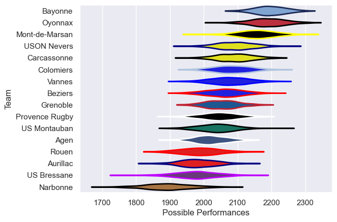

---  
title: "Pro D2 21/22"  
date: 2025-07-29 6:00:00 -0500  
categories: model review projection  
layout: article  
aside:  
    toc: true  
---
# Current Team Rankings

# Standings

## Current Standings

| Club           |   Played |   Wins |   Point Differential |   Losing Bonus Points |   Try Bonus Points |   Competition Points |
|:---------------|---------:|-------:|---------------------:|----------------------:|-------------------:|---------------------:|
| Mont-de-Marsan |       32 |     24 |                  318 |                     2 |                    |                   98 |
| Bayonne        |       32 |     22 |                  324 |                     4 |                  1 |                   97 |
| Oyonnax        |       32 |     21 |                  368 |                     6 |                    |                   92 |
| Colomiers      |       31 |     18 |                   40 |                     8 |                    |                   80 |
| USON Nevers    |       32 |     17 |                  146 |                     5 |                    |                   77 |
| Carcassonne    |       31 |     17 |                   61 |                     7 |                    |                   77 |
| Provence Rugby |       30 |     17 |                  -14 |                     6 |                    |                   76 |
| US Montauban   |       30 |     14 |                  -87 |                     5 |                    |                   65 |
| Beziers        |       30 |     13 |                  -12 |                     9 |                    |                   63 |
| Vannes         |       30 |     12 |                   32 |                     9 |                    |                   61 |
| Aurillac       |       30 |     14 |                 -170 |                     5 |                    |                   61 |
| Grenoble       |       30 |     11 |                  -34 |                     9 |                    |                   59 |
| Agen           |       30 |     10 |                 -121 |                    12 |                    |                   54 |
| Rouen          |       30 |     10 |                 -217 |                     8 |                    |                   50 |
| US Bressane    |       30 |      9 |                 -237 |                     6 |                    |                   48 |
| Narbonne       |       30 |      5 |                 -397 |                     8 |                    |                   32 |

# Completed Match Review

| Model | Percent Correct Predictions | Spread Error |
| ------ | ------ | ------ |
| Club Level | 73.9% | 10.1 |
| Player Level: Lineup | nan% | nan |
| Player Level: Minutes | nan% | nan |

