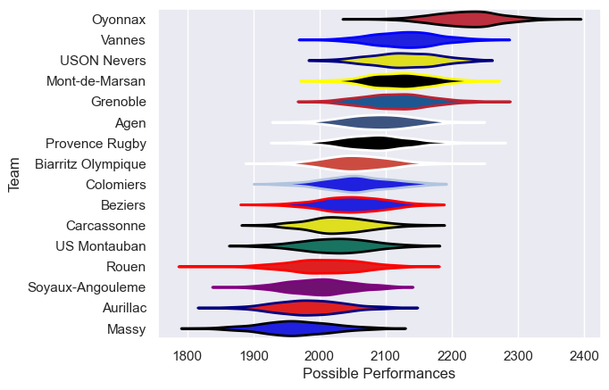

---  
title: "Pro D2 22/23"  
date: 2025-07-29 6:00:00 -0500  
categories: model review projection  
layout: article  
aside:  
    toc: true  
---
# Current Team Rankings

# Standings

## Current Standings

| Club               |   Played |   Wins |   Point Differential |   Losing Bonus Points |   Try Bonus Points |   Competition Points |
|:-------------------|---------:|-------:|---------------------:|----------------------:|-------------------:|---------------------:|
| Oyonnax            |       32 |     25 |                  465 |                     4 |                 15 |                  121 |
| Grenoble           |       32 |     20 |                   82 |                     3 |                  7 |                   96 |
| Mont-de-Marsan     |       32 |     20 |                  119 |                     5 |                  9 |                   94 |
| Vannes             |       32 |     18 |                   83 |                     9 |                 10 |                   93 |
| USON Nevers        |       31 |     17 |                  164 |                     7 |                  8 |                   89 |
| Agen               |       31 |     15 |                   57 |                    10 |                  7 |                   79 |
| Colomiers          |       30 |     15 |                   -4 |                     9 |                  6 |                   75 |
| Provence Rugby     |       30 |     13 |                   14 |                     5 |                  5 |                   70 |
| Beziers            |       30 |     13 |                  -18 |                     9 |                  6 |                   69 |
| Biarritz Olympique |       30 |     12 |                   -9 |                     7 |                  9 |                   68 |
| Aurillac           |       30 |     15 |                 -120 |                     3 |                  4 |                   67 |
| Rouen              |       30 |     12 |                 -173 |                     3 |                  5 |                   60 |
| US Montauban       |       30 |     12 |                 -106 |                     4 |                  4 |                   58 |
| Soyaux-Angouleme   |       30 |     11 |                 -128 |                    11 |                  2 |                   57 |
| Carcassonne        |       30 |     10 |                 -124 |                     7 |                  2 |                   51 |
| Massy              |       30 |      7 |                 -302 |                     8 |                  6 |                   42 |

# Completed Match Review

| Model | Percent Correct Predictions | Spread Error |
| ------ | ------ | ------ |
| Club Level | 68.6% | 9.6 |
| Player Level: Lineup | nan% | nan |
| Player Level: Minutes | nan% | nan |

