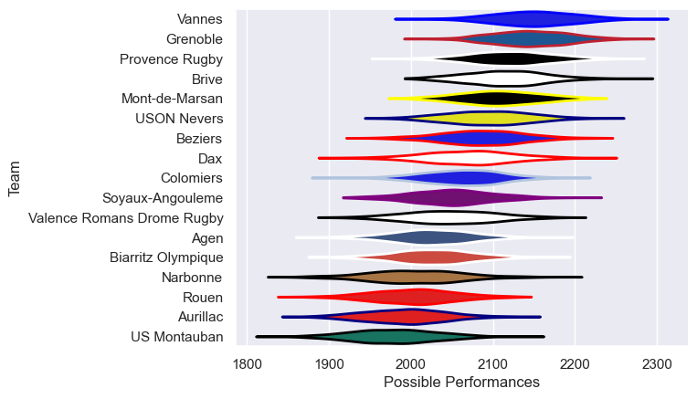

---  
title: "Pro D2 23/24 Status"  
date: 2025-07-28 6:00:00 -0500  
categories: model review projection  
layout: article  
aside:  
    toc: true  
---
# Current Team Rankings

# Standings

## Current Standings

| Club                       |   Played |   Wins |   Point Differential |   Losing Bonus Points |   Try Bonus Points |   Competition Points |
|:---------------------------|---------:|-------:|---------------------:|----------------------:|-------------------:|---------------------:|
| Vannes                     |       32 |     19 |                  282 |                     8 |                 13 |                  101 |
| Grenoble                   |       33 |     21 |                  174 |                     4 |                 12 |                  100 |
| Provence Rugby             |       31 |     20 |                  170 |                     4 |                 12 |                  100 |
| Beziers                    |       32 |     18 |                   70 |                     6 |                  9 |                   89 |
| Brive                      |       31 |     16 |                  104 |                     7 |                 10 |                   83 |
| Mont-de-Marsan             |       30 |     15 |                  125 |                     9 |                 10 |                   81 |
| USON Nevers                |       30 |     15 |                   72 |                    10 |                  8 |                   78 |
| Dax                        |       31 |     17 |                 -105 |                     2 |                  5 |                   77 |
| Colomiers                  |       30 |     13 |                    4 |                     6 |                  5 |                   65 |
| Agen                       |       30 |     13 |                 -135 |                     5 |                  6 |                   65 |
| Aurillac                   |       30 |     14 |                 -171 |                     4 |                  3 |                   65 |
| Valence Romans Drome Rugby |       30 |     13 |                  -17 |                     6 |                  6 |                   64 |
| Soyaux-Angouleme           |       30 |     13 |                  -53 |                     7 |                  1 |                   64 |
| US Montauban               |       31 |     12 |                 -177 |                     6 |                  4 |                   58 |
| Biarritz Olympique         |       30 |     11 |                 -193 |                     5 |                  9 |                   58 |
| Rouen                      |       30 |      9 |                 -149 |                     9 |                  8 |                   55 |
| Narbonne                   |        1 |      0 |                   -1 |                     1 |                    |                    1 |

# Completed Match Review

| Model | Percent Correct Predictions | Spread Error |
| ------ | ------ | ------ |
| Club Level | 77.6% | 10.9 |
| Player Level: Lineup | nan% | nan |
| Player Level: Minutes | nan% | nan |

