---  
title: "Pro D2 24/25 Status"  
date: 2025-05-16 6:00:00 -0500  
categories: model review projection  
layout: article  
aside:  
    toc: true  
---
# Current Team Rankings

# Standings

## Current Standings

| Club                       |   Played |   Wins |   Point Differential |   Losing Bonus Points |   Try Bonus Points |   Competition Points |
|:---------------------------|---------:|-------:|---------------------:|----------------------:|-------------------:|---------------------:|
| Grenoble                   |       29 |     20 |                  301 |                     5 |                 13 |                   98 |
| Brive                      |       29 |     20 |                  182 |                     4 |                 11 |                   95 |
| Colomiers                  |       29 |     18 |                  156 |                     5 |                 14 |                   93 |
| Provence Rugby             |       29 |     17 |                  112 |                     6 |                 11 |                   87 |
| Soyaux-Angouleme           |       29 |     18 |                   51 |                     3 |                 11 |                   86 |
| Montauban                  |       29 |     17 |                   45 |                     6 |                  8 |                   82 |
| Beziers                    |       29 |     15 |                   41 |                     6 |                 10 |                   76 |
| Nevers                     |       29 |     14 |                 -142 |                     5 |                  9 |                   70 |
| Biarritz Olympique         |       29 |     13 |                  -47 |                     6 |                  9 |                   67 |
| Mont-de-Marsan             |       30 |     13 |                  -49 |                     7 |                nan |                   67 |
| Agen                       |       29 |     11 |                  -60 |                    11 |                 10 |                   65 |
| Valence Romans Drome Rugby |       29 |     12 |                   41 |                    10 |                  6 |                   64 |
| Dax                        |       29 |     13 |                  -96 |                     6 |                  3 |                   63 |
| Oyonnax                    |       29 |     11 |                   17 |                     9 |                  7 |                   62 |
| Aurillac                   |       30 |     13 |                 -188 |                     4 |                nan |                   61 |
| Nice                       |       29 |      6 |                 -364 |                     7 |                  8 |                   39 |

## Projected Remaining Table

| Club                       |   Matches Remaining |   Wins |   Point Differential |   Losing Bonus Points |   Try Bonus Points |   Competition Points |
|:---------------------------|--------------------:|-------:|---------------------:|----------------------:|-------------------:|---------------------:|
| Grenoble                   |                   1 |    0.9 |            10.6574   |                   0.1 |                0.4 |                  4   |
| Oyonnax                    |                   1 |    0.7 |             3.52979  |                   0.2 |                0.2 |                  3.2 |
| Agen                       |                   1 |    0.7 |             2.37288  |                   0.2 |                0.2 |                  3.2 |
| Dax                        |                   1 |    0.6 |             2.22084  |                   0.3 |                0.5 |                  3.2 |
| Colomiers                  |                   1 |    0.6 |             1.3933   |                   0.3 |                0.5 |                  3.1 |
| Valence Romans Drome Rugby |                   1 |    0.6 |             1.99306  |                   0.2 |                0.2 |                  3   |
| Aurillac                   |                   1 |    0.6 |             1.29071  |                   0.3 |                0.3 |                  2.9 |
| Brive                      |                   1 |    0.5 |             0.573966 |                   0.3 |                0.3 |                  2.8 |
| Beziers                    |                   1 |    0.5 |            -0.573966 |                   0.4 |                0.2 |                  2.4 |
| Montauban                  |                   1 |    0.4 |            -1.29071  |                   0.4 |                0.4 |                  2.4 |
| Biarritz Olympique         |                   1 |    0.4 |            -1.3933   |                   0.4 |                0.2 |                  2.2 |
| Nice                       |                   1 |    0.4 |            -2.22084  |                   0.4 |                0.3 |                  2.2 |
| Soyaux-Angouleme           |                   1 |    0.4 |            -1.99306  |                   0.4 |                0.2 |                  2.1 |
| Provence Rugby             |                   1 |    0.3 |            -3.52979  |                   0.5 |                0.4 |                  2.1 |
| Mont-de-Marsan             |                   1 |    0.3 |            -2.37288  |                   0.5 |                0.3 |                  2   |
| Nevers                     |                   1 |    0.1 |           -10.6574   |                   0.2 |                0.2 |                  0.8 |

## Projected Total Table

| Club                       |   Total Matches |   Wins |   Point Differential |   Losing Bonus Points |   Try Bonus Points |   Competition Points |
|:---------------------------|----------------:|-------:|---------------------:|----------------------:|-------------------:|---------------------:|
| Grenoble                   |              30 |   20.9 |             311.657  |                   5.1 |               13.4 |                102   |
| Brive                      |              30 |   20.5 |             182.574  |                   4.3 |               11.3 |                 97.8 |
| Colomiers                  |              30 |   18.6 |             157.393  |                   5.3 |               14.5 |                 96.1 |
| Provence Rugby             |              30 |   17.3 |             108.47   |                   6.5 |               11.4 |                 89.1 |
| Soyaux-Angouleme           |              30 |   18.4 |              49.0069 |                   3.4 |               11.2 |                 88.1 |
| Montauban                  |              30 |   17.4 |              43.7093 |                   6.4 |                8.4 |                 84.4 |
| Beziers                    |              30 |   15.5 |              40.426  |                   6.4 |               10.2 |                 78.4 |
| Nevers                     |              30 |   14.1 |            -152.657  |                   5.2 |                9.2 |                 70.8 |
| Biarritz Olympique         |              30 |   13.4 |             -48.3933 |                   6.4 |                9.2 |                 69.2 |
| Mont-de-Marsan             |              31 |   13.3 |             -51.3729 |                   7.5 |                0.3 |                 69   |
| Agen                       |              30 |   11.7 |             -57.6271 |                  11.2 |               10.2 |                 68.2 |
| Valence Romans Drome Rugby |              30 |   12.6 |              42.9931 |                  10.2 |                6.2 |                 67   |
| Dax                        |              30 |   13.6 |             -93.7792 |                   6.3 |                3.5 |                 66.2 |
| Oyonnax                    |              30 |   11.7 |              20.5298 |                   9.2 |                7.2 |                 65.2 |
| Aurillac                   |              31 |   13.6 |            -186.709  |                   4.3 |                0.3 |                 63.9 |
| Nice                       |              30 |    6.4 |            -366.221  |                   7.4 |                8.3 |                 41.2 |

# Completed Match Review

| Model | Percent Correct Predictions | Spread Error |
| ------ | ------ | ------ |
| Club Level | 68.2% | 11.7 |
| Player Level: Lineup | 73.8% | 12.4 |
| Player Level: Minutes | 73.8% | 12.5 |

# Future Predictions

## Week 31

### Oyonnax V Provence Rugby on 2025/05/16

Average Margin: Oyonnax by 3.5

Average Scoreline: 36-32

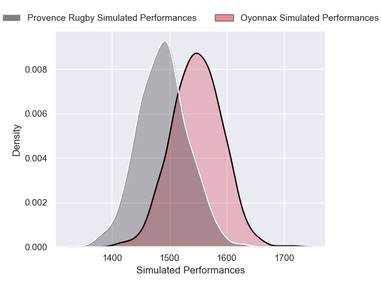
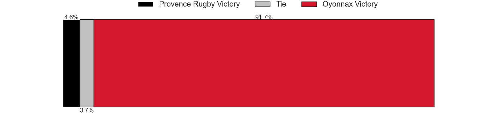
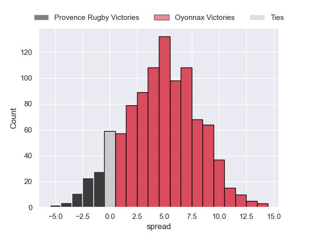

### Nice V Dax on 2025/05/16

Average Margin: Dax by 2.2

Average Scoreline: 31-29

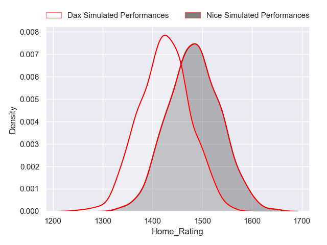
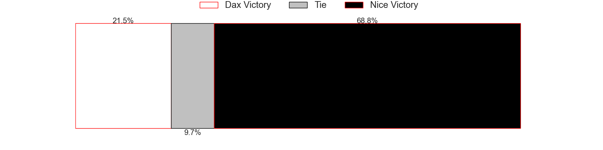
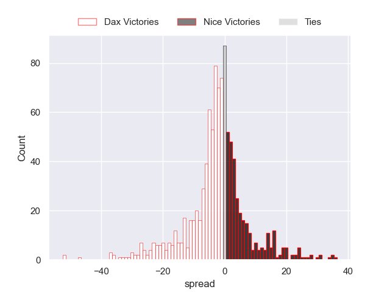

### Aurillac V Montauban on 2025/05/16

Average Margin: Aurillac by 1.3

Average Scoreline: 41-39

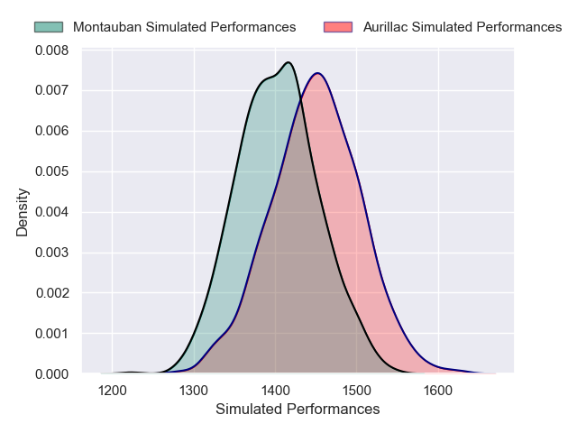
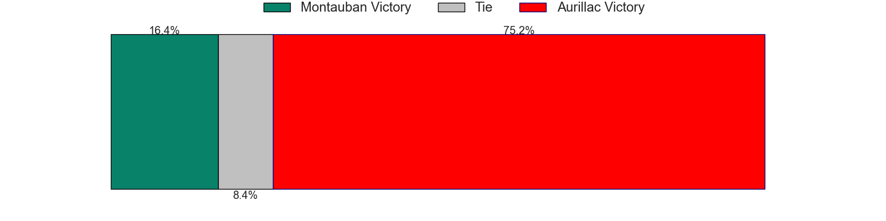
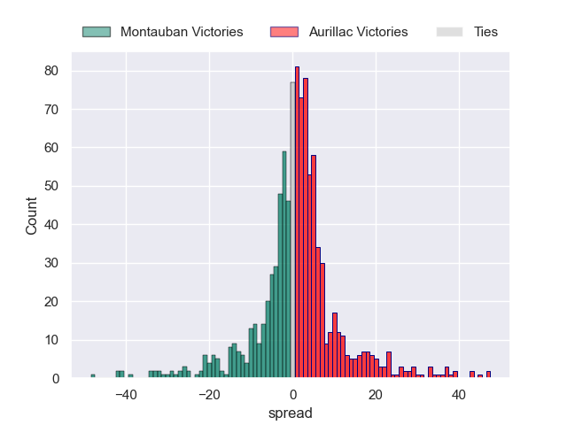

### Valence Romans Drome Rugby V Soyaux-Angouleme on 2025/05/16

Average Margin: Valence Romans Drome Rugby by 2.0

Average Scoreline: 31-29

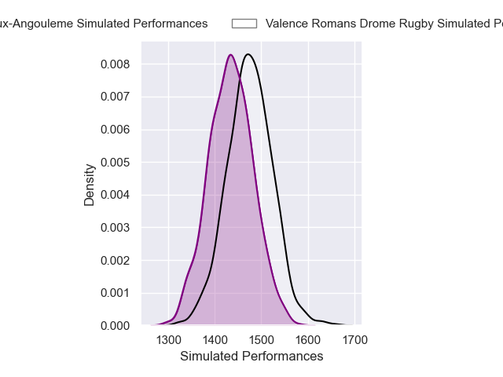
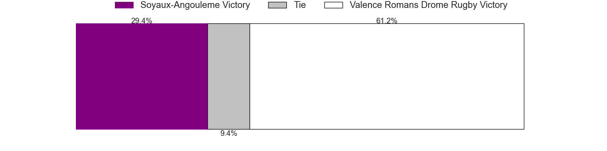
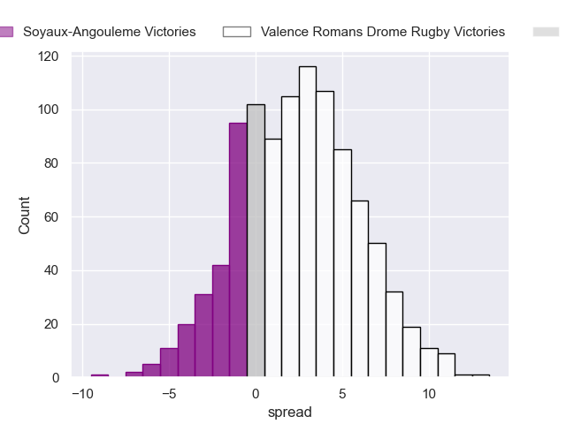

### Biarritz Olympique V Colomiers on 2025/05/16

Average Margin: Colomiers by 1.4

Average Scoreline: 37-36

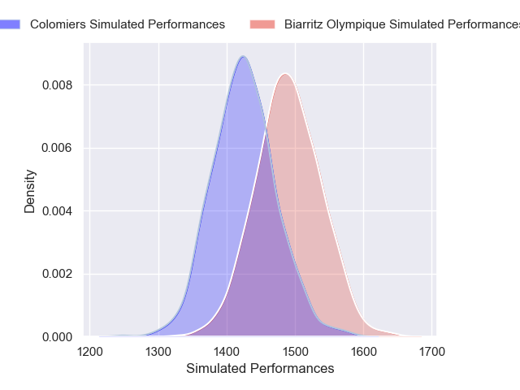
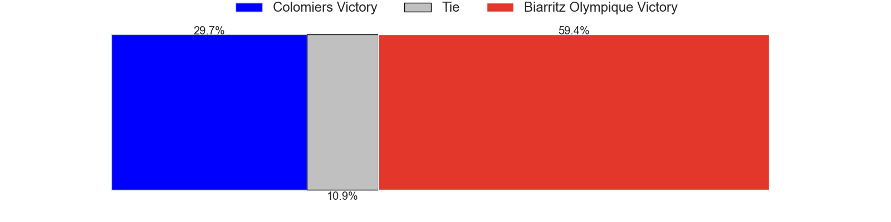
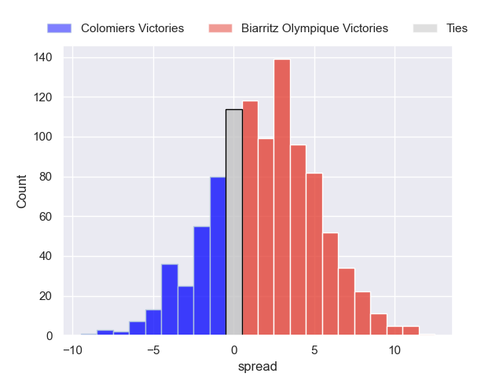

### Beziers V Brive on 2025/05/16

Average Margin: Brive by 0.6

Average Scoreline: 38-37

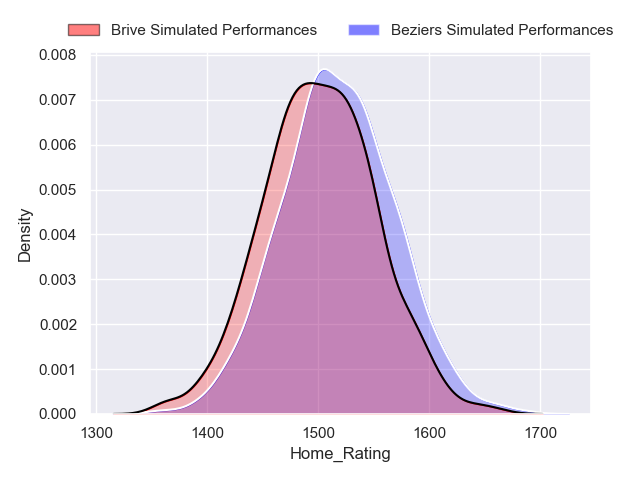
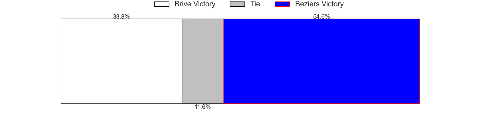
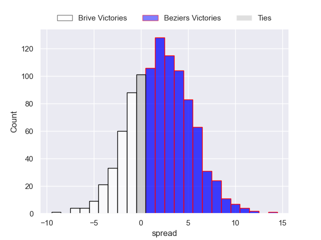

### Agen V Mont-de-Marsan on 2025/05/16

Average Margin: Agen by 2.4

Average Scoreline: 38-36

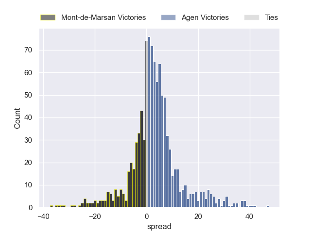

### Grenoble V Nevers on 2025/05/16

Average Margin: Grenoble by 10.7

Average Scoreline: 42-31

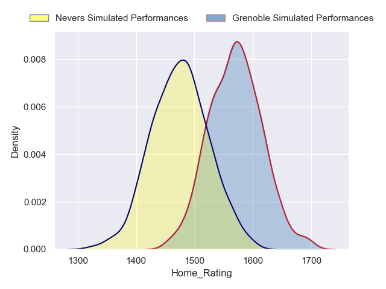
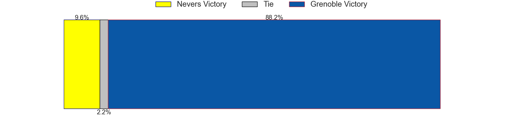
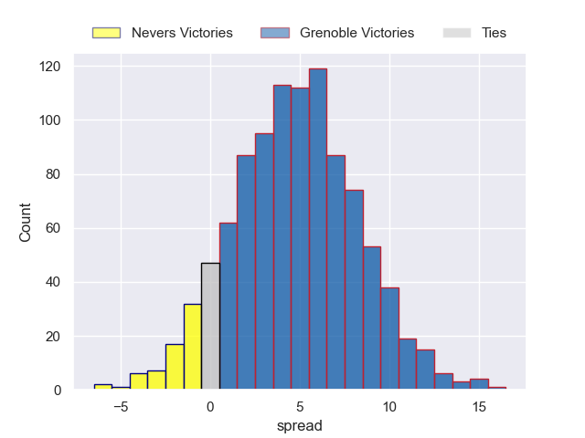

