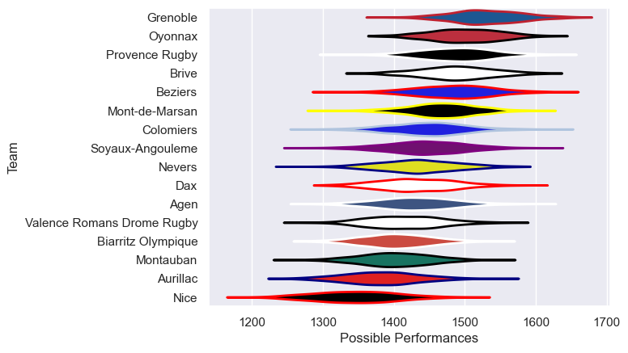

---  
title: "Pro D2 24/25 Status"  
date: 2025-07-28 6:00:00 -0500  
categories: model review projection  
layout: article  
aside:  
    toc: true  
---
# Current Team Rankings

# Standings

## Current Standings

| Club                       |   Played |   Wins |   Point Differential |   Losing Bonus Points |   Try Bonus Points |   Competition Points |
|:---------------------------|---------:|-------:|---------------------:|----------------------:|-------------------:|---------------------:|
| Grenoble                   |       32 |     22 |                  326 |                     6 |                 15 |                  109 |
| Brive                      |       31 |     20 |                  133 |                     4 |                 12 |                   96 |
| Colomiers                  |       31 |     18 |                  145 |                     6 |                 14 |                   94 |
| US Montauban               |       33 |     20 |                   43 |                     6 |                  8 |                   94 |
| Provence Rugby             |       32 |     18 |                  102 |                     6 |                 13 |                   93 |
| Soyaux-Angouleme           |       31 |     17 |                    7 |                     3 |                 11 |                   86 |
| Beziers                    |       30 |     16 |                   74 |                     6 |                 11 |                   81 |
| Biarritz Olympique         |       30 |     14 |                  -39 |                     6 |                 10 |                   72 |
| USON Nevers                |       30 |     14 |                 -151 |                     5 |                 10 |                   71 |
| Agen                       |       30 |     12 |                  -28 |                    11 |                 11 |                   70 |
| Valence Romans Drome Rugby |       30 |     13 |                   58 |                    10 |                  7 |                   69 |
| Oyonnax                    |       30 |     12 |                   33 |                     9 |                  8 |                   67 |
| Mont-de-Marsan             |       30 |     13 |                  -70 |                     7 |                  8 |                   67 |
| Dax                        |       30 |     13 |                 -111 |                     6 |                  3 |                   63 |
| Aurillac                   |       30 |     13 |                 -173 |                     4 |                  6 |                   62 |
| Nice                       |       30 |      7 |                 -349 |                     7 |                  9 |                   44 |

# Completed Match Review

| Model | Percent Correct Predictions | Spread Error |
| ------ | ------ | ------ |
| Club Level | 71.4% | 11.8 |
| Player Level: Lineup | nan% | nan |
| Player Level: Minutes | nan% | nan |

