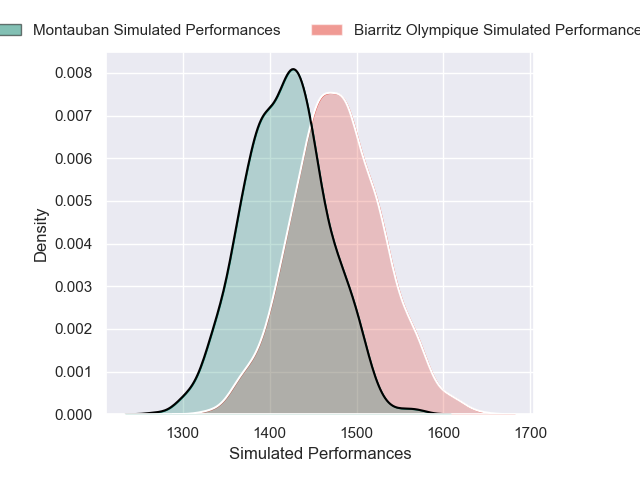
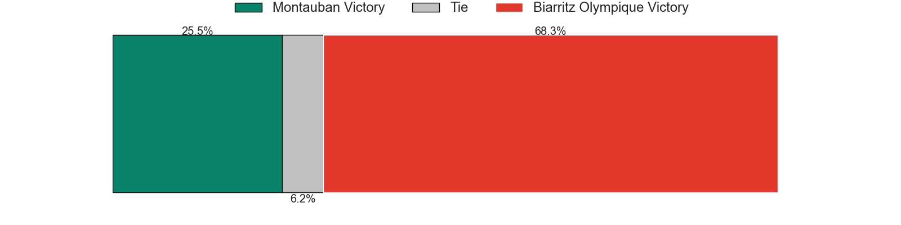
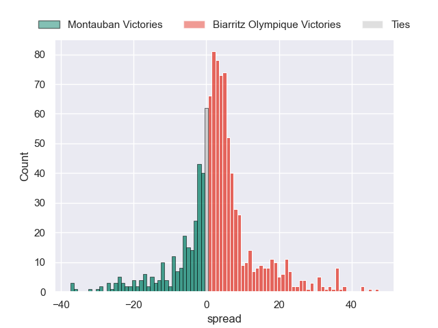

---  
title: "Pro D2 24/25 Status"  
date: 2025-03-28 6:00:00 -0500  
categories: model review projection  
layout: article  
aside:  
    toc: true  
---
# Current Team Rankings

# Standings

## Current Standings

| Club                       |   Played |   Wins |   Point Differential |   Losing Bonus Points |   Try Bonus Points |   Competition Points |
|:---------------------------|---------:|-------:|---------------------:|----------------------:|-------------------:|---------------------:|
| Grenoble                   |       23 |     17 |                  282 |                     3 |                 10 |                   81 |
| Provence Rugby             |       23 |     14 |                   76 |                     4 |                  8 |                   70 |
| Brive                      |       23 |     14 |                  107 |                     4 |                  8 |                   68 |
| Beziers                    |       23 |     13 |                   91 |                     6 |                  9 |                   67 |
| Montauban                  |       23 |     14 |                   28 |                     4 |                  6 |                   66 |
| Soyaux-Angouleme           |       23 |     14 |                   -6 |                     1 |                  9 |                   66 |
| Colomiers                  |       23 |     12 |                  -10 |                     5 |                  8 |                   63 |
| Oyonnax                    |       23 |     10 |                   71 |                     6 |                  6 |                   54 |
| Agen                       |       23 |      9 |                   -3 |                     9 |                  8 |                   53 |
| Biarritz Olympique         |       23 |     11 |                  -10 |                     4 |                  5 |                   53 |
| Nevers                     |       23 |     11 |                 -127 |                     4 |                  5 |                   53 |
| Dax                        |       23 |     10 |                  -46 |                     6 |                  3 |                   51 |
| Mont-de-Marsan             |       24 |     10 |                  -71 |                     6 |                nan |                   51 |
| Valence Romans Drome Rugby |       23 |      9 |                    8 |                    10 |                  4 |                   50 |
| Aurillac                   |       24 |     11 |                 -136 |                     2 |                nan |                   49 |
| Nice                       |       23 |      4 |                 -254 |                     7 |                  6 |                   29 |

## Projected Remaining Table

| Club                       |   Matches Remaining |   Wins |   Point Differential |   Losing Bonus Points |   Try Bonus Points |   Competition Points |
|:---------------------------|--------------------:|-------:|---------------------:|----------------------:|-------------------:|---------------------:|
| Grenoble                   |                   7 |    5.3 |             46.1448  |                   1.1 |                2.9 |                 25.2 |
| Colomiers                  |                   7 |    4.4 |             18.9448  |                   1.7 |                3.3 |                 22.4 |
| Provence Rugby             |                   7 |    4.3 |             18.7181  |                   1.7 |                2.8 |                 21.9 |
| Brive                      |                   7 |    4.3 |             16.3416  |                   1.8 |                1.9 |                 21.1 |
| Oyonnax                    |                   7 |    3.7 |              6.87276 |                   2.1 |                2.1 |                 19.2 |
| Nevers                     |                   7 |    3.6 |              1.99662 |                   1.7 |                2.6 |                 18.9 |
| Soyaux-Angouleme           |                   7 |    3.6 |              5.27613 |                   2.3 |                2   |                 18.5 |
| Beziers                    |                   6 |    3.5 |             11.9148  |                   1.6 |                2.5 |                 18.2 |
| Mont-de-Marsan             |                   7 |    3.4 |             -5.35674 |                   1.9 |                2.1 |                 17.8 |
| Biarritz Olympique         |                   7 |    3.1 |             -9.52878 |                   2.4 |                2.4 |                 17.2 |
| Montauban                  |                   7 |    3.3 |             -3.21219 |                   2.5 |                1.5 |                 17.1 |
| Valence Romans Drome Rugby |                   7 |    2.9 |            -13.3914  |                   2.4 |                2.1 |                 15.9 |
| Agen                       |                   7 |    2.7 |            -16.2253  |                   2.6 |                2   |                 15.4 |
| Dax                        |                   6 |    2.7 |             -6.38712 |                   1.9 |                2.6 |                 15.3 |
| Aurillac                   |                   7 |    2.6 |            -21.3324  |                   2.5 |                1.7 |                 14.7 |
| Nice                       |                   7 |    1.5 |            -50.7757  |                   2.2 |                1.6 |                  9.9 |

## Projected Total Table

| Club                       |   Total Matches |   Wins |   Point Differential |   Losing Bonus Points |   Try Bonus Points |   Competition Points |
|:---------------------------|----------------:|-------:|---------------------:|----------------------:|-------------------:|---------------------:|
| Grenoble                   |              30 |   22.3 |           328.145    |                   4.1 |               12.9 |                106.2 |
| Provence Rugby             |              30 |   18.3 |            94.7181   |                   5.7 |               10.8 |                 91.9 |
| Brive                      |              30 |   18.3 |           123.342    |                   5.8 |                9.9 |                 89.1 |
| Colomiers                  |              30 |   16.4 |             8.94476  |                   6.7 |               11.3 |                 85.4 |
| Beziers                    |              29 |   16.5 |           102.915    |                   7.6 |               11.5 |                 85.2 |
| Soyaux-Angouleme           |              30 |   17.6 |            -0.723866 |                   3.3 |               11   |                 84.5 |
| Montauban                  |              30 |   17.3 |            24.7878   |                   6.5 |                7.5 |                 83.1 |
| Oyonnax                    |              30 |   13.7 |            77.8728   |                   8.1 |                8.1 |                 73.2 |
| Nevers                     |              30 |   14.6 |          -125.003    |                   5.7 |                7.6 |                 71.9 |
| Biarritz Olympique         |              30 |   14.1 |           -19.5288   |                   6.4 |                7.4 |                 70.2 |
| Mont-de-Marsan             |              31 |   13.4 |           -76.3567   |                   7.9 |                2.1 |                 68.8 |
| Agen                       |              30 |   11.7 |           -19.2253   |                  11.6 |               10   |                 68.4 |
| Dax                        |              29 |   12.7 |           -52.3871   |                   7.9 |                5.6 |                 66.3 |
| Valence Romans Drome Rugby |              30 |   11.9 |            -5.39138  |                  12.4 |                6.1 |                 65.9 |
| Aurillac                   |              31 |   13.6 |          -157.332    |                   4.5 |                1.7 |                 63.7 |
| Nice                       |              30 |    5.5 |          -304.776    |                   9.2 |                7.6 |                 38.9 |

# Completed Match Review

| Model | Percent Correct Predictions | Spread Error |
| ------ | ------ | ------ |
| Club Level | 67.6% | 11.1 |
| Player Level: Lineup | 69.9% | 10.6 |
| Player Level: Minutes | 72.8% | 10.7 |

# Future Predictions

## Week 25

### Valence Romans Drome Rugby V Provence Rugby on 2025/03/28

Average Margin: Valence Romans Drome Rugby by 0.7

Average Scoreline: 25-24

### Nevers V Nice on 2025/03/28

Average Margin: Nevers by 9.2

Average Scoreline: 29-20

### Colomiers V Oyonnax on 2025/03/28

Average Margin: Colomiers by 2.0

Average Scoreline: 29-27

### Aurillac V Biarritz Olympique on 2025/03/28

Average Margin: Aurillac by 2.0

Average Scoreline: 33-31

### Mont-de-Marsan V Soyaux-Angouleme on 2025/03/28

Average Margin: Mont-de-Marsan by 3.3

Average Scoreline: 32-29

### Montauban V Brive on 2025/03/28

Average Margin: Brive by 0.7

Average Scoreline: 31-30

### Agen V Grenoble on 2025/03/28

Average Margin: Grenoble by 2.9

Average Scoreline: 37-34

## Week 26

### Biarritz Olympique V Montauban on 2025/04/03

Average Margin: Biarritz Olympique by 3.4

Average Scoreline: 33-29

### Grenoble V Mont-de-Marsan on 2025/04/04

Average Margin: Grenoble by 9.8

Average Scoreline: 34-24

### Brive V Valence Romans Drome Rugby on 2025/04/04

Average Margin: Brive by 7.7

Average Scoreline: 28-21

### Oyonnax V Agen on 2025/04/04

Average Margin: Oyonnax by 7.4

Average Scoreline: 27-19

### Soyaux-Angouleme V Nice on 2025/04/04

Average Margin: Soyaux-Angouleme by 10.6

Average Scoreline: 33-23

### Provence Rugby V Dax on 2025/04/04

Average Margin: Provence Rugby by 8.6

Average Scoreline: 34-25

### Beziers V Aurillac on 2025/04/04

Average Margin: Beziers by 9.8

Average Scoreline: 31-21

### Colomiers V Nevers on 2025/04/04

Average Margin: Colomiers by 5.5

Average Scoreline: 31-25

## Week 27

### Valence Romans Drome Rugby V Grenoble on 2025/04/10

Average Margin: Grenoble by 3.0

Average Scoreline: 29-26

### Provence Rugby V Beziers on 2025/04/11

Average Margin: Provence Rugby by 4.8

Average Scoreline: 30-25

### Mont-de-Marsan V Oyonnax on 2025/04/11

Average Margin: Mont-de-Marsan by 0.4

Average Scoreline: 32-32

### Aurillac V Colomiers on 2025/04/11

Average Margin: Aurillac by 0.1

Average Scoreline: 33-32

### Agen V Brive on 2025/04/11

Average Margin: Brive by 1.1

Average Scoreline: 32-31

### Nevers V Soyaux-Angouleme on 2025/04/11

Average Margin: Nevers by 3.1

Average Scoreline: 31-28

### Nice V Biarritz Olympique on 2025/04/11

Average Margin: Biarritz Olympique by 0.6

Average Scoreline: 34-33

### Montauban V Dax on 2025/04/11

Average Margin: Montauban by 3.9

Average Scoreline: 33-29

## Week 28

### Colomiers V Agen on 2025/04/17

Average Margin: Colomiers by 5.5

Average Scoreline: 30-25

### Nevers V Biarritz Olympique on 2025/04/18

Average Margin: Nevers by 4.7

Average Scoreline: 32-28

### Beziers V Mont-de-Marsan on 2025/04/18

Average Margin: Beziers by 5.6

Average Scoreline: 28-23

### Oyonnax V Valence Romans Drome Rugby on 2025/04/18

Average Margin: Oyonnax by 7.0

Average Scoreline: 29-22

### Soyaux-Angouleme V Montauban on 2025/04/18

Average Margin: Soyaux-Angouleme by 4.6

Average Scoreline: 28-23

### Grenoble V Nice on 2025/04/18

Average Margin: Grenoble by 14.1

Average Scoreline: 40-26

### Dax V Aurillac on 2025/04/18

Average Margin: Dax by 6.1

Average Scoreline: 31-25

### Brive V Provence Rugby on 2025/04/18

Average Margin: Brive by 4.4

Average Scoreline: 30-26

## Week 29

### Mont-de-Marsan V Dax on 2025/04/25

Average Margin: Mont-de-Marsan by 4.8

Average Scoreline: 34-29

### Agen V Soyaux-Angouleme on 2025/04/25

Average Margin: Agen by 2.2

Average Scoreline: 32-29

### Grenoble V Oyonnax on 2025/04/25

Average Margin: Grenoble by 7.2

Average Scoreline: 29-22

### Biarritz Olympique V Beziers on 2025/04/25

Average Margin: Biarritz Olympique by 0.1

Average Scoreline: 33-33

### Nice V Provence Rugby on 2025/04/25

Average Margin: Provence Rugby by 5.3

Average Scoreline: 36-31

### Aurillac V Brive on 2025/04/25

Average Margin: Brive by 3.3

Average Scoreline: 33-29

### Montauban V Colomiers on 2025/04/25

Average Margin: Montauban by 2.2

Average Scoreline: 35-33

### Valence Romans Drome Rugby V Nevers on 2025/04/25

Average Margin: Valence Romans Drome Rugby by 4.7

Average Scoreline: 32-27

## Week 30

### Dax V Agen on 2025/05/09

Average Margin: Dax by 3.9

Average Scoreline: 32-28

### Provence Rugby V Biarritz Olympique on 2025/05/09

Average Margin: Provence Rugby by 8.7

Average Scoreline: 33-25

### Nevers V Aurillac on 2025/05/09

Average Margin: Nevers by 5.7

Average Scoreline: 30-25

### Montauban V Beziers on 2025/05/09

Average Margin: Montauban by 0.9

Average Scoreline: 33-32

### Soyaux-Angouleme V Oyonnax on 2025/05/09

Average Margin: Soyaux-Angouleme by 1.5

Average Scoreline: 35-34

### Brive V Grenoble on 2025/05/09

Average Margin: Brive by 1.4

Average Scoreline: 32-30

### Colomiers V Nice on 2025/05/09

Average Margin: Colomiers by 10.2

Average Scoreline: 33-23

### Mont-de-Marsan V Valence Romans Drome Rugby on 2025/05/09

Average Margin: Mont-de-Marsan by 3.9

Average Scoreline: 34-30

## Week 31

### Nice V Dax on 2025/05/16

Average Margin: Dax by 0.9

Average Scoreline: 33-32

### Beziers V Brive on 2025/05/16

Average Margin: Beziers by 2.3

Average Scoreline: 26-24

### Valence Romans Drome Rugby V Soyaux-Angouleme on 2025/05/16

Average Margin: Valence Romans Drome Rugby by 2.8

Average Scoreline: 29-26

### Agen V Mont-de-Marsan on 2025/05/16

Average Margin: Agen by 2.4

Average Scoreline: 34-31

### Oyonnax V Provence Rugby on 2025/05/16

Average Margin: Oyonnax by 3.6

Average Scoreline: 33-29

### Aurillac V Montauban on 2025/05/16

Average Margin: Aurillac by 1.5

Average Scoreline: 36-34

### Grenoble V Nevers on 2025/05/16

Average Margin: Grenoble by 10.5

Average Scoreline: 37-27

### Biarritz Olympique V Colomiers on 2025/05/16

Average Margin: Biarritz Olympique by 1.9

Average Scoreline: 31-29

