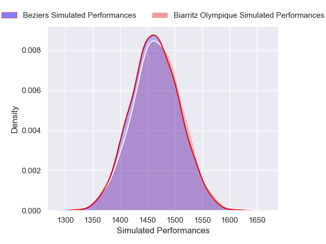
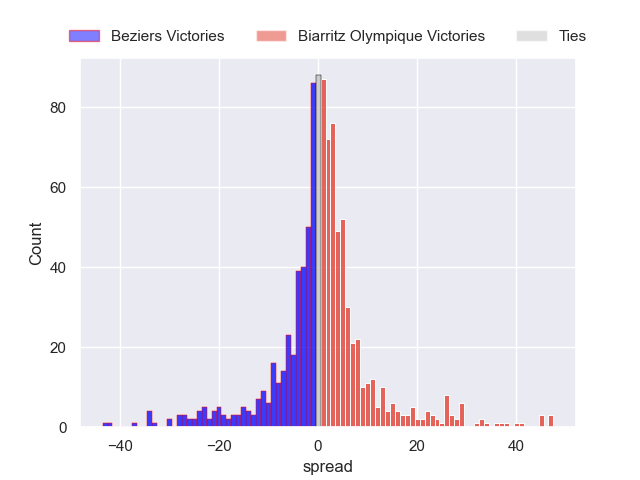

---  
title: "Pro D2 24/25 Status"  
date: 2025-04-17 6:00:00 -0500  
categories: model review projection  
layout: article  
aside:  
    toc: true  
---
# Current Team Rankings

# Standings

## Current Standings

| Club                       |   Played |   Wins |   Point Differential |   Losing Bonus Points |   Try Bonus Points |   Competition Points |
|:---------------------------|---------:|-------:|---------------------:|----------------------:|-------------------:|---------------------:|
| Grenoble                   |       26 |     18 |                  293 |                     5 |                 11 |                   88 |
| Brive                      |       26 |     17 |                  134 |                     4 |                  9 |                   81 |
| Provence Rugby             |       26 |     16 |                   88 |                     4 |                 10 |                   80 |
| Colomiers                  |       26 |     15 |                   66 |                     5 |                 11 |                   78 |
| Soyaux-Angouleme           |       26 |     16 |                   24 |                     2 |                 10 |                   76 |
| Montauban                  |       26 |     15 |                   33 |                     6 |                  7 |                   73 |
| Beziers                    |       26 |     14 |                   57 |                     6 |                  9 |                   71 |
| Agen                       |       26 |     11 |                    1 |                    10 |                 10 |                   64 |
| Nevers                     |       26 |     13 |                 -113 |                     4 |                  8 |                   64 |
| Biarritz Olympique         |       26 |     12 |                  -11 |                     6 |                  8 |                   62 |
| Mont-de-Marsan             |       27 |     12 |                  -38 |                     7 |                nan |                   61 |
| Valence Romans Drome Rugby |       26 |     11 |                   51 |                    10 |                  5 |                   59 |
| Oyonnax                    |       26 |     10 |                   11 |                     8 |                  6 |                   56 |
| Dax                        |       26 |     11 |                  -88 |                     6 |                  3 |                   55 |
| Aurillac                   |       27 |     11 |                 -200 |                     3 |                nan |                   52 |
| Nice                       |       26 |      5 |                 -308 |                     7 |                  8 |                   35 |

## Projected Remaining Table

| Club                       |   Matches Remaining |   Wins |   Point Differential |   Losing Bonus Points |   Try Bonus Points |   Competition Points |
|:---------------------------|--------------------:|-------:|---------------------:|----------------------:|-------------------:|---------------------:|
| Grenoble                   |                   4 |    3   |             30.617   |                   0.7 |                2.2 |                 14.8 |
| Colomiers                  |                   4 |    2.7 |             17.4271  |                   0.9 |                2   |                 13.6 |
| Brive                      |                   4 |    2.7 |             11.2325  |                   0.9 |                1.3 |                 13   |
| Provence Rugby             |                   4 |    2.3 |              7.82603 |                   1.1 |                1.8 |                 12   |
| Dax                        |                   4 |    2.3 |              6.27368 |                   1   |                1.4 |                 11.7 |
| Beziers                    |                   4 |    2.1 |              1.11669 |                   1.3 |                1.4 |                 11   |
| Soyaux-Angouleme           |                   4 |    2.2 |              3.78762 |                   1.2 |                1.1 |                 10.9 |
| Mont-de-Marsan             |                   4 |    2.1 |              2.89251 |                   1.2 |                1.1 |                 10.9 |
| Oyonnax                    |                   4 |    1.9 |             -1.84862 |                   1.2 |                1.5 |                 10.5 |
| Valence Romans Drome Rugby |                   4 |    1.9 |             -2.07203 |                   1.3 |                1.5 |                 10.4 |
| Nevers                     |                   4 |    2   |             -3.78011 |                   0.9 |                1.4 |                 10.2 |
| Agen                       |                   4 |    1.8 |             -3.97295 |                   1.4 |                1.5 |                 10.2 |
| Montauban                  |                   4 |    1.9 |             -4.1502  |                   1.4 |                1   |                  9.8 |
| Biarritz Olympique         |                   4 |    1.5 |            -10.7712  |                   1.4 |                1   |                  8.3 |
| Aurillac                   |                   4 |    1.1 |            -18.3123  |                   1.6 |                1.2 |                  7.1 |
| Nice                       |                   4 |    0.7 |            -36.2656  |                   1.1 |                1.3 |                  5.2 |

## Projected Total Table

| Club                       |   Total Matches |   Wins |   Point Differential |   Losing Bonus Points |   Try Bonus Points |   Competition Points |
|:---------------------------|----------------:|-------:|---------------------:|----------------------:|-------------------:|---------------------:|
| Grenoble                   |              30 |   21   |            323.617   |                   5.7 |               13.2 |                102.8 |
| Brive                      |              30 |   19.7 |            145.232   |                   4.9 |               10.3 |                 94   |
| Provence Rugby             |              30 |   18.3 |             95.826   |                   5.1 |               11.8 |                 92   |
| Colomiers                  |              30 |   17.7 |             83.4271  |                   5.9 |               13   |                 91.6 |
| Soyaux-Angouleme           |              30 |   18.2 |             27.7876  |                   3.2 |               11.1 |                 86.9 |
| Montauban                  |              30 |   16.9 |             28.8498  |                   7.4 |                8   |                 82.8 |
| Beziers                    |              30 |   16.1 |             58.1167  |                   7.3 |               10.4 |                 82   |
| Agen                       |              30 |   12.8 |             -2.97295 |                  11.4 |               11.5 |                 74.2 |
| Nevers                     |              30 |   15   |           -116.78    |                   4.9 |                9.4 |                 74.2 |
| Mont-de-Marsan             |              31 |   14.1 |            -35.1075  |                   8.2 |                1.1 |                 71.9 |
| Biarritz Olympique         |              30 |   13.5 |            -21.7712  |                   7.4 |                9   |                 70.3 |
| Valence Romans Drome Rugby |              30 |   12.9 |             48.928   |                  11.3 |                6.5 |                 69.4 |
| Dax                        |              30 |   13.3 |            -81.7263  |                   7   |                4.4 |                 66.7 |
| Oyonnax                    |              30 |   11.9 |              9.15138 |                   9.2 |                7.5 |                 66.5 |
| Aurillac                   |              31 |   12.1 |           -218.312   |                   4.6 |                1.2 |                 59.1 |
| Nice                       |              30 |    5.7 |           -344.266   |                   8.1 |                9.3 |                 40.2 |

# Completed Match Review

| Model | Percent Correct Predictions | Spread Error |
| ------ | ------ | ------ |
| Club Level | 67.0% | 11.3 |
| Player Level: Lineup | 74.1% | 12.1 |
| Player Level: Minutes | 75.0% | 12.1 |

# Future Predictions

## Week 28

### Colomiers V Agen on 2025/04/17

Average Margin: Colomiers by 6.2

Average Scoreline: 35-28

### Beziers V Mont-de-Marsan on 2025/04/18

Average Margin: Beziers by 4.7

Average Scoreline: 33-28

### Oyonnax V Valence Romans Drome Rugby on 2025/04/18

Average Margin: Oyonnax by 5.9

Average Scoreline: 36-30

### Soyaux-Angouleme V Montauban on 2025/04/18

Average Margin: Soyaux-Angouleme by 6.3

Average Scoreline: 32-25

### Dax V Aurillac on 2025/04/18

Average Margin: Dax by 6.9

Average Scoreline: 35-28

### Brive V Provence Rugby on 2025/04/18

Average Margin: Brive by 4.5

Average Scoreline: 27-23

### Nevers V Biarritz Olympique on 2025/04/18

Average Margin: Nevers by 4.4

Average Scoreline: 34-30

### Grenoble V Nice on 2025/04/18

Average Margin: Grenoble by 15.7

Average Scoreline: 52-37

## Week 29

### Biarritz Olympique V Beziers on 2025/04/24

Average Margin: Biarritz Olympique by 2.2

Average Scoreline: 37-34

### Montauban V Colomiers on 2025/04/25

Average Margin: Montauban by 0.9

Average Scoreline: 25-25

### Agen V Soyaux-Angouleme on 2025/04/25

Average Margin: Agen by 2.6

Average Scoreline: 35-32

### Aurillac V Brive on 2025/04/25

Average Margin: Brive by 5.2

Average Scoreline: 38-32

### Grenoble V Oyonnax on 2025/04/25

Average Margin: Grenoble by 7.1

Average Scoreline: 39-32

### Valence Romans Drome Rugby V Nevers on 2025/04/25

Average Margin: Valence Romans Drome Rugby by 5.1

Average Scoreline: 34-29

### Nice V Provence Rugby on 2025/04/25

Average Margin: Provence Rugby by 6.1

Average Scoreline: 35-29

### Mont-de-Marsan V Dax on 2025/04/25

Average Margin: Mont-de-Marsan by 6.2

Average Scoreline: 36-30

## Week 30

### Montauban V Beziers on 2025/05/09

Average Margin: Montauban by 2.1

Average Scoreline: 27-25

### Nevers V Aurillac on 2025/05/09

Average Margin: Nevers by 7.1

Average Scoreline: 36-29

### Provence Rugby V Biarritz Olympique on 2025/05/09

Average Margin: Provence Rugby by 8.5

Average Scoreline: 36-28

### Mont-de-Marsan V Valence Romans Drome Rugby on 2025/05/09

Average Margin: Mont-de-Marsan by 4.2

Average Scoreline: 37-33

### Dax V Agen on 2025/05/09

Average Margin: Dax by 3.2

Average Scoreline: 30-27

### Soyaux-Angouleme V Oyonnax on 2025/05/09

Average Margin: Soyaux-Angouleme by 3.0

Average Scoreline: 32-28

### Brive V Grenoble on 2025/05/09

Average Margin: Brive by 2.3

Average Scoreline: 34-31

### Colomiers V Nice on 2025/05/09

Average Margin: Colomiers by 12.0

Average Scoreline: 45-32

## Week 31

### Valence Romans Drome Rugby V Soyaux-Angouleme on 2025/05/16

Average Margin: Valence Romans Drome Rugby by 2.9

Average Scoreline: 36-33

### Grenoble V Nevers on 2025/05/16

Average Margin: Grenoble by 10.2

Average Scoreline: 42-31

### Oyonnax V Provence Rugby on 2025/05/16

Average Margin: Oyonnax by 2.4

Average Scoreline: 29-27

### Beziers V Brive on 2025/05/16

Average Margin: Beziers by 0.7

Average Scoreline: 32-32

### Biarritz Olympique V Colomiers on 2025/05/16

Average Margin: Colomiers by 0.1

Average Scoreline: 32-32

### Aurillac V Montauban on 2025/05/16

Average Margin: Aurillac by 0.9

Average Scoreline: 29-28

### Nice V Dax on 2025/05/16

Average Margin: Dax by 2.4

Average Scoreline: 36-33

### Agen V Mont-de-Marsan on 2025/05/16

Average Margin: Agen by 2.8

Average Scoreline: 34-31

