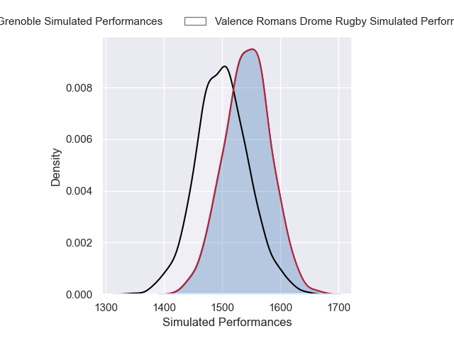
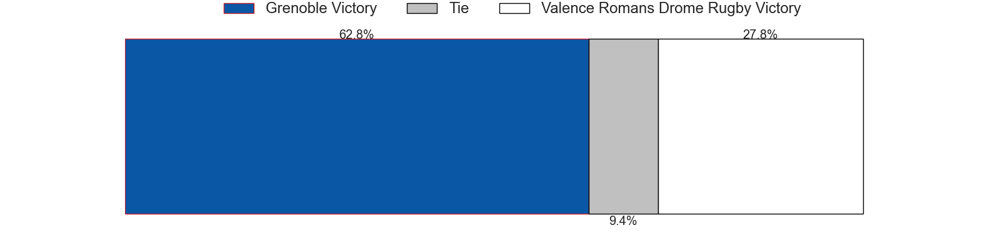
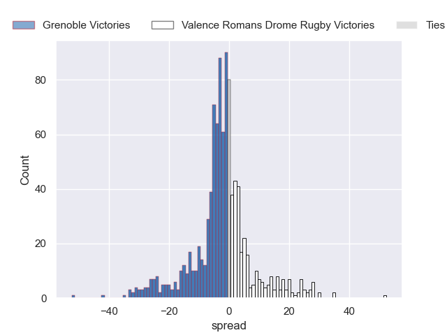
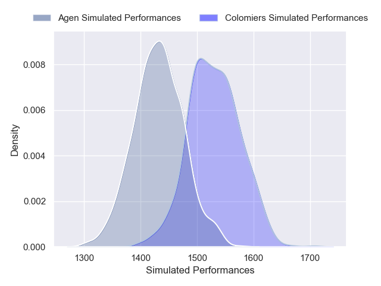
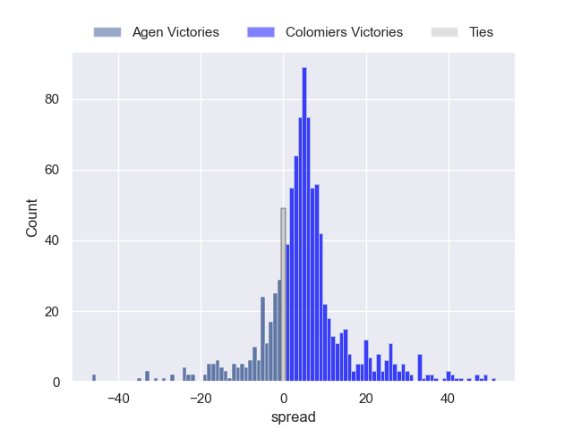

---  
title: "Pro D2 24/25 Status"  
date: 2025-04-07 6:00:00 -0500  
categories: model review projection  
layout: article  
aside:  
    toc: true  
---
# Current Team Rankings

# Standings

## Current Standings

| Club                       |   Played |   Wins |   Point Differential |   Losing Bonus Points |   Try Bonus Points |   Competition Points |
|:---------------------------|---------:|-------:|---------------------:|----------------------:|-------------------:|---------------------:|
| Grenoble                   |       25 |     18 |                  297 |                     4 |                 11 |                   87 |
| Brive                      |       25 |     16 |                  128 |                     4 |                  9 |                   77 |
| Provence Rugby             |       25 |     15 |                   77 |                     4 |                  9 |                   75 |
| Soyaux-Angouleme           |       25 |     16 |                   31 |                     1 |                 10 |                   75 |
| Colomiers                  |       25 |     14 |                   57 |                     5 |                 10 |                   73 |
| Beziers                    |       25 |     14 |                   68 |                     6 |                  9 |                   71 |
| Montauban                  |       25 |     14 |                   21 |                     6 |                  6 |                   68 |
| Agen                       |       25 |     11 |                    7 |                     9 |                 10 |                   63 |
| Biarritz Olympique         |       25 |     12 |                  -10 |                     5 |                  7 |                   60 |
| Nevers                     |       25 |     12 |                 -120 |                     4 |                  7 |                   59 |
| Mont-de-Marsan             |       26 |     11 |                  -54 |                     7 |                nan |                   57 |
| Valence Romans Drome Rugby |       25 |     10 |                   47 |                    10 |                  5 |                   55 |
| Oyonnax                    |       25 |     10 |                   17 |                     7 |                  6 |                   55 |
| Dax                        |       25 |     11 |                  -76 |                     6 |                  3 |                   55 |
| Aurillac                   |       26 |     11 |                 -181 |                     3 |                nan |                   51 |
| Nice                       |       25 |      4 |                 -309 |                     7 |                  7 |                   30 |

## Projected Remaining Table

| Club                       |   Matches Remaining |   Wins |   Point Differential |   Losing Bonus Points |   Try Bonus Points |   Competition Points |
|:---------------------------|--------------------:|-------:|---------------------:|----------------------:|-------------------:|---------------------:|
| Grenoble                   |                   5 |    3.7 |            33.7653   |                   0.8 |                3.4 |                 19   |
| Colomiers                  |                   5 |    3.2 |            16.2275   |                   1.3 |                2.3 |                 16.2 |
| Provence Rugby             |                   5 |    3   |            12.5645   |                   1.2 |                2.3 |                 15.7 |
| Brive                      |                   5 |    3.1 |             8.51409  |                   1.3 |                1.4 |                 15.1 |
| Dax                        |                   5 |    2.7 |             4.7676   |                   1.5 |                1.7 |                 14   |
| Mont-de-Marsan             |                   5 |    2.7 |             3.96337  |                   1.4 |                1.5 |                 13.8 |
| Beziers                    |                   5 |    2.4 |            -0.350104 |                   1.7 |                1.7 |                 13.2 |
| Soyaux-Angouleme           |                   5 |    2.5 |             1.32898  |                   1.6 |                1.2 |                 13   |
| Nevers                     |                   5 |    2.6 |            -1.77023  |                   1.2 |                1.5 |                 13   |
| Oyonnax                    |                   5 |    2.3 |            -4.82445  |                   1.6 |                2   |                 12.9 |
| Montauban                  |                   5 |    2.5 |            -1.50586  |                   1.6 |                1.2 |                 12.8 |
| Agen                       |                   5 |    2.3 |            -3.77642  |                   1.7 |                1.8 |                 12.7 |
| Valence Romans Drome Rugby |                   5 |    2.2 |            -4.92311  |                   1.7 |                1.5 |                 12.2 |
| Biarritz Olympique         |                   5 |    2.1 |           -10.337    |                   1.7 |                1.4 |                 11.5 |
| Aurillac                   |                   5 |    1.6 |           -16.8043   |                   2   |                1.4 |                  9.7 |
| Nice                       |                   5 |    1.1 |           -36.8398   |                   1.6 |                1.1 |                  7   |

## Projected Total Table

| Club                       |   Total Matches |   Wins |   Point Differential |   Losing Bonus Points |   Try Bonus Points |   Competition Points |
|:---------------------------|----------------:|-------:|---------------------:|----------------------:|-------------------:|---------------------:|
| Grenoble                   |              30 |   21.7 |            330.765   |                   4.8 |               14.4 |                106   |
| Brive                      |              30 |   19.1 |            136.514   |                   5.3 |               10.4 |                 92.1 |
| Provence Rugby             |              30 |   18   |             89.5645  |                   5.2 |               11.3 |                 90.7 |
| Colomiers                  |              30 |   17.2 |             73.2275  |                   6.3 |               12.3 |                 89.2 |
| Soyaux-Angouleme           |              30 |   18.5 |             32.329   |                   2.6 |               11.2 |                 88   |
| Beziers                    |              30 |   16.4 |             67.6499  |                   7.7 |               10.7 |                 84.2 |
| Montauban                  |              30 |   16.5 |             19.4941  |                   7.6 |                7.2 |                 80.8 |
| Agen                       |              30 |   13.3 |              3.22358 |                  10.7 |               11.8 |                 75.7 |
| Nevers                     |              30 |   14.6 |           -121.77    |                   5.2 |                8.5 |                 72   |
| Biarritz Olympique         |              30 |   14.1 |            -20.337   |                   6.7 |                8.4 |                 71.5 |
| Mont-de-Marsan             |              31 |   13.7 |            -50.0366  |                   8.4 |                1.5 |                 70.8 |
| Dax                        |              30 |   13.7 |            -71.2324  |                   7.5 |                4.7 |                 69   |
| Oyonnax                    |              30 |   12.3 |             12.1756  |                   8.6 |                8   |                 67.9 |
| Valence Romans Drome Rugby |              30 |   12.2 |             42.0769  |                  11.7 |                6.5 |                 67.2 |
| Aurillac                   |              31 |   12.6 |           -197.804   |                   5   |                1.4 |                 60.7 |
| Nice                       |              30 |    5.1 |           -345.84    |                   8.6 |                8.1 |                 37   |

# Completed Match Review

| Model | Percent Correct Predictions | Spread Error |
| ------ | ------ | ------ |
| Club Level | 67.2% | 11.5 |
| Player Level: Lineup | 74.1% | 12.6 |
| Player Level: Minutes | 75.0% | 12.7 |

# Future Predictions

## Week 27

### Valence Romans Drome Rugby V Grenoble on 2025/04/10

Average Margin: Grenoble by 2.4

Average Scoreline: 30-28

### Nice V Biarritz Olympique on 2025/04/11

Average Margin: Biarritz Olympique by 2.0

Average Scoreline: 30-28

### Montauban V Dax on 2025/04/11

Average Margin: Montauban by 2.8

Average Scoreline: 30-27

### Nevers V Soyaux-Angouleme on 2025/04/11

Average Margin: Nevers by 2.1

Average Scoreline: 28-26

### Aurillac V Colomiers on 2025/04/11

Average Margin: Colomiers by 1.1

Average Scoreline: 31-30

### Mont-de-Marsan V Oyonnax on 2025/04/11

Average Margin: Mont-de-Marsan by 3.0

Average Scoreline: 31-28

### Agen V Brive on 2025/04/11

Average Margin: Brive by 0.8

Average Scoreline: 37-36

### Provence Rugby V Beziers on 2025/04/11

Average Margin: Provence Rugby by 5.0

Average Scoreline: 29-24

## Week 28

### Colomiers V Agen on 2025/04/17

Average Margin: Colomiers by 6.0

Average Scoreline: 31-25

### Beziers V Mont-de-Marsan on 2025/04/18

Average Margin: Beziers by 4.5

Average Scoreline: 31-27

### Brive V Provence Rugby on 2025/04/18

Average Margin: Brive by 3.9

Average Scoreline: 34-31

### Oyonnax V Valence Romans Drome Rugby on 2025/04/18

Average Margin: Oyonnax by 6.0

Average Scoreline: 28-22

### Grenoble V Nice on 2025/04/18

Average Margin: Grenoble by 15.2

Average Scoreline: 49-34

### Nevers V Biarritz Olympique on 2025/04/18

Average Margin: Nevers by 4.1

Average Scoreline: 29-25

### Dax V Aurillac on 2025/04/18

Average Margin: Dax by 6.8

Average Scoreline: 31-25

### Soyaux-Angouleme V Montauban on 2025/04/18

Average Margin: Soyaux-Angouleme by 5.3

Average Scoreline: 29-24

## Week 29

### Biarritz Olympique V Beziers on 2025/04/25

Average Margin: Biarritz Olympique by 0.2

Average Scoreline: 29-28

### Grenoble V Oyonnax on 2025/04/25

Average Margin: Grenoble by 7.8

Average Scoreline: 39-31

### Agen V Soyaux-Angouleme on 2025/04/25

Average Margin: Agen by 2.7

Average Scoreline: 26-23

### Nice V Provence Rugby on 2025/04/25

Average Margin: Provence Rugby by 5.8

Average Scoreline: 34-28

### Montauban V Colomiers on 2025/04/25

Average Margin: Montauban by 1.4

Average Scoreline: 29-28

### Aurillac V Brive on 2025/04/25

Average Margin: Brive by 3.7

Average Scoreline: 31-28

### Mont-de-Marsan V Dax on 2025/04/25

Average Margin: Mont-de-Marsan by 5.2

Average Scoreline: 30-25

### Valence Romans Drome Rugby V Nevers on 2025/04/25

Average Margin: Valence Romans Drome Rugby by 4.7

Average Scoreline: 28-23

## Week 30

### Provence Rugby V Biarritz Olympique on 2025/05/09

Average Margin: Provence Rugby by 9.0

Average Scoreline: 36-27

### Colomiers V Nice on 2025/05/09

Average Margin: Colomiers by 11.2

Average Scoreline: 43-31

### Brive V Grenoble on 2025/05/09

Average Margin: Brive by 1.8

Average Scoreline: 32-30

### Soyaux-Angouleme V Oyonnax on 2025/05/09

Average Margin: Soyaux-Angouleme by 3.4

Average Scoreline: 36-33

### Dax V Agen on 2025/05/09

Average Margin: Dax by 3.3

Average Scoreline: 33-30

### Nevers V Aurillac on 2025/05/09

Average Margin: Nevers by 7.0

Average Scoreline: 38-31

### Montauban V Beziers on 2025/05/09

Average Margin: Montauban by 1.4

Average Scoreline: 32-31

### Mont-de-Marsan V Valence Romans Drome Rugby on 2025/05/09

Average Margin: Mont-de-Marsan by 3.9

Average Scoreline: 29-25

## Week 31

### Aurillac V Montauban on 2025/05/16

Average Margin: Aurillac by 1.8

Average Scoreline: 31-29

### Valence Romans Drome Rugby V Soyaux-Angouleme on 2025/05/16

Average Margin: Valence Romans Drome Rugby by 2.7

Average Scoreline: 30-27

### Agen V Mont-de-Marsan on 2025/05/16

Average Margin: Agen by 3.5

Average Scoreline: 35-32

### Nice V Dax on 2025/05/16

Average Margin: Dax by 2.6

Average Scoreline: 33-30

### Oyonnax V Provence Rugby on 2025/05/16

Average Margin: Oyonnax by 3.4

Average Scoreline: 31-28

### Biarritz Olympique V Colomiers on 2025/05/16

Average Margin: Biarritz Olympique by 0.6

Average Scoreline: 31-31

### Beziers V Brive on 2025/05/16

Average Margin: Beziers by 1.7

Average Scoreline: 31-30

### Grenoble V Nevers on 2025/05/16

Average Margin: Grenoble by 10.2

Average Scoreline: 41-31

