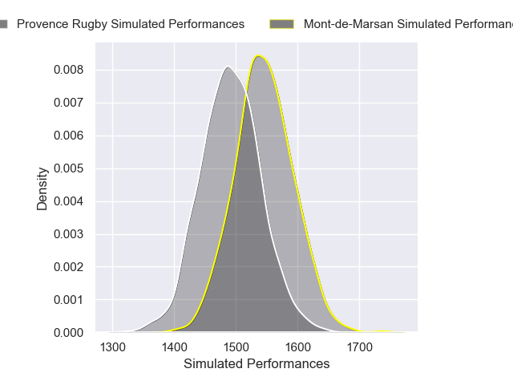
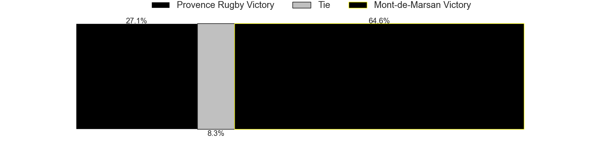
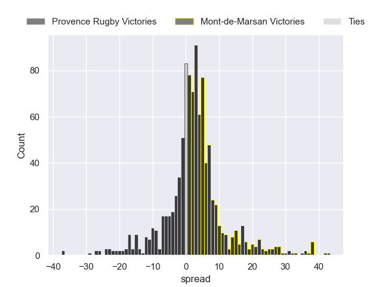
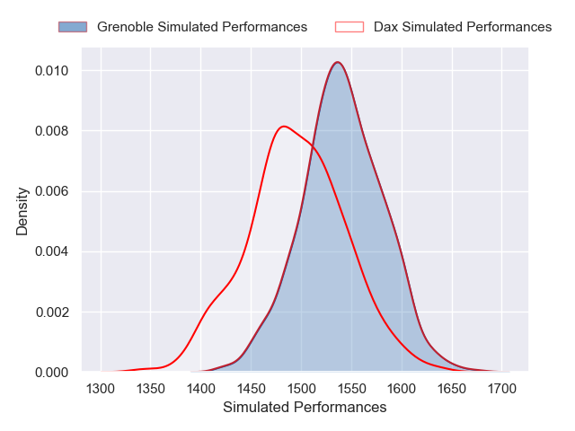
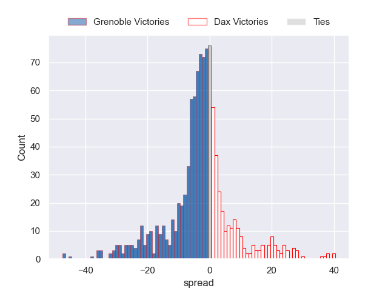
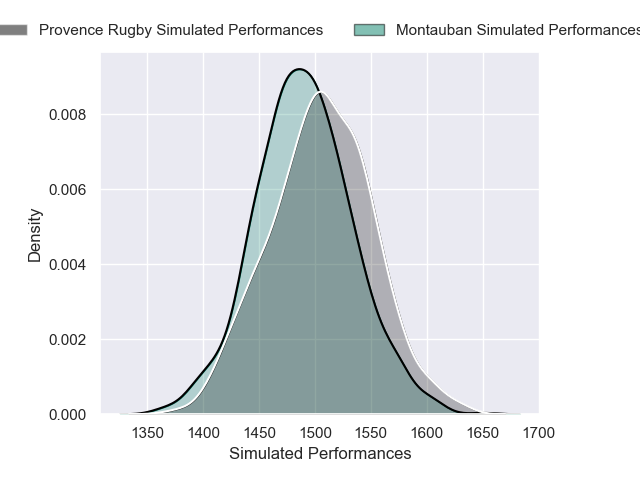
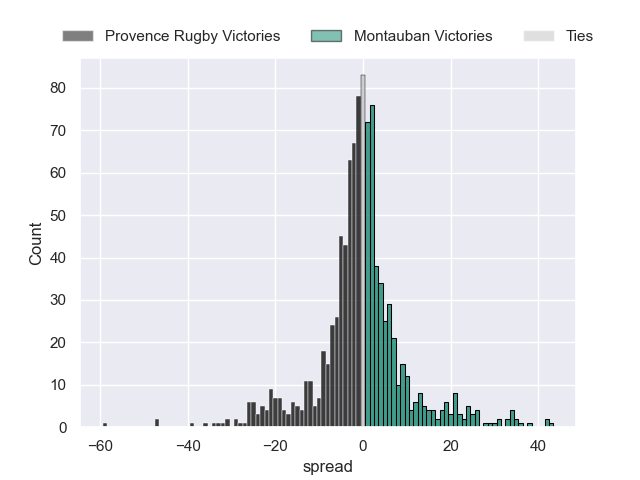
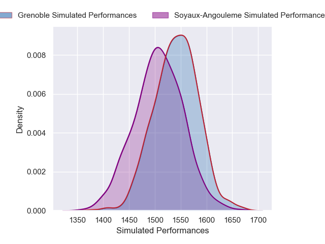
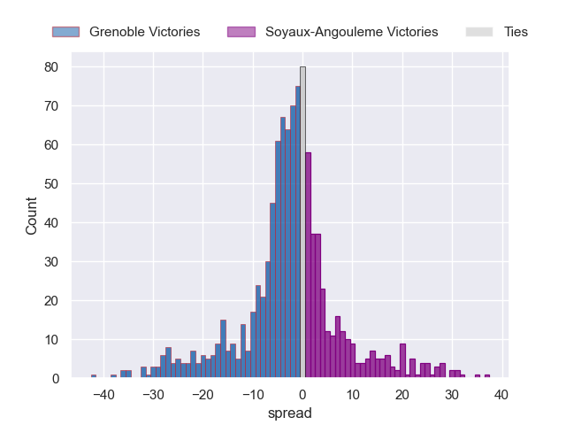

---  
title: "Pro D2 24/25 Status"  
date: 2025-02-13 6:00:00 -0500  
categories: model review projection  
layout: article  
aside:  
    toc: true  
---
# Current Team Rankings

# Standings

## Current Standings

| Club                       |   Played |   Wins |   Point Differential |   Losing Bonus Points |   Try Bonus Points |   Competition Points |
|:---------------------------|---------:|-------:|---------------------:|----------------------:|-------------------:|---------------------:|
| Grenoble                   |       19 |     14 |                  191 |                     3 |                  8 |                   67 |
| Beziers                    |       19 |     11 |                  120 |                     6 |                  8 |                   58 |
| Provence Rugby             |       19 |     11 |                   60 |                     4 |                  6 |                   56 |
| Brive                      |       19 |     11 |                   72 |                     3 |                  6 |                   53 |
| Montauban                  |       19 |     11 |                    7 |                     4 |                  5 |                   53 |
| Soyaux-Angouleme           |       19 |     11 |                  -26 |                     1 |                  6 |                   51 |
| Colomiers                  |       19 |     10 |                  -39 |                     3 |                  6 |                   51 |
| Mont-de-Marsan             |       20 |     10 |                   72 |                     5 |                nan |                   49 |
| Dax                        |       19 |     10 |                  -32 |                     4 |                  3 |                   47 |
| Nevers                     |       19 |      9 |                  -80 |                     4 |                  5 |                   45 |
| Oyonnax                    |       19 |      9 |                   48 |                     4 |                  4 |                   44 |
| Agen                       |       19 |      7 |                  -10 |                     8 |                  6 |                   42 |
| Biarritz Olympique         |       19 |      9 |                  -13 |                     2 |                  3 |                   41 |
| Aurillac                   |       20 |      9 |                 -130 |                     2 |                nan |                   41 |
| Valence Romans Drome Rugby |       19 |      7 |                  -15 |                     8 |                  3 |                   39 |
| Nice                       |       19 |      3 |                 -225 |                     6 |                  4 |                   22 |

## Projected Remaining Table

| Club                       |   Matches Remaining |   Wins |   Point Differential |   Losing Bonus Points |   Try Bonus Points |   Competition Points |
|:---------------------------|--------------------:|-------:|---------------------:|----------------------:|-------------------:|---------------------:|
| Grenoble                   |                  11 |    8.3 |             64.8974  |                   1.7 |                3.8 |                 38.9 |
| Oyonnax                    |                  11 |    7   |             36.1353  |                   2.5 |                4.1 |                 34.6 |
| Provence Rugby             |                  11 |    6.8 |             29.1025  |                   2.7 |                3.9 |                 34   |
| Brive                      |                  11 |    7   |             31.2929  |                   2.6 |                2.8 |                 33.5 |
| Beziers                    |                  11 |    6.6 |             22.5446  |                   2.8 |                3.8 |                 33   |
| Mont-de-Marsan             |                  11 |    6.3 |             19.621   |                   2.8 |                3.2 |                 31.3 |
| Colomiers                  |                  11 |    5.7 |              6.06157 |                   3.4 |                3.3 |                 29.6 |
| Soyaux-Angouleme           |                  11 |    5.4 |              2.95057 |                   3.5 |                1.7 |                 26.8 |
| Nevers                     |                  11 |    5   |             -7.5568  |                   3.4 |                3.2 |                 26.8 |
| Agen                       |                  11 |    4.8 |            -12.6627  |                   4   |                3   |                 26.3 |
| Dax                        |                  11 |    4.6 |            -17.8597  |                   3.6 |                3.1 |                 25.3 |
| Montauban                  |                  11 |    4.8 |            -14.899   |                   3.9 |                1.9 |                 25   |
| Valence Romans Drome Rugby |                  11 |    4.7 |            -18.3778  |                   3.4 |                2.7 |                 24.8 |
| Biarritz Olympique         |                  11 |    4.5 |            -23.4034  |                   3.8 |                2.8 |                 24.4 |
| Aurillac                   |                  11 |    3.6 |            -43.7625  |                   3.6 |                2.6 |                 20.8 |
| Nice                       |                  11 |    2.6 |            -74.0838  |                   3.4 |                1.9 |                 15.7 |

## Projected Total Table

| Club                       |   Total Matches |   Wins |   Point Differential |   Losing Bonus Points |   Try Bonus Points |   Competition Points |
|:---------------------------|----------------:|-------:|---------------------:|----------------------:|-------------------:|---------------------:|
| Grenoble                   |              30 |   22.3 |            255.897   |                   4.7 |               11.8 |                105.9 |
| Beziers                    |              30 |   17.6 |            142.545   |                   8.8 |               11.8 |                 91   |
| Provence Rugby             |              30 |   17.8 |             89.1025  |                   6.7 |                9.9 |                 90   |
| Brive                      |              30 |   18   |            103.293   |                   5.6 |                8.8 |                 86.5 |
| Colomiers                  |              30 |   15.7 |            -32.9384  |                   6.4 |                9.3 |                 80.6 |
| Mont-de-Marsan             |              31 |   16.3 |             91.621   |                   7.8 |                3.2 |                 80.3 |
| Oyonnax                    |              30 |   16   |             84.1353  |                   6.5 |                8.1 |                 78.6 |
| Montauban                  |              30 |   15.8 |             -7.89901 |                   7.9 |                6.9 |                 78   |
| Soyaux-Angouleme           |              30 |   16.4 |            -23.0494  |                   4.5 |                7.7 |                 77.8 |
| Dax                        |              30 |   14.6 |            -49.8597  |                   7.6 |                6.1 |                 72.3 |
| Nevers                     |              30 |   14   |            -87.5568  |                   7.4 |                8.2 |                 71.8 |
| Agen                       |              30 |   11.8 |            -22.6627  |                  12   |                9   |                 68.3 |
| Biarritz Olympique         |              30 |   13.5 |            -36.4034  |                   5.8 |                5.8 |                 65.4 |
| Valence Romans Drome Rugby |              30 |   11.7 |            -33.3778  |                  11.4 |                5.7 |                 63.8 |
| Aurillac                   |              31 |   12.6 |           -173.763   |                   5.6 |                2.6 |                 61.8 |
| Nice                       |              30 |    5.6 |           -299.084   |                   9.4 |                5.9 |                 37.7 |

# Completed Match Review

| Model | Percent Correct Predictions | Spread Error |
| ------ | ------ | ------ |
| Club Level | 65.4% | 11.2 |
| Player Level: Lineup | 72.1% | 10.3 |
| Player Level: Minutes | 73.3% | 10.5 |

# Future Predictions

## Week 21

### Mont-de-Marsan V Provence Rugby on 2025/02/13

Average Margin: Mont-de-Marsan by 2.7

Average Scoreline: 29-27

### Soyaux-Angouleme V Colomiers on 2025/02/14

Average Margin: Soyaux-Angouleme by 3.8

Average Scoreline: 31-27

### Agen V Beziers on 2025/02/14

Average Margin: Agen by 0.4

Average Scoreline: 27-27

### Brive V Nice on 2025/02/14

Average Margin: Brive by 12.5

Average Scoreline: 27-15

### Grenoble V Aurillac on 2025/02/14

Average Margin: Grenoble by 12.0

Average Scoreline: 31-19

### Oyonnax V Dax on 2025/02/14

Average Margin: Oyonnax by 8.0

Average Scoreline: 33-25

### Montauban V Nevers on 2025/02/14

Average Margin: Montauban by 3.2

Average Scoreline: 29-25

### Valence Romans Drome Rugby V Biarritz Olympique on 2025/02/14

Average Margin: Valence Romans Drome Rugby by 4.4

Average Scoreline: 33-28

## Week 22

### Dax V Grenoble on 2025/02/20

Average Margin: Grenoble by 3.2

Average Scoreline: 35-32

### Biarritz Olympique V Brive on 2025/02/21

Average Margin: Brive by 1.1

Average Scoreline: 26-25

### Nevers V Oyonnax on 2025/02/21

Average Margin: Nevers by 0.2

Average Scoreline: 31-31

### Provence Rugby V Soyaux-Angouleme on 2025/02/21

Average Margin: Provence Rugby by 6.8

Average Scoreline: 28-21

### Beziers V Valence Romans Drome Rugby on 2025/02/21

Average Margin: Beziers by 6.5

Average Scoreline: 32-25

### Colomiers V Mont-de-Marsan on 2025/02/21

Average Margin: Colomiers by 1.7

Average Scoreline: 28-26

### Aurillac V Agen on 2025/02/21

Average Margin: Aurillac by 1.0

Average Scoreline: 29-28

### Nice V Montauban on 2025/02/21

Average Margin: Montauban by 0.8

Average Scoreline: 33-32

## Week 23

### Montauban V Provence Rugby on 2025/02/27

Average Margin: Provence Rugby by 1.4

Average Scoreline: 29-28

### Mont-de-Marsan V Nice on 2025/02/28

Average Margin: Mont-de-Marsan by 11.1

Average Scoreline: 30-18

### Colomiers V Brive on 2025/02/28

Average Margin: Colomiers by 0.5

Average Scoreline: 24-23

### Soyaux-Angouleme V Aurillac on 2025/02/28

Average Margin: Soyaux-Angouleme by 6.9

Average Scoreline: 31-24

### Oyonnax V Biarritz Olympique on 2025/02/28

Average Margin: Oyonnax by 10.0

Average Scoreline: 33-23

### Agen V Valence Romans Drome Rugby on 2025/02/28

Average Margin: Agen by 3.5

Average Scoreline: 35-31

### Dax V Nevers on 2025/02/28

Average Margin: Dax by 3.3

Average Scoreline: 35-31

### Grenoble V Beziers on 2025/02/28

Average Margin: Grenoble by 6.5

Average Scoreline: 30-24

## Week 24

### Soyaux-Angouleme V Grenoble on 2025/03/06

Average Margin: Grenoble by 1.9

Average Scoreline: 31-29

### Oyonnax V Montauban on 2025/03/07

Average Margin: Oyonnax by 9.7

Average Scoreline: 32-22

### Nice V Agen on 2025/03/07

Average Margin: Agen by 1.0

Average Scoreline: 30-29

### Biarritz Olympique V Dax on 2025/03/07

Average Margin: Biarritz Olympique by 3.3

Average Scoreline: 31-28

### Provence Rugby V Colomiers on 2025/03/07

Average Margin: Provence Rugby by 6.9

Average Scoreline: 34-27

### Valence Romans Drome Rugby V Aurillac on 2025/03/07

Average Margin: Valence Romans Drome Rugby by 5.9

Average Scoreline: 33-27

### Beziers V Nevers on 2025/03/07

Average Margin: Beziers by 7.6

Average Scoreline: 35-27

### Brive V Mont-de-Marsan on 2025/03/07

Average Margin: Brive by 5.1

Average Scoreline: 27-22

## Week 25

### Nevers V Nice on 2025/03/28

Average Margin: Nevers by 9.6

Average Scoreline: 30-21

### Colomiers V Oyonnax on 2025/03/28

Average Margin: Colomiers by 0.9

Average Scoreline: 33-32

### Aurillac V Biarritz Olympique on 2025/03/28

Average Margin: Aurillac by 2.4

Average Scoreline: 31-29

### Dax V Beziers on 2025/03/28

Average Margin: Dax by 0.3

Average Scoreline: 28-28

### Agen V Grenoble on 2025/03/28

Average Margin: Grenoble by 2.7

Average Scoreline: 29-27

### Mont-de-Marsan V Soyaux-Angouleme on 2025/03/28

Average Margin: Mont-de-Marsan by 6.2

Average Scoreline: 30-24

### Montauban V Brive on 2025/03/28

Average Margin: Brive by 0.9

Average Scoreline: 28-27

### Valence Romans Drome Rugby V Provence Rugby on 2025/03/28

Average Margin: Provence Rugby by 0.2

Average Scoreline: 29-29

## Week 26

### Colomiers V Nevers on 2025/04/04

Average Margin: Colomiers by 4.0

Average Scoreline: 37-33

### Brive V Valence Romans Drome Rugby on 2025/04/04

Average Margin: Brive by 7.8

Average Scoreline: 29-21

### Provence Rugby V Dax on 2025/04/04

Average Margin: Provence Rugby by 7.5

Average Scoreline: 34-27

### Oyonnax V Agen on 2025/04/04

Average Margin: Oyonnax by 8.0

Average Scoreline: 34-26

### Beziers V Aurillac on 2025/04/04

Average Margin: Beziers by 10.1

Average Scoreline: 33-23

### Soyaux-Angouleme V Nice on 2025/04/04

Average Margin: Soyaux-Angouleme by 9.6

Average Scoreline: 29-20

### Grenoble V Mont-de-Marsan on 2025/04/04

Average Margin: Grenoble by 6.7

Average Scoreline: 28-21

### Biarritz Olympique V Montauban on 2025/04/04

Average Margin: Biarritz Olympique by 3.7

Average Scoreline: 30-26

## Week 27

### Nice V Biarritz Olympique on 2025/04/11

Average Margin: Biarritz Olympique by 0.0

Average Scoreline: 28-28

### Agen V Brive on 2025/04/11

Average Margin: Brive by 0.1

Average Scoreline: 28-28

### Montauban V Dax on 2025/04/11

Average Margin: Montauban by 3.6

Average Scoreline: 32-28

### Valence Romans Drome Rugby V Grenoble on 2025/04/11

Average Margin: Grenoble by 2.5

Average Scoreline: 33-31

### Nevers V Soyaux-Angouleme on 2025/04/11

Average Margin: Nevers by 3.1

Average Scoreline: 29-26

### Provence Rugby V Beziers on 2025/04/11

Average Margin: Provence Rugby by 4.0

Average Scoreline: 32-28

### Aurillac V Colomiers on 2025/04/11

Average Margin: Aurillac by 0.9

Average Scoreline: 31-31

### Mont-de-Marsan V Oyonnax on 2025/04/11

Average Margin: Mont-de-Marsan by 3.3

Average Scoreline: 35-32

## Week 28

### Brive V Provence Rugby on 2025/04/18

Average Margin: Brive by 3.9

Average Scoreline: 33-29

### Colomiers V Agen on 2025/04/18

Average Margin: Colomiers by 5.3

Average Scoreline: 34-29

### Grenoble V Nice on 2025/04/18

Average Margin: Grenoble by 14.4

Average Scoreline: 40-25

### Oyonnax V Valence Romans Drome Rugby on 2025/04/18

Average Margin: Oyonnax by 8.0

Average Scoreline: 33-25

### Soyaux-Angouleme V Montauban on 2025/04/18

Average Margin: Soyaux-Angouleme by 5.8

Average Scoreline: 26-20

### Dax V Aurillac on 2025/04/18

Average Margin: Dax by 6.3

Average Scoreline: 32-26

### Beziers V Mont-de-Marsan on 2025/04/18

Average Margin: Beziers by 4.4

Average Scoreline: 32-27

### Nevers V Biarritz Olympique on 2025/04/18

Average Margin: Nevers by 4.8

Average Scoreline: 34-29

## Week 29

### Aurillac V Brive on 2025/04/25

Average Margin: Brive by 2.3

Average Scoreline: 32-30

### Mont-de-Marsan V Dax on 2025/04/25

Average Margin: Mont-de-Marsan by 7.1

Average Scoreline: 34-27

### Grenoble V Oyonnax on 2025/04/25

Average Margin: Grenoble by 6.5

Average Scoreline: 37-30

### Nice V Provence Rugby on 2025/04/25

Average Margin: Provence Rugby by 4.4

Average Scoreline: 35-31

### Biarritz Olympique V Beziers on 2025/04/25

Average Margin: Beziers by 1.1

Average Scoreline: 31-30

### Agen V Soyaux-Angouleme on 2025/04/25

Average Margin: Agen by 3.1

Average Scoreline: 29-26

### Valence Romans Drome Rugby V Nevers on 2025/04/25

Average Margin: Valence Romans Drome Rugby by 4.0

Average Scoreline: 39-35

### Montauban V Colomiers on 2025/04/25

Average Margin: Montauban by 2.1

Average Scoreline: 33-31

## Week 30

### Soyaux-Angouleme V Oyonnax on 2025/05/09

Average Margin: Soyaux-Angouleme by 1.0

Average Scoreline: 32-31

### Brive V Grenoble on 2025/05/09

Average Margin: Brive by 1.4

Average Scoreline: 31-30

### Dax V Agen on 2025/05/09

Average Margin: Dax by 3.8

Average Scoreline: 32-29

### Provence Rugby V Biarritz Olympique on 2025/05/09

Average Margin: Provence Rugby by 8.8

Average Scoreline: 34-25

### Nevers V Aurillac on 2025/05/09

Average Margin: Nevers by 6.8

Average Scoreline: 35-28

### Colomiers V Nice on 2025/05/09

Average Margin: Colomiers by 9.5

Average Scoreline: 31-22

### Montauban V Beziers on 2025/05/09

Average Margin: Beziers by 0.7

Average Scoreline: 31-30

### Mont-de-Marsan V Valence Romans Drome Rugby on 2025/05/09

Average Margin: Mont-de-Marsan by 7.4

Average Scoreline: 30-22

## Week 31

### Agen V Mont-de-Marsan on 2025/05/16

Average Margin: Agen by 0.3

Average Scoreline: 32-31

### Beziers V Brive on 2025/05/16

Average Margin: Beziers by 3.4

Average Scoreline: 29-25

### Biarritz Olympique V Colomiers on 2025/05/16

Average Margin: Biarritz Olympique by 2.2

Average Scoreline: 32-30

### Grenoble V Nevers on 2025/05/16

Average Margin: Grenoble by 9.9

Average Scoreline: 34-24

### Valence Romans Drome Rugby V Soyaux-Angouleme on 2025/05/16

Average Margin: Valence Romans Drome Rugby by 3.2

Average Scoreline: 29-26

### Oyonnax V Provence Rugby on 2025/05/16

Average Margin: Oyonnax by 4.4

Average Scoreline: 31-27

### Nice V Dax on 2025/05/16

Average Margin: Dax by 1.2

Average Scoreline: 28-27

### Aurillac V Montauban on 2025/05/16

Average Margin: Aurillac by 2.1

Average Scoreline: 27-25

