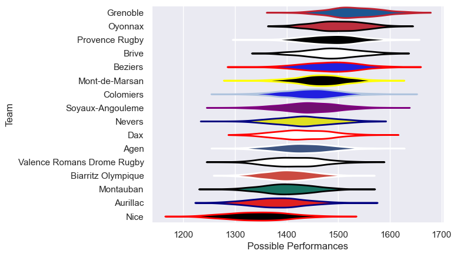

---  
title: "Pro D2 24/25 Status"  
date: 2025-04-25 6:00:00 -0500  
categories: model review projection  
layout: article  
aside:  
    toc: true  
---
# Current Team Rankings

# Standings

## Current Standings

| Club                       |   Played |   Wins |   Point Differential |   Losing Bonus Points |   Try Bonus Points |   Competition Points |
|:---------------------------|---------:|-------:|---------------------:|----------------------:|-------------------:|---------------------:|
| Grenoble                   |       27 |     19 |                  323 |                     5 |                 12 |                   93 |
| Brive                      |       27 |     18 |                  141 |                     4 |                  9 |                   85 |
| Colomiers                  |       27 |     16 |                  115 |                     5 |                 12 |                   83 |
| Provence Rugby             |       27 |     16 |                   81 |                     5 |                 10 |                   81 |
| Montauban                  |       27 |     16 |                   34 |                     6 |                  7 |                   77 |
| Soyaux-Angouleme           |       27 |     16 |                   23 |                     3 |                 10 |                   77 |
| Beziers                    |       28 |     15 |                   66 |                     6 |                 10 |                   76 |
| Nevers                     |       27 |     14 |                  -93 |                     4 |                  9 |                   69 |
| Biarritz Olympique         |       28 |     13 |                  -15 |                     6 |                  9 |                   67 |
| Agen                       |       27 |     11 |                  -48 |                    10 |                 10 |                   64 |
| Oyonnax                    |       27 |     11 |                   37 |                     8 |                  7 |                   61 |
| Mont-de-Marsan             |       28 |     12 |                  -82 |                     7 |                nan |                   61 |
| Valence Romans Drome Rugby |       27 |     11 |                   25 |                    10 |                  5 |                   59 |
| Dax                        |       27 |     12 |                  -83 |                     6 |                  3 |                   59 |
| Aurillac                   |       28 |     11 |                 -186 |                     5 |                nan |                   54 |
| Nice                       |       27 |      5 |                 -338 |                     7 |                  8 |                   35 |

## Projected Remaining Table

| Club                       |   Matches Remaining |   Wins |   Point Differential |   Losing Bonus Points |   Try Bonus Points |   Competition Points |
|:---------------------------|--------------------:|-------:|---------------------:|----------------------:|-------------------:|---------------------:|
| Grenoble                   |                   3 |    2.1 |             14.487   |                   0.6 |                1.8 |                 10.6 |
| Provence Rugby             |                   3 |    2   |             11.4503  |                   0.6 |                1.8 |                 10.4 |
| Colomiers                  |                   3 |    1.8 |             10.5724  |                   0.8 |                1.7 |                  9.7 |
| Mont-de-Marsan             |                   3 |    1.8 |              4.72413 |                   0.8 |                1.2 |                  9.2 |
| Brive                      |                   3 |    1.9 |              6.40679 |                   0.8 |                0.8 |                  9.1 |
| Valence Romans Drome Rugby |                   3 |    1.7 |              2.60792 |                   0.8 |                1.5 |                  9   |
| Agen                       |                   3 |    1.6 |              2.31757 |                   0.9 |                1.2 |                  8.7 |
| Dax                        |                   3 |    1.6 |              2.13073 |                   0.9 |                1.3 |                  8.7 |
| Montauban                  |                   3 |    1.7 |              2.28057 |                   0.9 |                0.9 |                  8.5 |
| Soyaux-Angouleme           |                   3 |    1.3 |             -3.4446  |                   1.1 |                0.7 |                  7.1 |
| Nevers                     |                   3 |    1.2 |             -6.46907 |                   0.8 |                1.1 |                  6.9 |
| Oyonnax                    |                   3 |    1.2 |             -6.60171 |                   1.1 |                1.2 |                  6.9 |
| Aurillac                   |                   3 |    0.9 |            -10.4138  |                   1.2 |                0.6 |                  5.6 |
| Beziers                    |                   2 |    0.9 |             -1.37409 |                   0.8 |                0.7 |                  5.1 |
| Nice                       |                   3 |    0.6 |            -20.5081  |                   1   |                1   |                  4.6 |
| Biarritz Olympique         |                   2 |    0.6 |             -8.16599 |                   0.7 |                0.4 |                  3.6 |

## Projected Total Table

| Club                       |   Total Matches |   Wins |   Point Differential |   Losing Bonus Points |   Try Bonus Points |   Competition Points |
|:---------------------------|----------------:|-------:|---------------------:|----------------------:|-------------------:|---------------------:|
| Grenoble                   |              30 |   21.1 |             337.487  |                   5.6 |               13.8 |                103.6 |
| Brive                      |              30 |   19.9 |             147.407  |                   4.8 |                9.8 |                 94.1 |
| Colomiers                  |              30 |   17.8 |             125.572  |                   5.8 |               13.7 |                 92.7 |
| Provence Rugby             |              30 |   18   |              92.4503 |                   5.6 |               11.8 |                 91.4 |
| Montauban                  |              30 |   17.7 |              36.2806 |                   6.9 |                7.9 |                 85.5 |
| Soyaux-Angouleme           |              30 |   17.3 |              19.5554 |                   4.1 |               10.7 |                 84.1 |
| Beziers                    |              30 |   15.9 |              64.6259 |                   6.8 |               10.7 |                 81.1 |
| Nevers                     |              30 |   15.2 |             -99.4691 |                   4.8 |               10.1 |                 75.9 |
| Agen                       |              30 |   12.6 |             -45.6824 |                  10.9 |               11.2 |                 72.7 |
| Biarritz Olympique         |              30 |   13.6 |             -23.166  |                   6.7 |                9.4 |                 70.6 |
| Mont-de-Marsan             |              31 |   13.8 |             -77.2759 |                   7.8 |                1.2 |                 70.2 |
| Valence Romans Drome Rugby |              30 |   12.7 |              27.6079 |                  10.8 |                6.5 |                 68   |
| Oyonnax                    |              30 |   12.2 |              30.3983 |                   9.1 |                8.2 |                 67.9 |
| Dax                        |              30 |   13.6 |             -80.8693 |                   6.9 |                4.3 |                 67.7 |
| Aurillac                   |              31 |   11.9 |            -196.414  |                   6.2 |                0.6 |                 59.6 |
| Nice                       |              30 |    5.6 |            -358.508  |                   8   |                9   |                 39.6 |

# Completed Match Review

| Model | Percent Correct Predictions | Spread Error |
| ------ | ------ | ------ |
| Club Level | 67.4% | 11.4 |
| Player Level: Lineup | 74.6% | 12.4 |
| Player Level: Minutes | 75.4% | 12.4 |

# Future Predictions

## Week 29

### Mont-de-Marsan V Dax on 2025/04/25

Average Margin: Mont-de-Marsan by 3.9

Average Scoreline: 33-29

### Valence Romans Drome Rugby V Nevers on 2025/04/25

Average Margin: Valence Romans Drome Rugby by 3.5

Average Scoreline: 33-30

### Agen V Soyaux-Angouleme on 2025/04/25

Average Margin: Agen by 2.7

Average Scoreline: 34-31

### Grenoble V Oyonnax on 2025/04/25

Average Margin: Grenoble by 7.1

Average Scoreline: 41-34

### Aurillac V Brive on 2025/04/25

Average Margin: Brive by 4.1

Average Scoreline: 21-16

### Nice V Provence Rugby on 2025/04/25

Average Margin: Provence Rugby by 5.8

Average Scoreline: 25-19

### Montauban V Colomiers on 2025/04/25

Average Margin: Montauban by 1.3

Average Scoreline: 21-20

## Week 30

### Brive V Grenoble on 2025/05/09

Average Margin: Brive by 3.1

Average Scoreline: 26-23

### Dax V Agen on 2025/05/09

Average Margin: Dax by 3.6

Average Scoreline: 32-28

### Mont-de-Marsan V Valence Romans Drome Rugby on 2025/05/09

Average Margin: Mont-de-Marsan by 4.1

Average Scoreline: 25-20

### Colomiers V Nice on 2025/05/09

Average Margin: Colomiers by 12.3

Average Scoreline: 39-27

### Montauban V Beziers on 2025/05/09

Average Margin: Montauban by 2.2

Average Scoreline: 24-21

### Provence Rugby V Biarritz Olympique on 2025/05/09

Average Margin: Provence Rugby by 8.6

Average Scoreline: 33-25

### Nevers V Aurillac on 2025/05/09

Average Margin: Nevers by 7.5

Average Scoreline: 34-26

### Soyaux-Angouleme V Oyonnax on 2025/05/09

Average Margin: Soyaux-Angouleme by 2.4

Average Scoreline: 25-23

## Week 31

### Beziers V Brive on 2025/05/16

Average Margin: Beziers by 0.8

Average Scoreline: 22-21

### Grenoble V Nevers on 2025/05/16

Average Margin: Grenoble by 10.4

Average Scoreline: 41-31

### Aurillac V Montauban on 2025/05/16

Average Margin: Aurillac by 1.2

Average Scoreline: 31-30

### Nice V Dax on 2025/05/16

Average Margin: Dax by 2.4

Average Scoreline: 26-23

### Biarritz Olympique V Colomiers on 2025/05/16

Average Margin: Biarritz Olympique by 0.4

Average Scoreline: 25-24

### Agen V Mont-de-Marsan on 2025/05/16

Average Margin: Agen by 3.3

Average Scoreline: 36-33

### Valence Romans Drome Rugby V Soyaux-Angouleme on 2025/05/16

Average Margin: Valence Romans Drome Rugby by 3.2

Average Scoreline: 29-26

### Oyonnax V Provence Rugby on 2025/05/16

Average Margin: Oyonnax by 2.9

Average Scoreline: 31-28

