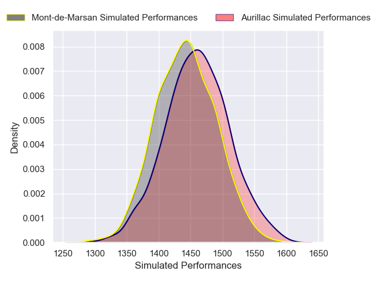
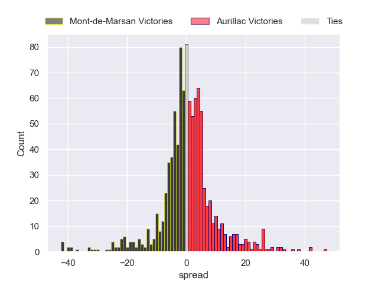

---  
title: "Pro D2 24/25 Status"  
date: 2025-01-30 6:00:00 -0500  
categories: model review projection  
layout: article  
aside:  
    toc: true  
---
# Current Team Rankings

# Standings

## Current Standings

| Club                       |   Played |   Wins |   Point Differential |   Losing Bonus Points |   Try Bonus Points |   Competition Points |
|:---------------------------|---------:|-------:|---------------------:|----------------------:|-------------------:|---------------------:|
| Grenoble                   |       18 |     13 |                  179 |                     3 |                  8 |                   63 |
| Beziers                    |       18 |     10 |                  109 |                     6 |                  8 |                   54 |
| Provence Rugby             |       18 |     10 |                   43 |                     4 |                  5 |                   51 |
| Soyaux-Angouleme           |       18 |     11 |                   -2 |                     1 |                  6 |                   51 |
| Colomiers                  |       18 |     10 |                  -27 |                     3 |                  6 |                   51 |
| Brive                      |       18 |     10 |                   48 |                     3 |                  6 |                   49 |
| Montauban                  |       18 |     10 |                  -15 |                     4 |                  4 |                   48 |
| Dax                        |       18 |     10 |                  -26 |                     3 |                  3 |                   46 |
| Nevers                     |       18 |      9 |                  -63 |                     4 |                  5 |                   45 |
| Oyonnax                    |       18 |      9 |                   59 |                     4 |                  4 |                   44 |
| Agen                       |       18 |      7 |                   12 |                     8 |                  6 |                   42 |
| Biarritz Olympique         |       18 |      9 |                   14 |                     2 |                  3 |                   41 |
| Mont-de-Marsan             |       17 |      7 |                  -38 |                     5 |                  3 |                   36 |
| Aurillac                   |       17 |      8 |                  -58 |                     2 |                  2 |                   36 |
| Valence Romans Drome Rugby |       18 |      6 |                  -21 |                     8 |                  3 |                   35 |
| Nice                       |       18 |      3 |                 -214 |                     6 |                  4 |                   22 |

## Projected Remaining Table

| Club                       |   Matches Remaining |   Wins |   Point Differential |   Losing Bonus Points |   Try Bonus Points |   Competition Points |
|:---------------------------|--------------------:|-------:|---------------------:|----------------------:|-------------------:|---------------------:|
| Grenoble                   |                  12 |    8.7 |             61.8012  |                   2.2 |                4.2 |                 41.1 |
| Provence Rugby             |                  12 |    7.7 |             33.9651  |                   2.7 |                3.2 |                 36.6 |
| Oyonnax                    |                  12 |    7.5 |             36.9163  |                   2.9 |                2.6 |                 35.5 |
| Brive                      |                  12 |    7.4 |             30.0366  |                   3   |                2.6 |                 35.2 |
| Beziers                    |                  12 |    7.2 |             26.6191  |                   3   |                3.1 |                 35.1 |
| Colomiers                  |                  12 |    6.4 |              8.73284 |                   3.6 |                3.1 |                 32.2 |
| Mont-de-Marsan             |                  13 |    6.3 |             -3.74164 |                   3.9 |                3.1 |                 32.1 |
| Soyaux-Angouleme           |                  12 |    5.9 |              3.12802 |                   3.8 |                1.9 |                 29.2 |
| Dax                        |                  12 |    5.7 |             -5.49723 |                   3.8 |                2.4 |                 29   |
| Agen                       |                  12 |    5.5 |             -9.37466 |                   4   |                3   |                 29   |
| Biarritz Olympique         |                  12 |    5.4 |            -12.9809  |                   3.9 |                2.7 |                 28.3 |
| Nevers                     |                  12 |    5.3 |            -15.2767  |                   3.7 |                3   |                 27.7 |
| Montauban                  |                  12 |    5.1 |            -18.3445  |                   4.2 |                1.9 |                 26.7 |
| Aurillac                   |                  13 |    4.9 |            -37.9963  |                   4.4 |                1.6 |                 25.5 |
| Valence Romans Drome Rugby |                  12 |    4.6 |            -31.9002  |                   3.9 |                2.6 |                 24.9 |
| Nice                       |                  12 |    3.5 |            -66.0872  |                   3.6 |                1.9 |                 19.5 |

## Projected Total Table

| Club                       |   Total Matches |   Wins |   Point Differential |   Losing Bonus Points |   Try Bonus Points |   Competition Points |
|:---------------------------|----------------:|-------:|---------------------:|----------------------:|-------------------:|---------------------:|
| Grenoble                   |              30 |   21.7 |            240.801   |                   5.2 |               12.2 |                104.1 |
| Beziers                    |              30 |   17.2 |            135.619   |                   9   |               11.1 |                 89.1 |
| Provence Rugby             |              30 |   17.7 |             76.9651  |                   6.7 |                8.2 |                 87.6 |
| Brive                      |              30 |   17.4 |             78.0366  |                   6   |                8.6 |                 84.2 |
| Colomiers                  |              30 |   16.4 |            -18.2672  |                   6.6 |                9.1 |                 83.2 |
| Soyaux-Angouleme           |              30 |   16.9 |              1.12802 |                   4.8 |                7.9 |                 80.2 |
| Oyonnax                    |              30 |   16.5 |             95.9163  |                   6.9 |                6.6 |                 79.5 |
| Dax                        |              30 |   15.7 |            -31.4972  |                   6.8 |                5.4 |                 75   |
| Montauban                  |              30 |   15.1 |            -33.3445  |                   8.2 |                5.9 |                 74.7 |
| Nevers                     |              30 |   14.3 |            -78.2767  |                   7.7 |                8   |                 72.7 |
| Agen                       |              30 |   12.5 |              2.62534 |                  12   |                9   |                 71   |
| Biarritz Olympique         |              30 |   14.4 |              1.01914 |                   5.9 |                5.7 |                 69.3 |
| Mont-de-Marsan             |              30 |   13.3 |            -41.7416  |                   8.9 |                6.1 |                 68.1 |
| Aurillac                   |              30 |   12.9 |            -95.9963  |                   6.4 |                3.6 |                 61.5 |
| Valence Romans Drome Rugby |              30 |   10.6 |            -52.9002  |                  11.9 |                5.6 |                 59.9 |
| Nice                       |              30 |    6.5 |           -280.087   |                   9.6 |                5.9 |                 41.5 |

# Completed Match Review

| Model | Percent Correct Predictions | Spread Error |
| ------ | ------ | ------ |
| Club Level | 67.1% | 10.6 |
| Player Level: Lineup | 72.5% | 10.1 |
| Player Level: Minutes | 73.8% | 10.2 |

# Future Predictions

## Week 19

### Aurillac V Mont-de-Marsan on 2025/01/30

Average Margin: Aurillac by 0.4

Average Scoreline: 31-30

## Week 20

### Biarritz Olympique V Mont-de-Marsan on 2025/02/06

Average Margin: Biarritz Olympique by 2.1

Average Scoreline: 26-24

### Montauban V Agen on 2025/02/07

Average Margin: Montauban by 2.2

Average Scoreline: 24-22

### Nice V Aurillac on 2025/02/07

Average Margin: Nice by 1.4

Average Scoreline: 29-28

### Dax V Valence Romans Drome Rugby on 2025/02/07

Average Margin: Dax by 4.8

Average Scoreline: 32-27

### Provence Rugby V Nevers on 2025/02/07

Average Margin: Provence Rugby by 7.1

Average Scoreline: 28-21

### Colomiers V Grenoble on 2025/02/07

Average Margin: Grenoble by 1.3

Average Scoreline: 27-25

### Brive V Soyaux-Angouleme on 2025/02/07

Average Margin: Brive by 5.8

Average Scoreline: 27-22

### Beziers V Oyonnax on 2025/02/07

Average Margin: Beziers by 3.1

Average Scoreline: 26-23

## Week 21

### Brive V Nice on 2025/02/14

Average Margin: Brive by 11.3

Average Scoreline: 30-19

### Montauban V Nevers on 2025/02/14

Average Margin: Montauban by 2.5

Average Scoreline: 22-20

### Soyaux-Angouleme V Colomiers on 2025/02/14

Average Margin: Soyaux-Angouleme by 4.1

Average Scoreline: 24-20

### Oyonnax V Dax on 2025/02/14

Average Margin: Oyonnax by 8.2

Average Scoreline: 28-20

### Mont-de-Marsan V Provence Rugby on 2025/02/14

Average Margin: Mont-de-Marsan by 1.7

Average Scoreline: 28-26

### Agen V Beziers on 2025/02/14

Average Margin: Agen by 1.1

Average Scoreline: 27-26

### Grenoble V Aurillac on 2025/02/14

Average Margin: Grenoble by 11.0

Average Scoreline: 32-21

### Valence Romans Drome Rugby V Biarritz Olympique on 2025/02/14

Average Margin: Valence Romans Drome Rugby by 3.4

Average Scoreline: 28-24

## Week 22

### Biarritz Olympique V Brive on 2025/02/21

Average Margin: Biarritz Olympique by 0.4

Average Scoreline: 27-27

### Colomiers V Mont-de-Marsan on 2025/02/21

Average Margin: Colomiers by 3.8

Average Scoreline: 29-25

### Dax V Grenoble on 2025/02/21

Average Margin: Grenoble by 1.9

Average Scoreline: 26-24

### Nevers V Oyonnax on 2025/02/21

Average Margin: Nevers by 0.1

Average Scoreline: 23-23

### Aurillac V Agen on 2025/02/21

Average Margin: Aurillac by 1.7

Average Scoreline: 29-27

### Provence Rugby V Soyaux-Angouleme on 2025/02/21

Average Margin: Provence Rugby by 6.3

Average Scoreline: 28-21

### Beziers V Valence Romans Drome Rugby on 2025/02/21

Average Margin: Beziers by 8.4

Average Scoreline: 32-23

### Nice V Montauban on 2025/02/21

Average Margin: Nice by 0.9

Average Scoreline: 26-25

## Week 23

### Grenoble V Beziers on 2025/02/28

Average Margin: Grenoble by 5.7

Average Scoreline: 28-22

### Soyaux-Angouleme V Aurillac on 2025/02/28

Average Margin: Soyaux-Angouleme by 7.2

Average Scoreline: 28-21

### Dax V Nevers on 2025/02/28

Average Margin: Dax by 4.7

Average Scoreline: 25-20

### Oyonnax V Biarritz Olympique on 2025/02/28

Average Margin: Oyonnax by 8.2

Average Scoreline: 29-21

### Colomiers V Brive on 2025/02/28

Average Margin: Colomiers by 1.4

Average Scoreline: 25-23

### Mont-de-Marsan V Nice on 2025/02/28

Average Margin: Mont-de-Marsan by 9.6

Average Scoreline: 31-21

### Montauban V Provence Rugby on 2025/02/28

Average Margin: Provence Rugby by 1.1

Average Scoreline: 27-26

### Agen V Valence Romans Drome Rugby on 2025/02/28

Average Margin: Agen by 4.9

Average Scoreline: 31-26

## Week 24

### Brive V Mont-de-Marsan on 2025/03/07

Average Margin: Brive by 5.8

Average Scoreline: 28-23

### Valence Romans Drome Rugby V Aurillac on 2025/03/07

Average Margin: Valence Romans Drome Rugby by 4.6

Average Scoreline: 29-24

### Beziers V Nevers on 2025/03/07

Average Margin: Beziers by 6.9

Average Scoreline: 27-21

### Provence Rugby V Colomiers on 2025/03/07

Average Margin: Provence Rugby by 6.0

Average Scoreline: 28-22

### Soyaux-Angouleme V Grenoble on 2025/03/07

Average Margin: Grenoble by 1.2

Average Scoreline: 28-27

### Nice V Agen on 2025/03/07

Average Margin: Agen by 0.8

Average Scoreline: 31-30

### Oyonnax V Montauban on 2025/03/07

Average Margin: Oyonnax by 9.8

Average Scoreline: 30-20

### Biarritz Olympique V Dax on 2025/03/07

Average Margin: Biarritz Olympique by 3.1

Average Scoreline: 27-24

## Week 25

### Valence Romans Drome Rugby V Provence Rugby on 2025/03/28

Average Margin: Provence Rugby by 0.6

Average Scoreline: 25-25

### Nevers V Nice on 2025/03/28

Average Margin: Nevers by 8.8

Average Scoreline: 31-22

### Aurillac V Biarritz Olympique on 2025/03/28

Average Margin: Aurillac by 2.5

Average Scoreline: 29-27

### Agen V Grenoble on 2025/03/28

Average Margin: Grenoble by 2.3

Average Scoreline: 28-26

### Mont-de-Marsan V Soyaux-Angouleme on 2025/03/28

Average Margin: Mont-de-Marsan by 3.7

Average Scoreline: 26-23

### Montauban V Brive on 2025/03/28

Average Margin: Brive by 0.5

Average Scoreline: 27-27

### Colomiers V Oyonnax on 2025/03/28

Average Margin: Colomiers by 0.9

Average Scoreline: 25-24

### Dax V Beziers on 2025/03/28

Average Margin: Dax by 0.7

Average Scoreline: 24-23

## Week 26

### Colomiers V Nevers on 2025/04/04

Average Margin: Colomiers by 4.3

Average Scoreline: 27-22

### Beziers V Aurillac on 2025/04/04

Average Margin: Beziers by 9.4

Average Scoreline: 31-21

### Brive V Valence Romans Drome Rugby on 2025/04/04

Average Margin: Brive by 8.1

Average Scoreline: 30-22

### Provence Rugby V Dax on 2025/04/04

Average Margin: Provence Rugby by 6.6

Average Scoreline: 29-22

### Soyaux-Angouleme V Nice on 2025/04/04

Average Margin: Soyaux-Angouleme by 9.6

Average Scoreline: 30-21

### Biarritz Olympique V Montauban on 2025/04/04

Average Margin: Biarritz Olympique by 4.7

Average Scoreline: 28-23

### Oyonnax V Agen on 2025/04/04

Average Margin: Oyonnax by 7.9

Average Scoreline: 28-20

### Grenoble V Mont-de-Marsan on 2025/04/04

Average Margin: Grenoble by 7.8

Average Scoreline: 31-24

## Week 27

### Mont-de-Marsan V Oyonnax on 2025/04/11

Average Margin: Mont-de-Marsan by 0.9

Average Scoreline: 28-27

### Agen V Brive on 2025/04/11

Average Margin: Agen by 0.5

Average Scoreline: 25-24

### Aurillac V Colomiers on 2025/04/11

Average Margin: Aurillac by 0.8

Average Scoreline: 25-24

### Provence Rugby V Beziers on 2025/04/11

Average Margin: Provence Rugby by 4.1

Average Scoreline: 26-22

### Montauban V Dax on 2025/04/11

Average Margin: Montauban by 2.7

Average Scoreline: 25-23

### Nevers V Soyaux-Angouleme on 2025/04/11

Average Margin: Nevers by 2.9

Average Scoreline: 25-23

### Valence Romans Drome Rugby V Grenoble on 2025/04/11

Average Margin: Grenoble by 3.5

Average Scoreline: 30-27

### Nice V Biarritz Olympique on 2025/04/11

Average Margin: Biarritz Olympique by 0.4

Average Scoreline: 26-26

## Week 28

### Beziers V Mont-de-Marsan on 2025/04/18

Average Margin: Beziers by 6.1

Average Scoreline: 28-22

### Grenoble V Nice on 2025/04/18

Average Margin: Grenoble by 13.6

Average Scoreline: 38-24

### Brive V Provence Rugby on 2025/04/18

Average Margin: Brive by 4.0

Average Scoreline: 26-22

### Dax V Aurillac on 2025/04/18

Average Margin: Dax by 6.2

Average Scoreline: 28-21

### Oyonnax V Valence Romans Drome Rugby on 2025/04/18

Average Margin: Oyonnax by 9.1

Average Scoreline: 30-21

### Nevers V Biarritz Olympique on 2025/04/18

Average Margin: Nevers by 4.1

Average Scoreline: 27-23

### Soyaux-Angouleme V Montauban on 2025/04/18

Average Margin: Soyaux-Angouleme by 6.1

Average Scoreline: 27-21

### Colomiers V Agen on 2025/04/18

Average Margin: Colomiers by 5.2

Average Scoreline: 28-23

## Week 29

### Mont-de-Marsan V Dax on 2025/04/25

Average Margin: Mont-de-Marsan by 4.0

Average Scoreline: 29-25

### Agen V Soyaux-Angouleme on 2025/04/25

Average Margin: Agen by 3.0

Average Scoreline: 27-24

### Aurillac V Brive on 2025/04/25

Average Margin: Brive by 0.7

Average Scoreline: 27-26

### Nice V Provence Rugby on 2025/04/25

Average Margin: Provence Rugby by 4.2

Average Scoreline: 33-28

### Montauban V Colomiers on 2025/04/25

Average Margin: Montauban by 1.3

Average Scoreline: 28-27

### Valence Romans Drome Rugby V Nevers on 2025/04/25

Average Margin: Valence Romans Drome Rugby by 3.2

Average Scoreline: 27-24

### Biarritz Olympique V Beziers on 2025/04/25

Average Margin: Biarritz Olympique by 0.5

Average Scoreline: 29-28

### Grenoble V Oyonnax on 2025/04/25

Average Margin: Grenoble by 5.4

Average Scoreline: 30-24

## Week 30

### Dax V Agen on 2025/05/09

Average Margin: Dax by 3.9

Average Scoreline: 24-20

### Brive V Grenoble on 2025/05/09

Average Margin: Brive by 0.6

Average Scoreline: 27-26

### Montauban V Beziers on 2025/05/09

Average Margin: Beziers by 0.2

Average Scoreline: 28-28

### Nevers V Aurillac on 2025/05/09

Average Margin: Nevers by 6.3

Average Scoreline: 30-24

### Mont-de-Marsan V Valence Romans Drome Rugby on 2025/05/09

Average Margin: Mont-de-Marsan by 5.8

Average Scoreline: 30-24

### Provence Rugby V Biarritz Olympique on 2025/05/09

Average Margin: Provence Rugby by 8.7

Average Scoreline: 31-22

### Soyaux-Angouleme V Oyonnax on 2025/05/09

Average Margin: Soyaux-Angouleme by 1.0

Average Scoreline: 25-24

### Colomiers V Nice on 2025/05/09

Average Margin: Colomiers by 9.2

Average Scoreline: 32-23

## Week 31

### Valence Romans Drome Rugby V Soyaux-Angouleme on 2025/05/16

Average Margin: Valence Romans Drome Rugby by 2.1

Average Scoreline: 25-23

### Oyonnax V Provence Rugby on 2025/05/16

Average Margin: Oyonnax by 5.1

Average Scoreline: 28-23

### Agen V Mont-de-Marsan on 2025/05/16

Average Margin: Agen by 3.4

Average Scoreline: 27-24

### Nice V Dax on 2025/05/16

Average Margin: Dax by 0.7

Average Scoreline: 25-25

### Aurillac V Montauban on 2025/05/16

Average Margin: Aurillac by 3.7

Average Scoreline: 27-23

### Grenoble V Nevers on 2025/05/16

Average Margin: Grenoble by 8.8

Average Scoreline: 31-22

### Beziers V Brive on 2025/05/16

Average Margin: Beziers by 4.5

Average Scoreline: 27-23

### Biarritz Olympique V Colomiers on 2025/05/16

Average Margin: Biarritz Olympique by 2.7

Average Scoreline: 28-26

