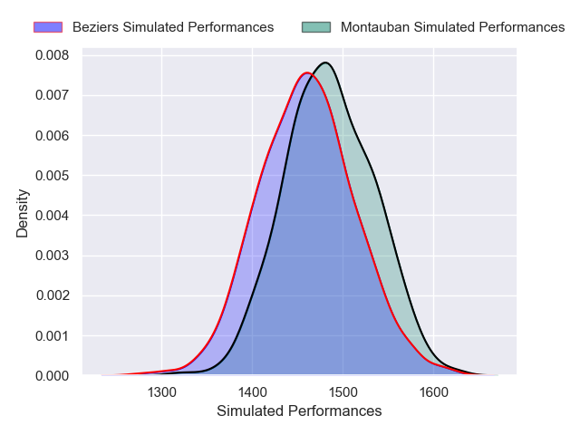
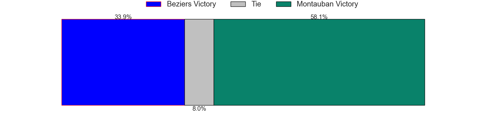
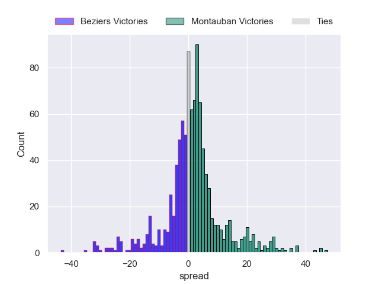

---  
title: "Pro D2 24/25 Status"  
date: 2025-05-08 6:00:00 -0500  
categories: model review projection  
layout: article  
aside:  
    toc: true  
---
# Current Team Rankings

# Standings

## Current Standings

| Club                       |   Played |   Wins |   Point Differential |   Losing Bonus Points |   Try Bonus Points |   Competition Points |
|:---------------------------|---------:|-------:|---------------------:|----------------------:|-------------------:|---------------------:|
| Grenoble                   |       28 |     20 |                  326 |                     5 |                 13 |                   98 |
| Brive                      |       28 |     19 |                  157 |                     4 |                 10 |                   90 |
| Colomiers                  |       28 |     17 |                  129 |                     5 |                 13 |                   88 |
| Provence Rugby             |       28 |     16 |                   80 |                     6 |                 10 |                   82 |
| Soyaux-Angouleme           |       28 |     17 |                   34 |                     3 |                 10 |                   81 |
| Montauban                  |       28 |     16 |                   20 |                     6 |                  7 |                   77 |
| Beziers                    |       28 |     15 |                   66 |                     6 |                 10 |                   76 |
| Nevers                     |       28 |     14 |                 -141 |                     4 |                  9 |                   69 |
| Biarritz Olympique         |       28 |     13 |                  -15 |                     6 |                  9 |                   67 |
| Valence Romans Drome Rugby |       28 |     12 |                   73 |                    10 |                  6 |                   64 |
| Agen                       |       28 |     11 |                  -59 |                    10 |                 10 |                   64 |
| Oyonnax                    |       28 |     11 |                   34 |                     9 |                  7 |                   62 |
| Mont-de-Marsan             |       29 |     12 |                  -81 |                     7 |                nan |                   62 |
| Dax                        |       28 |     12 |                  -97 |                     6 |                  3 |                   59 |
| Aurillac                   |       29 |     12 |                 -189 |                     4 |                nan |                   57 |
| Nice                       |       28 |      6 |                 -337 |                     7 |                  8 |                   39 |

## Projected Remaining Table

| Club                       |   Matches Remaining |   Wins |   Point Differential |   Losing Bonus Points |   Try Bonus Points |   Competition Points |
|:---------------------------|--------------------:|-------:|---------------------:|----------------------:|-------------------:|---------------------:|
| Colomiers                  |                   2 |    1.4 |            12.4267   |                   0.4 |                1   |                  7.1 |
| Dax                        |                   2 |    1.3 |             6.17738  |                   0.5 |                0.6 |                  6.4 |
| Grenoble                   |                   2 |    1.2 |             7.49207  |                   0.5 |                0.8 |                  6.1 |
| Provence Rugby             |                   2 |    1.2 |             5.08233  |                   0.5 |                0.7 |                  5.9 |
| Brive                      |                   2 |    1.2 |             3.55312  |                   0.6 |                0.5 |                  5.8 |
| Oyonnax                    |                   2 |    1   |             1.07968  |                   0.6 |                0.5 |                  5.3 |
| Mont-de-Marsan             |                   2 |    1   |             0.845743 |                   0.6 |                0.4 |                  5.2 |
| Montauban                  |                   2 |    1   |             0.712546 |                   0.7 |                0.5 |                  5.2 |
| Valence Romans Drome Rugby |                   2 |    1   |            -0.402873 |                   0.7 |                0.6 |                  5.2 |
| Agen                       |                   2 |    1   |            -1.04947  |                   0.7 |                0.5 |                  5   |
| Soyaux-Angouleme           |                   2 |    1   |            -0.544128 |                   0.6 |                0.3 |                  4.9 |
| Beziers                    |                   2 |    0.9 |            -2.63445  |                   0.7 |                0.6 |                  4.9 |
| Nevers                     |                   2 |    0.9 |            -4.44695  |                   0.3 |                0.5 |                  4.6 |
| Aurillac                   |                   2 |    0.8 |            -4.67634  |                   0.7 |                0.5 |                  4.2 |
| Biarritz Olympique         |                   2 |    0.6 |            -8.6222   |                   0.7 |                0.3 |                  3.5 |
| Nice                       |                   2 |    0.5 |           -14.9932   |                   0.5 |                0.5 |                  3   |

## Projected Total Table

| Club                       |   Total Matches |   Wins |   Point Differential |   Losing Bonus Points |   Try Bonus Points |   Competition Points |
|:---------------------------|----------------:|-------:|---------------------:|----------------------:|-------------------:|---------------------:|
| Grenoble                   |              30 |   21.2 |             333.492  |                   5.5 |               13.8 |                104.1 |
| Brive                      |              30 |   20.2 |             160.553  |                   4.6 |               10.5 |                 95.8 |
| Colomiers                  |              30 |   18.4 |             141.427  |                   5.4 |               14   |                 95.1 |
| Provence Rugby             |              30 |   17.2 |              85.0823 |                   6.5 |               10.7 |                 87.9 |
| Soyaux-Angouleme           |              30 |   18   |              33.4559 |                   3.6 |               10.3 |                 85.9 |
| Montauban                  |              30 |   17   |              20.7125 |                   6.7 |                7.5 |                 82.2 |
| Beziers                    |              30 |   15.9 |              63.3656 |                   6.7 |               10.6 |                 80.9 |
| Nevers                     |              30 |   14.9 |            -145.447  |                   4.3 |                9.5 |                 73.6 |
| Biarritz Olympique         |              30 |   13.6 |             -23.6222 |                   6.7 |                9.3 |                 70.5 |
| Valence Romans Drome Rugby |              30 |   13   |              72.5971 |                  10.7 |                6.6 |                 69.2 |
| Agen                       |              30 |   12   |             -60.0495 |                  10.7 |               10.5 |                 69   |
| Oyonnax                    |              30 |   12   |              35.0797 |                   9.6 |                7.5 |                 67.3 |
| Mont-de-Marsan             |              31 |   13   |             -80.1543 |                   7.6 |                0.4 |                 67.2 |
| Dax                        |              30 |   13.3 |             -90.8226 |                   6.5 |                3.6 |                 65.4 |
| Aurillac                   |              31 |   12.8 |            -193.676  |                   4.7 |                0.5 |                 61.2 |
| Nice                       |              30 |    6.5 |            -351.993  |                   7.5 |                8.5 |                 42   |

# Completed Match Review

| Model | Percent Correct Predictions | Spread Error |
| ------ | ------ | ------ |
| Club Level | 67.6% | 11.5 |
| Player Level: Lineup | 73.3% | 12.1 |
| Player Level: Minutes | 73.3% | 12.0 |

# Future Predictions

## Week 30

### Montauban V Beziers on 2025/05/08

Average Margin: Montauban by 2.3

Average Scoreline: 30-28

### Mont-de-Marsan V Valence Romans Drome Rugby on 2025/05/09

Average Margin: Mont-de-Marsan by 3.1

Average Scoreline: 28-25

### Colomiers V Nice on 2025/05/09

Average Margin: Colomiers by 12.2

Average Scoreline: 33-21

### Brive V Grenoble on 2025/05/09

Average Margin: Brive by 3.2

Average Scoreline: 25-22

### Soyaux-Angouleme V Oyonnax on 2025/05/09

Average Margin: Soyaux-Angouleme by 2.2

Average Scoreline: 26-24

### Dax V Agen on 2025/05/09

Average Margin: Dax by 3.3

Average Scoreline: 31-28

### Nevers V Aurillac on 2025/05/09

Average Margin: Nevers by 6.3

Average Scoreline: 30-23

### Provence Rugby V Biarritz Olympique on 2025/05/09

Average Margin: Provence Rugby by 8.4

Average Scoreline: 29-20

## Week 31

### Nice V Dax on 2025/05/16

Average Margin: Dax by 2.8

Average Scoreline: 36-33

### Grenoble V Nevers on 2025/05/16

Average Margin: Grenoble by 10.7

Average Scoreline: 38-28

### Aurillac V Montauban on 2025/05/16

Average Margin: Aurillac by 1.6

Average Scoreline: 34-32

### Agen V Mont-de-Marsan on 2025/05/16

Average Margin: Agen by 2.3

Average Scoreline: 27-25

### Biarritz Olympique V Colomiers on 2025/05/16

Average Margin: Colomiers by 0.3

Average Scoreline: 27-27

### Beziers V Brive on 2025/05/16

Average Margin: Brive by 0.3

Average Scoreline: 31-31

### Valence Romans Drome Rugby V Soyaux-Angouleme on 2025/05/16

Average Margin: Valence Romans Drome Rugby by 2.7

Average Scoreline: 27-24

### Oyonnax V Provence Rugby on 2025/05/16

Average Margin: Oyonnax by 3.3

Average Scoreline: 32-29

