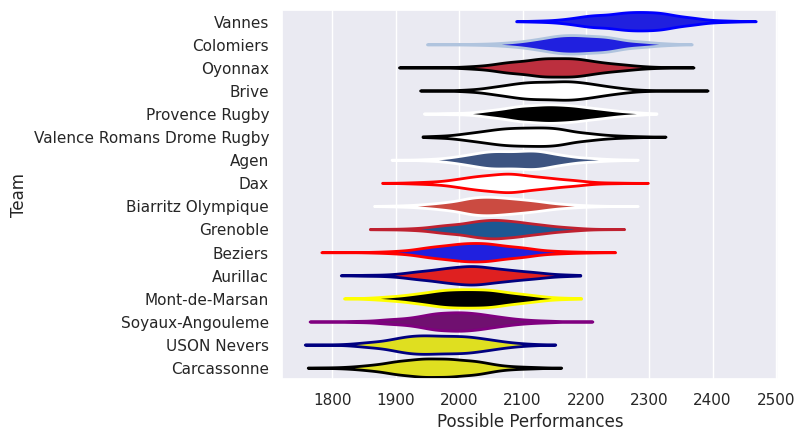

---  
title: "Pro D2 25/26"  
date: 2025-12-18 6:00:00 -0500  
categories: model review projection  
layout: article  
aside:  
    toc: true  
---
# Team Rankings

# Standings

## Current Standings

| Club                       |   Played |   Wins |   Point Differential |   Losing Bonus Points |   Try Bonus Points |   Competition Points |
|:---------------------------|---------:|-------:|---------------------:|----------------------:|-------------------:|---------------------:|
| Vannes                     |       14 |     11 |                  211 |                     1 |                  8 |                   55 |
| Valence Romans Drome Rugby |       14 |     11 |                   44 |                     0 |                  7 |                   51 |
| Provence Rugby             |       14 |      9 |                  105 |                     4 |                  6 |                   46 |
| Colomiers                  |       14 |      9 |                  183 |                     3 |                  5 |                   44 |
| Oyonnax                    |       14 |      8 |                  101 |                     4 |                  5 |                   41 |
| Aurillac                   |       14 |      8 |                  -22 |                     2 |                  4 |                   38 |
| USON Nevers                |       14 |      7 |                  -44 |                     2 |                  7 |                   37 |
| Brive                      |       14 |      7 |                   73 |                     0 |                  5 |                   35 |
| Agen                       |       14 |      7 |                   -1 |                     2 |                  4 |                   34 |
| Dax                        |       14 |      6 |                   31 |                     4 |                  2 |                   30 |
| Grenoble                   |       14 |      6 |                  -11 |                     3 |                  3 |                   30 |
| Soyaux-Angouleme           |       14 |      7 |                  -90 |                     2 |                    |                   30 |
| Biarritz Olympique         |       14 |      5 |                  -69 |                     1 |                  4 |                   27 |
| Beziers                    |       14 |      4 |                  -79 |                     1 |                  5 |                   22 |
| Carcassonne                |       14 |      2 |                 -215 |                     3 |                  1 |                   14 |
| Mont-de-Marsan             |       14 |      3 |                 -217 |                     1 |                  1 |                   14 |

## Projected Remaining Table

| Club                       |   To Play |   Projected Wins |   Projected Differential |   Projected Losing Bonus Points | Projected Try Bonus Points   |   Projected Competition Points |
|:---------------------------|----------:|-----------------:|-------------------------:|--------------------------------:|:-----------------------------|-------------------------------:|
| Vannes                     |        16 |            9.696 |                   58.615 |                           3.29  |                              |                         43.52  |
| Provence Rugby             |        16 |            8.932 |                   31.097 |                           3.735 |                              |                         41.119 |
| Grenoble                   |        16 |            8.676 |                   23.611 |                           3.881 |                              |                         40.259 |
| Colomiers                  |        16 |            8.778 |                   33.684 |                           3.612 |                              |                         40.186 |
| Valence Romans Drome Rugby |        16 |            8.279 |                   18.703 |                           3.931 |                              |                         38.703 |
| Oyonnax                    |        16 |            8.273 |                   23.476 |                           3.731 |                              |                         38.273 |
| Brive                      |        16 |            7.889 |                    8.282 |                           3.683 |                              |                         36.705 |
| Dax                        |        16 |            7.374 |                  -10.954 |                           3.776 |                              |                         34.782 |
| Agen                       |        16 |            7.289 |                   -7.222 |                           4.083 |                              |                         34.705 |
| Soyaux-Angouleme           |        16 |            7.227 |                   -8.037 |                           4.051 |                              |                         34.541 |
| USON Nevers                |        16 |            7.133 |                  -11.257 |                           4.252 |                              |                         34.356 |
| Aurillac                   |        16 |            6.779 |                  -24.032 |                           3.856 |                              |                         32.422 |
| Carcassonne                |        16 |            6.572 |                  -33.144 |                           3.786 |                              |                         31.71  |
| Biarritz Olympique         |        16 |            6.396 |                  -27.226 |                           4.355 |                              |                         31.629 |
| Beziers                    |        16 |            6.456 |                  -30.426 |                           4.146 |                              |                         31.558 |
| Mont-de-Marsan             |        16 |            6.04  |                  -45.17  |                           3.913 |                              |                         29.613 |

## Projected Total Table

| Club                       |   Played |   Wins |   Point Differential |   Losing Bonus Points |   Try Bonus Points |   Competition Points |
|:---------------------------|---------:|-------:|---------------------:|----------------------:|-------------------:|---------------------:|
| Vannes                     |       30 | 20.696 |              269.615 |                 4.29  |                  8 |               98.52  |
| Valence Romans Drome Rugby |       30 | 19.279 |               62.703 |                 3.931 |                  7 |               89.703 |
| Provence Rugby             |       30 | 17.932 |              136.097 |                 7.735 |                  6 |               87.119 |
| Colomiers                  |       30 | 17.778 |              216.684 |                 6.612 |                  5 |               84.186 |
| Oyonnax                    |       30 | 16.273 |              124.476 |                 7.731 |                  5 |               79.273 |
| Brive                      |       30 | 14.889 |               81.282 |                 3.683 |                  5 |               71.705 |
| USON Nevers                |       30 | 14.133 |              -55.257 |                 6.252 |                  7 |               71.356 |
| Aurillac                   |       30 | 14.779 |              -46.032 |                 5.856 |                  4 |               70.422 |
| Grenoble                   |       30 | 14.676 |               12.611 |                 6.881 |                  3 |               70.259 |
| Agen                       |       30 | 14.289 |               -8.222 |                 6.083 |                  4 |               68.705 |
| Dax                        |       30 | 13.374 |               20.046 |                 7.776 |                  2 |               64.782 |
| Soyaux-Angouleme           |       30 | 14.227 |              -98.037 |                 6.051 |                    |               64.541 |
| Biarritz Olympique         |       30 | 11.396 |              -96.226 |                 5.355 |                  4 |               58.629 |
| Beziers                    |       30 | 10.456 |             -109.426 |                 5.146 |                  5 |               53.558 |
| Carcassonne                |       30 |  8.572 |             -248.144 |                 6.786 |                  1 |               45.71  |
| Mont-de-Marsan             |       30 |  9.04  |             -262.17  |                 4.913 |                  1 |               43.613 |

# Completed Match Review

| Model | Percent Correct Predictions | Spread Error |
| ------ | ------ | ------ |
| Club Level | 68.8% | 10.4 |
| Player Level: Lineup | nan% | nan |
| Player Level: Minutes | nan% | nan |

# Future Predictions

## Week 15

### Beziers V Vannes on 2025/12/18

Average Margin: Vannes by 1.8

### Agen V Aurillac on 2025/12/19

Average Margin: Agen by 4.9

### Colomiers V Valence Romans Drome Rugby on 2025/12/19

Average Margin: Colomiers by 5.1

### Grenoble V Dax on 2025/12/19

Average Margin: Grenoble by 5.1

### Biarritz Olympique V Oyonnax on 2025/12/19

Average Margin: Biarritz Olympique by 0.4

### Mont-de-Marsan V Provence Rugby on 2025/12/19

Average Margin: Provence Rugby by 1.5

### Carcassonne V Soyaux-Angouleme on 2025/12/19

Average Margin: Carcassonne by 2.1

### USON Nevers V Brive on 2025/12/19

Average Margin: USON Nevers by 2.6

## Week 16

### Vannes V Mont-de-Marsan on 2026/01/08

Average Margin: Vannes by 9.8

### Brive V Biarritz Olympique on 2026/01/08

Average Margin: Brive by 6.6

### Provence Rugby V Grenoble on 2026/01/08

Average Margin: Provence Rugby by 4.6

### Oyonnax V Carcassonne on 2026/01/08

Average Margin: Oyonnax by 7.8

### Dax V Agen on 2026/01/08

Average Margin: Dax by 3.3

### Valence Romans Drome Rugby V Beziers on 2026/01/08

Average Margin: Valence Romans Drome Rugby by 6.6

### Aurillac V Colomiers on 2026/01/08

Average Margin: Aurillac by 0.8

### Soyaux-Angouleme V USON Nevers on 2026/01/08

Average Margin: Soyaux-Angouleme by 4.1

## Week 17

### Carcassonne V Dax on 2026/01/15

Average Margin: Carcassonne by 1.1

### Mont-de-Marsan V Valence Romans Drome Rugby on 2026/01/15

Average Margin: Valence Romans Drome Rugby by 1.0

### Vannes V Brive on 2026/01/15

Average Margin: Vannes by 6.0

### USON Nevers V Provence Rugby on 2026/01/15

Average Margin: USON Nevers by 1.5

### Colomiers V Oyonnax on 2026/01/15

Average Margin: Colomiers by 4.8

### Biarritz Olympique V Soyaux-Angouleme on 2026/01/15

Average Margin: Biarritz Olympique by 2.6

### Beziers V Aurillac on 2026/01/15

Average Margin: Beziers by 3.7

### Grenoble V Agen on 2026/01/15

Average Margin: Grenoble by 5.5

## Week 18

### USON Nevers V Mont-de-Marsan on 2026/01/22

Average Margin: USON Nevers by 6.0

### Valence Romans Drome Rugby V Carcassonne on 2026/01/22

Average Margin: Valence Romans Drome Rugby by 7.0

### Agen V Colomiers on 2026/01/22

Average Margin: Agen by 0.6

### Dax V Biarritz Olympique on 2026/01/22

Average Margin: Dax by 4.1

### Provence Rugby V Aurillac on 2026/01/22

Average Margin: Provence Rugby by 6.7

### Grenoble V Vannes on 2026/01/22

Average Margin: Grenoble by 0.7

### Brive V Beziers on 2026/01/22

Average Margin: Brive by 7.0

### Soyaux-Angouleme V Oyonnax on 2026/01/22

Average Margin: Soyaux-Angouleme by 2.2

## Week 19

### Mont-de-Marsan V Brive on 2026/01/29

Average Margin: Brive by 0.1

### Agen V USON Nevers on 2026/01/29

Average Margin: Agen by 3.9

### Aurillac V Valence Romans Drome Rugby on 2026/01/29

Average Margin: Aurillac by 1.2

### Carcassonne V Provence Rugby on 2026/01/29

Average Margin: Provence Rugby by 1.2

### Colomiers V Soyaux-Angouleme on 2026/01/29

Average Margin: Colomiers by 6.1

### Biarritz Olympique V Grenoble on 2026/01/29

Average Margin: Biarritz Olympique by 0.4

### Beziers V Dax on 2026/01/29

Average Margin: Beziers by 2.9

### Oyonnax V Vannes on 2026/01/29

Average Margin: Oyonnax by 1.9

## Week 20

### Valence Romans Drome Rugby V Biarritz Olympique on 2026/02/12

Average Margin: Valence Romans Drome Rugby by 6.4

### USON Nevers V Colomiers on 2026/02/12

Average Margin: USON Nevers by 1.0

### Dax V Aurillac on 2026/02/12

Average Margin: Dax by 4.0

### Soyaux-Angouleme V Mont-de-Marsan on 2026/02/12

Average Margin: Soyaux-Angouleme by 5.8

### Vannes V Carcassonne on 2026/02/12

Average Margin: Vannes by 9.7

### Brive V Agen on 2026/02/12

Average Margin: Brive by 4.9

### Beziers V Grenoble on 2026/02/12

Average Margin: Beziers by 0.9

### Provence Rugby V Oyonnax on 2026/02/12

Average Margin: Provence Rugby by 4.4

## Week 21

### Dax V Provence Rugby on 2026/02/19

Average Margin: Dax by 1.2

### Carcassonne V USON Nevers on 2026/02/19

Average Margin: Carcassonne by 2.0

### Agen V Valence Romans Drome Rugby on 2026/02/19

Average Margin: Agen by 2.3

### Aurillac V Soyaux-Angouleme on 2026/02/19

Average Margin: Aurillac by 4.0

### Oyonnax V Mont-de-Marsan on 2026/02/19

Average Margin: Oyonnax by 7.4

### Colomiers V Beziers on 2026/02/19

Average Margin: Colomiers by 6.9

### Biarritz Olympique V Vannes on 2026/02/19

Average Margin: Vannes by 1.6

### Grenoble V Brive on 2026/02/19

Average Margin: Grenoble by 3.7

## Week 22

### Mont-de-Marsan V Biarritz Olympique on 2026/02/26

Average Margin: Mont-de-Marsan by 2.0

### Carcassonne V Aurillac on 2026/02/26

Average Margin: Carcassonne by 2.0

### Soyaux-Angouleme V Valence Romans Drome Rugby on 2026/02/26

Average Margin: Soyaux-Angouleme by 2.0

### USON Nevers V Grenoble on 2026/02/26

Average Margin: USON Nevers by 1.5

### Provence Rugby V Agen on 2026/02/26

Average Margin: Provence Rugby by 5.6

### Brive V Dax on 2026/02/26

Average Margin: Brive by 5.1

### Beziers V Oyonnax on 2026/02/26

Average Margin: Beziers by 1.6

### Vannes V Colomiers on 2026/02/26

Average Margin: Vannes by 5.0

## Week 23

### Valence Romans Drome Rugby V Vannes on 2026/03/05

Average Margin: Valence Romans Drome Rugby by 1.5

### Agen V Carcassonne on 2026/03/05

Average Margin: Agen by 5.1

### Aurillac V USON Nevers on 2026/03/05

Average Margin: Aurillac by 4.1

### Mont-de-Marsan V Beziers on 2026/03/05

Average Margin: Mont-de-Marsan by 3.0

### Grenoble V Soyaux-Angouleme on 2026/03/05

Average Margin: Grenoble by 5.2

### Colomiers V Brive on 2026/03/05

Average Margin: Colomiers by 5.1

### Biarritz Olympique V Provence Rugby on 2026/03/05

Average Margin: Biarritz Olympique by 0.7

### Oyonnax V Dax on 2026/03/05

Average Margin: Oyonnax by 6.5

## Week 24

### Valence Romans Drome Rugby V Oyonnax on 2026/03/26

Average Margin: Valence Romans Drome Rugby by 4.4

### Dax V Grenoble on 2026/03/26

Average Margin: Dax by 1.8

### Carcassonne V Mont-de-Marsan on 2026/03/26

Average Margin: Carcassonne by 3.3

### Aurillac V Biarritz Olympique on 2026/03/26

Average Margin: Aurillac by 4.5

### Soyaux-Angouleme V Brive on 2026/03/26

Average Margin: Soyaux-Angouleme by 2.5

### Provence Rugby V Colomiers on 2026/03/26

Average Margin: Provence Rugby by 2.7

### Beziers V Agen on 2026/03/26

Average Margin: Beziers by 2.3

### Vannes V USON Nevers on 2026/03/26

Average Margin: Vannes by 7.4

## Week 25

### Brive V Provence Rugby on 2026/04/02

Average Margin: Brive by 3.3

### Mont-de-Marsan V Aurillac on 2026/04/02

Average Margin: Mont-de-Marsan by 2.6

### Soyaux-Angouleme V Carcassonne on 2026/04/02

Average Margin: Soyaux-Angouleme by 4.6

### Oyonnax V Biarritz Olympique on 2026/04/02

Average Margin: Oyonnax by 6.5

### Grenoble V Valence Romans Drome Rugby on 2026/04/02

Average Margin: Grenoble by 3.2

### USON Nevers V Beziers on 2026/04/02

Average Margin: USON Nevers by 4.4

### Colomiers V Dax on 2026/04/02

Average Margin: Colomiers by 6.3

### Agen V Vannes on 2026/04/02

Average Margin: Vannes by 0.0

## Week 26

### Carcassonne V Grenoble on 2026/04/09

Average Margin: Carcassonne by 0.2

### Oyonnax V Brive on 2026/04/09

Average Margin: Oyonnax by 5.0

### Provence Rugby V Mont-de-Marsan on 2026/04/09

Average Margin: Provence Rugby by 6.6

### Dax V Soyaux-Angouleme on 2026/04/09

Average Margin: Dax by 3.8

### Aurillac V Agen on 2026/04/09

Average Margin: Aurillac by 3.8

### Vannes V Beziers on 2026/04/09

Average Margin: Vannes by 8.0

### Biarritz Olympique V USON Nevers on 2026/04/09

Average Margin: Biarritz Olympique by 2.9

### Valence Romans Drome Rugby V Colomiers on 2026/04/09

Average Margin: Valence Romans Drome Rugby by 3.3

## Week 27

### Agen V Biarritz Olympique on 2026/04/16

Average Margin: Agen by 4.2

### USON Nevers V Valence Romans Drome Rugby on 2026/04/16

Average Margin: USON Nevers by 2.4

### Mont-de-Marsan V Dax on 2026/04/16

Average Margin: Mont-de-Marsan by 1.3

### Soyaux-Angouleme V Vannes on 2026/04/16

Average Margin: Vannes by 0.1

### Brive V Aurillac on 2026/04/16

Average Margin: Brive by 6.1

### Colomiers V Carcassonne on 2026/04/16

Average Margin: Colomiers by 7.8

### Beziers V Provence Rugby on 2026/04/16

Average Margin: Beziers by 0.4

### Grenoble V Oyonnax on 2026/04/16

Average Margin: Grenoble by 3.4

## Week 28

### Valence Romans Drome Rugby V Brive on 2026/04/23

Average Margin: Valence Romans Drome Rugby by 4.0

### Dax V USON Nevers on 2026/04/23

Average Margin: Dax by 3.6

### Vannes V Aurillac on 2026/04/23

Average Margin: Vannes by 8.4

### Carcassonne V Beziers on 2026/04/23

Average Margin: Carcassonne by 3.0

### Oyonnax V Agen on 2026/04/23

Average Margin: Oyonnax by 4.9

### Grenoble V Mont-de-Marsan on 2026/04/23

Average Margin: Grenoble by 6.7

### Biarritz Olympique V Colomiers on 2026/04/23

Average Margin: Biarritz Olympique by 0.3

### Provence Rugby V Soyaux-Angouleme on 2026/04/23

Average Margin: Provence Rugby by 6.0

## Week 29

### Aurillac V Grenoble on 2026/05/07

Average Margin: Aurillac by 2.9

### Beziers V Biarritz Olympique on 2026/05/07

Average Margin: Beziers by 3.0

### Provence Rugby V Vannes on 2026/05/07

Average Margin: Provence Rugby by 2.1

### Colomiers V Mont-de-Marsan on 2026/05/07

Average Margin: Colomiers by 7.6

### Carcassonne V Brive on 2026/05/07

Average Margin: Carcassonne by 0.9

### Dax V Valence Romans Drome Rugby on 2026/05/07

Average Margin: Dax by 2.6

### USON Nevers V Oyonnax on 2026/05/07

Average Margin: USON Nevers by 2.3

### Agen V Soyaux-Angouleme on 2026/05/07

Average Margin: Agen by 3.6

## Week 30

### Soyaux-Angouleme V Beziers on 2026/05/14

Average Margin: Soyaux-Angouleme by 4.3

### Mont-de-Marsan V Agen on 2026/05/14

Average Margin: Mont-de-Marsan by 1.7

### Biarritz Olympique V Carcassonne on 2026/05/14

Average Margin: Biarritz Olympique by 4.4

### Brive V USON Nevers on 2026/05/14

Average Margin: Brive by 5.1

### Grenoble V Colomiers on 2026/05/14

Average Margin: Grenoble by 2.5

### Oyonnax V Aurillac on 2026/05/14

Average Margin: Oyonnax by 6.9

### Vannes V Dax on 2026/05/14

Average Margin: Vannes by 6.9

### Valence Romans Drome Rugby V Provence Rugby on 2026/05/14

Average Margin: Valence Romans Drome Rugby by 3.2

