# Team Rankings

# Standings

## Current Standings

| Club                       |   Played |   Wins |   Point Differential |   Losing Bonus Points |   Try Bonus Points |   Competition Points |
|:---------------------------|---------:|-------:|---------------------:|----------------------:|-------------------:|---------------------:|
| Vannes                     |       22 |     18 |                  318 |                     2 |                 12 |                   88 |
| Colomiers                  |       22 |     16 |                  253 |                     3 |                  7 |                   74 |
| Provence Rugby             |       22 |     14 |                  175 |                     6 |                  9 |                   71 |
| Valence Romans Drome Rugby |       22 |     14 |                   27 |                     3 |                  7 |                   66 |
| Oyonnax                    |       22 |     11 |                  174 |                     8 |                  7 |                   59 |
| Brive                      |       22 |     11 |                  129 |                     2 |                  7 |                   55 |
| Agen                       |       22 |     11 |                   37 |                     4 |                  7 |                   55 |
| Aurillac                   |       22 |     10 |                  -50 |                     5 |                  5 |                   50 |
| Dax                        |       22 |     10 |                   25 |                     7 |                  2 |                   49 |
| Grenoble                   |       22 |     10 |                  -47 |                     4 |                  4 |                   48 |
| USON Nevers                |       22 |      8 |                 -171 |                     3 |                  8 |                   45 |
| Soyaux-Angouleme           |       22 |     10 |                 -149 |                     3 |                  1 |                   44 |
| Biarritz Olympique         |       22 |      8 |                  -89 |                     3 |                  6 |                   43 |
| Beziers                    |       22 |      9 |                 -107 |                     1 |                  5 |                   42 |
| Carcassonne                |       22 |      6 |                 -256 |                     5 |                  2 |                   33 |
| Mont-de-Marsan             |       22 |      7 |                 -269 |                     1 |                  2 |                   33 |

## Projected Remaining Table

| Club                       |   To Play |   Projected Wins |   Projected Differential |   Projected Losing Bonus Points | Projected Try Bonus Points   |   Projected Competition Points |
|:---------------------------|----------:|-----------------:|-------------------------:|--------------------------------:|:-----------------------------|-------------------------------:|
| Vannes                     |         8 |            5.066 |                   41.381 |                           1.431 |                              |                         22.413 |
| Oyonnax                    |         8 |            4.924 |                   28.567 |                           1.476 |                              |                         21.898 |
| Colomiers                  |         8 |            4.736 |                   27.349 |                           1.594 |                              |                         21.238 |
| Provence Rugby             |         8 |            4.228 |                   12.697 |                           1.906 |                              |                         19.64  |
| Valence Romans Drome Rugby |         8 |            4.007 |                    4.669 |                           2.126 |                              |                         18.936 |
| Grenoble                   |         8 |            3.982 |                    5.124 |                           2.011 |                              |                         18.759 |
| Agen                       |         8 |            3.897 |                    5.341 |                           1.946 |                              |                         18.326 |
| Dax                        |         8 |            3.833 |                   -4.002 |                           1.595 |                              |                         17.565 |
| Brive                      |         8 |            3.718 |                   -0.646 |                           1.902 |                              |                         17.518 |
| Aurillac                   |         8 |            3.608 |                  -10.458 |                           1.615 |                              |                         16.749 |
| Mont-de-Marsan             |         8 |            3.415 |                  -14.504 |                           1.878 |                              |                         16.22  |
| Biarritz Olympique         |         8 |            3.35  |                  -10.02  |                           2.02  |                              |                         16.128 |
| Beziers                    |         8 |            3.216 |                  -15.022 |                           2.184 |                              |                         15.87  |
| Soyaux-Angouleme           |         8 |            3.231 |                  -15.647 |                           1.884 |                              |                         15.502 |
| Carcassonne                |         8 |            3.112 |                  -21.165 |                           1.937 |                              |                         15.171 |
| USON Nevers                |         8 |            2.721 |                  -33.664 |                           1.831 |                              |                         13.403 |

## Projected Total Table

| Club                       |   Played |   Wins |   Point Differential |   Losing Bonus Points |   Try Bonus Points |   Competition Points |
|:---------------------------|---------:|-------:|---------------------:|----------------------:|-------------------:|---------------------:|
| Vannes                     |       30 | 23.066 |              359.381 |                 3.431 |                 12 |              110.413 |
| Colomiers                  |       30 | 20.736 |              280.349 |                 4.594 |                  7 |               95.238 |
| Provence Rugby             |       30 | 18.228 |              187.697 |                 7.906 |                  9 |               90.64  |
| Valence Romans Drome Rugby |       30 | 18.007 |               31.669 |                 5.126 |                  7 |               84.936 |
| Oyonnax                    |       30 | 15.924 |              202.567 |                 9.476 |                  7 |               80.898 |
| Agen                       |       30 | 14.897 |               42.341 |                 5.946 |                  7 |               73.326 |
| Brive                      |       30 | 14.718 |              128.354 |                 3.902 |                  7 |               72.518 |
| Grenoble                   |       30 | 13.982 |              -41.876 |                 6.011 |                  4 |               66.759 |
| Aurillac                   |       30 | 13.608 |              -60.458 |                 6.615 |                  5 |               66.749 |
| Dax                        |       30 | 13.833 |               20.998 |                 8.595 |                  2 |               66.565 |
| Soyaux-Angouleme           |       30 | 13.231 |             -164.647 |                 4.884 |                  1 |               59.502 |
| Biarritz Olympique         |       30 | 11.35  |              -99.02  |                 5.02  |                  6 |               59.128 |
| USON Nevers                |       30 | 10.721 |             -204.664 |                 4.831 |                  8 |               58.403 |
| Beziers                    |       30 | 12.216 |             -122.022 |                 3.184 |                  5 |               57.87  |
| Mont-de-Marsan             |       30 | 10.415 |             -283.504 |                 2.878 |                  2 |               49.22  |
| Carcassonne                |       30 |  9.112 |             -277.165 |                 6.937 |                  2 |               48.171 |

# Completed Match Review

| Model | Percent Correct Predictions | Spread Error |
| ------ | ------ | ------ |
| Club Level | 74.6% | 11.7 |
| Player Level: Lineup | nan% | nan |
| Player Level: Minutes | nan% | nan |

# Future Predictions

## Week 23

### Agen V Carcassonne on 2026/03/05

Average Margin: Agen by 6.4

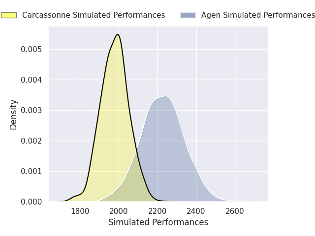

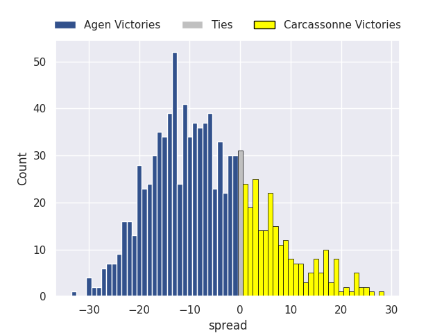

### Mont-de-Marsan V Beziers on 2026/03/05

Average Margin: Mont-de-Marsan by 2.7

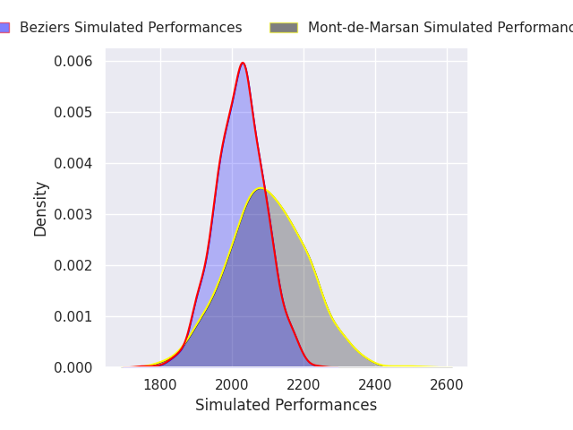

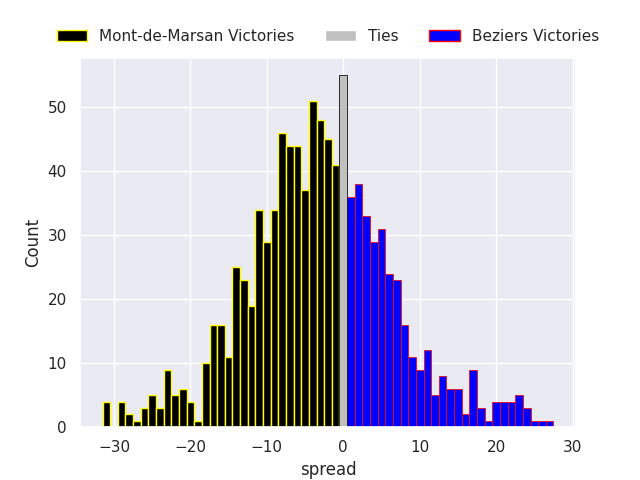

### Aurillac V USON Nevers on 2026/03/05

Average Margin: Aurillac by 6.2

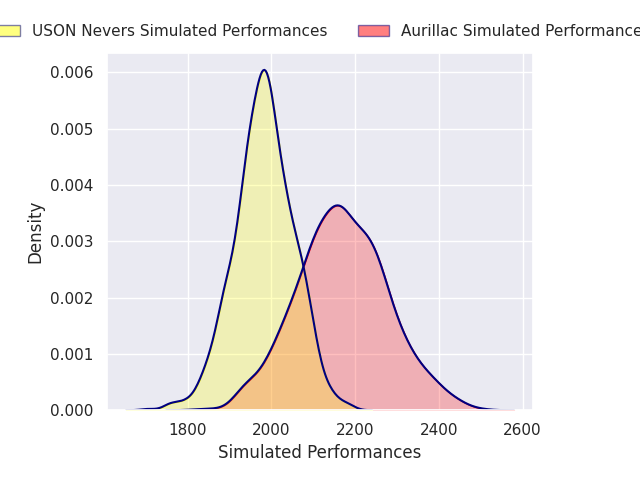
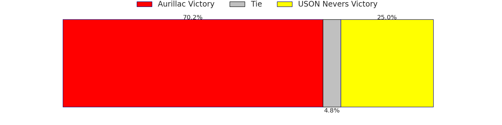
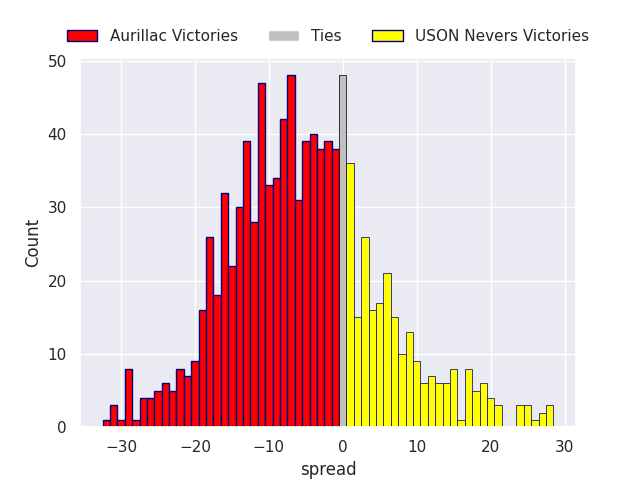

### Valence Romans Drome Rugby V Vannes on 2026/03/05

Average Margin: Vannes by 0.3

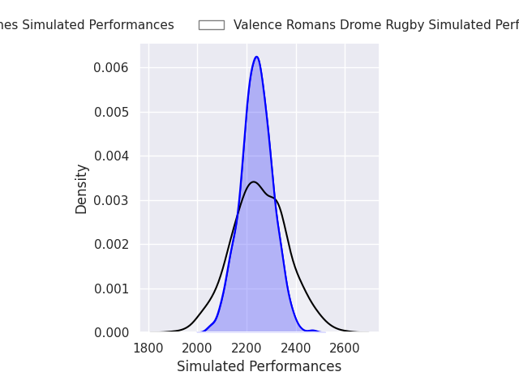
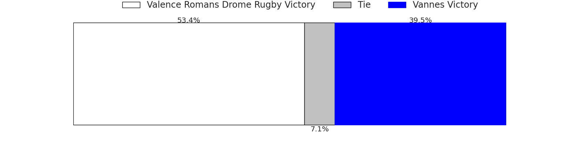
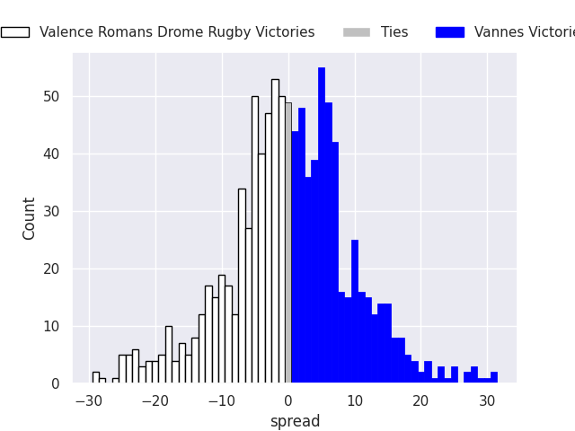

### Grenoble V Soyaux-Angouleme on 2026/03/05

Average Margin: Grenoble by 4.5

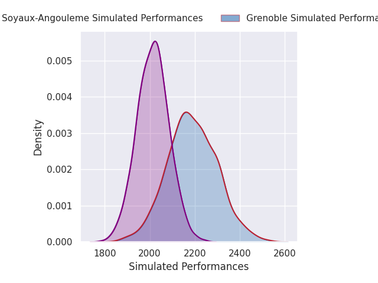
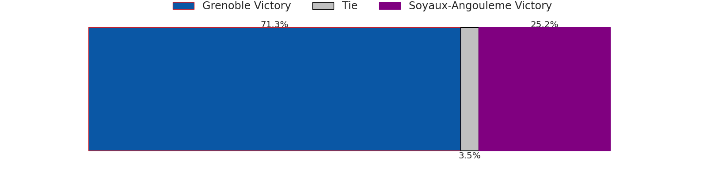
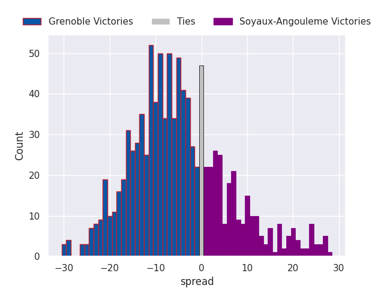

### Colomiers V Brive on 2026/03/05

Average Margin: Colomiers by 6.4

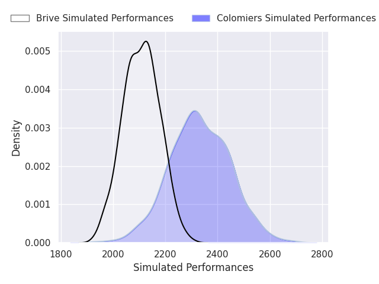

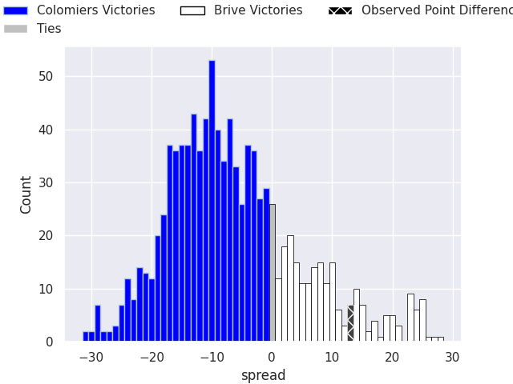

### Biarritz Olympique V Provence Rugby on 2026/03/05

Average Margin: Biarritz Olympique by 0.3

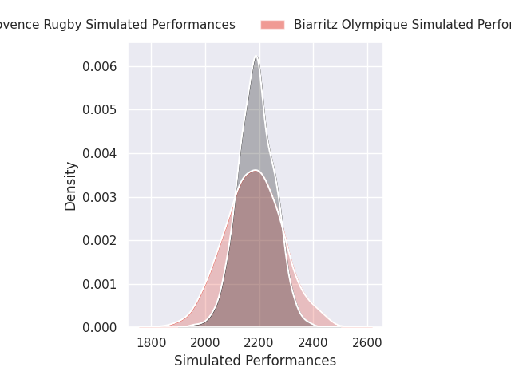

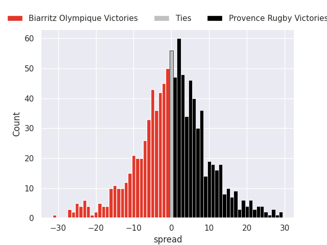

### Oyonnax V Dax on 2026/03/05

Average Margin: Oyonnax by 6.4

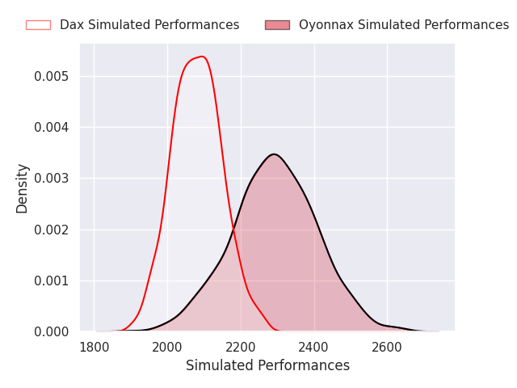

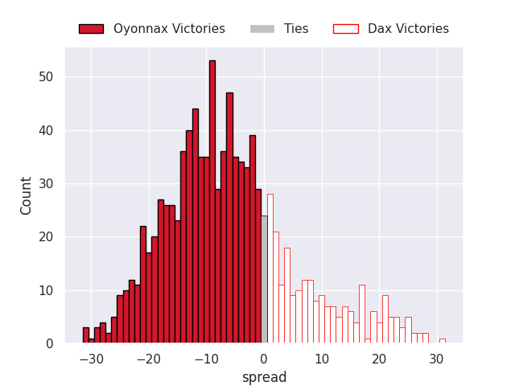

## Week 24

### Beziers V Agen on 2026/03/26

Average Margin: Beziers by 1.4

### Provence Rugby V Colomiers on 2026/03/26

Average Margin: Provence Rugby by 2.7

### Vannes V USON Nevers on 2026/03/26

Average Margin: Vannes by 12.1

### Soyaux-Angouleme V Brive on 2026/03/26

Average Margin: Soyaux-Angouleme by 1.6

### Aurillac V Biarritz Olympique on 2026/03/26

Average Margin: Aurillac by 3.9

### Carcassonne V Mont-de-Marsan on 2026/03/26

Average Margin: Carcassonne by 1.8

### Dax V Grenoble on 2026/03/26

Average Margin: Dax by 3.7

### Valence Romans Drome Rugby V Oyonnax on 2026/03/26

Average Margin: Valence Romans Drome Rugby by 2.3

## Week 25

### Agen V Vannes on 2026/04/02

Average Margin: Vannes by 0.6

### Grenoble V Valence Romans Drome Rugby on 2026/04/02

Average Margin: Grenoble by 2.2

### Oyonnax V Biarritz Olympique on 2026/04/02

Average Margin: Oyonnax by 7.3

### Soyaux-Angouleme V Carcassonne on 2026/04/02

Average Margin: Soyaux-Angouleme by 4.6

### Brive V Provence Rugby on 2026/04/02

Average Margin: Brive by 3.1

### USON Nevers V Beziers on 2026/04/02

Average Margin: USON Nevers by 2.4

### Mont-de-Marsan V Aurillac on 2026/04/02

Average Margin: Mont-de-Marsan by 2.9

### Colomiers V Dax on 2026/04/02

Average Margin: Colomiers by 6.8

## Week 26

### Dax V Soyaux-Angouleme on 2026/04/09

Average Margin: Dax by 5.0

### Biarritz Olympique V USON Nevers on 2026/04/09

Average Margin: Biarritz Olympique by 5.0

### Aurillac V Agen on 2026/04/09

Average Margin: Aurillac by 2.3

### Provence Rugby V Mont-de-Marsan on 2026/04/09

Average Margin: Provence Rugby by 7.5

### Vannes V Beziers on 2026/04/09

Average Margin: Vannes by 9.5

### Oyonnax V Brive on 2026/04/09

Average Margin: Oyonnax by 5.4

### Carcassonne V Grenoble on 2026/04/09

Average Margin: Carcassonne by 0.8

### Valence Romans Drome Rugby V Colomiers on 2026/04/09

Average Margin: Valence Romans Drome Rugby by 1.5

## Week 27

### USON Nevers V Valence Romans Drome Rugby on 2026/04/16

Average Margin: USON Nevers by 0.6

### Agen V Biarritz Olympique on 2026/04/16

Average Margin: Agen by 5.0

### Mont-de-Marsan V Dax on 2026/04/16

Average Margin: Mont-de-Marsan by 1.3

### Soyaux-Angouleme V Vannes on 2026/04/16

Average Margin: Vannes by 2.8

### Beziers V Provence Rugby on 2026/04/16

Average Margin: Provence Rugby by 0.0

### Colomiers V Carcassonne on 2026/04/16

Average Margin: Colomiers by 9.1

### Brive V Aurillac on 2026/04/16

Average Margin: Brive by 6.3

### Grenoble V Oyonnax on 2026/04/16

Average Margin: Grenoble by 0.7

## Week 28

### Valence Romans Drome Rugby V Brive on 2026/04/23

Average Margin: Valence Romans Drome Rugby by 3.7

### Dax V USON Nevers on 2026/04/23

Average Margin: Dax by 6.6

### Carcassonne V Beziers on 2026/04/23

Average Margin: Carcassonne by 2.0

### Vannes V Aurillac on 2026/04/23

Average Margin: Vannes by 10.0

### Oyonnax V Agen on 2026/04/23

Average Margin: Oyonnax by 5.9

### Grenoble V Mont-de-Marsan on 2026/04/23

Average Margin: Grenoble by 5.3

### Biarritz Olympique V Colomiers on 2026/04/23

Average Margin: Colomiers by 0.9

### Provence Rugby V Soyaux-Angouleme on 2026/04/23

Average Margin: Provence Rugby by 7.2

## Week 29

### USON Nevers V Oyonnax on 2026/05/07

Average Margin: USON Nevers by 0.1

### Carcassonne V Brive on 2026/05/07

Average Margin: Brive by 0.3

### Agen V Soyaux-Angouleme on 2026/05/07

Average Margin: Agen by 5.6

### Dax V Valence Romans Drome Rugby on 2026/05/07

Average Margin: Dax by 2.7

### Provence Rugby V Vannes on 2026/05/07

Average Margin: Provence Rugby by 1.5

### Colomiers V Mont-de-Marsan on 2026/05/07

Average Margin: Colomiers by 8.2

### Beziers V Biarritz Olympique on 2026/05/07

Average Margin: Beziers by 3.4

### Aurillac V Grenoble on 2026/05/07

Average Margin: Aurillac by 2.9

## Week 30

### Mont-de-Marsan V Agen on 2026/05/14

Average Margin: Mont-de-Marsan by 1.4

### Biarritz Olympique V Carcassonne on 2026/05/14

Average Margin: Biarritz Olympique by 5.3

### Brive V USON Nevers on 2026/05/14

Average Margin: Brive by 6.9

### Grenoble V Colomiers on 2026/05/14

Average Margin: Colomiers by 0.1

### Oyonnax V Aurillac on 2026/05/14

Average Margin: Oyonnax by 6.6

### Vannes V Dax on 2026/05/14

Average Margin: Vannes by 7.5

### Soyaux-Angouleme V Beziers on 2026/05/14

Average Margin: Soyaux-Angouleme by 3.2

### Valence Romans Drome Rugby V Provence Rugby on 2026/05/14

Average Margin: Valence Romans Drome Rugby by 2.9

