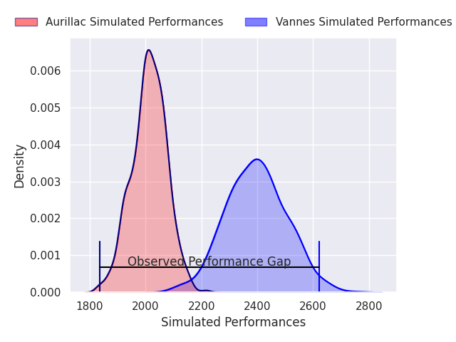
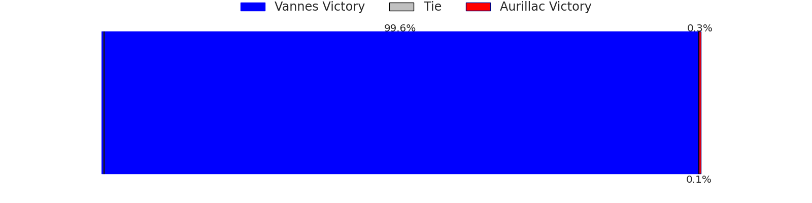
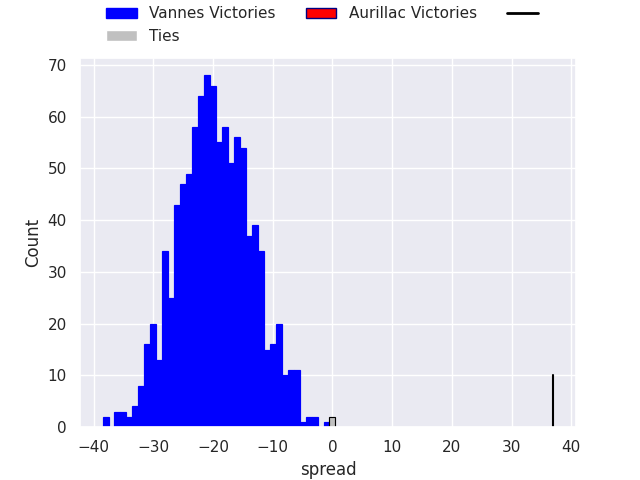
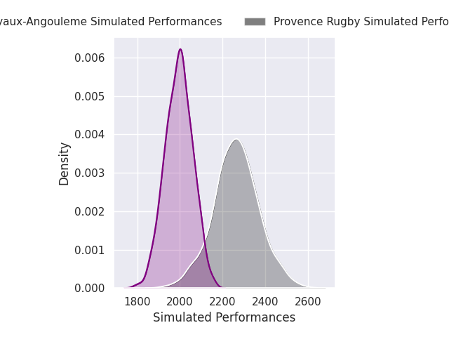
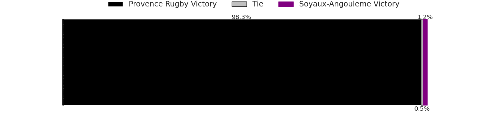
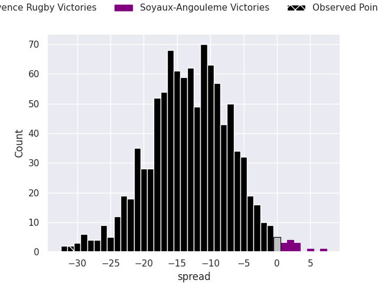

# Team Rankings

# Standings

## Current Standings

| Club                       |   Played |   Wins |   Point Differential |   Losing Bonus Points |   Try Bonus Points |   Competition Points |
|:---------------------------|---------:|-------:|---------------------:|----------------------:|-------------------:|---------------------:|
| Vannes                     |       27 |     22 |                  468 |                     3 |                 12 |                  105 |
| Colomiers                  |       27 |     19 |                  314 |                     4 |                  7 |                   87 |
| Valence Romans Drome Rugby |       28 |     18 |                   54 |                     4 |                  7 |                   83 |
| Provence Rugby             |       27 |     16 |                  132 |                     7 |                  9 |                   80 |
| Brive                      |       28 |     15 |                  246 |                     3 |                  7 |                   72 |
| Oyonnax                    |       27 |     14 |                  235 |                     9 |                  7 |                   72 |
| Agen                       |       27 |     14 |                   64 |                     4 |                  7 |                   67 |
| Dax                        |       27 |     13 |                  -13 |                     7 |                  2 |                   61 |
| Grenoble                   |       27 |     12 |                  -71 |                     6 |                  4 |                   58 |
| USON Nevers                |       27 |     11 |                 -215 |                     4 |                  8 |                   58 |
| Aurillac                   |       27 |     11 |                 -140 |                     6 |                  5 |                   55 |
| Soyaux-Angouleme           |       27 |     12 |                 -135 |                     5 |                  1 |                   54 |
| Biarritz Olympique         |       27 |     10 |                 -134 |                     4 |                  6 |                   52 |
| Beziers                    |       27 |     10 |                 -180 |                     3 |                  5 |                   48 |
| Mont-de-Marsan             |       27 |     10 |                 -264 |                     1 |                  2 |                   45 |
| Carcassonne                |       27 |      7 |                 -361 |                     6 |                  2 |                   38 |

## Projected Remaining Table

| Club                       |   To Play |   Projected Wins |   Projected Differential |   Projected Losing Bonus Points | Projected Try Bonus Points   |   Projected Competition Points |
|:---------------------------|----------:|-----------------:|-------------------------:|--------------------------------:|:-----------------------------|-------------------------------:|
| Oyonnax                    |         3 |            2.579 |                   30.379 |                           0.292 |                              |                         10.738 |
| Vannes                     |         3 |            2.564 |                   37.299 |                           0.296 |                              |                         10.68  |
| Colomiers                  |         3 |            2.029 |                   17.808 |                           0.672 |                              |                          9.022 |
| Brive                      |         2 |            1.766 |                   21.145 |                           0.169 |                              |                          7.319 |
| Dax                        |         3 |            1.733 |                    0.31  |                           0.267 |                              |                          7.307 |
| Biarritz Olympique         |         3 |            1.56  |                    4.188 |                           0.79  |                              |                          7.252 |
| Grenoble                   |         3 |            1.482 |                    2.359 |                           0.909 |                              |                          7.109 |
| Provence Rugby             |         3 |            1.488 |                    5.517 |                           0.787 |                              |                          6.953 |
| Beziers                    |         3 |            1.302 |                   -2.512 |                           0.925 |                              |                          6.383 |
| Agen                       |         3 |            1.378 |                   -1.367 |                           0.664 |                              |                          6.37  |
| Valence Romans Drome Rugby |         2 |            1.02  |                    1.655 |                           0.572 |                              |                          4.826 |
| Carcassonne                |         3 |            0.821 |                  -13.6   |                           0.961 |                              |                          4.491 |
| Soyaux-Angouleme           |         3 |            0.877 |                  -17.609 |                           0.54  |                              |                          4.154 |
| Mont-de-Marsan             |         3 |            0.64  |                  -23.194 |                           0.741 |                              |                          3.483 |
| Aurillac                   |         3 |            0.73  |                  -31.912 |                           0.288 |                              |                          3.318 |
| USON Nevers                |         3 |            0.339 |                  -30.466 |                           0.715 |                              |                          2.183 |

## Projected Total Table

| Club                       |   Played |   Wins |   Point Differential |   Losing Bonus Points |   Try Bonus Points |   Competition Points |
|:---------------------------|---------:|-------:|---------------------:|----------------------:|-------------------:|---------------------:|
| Vannes                     |       30 | 24.564 |              505.299 |                 3.296 |                 12 |              115.68  |
| Colomiers                  |       30 | 21.029 |              331.808 |                 4.672 |                  7 |               96.022 |
| Valence Romans Drome Rugby |       30 | 19.02  |               55.655 |                 4.572 |                  7 |               87.826 |
| Provence Rugby             |       30 | 17.488 |              137.517 |                 7.787 |                  9 |               86.953 |
| Oyonnax                    |       30 | 16.579 |              265.379 |                 9.292 |                  7 |               82.738 |
| Brive                      |       30 | 16.766 |              267.145 |                 3.169 |                  7 |               79.319 |
| Agen                       |       30 | 15.378 |               62.633 |                 4.664 |                  7 |               73.37  |
| Dax                        |       30 | 14.733 |              -12.69  |                 7.267 |                  2 |               68.307 |
| Grenoble                   |       30 | 13.482 |              -68.641 |                 6.909 |                  4 |               65.109 |
| USON Nevers                |       30 | 11.339 |             -245.466 |                 4.715 |                  8 |               60.183 |
| Biarritz Olympique         |       30 | 11.56  |             -129.812 |                 4.79  |                  6 |               59.252 |
| Aurillac                   |       30 | 11.73  |             -171.912 |                 6.288 |                  5 |               58.318 |
| Soyaux-Angouleme           |       30 | 12.877 |             -152.609 |                 5.54  |                  1 |               58.154 |
| Beziers                    |       30 | 11.302 |             -182.512 |                 3.925 |                  5 |               54.383 |
| Mont-de-Marsan             |       30 | 10.64  |             -287.194 |                 1.741 |                  2 |               48.483 |
| Carcassonne                |       30 |  7.821 |             -374.6   |                 6.961 |                  2 |               42.491 |

# Completed Match Review

| Model | Percent Correct Predictions | Spread Error |
| ------ | ------ | ------ |
| Club Level | 75.0% | 12.1 |
| Player Level: Lineup | nan% | nan |
| Player Level: Minutes | nan% | nan |

# Future Predictions

## Week 29

### Carcassonne V Beziers on 2026/04/24

Average Margin: Carcassonne by 2.1

### Vannes V Aurillac on 2026/04/24

Average Margin: Vannes by 19.2

### Provence Rugby V Soyaux-Angouleme on 2026/04/24

Average Margin: Provence Rugby by 13.5

### Dax V USON Nevers on 2026/04/24

Average Margin: Dax by 12.1

### Biarritz Olympique V Colomiers on 2026/04/24

Average Margin: Colomiers by 0.3

### Grenoble V Mont-de-Marsan on 2026/04/24

Average Margin: Grenoble by 7.8

### Oyonnax V Agen on 2026/04/24

Average Margin: Oyonnax by 11.0

## Week 30

### USON Nevers V Oyonnax on 2026/05/07

Average Margin: Oyonnax by 2.5

### Dax V Valence Romans Drome Rugby on 2026/05/07

Average Margin: Dax by 4.6

### Agen V Soyaux-Angouleme on 2026/05/07

Average Margin: Agen by 10.5

### Carcassonne V Brive on 2026/05/07

Average Margin: Brive by 5.2

### Provence Rugby V Vannes on 2026/05/07

Average Margin: Vannes by 1.7

### Colomiers V Mont-de-Marsan on 2026/05/07

Average Margin: Colomiers by 16.3

### Beziers V Biarritz Olympique on 2026/05/07

Average Margin: Beziers by 5.9

### Aurillac V Grenoble on 2026/05/07

Average Margin: Aurillac by 4.2

## Week 31

### Mont-de-Marsan V Agen on 2026/05/14

Average Margin: Mont-de-Marsan by 0.9

### Biarritz Olympique V Carcassonne on 2026/05/14

Average Margin: Biarritz Olympique by 10.4

### Brive V USON Nevers on 2026/05/14

Average Margin: Brive by 15.9

### Grenoble V Colomiers on 2026/05/14

Average Margin: Colomiers by 1.2

### Oyonnax V Aurillac on 2026/05/14

Average Margin: Oyonnax by 16.9

### Vannes V Dax on 2026/05/14

Average Margin: Vannes by 16.4

### Soyaux-Angouleme V Beziers on 2026/05/14

Average Margin: Soyaux-Angouleme by 6.4

### Valence Romans Drome Rugby V Provence Rugby on 2026/05/14

Average Margin: Valence Romans Drome Rugby by 6.2

