# Team Rankings

# Standings

## Current Standings

| Club                       |   Played |   Wins |   Point Differential |   Losing Bonus Points |   Try Bonus Points |   Competition Points |
|:---------------------------|---------:|-------:|---------------------:|----------------------:|-------------------:|---------------------:|
| Vannes                     |       25 |     21 |                  400 |                     2 |                 12 |                  100 |
| Colomiers                  |       25 |     18 |                  290 |                     3 |                  7 |                   82 |
| Valence Romans Drome Rugby |       25 |     16 |                   42 |                     3 |                  7 |                   74 |
| Provence Rugby             |       25 |     14 |                  122 |                     7 |                  9 |                   72 |
| Oyonnax                    |       25 |     13 |                  225 |                     8 |                  7 |                   67 |
| Brive                      |       25 |     14 |                  201 |                     2 |                  7 |                   67 |
| Agen                       |       25 |     12 |                   28 |                     4 |                  7 |                   59 |
| Aurillac                   |       25 |     11 |                  -57 |                     6 |                  5 |                   55 |
| Dax                        |       25 |     11 |                  -32 |                     7 |                  2 |                   53 |
| Grenoble                   |       25 |     11 |                  -73 |                     5 |                  4 |                   53 |
| Biarritz Olympique         |       25 |     10 |                 -112 |                     3 |                  6 |                   51 |
| USON Nevers                |       25 |      9 |                 -219 |                     4 |                  8 |                   50 |
| Soyaux-Angouleme           |       25 |     11 |                 -133 |                     4 |                  1 |                   49 |
| Beziers                    |       25 |     10 |                 -108 |                     2 |                  5 |                   47 |
| Mont-de-Marsan             |       25 |     10 |                 -241 |                     1 |                  2 |                   45 |
| Carcassonne                |       25 |      6 |                 -333 |                     6 |                  2 |                   34 |

## Projected Remaining Table

| Club                       |   To Play |   Projected Wins |   Projected Differential |   Projected Losing Bonus Points | Projected Try Bonus Points   |   Projected Competition Points |
|:---------------------------|----------:|-----------------:|-------------------------:|--------------------------------:|:-----------------------------|-------------------------------:|
| Vannes                     |         5 |            4.507 |                   66.446 |                           0.364 |                              |                         18.542 |
| Oyonnax                    |         5 |            3.953 |                   38.631 |                           0.738 |                              |                         16.92  |
| Colomiers                  |         5 |            3.415 |                   34.71  |                           1.057 |                              |                         15.081 |
| Valence Romans Drome Rugby |         5 |            2.997 |                   10.634 |                           1.303 |                              |                         13.813 |
| Brive                      |         5 |            3.065 |                   23.86  |                           0.987 |                              |                         13.493 |
| Provence Rugby             |         5 |            2.783 |                   14.921 |                           1.269 |                              |                         12.741 |
| Dax                        |         5 |            2.884 |                    5.578 |                           0.751 |                              |                         12.553 |
| Biarritz Olympique         |         5 |            2.575 |                    7.485 |                           1.227 |                              |                         11.847 |
| Grenoble                   |         5 |            2.284 |                   -1.072 |                           1.629 |                              |                         11.345 |
| Agen                       |         5 |            2.317 |                   -1.639 |                           1.255 |                              |                         10.833 |
| Beziers                    |         5 |            1.865 |                  -19.357 |                           1.345 |                              |                          9.275 |
| Mont-de-Marsan             |         5 |            1.519 |                  -28.407 |                           1.084 |                              |                          7.468 |
| Aurillac                   |         5 |            1.541 |                  -40.379 |                           0.559 |                              |                          6.925 |
| Carcassonne                |         5 |            1.26  |                  -33.137 |                           1.356 |                              |                          6.766 |
| Soyaux-Angouleme           |         5 |            0.949 |                  -35.7   |                           1.229 |                              |                          5.225 |
| USON Nevers                |         5 |            0.744 |                  -42.574 |                           1.335 |                              |                          4.661 |

## Projected Total Table

| Club                       |   Played |   Wins |   Point Differential |   Losing Bonus Points |   Try Bonus Points |   Competition Points |
|:---------------------------|---------:|-------:|---------------------:|----------------------:|-------------------:|---------------------:|
| Vannes                     |       30 | 25.507 |              466.446 |                 2.364 |                 12 |              118.542 |
| Colomiers                  |       30 | 21.415 |              324.71  |                 4.057 |                  7 |               97.081 |
| Valence Romans Drome Rugby |       30 | 18.997 |               52.634 |                 4.303 |                  7 |               87.813 |
| Provence Rugby             |       30 | 16.783 |              136.921 |                 8.269 |                  9 |               84.741 |
| Oyonnax                    |       30 | 16.953 |              263.631 |                 8.738 |                  7 |               83.92  |
| Brive                      |       30 | 17.065 |              224.86  |                 2.987 |                  7 |               80.493 |
| Agen                       |       30 | 14.317 |               26.361 |                 5.255 |                  7 |               69.833 |
| Dax                        |       30 | 13.884 |              -26.422 |                 7.751 |                  2 |               65.553 |
| Grenoble                   |       30 | 13.284 |              -74.072 |                 6.629 |                  4 |               64.345 |
| Biarritz Olympique         |       30 | 12.575 |             -104.515 |                 4.227 |                  6 |               62.847 |
| Aurillac                   |       30 | 12.541 |              -97.379 |                 6.559 |                  5 |               61.925 |
| Beziers                    |       30 | 11.865 |             -127.357 |                 3.345 |                  5 |               56.275 |
| USON Nevers                |       30 |  9.744 |             -261.574 |                 5.335 |                  8 |               54.661 |
| Soyaux-Angouleme           |       30 | 11.949 |             -168.7   |                 5.229 |                  1 |               54.225 |
| Mont-de-Marsan             |       30 | 11.519 |             -269.407 |                 2.084 |                  2 |               52.468 |
| Carcassonne                |       30 |  7.26  |             -366.137 |                 7.356 |                  2 |               40.766 |

# Completed Match Review

| Model | Percent Correct Predictions | Spread Error |
| ------ | ------ | ------ |
| Club Level | 75.4% | 11.6 |
| Player Level: Lineup | nan% | nan |
| Player Level: Minutes | nan% | nan |

# Future Predictions

## Week 26

### Oyonnax V Brive on 2026/04/09

Average Margin: Oyonnax by 7.9

### Carcassonne V Grenoble on 2026/04/10

Average Margin: Carcassonne by 0.8

### Biarritz Olympique V USON Nevers on 2026/04/10

Average Margin: Biarritz Olympique by 10.5

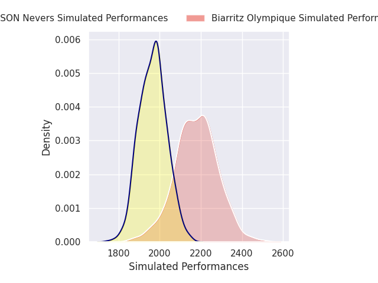
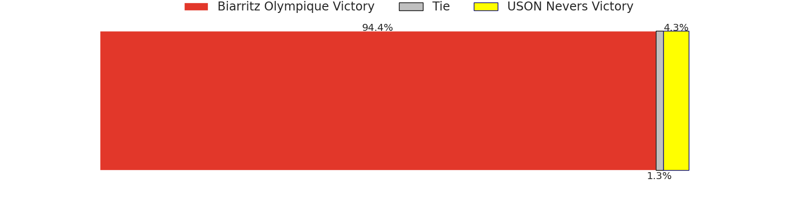
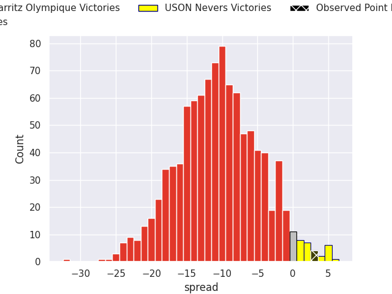

### Vannes V Beziers on 2026/04/10

Average Margin: Vannes by 19.0

### Provence Rugby V Mont-de-Marsan on 2026/04/10

Average Margin: Provence Rugby by 12.5

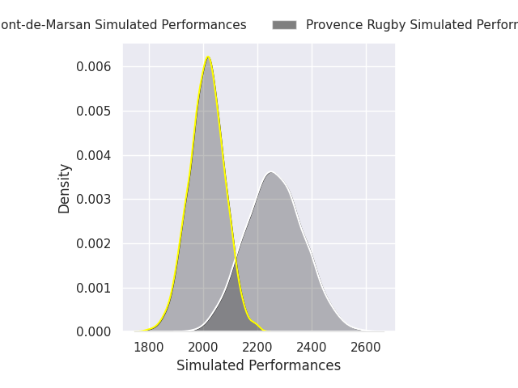

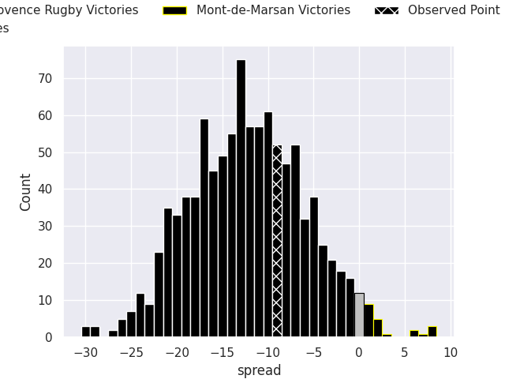

### Dax V Soyaux-Angouleme on 2026/04/10

Average Margin: Dax by 10.6

### Valence Romans Drome Rugby V Colomiers on 2026/04/10

Average Margin: Valence Romans Drome Rugby by 2.9

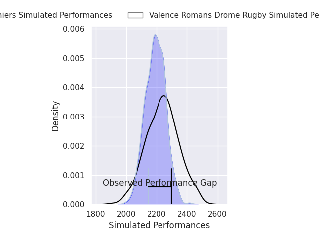
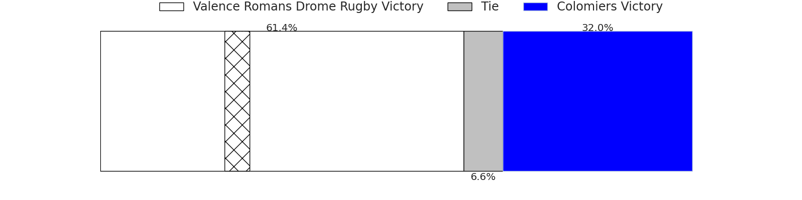
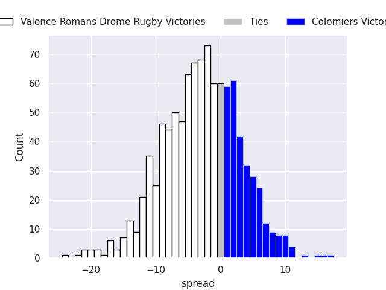

### Aurillac V Agen on 2026/04/10

Average Margin: Aurillac by 3.7

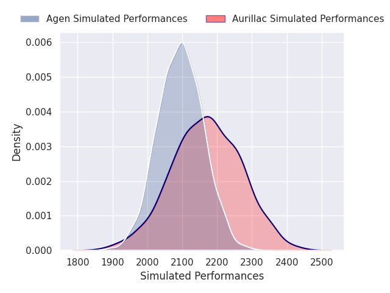
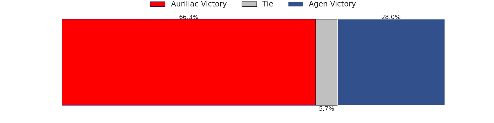
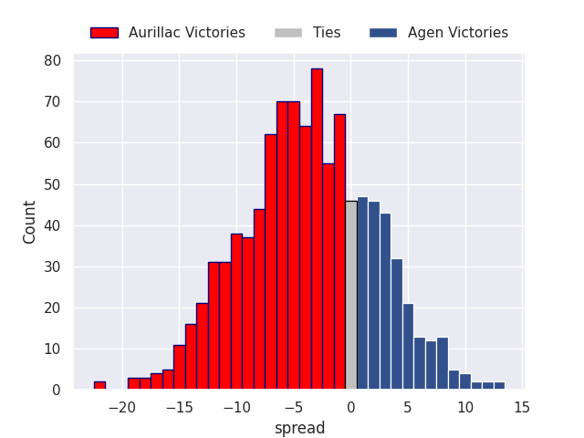

## Week 27

### USON Nevers V Valence Romans Drome Rugby on 2026/04/16

Average Margin: Valence Romans Drome Rugby by 0.8

### Agen V Biarritz Olympique on 2026/04/16

Average Margin: Agen by 7.8

### Mont-de-Marsan V Dax on 2026/04/16

Average Margin: Mont-de-Marsan by 3.6

### Soyaux-Angouleme V Vannes on 2026/04/16

Average Margin: Vannes by 8.1

### Colomiers V Carcassonne on 2026/04/16

Average Margin: Colomiers by 19.0

### Brive V Aurillac on 2026/04/16

Average Margin: Brive by 14.4

### Beziers V Provence Rugby on 2026/04/16

Average Margin: Beziers by 1.4

### Grenoble V Oyonnax on 2026/04/16

Average Margin: Oyonnax by 0.0

## Week 28

### Carcassonne V Beziers on 2026/04/23

Average Margin: Carcassonne by 1.5

### Dax V USON Nevers on 2026/04/23

Average Margin: Dax by 11.7

### Valence Romans Drome Rugby V Brive on 2026/04/23

Average Margin: Valence Romans Drome Rugby by 4.5

### Vannes V Aurillac on 2026/04/23

Average Margin: Vannes by 20.1

### Grenoble V Mont-de-Marsan on 2026/04/23

Average Margin: Grenoble by 7.4

### Oyonnax V Agen on 2026/04/23

Average Margin: Oyonnax by 12.2

### Biarritz Olympique V Colomiers on 2026/04/23

Average Margin: Colomiers by 1.4

### Provence Rugby V Soyaux-Angouleme on 2026/04/23

Average Margin: Provence Rugby by 12.3

## Week 29

### USON Nevers V Oyonnax on 2026/05/07

Average Margin: Oyonnax by 3.1

### Carcassonne V Brive on 2026/05/07

Average Margin: Brive by 5.4

### Agen V Soyaux-Angouleme on 2026/05/07

Average Margin: Agen by 9.9

### Dax V Valence Romans Drome Rugby on 2026/05/07

Average Margin: Dax by 4.0

### Provence Rugby V Vannes on 2026/05/07

Average Margin: Vannes by 2.2

### Colomiers V Mont-de-Marsan on 2026/05/07

Average Margin: Colomiers by 15.5

### Beziers V Biarritz Olympique on 2026/05/07

Average Margin: Beziers by 4.8

### Aurillac V Grenoble on 2026/05/07

Average Margin: Aurillac by 5.9

## Week 30

### Mont-de-Marsan V Agen on 2026/05/14

Average Margin: Mont-de-Marsan by 3.4

### Biarritz Olympique V Carcassonne on 2026/05/14

Average Margin: Biarritz Olympique by 11.0

### Brive V USON Nevers on 2026/05/14

Average Margin: Brive by 16.5

### Grenoble V Colomiers on 2026/05/14

Average Margin: Colomiers by 1.8

### Oyonnax V Aurillac on 2026/05/14

Average Margin: Oyonnax by 15.4

### Vannes V Dax on 2026/05/14

Average Margin: Vannes by 17.1

### Soyaux-Angouleme V Beziers on 2026/05/14

Average Margin: Soyaux-Angouleme by 5.2

### Valence Romans Drome Rugby V Provence Rugby on 2026/05/14

Average Margin: Valence Romans Drome Rugby by 6.3

