# Team Rankings

# Standings

## Current Standings

| Club                       |   Played |   Wins |   Point Differential |   Losing Bonus Points |   Try Bonus Points |   Competition Points |
|:---------------------------|---------:|-------:|---------------------:|----------------------:|-------------------:|---------------------:|
| Vannes                     |       22 |     18 |                  318 |                     2 |                 12 |                   88 |
| Colomiers                  |       23 |     16 |                  240 |                     3 |                  7 |                   74 |
| Provence Rugby             |       22 |     14 |                  175 |                     6 |                  9 |                   71 |
| Valence Romans Drome Rugby |       22 |     14 |                   27 |                     3 |                  7 |                   66 |
| Oyonnax                    |       22 |     11 |                  174 |                     8 |                  7 |                   59 |
| Brive                      |       23 |     12 |                  142 |                     2 |                  7 |                   59 |
| Agen                       |       22 |     11 |                   37 |                     4 |                  7 |                   55 |
| Aurillac                   |       22 |     10 |                  -50 |                     5 |                  5 |                   50 |
| Dax                        |       22 |     10 |                   25 |                     7 |                  2 |                   49 |
| Grenoble                   |       22 |     10 |                  -47 |                     4 |                  4 |                   48 |
| USON Nevers                |       22 |      8 |                 -171 |                     3 |                  8 |                   45 |
| Soyaux-Angouleme           |       22 |     10 |                 -149 |                     3 |                  1 |                   44 |
| Biarritz Olympique         |       22 |      8 |                  -89 |                     3 |                  6 |                   43 |
| Beziers                    |       22 |      9 |                 -107 |                     1 |                  5 |                   42 |
| Carcassonne                |       22 |      6 |                 -256 |                     5 |                  2 |                   33 |
| Mont-de-Marsan             |       22 |      7 |                 -269 |                     1 |                  2 |                   33 |

## Projected Remaining Table

| Club                       |   To Play |   Projected Wins |   Projected Differential |   Projected Losing Bonus Points | Projected Try Bonus Points   |   Projected Competition Points |
|:---------------------------|----------:|-----------------:|-------------------------:|--------------------------------:|:-----------------------------|-------------------------------:|
| Vannes                     |         8 |            5.025 |                   39.999 |                           1.508 |                              |                         22.342 |
| Oyonnax                    |         8 |            4.954 |                   30.571 |                           1.512 |                              |                         22.054 |
| Provence Rugby             |         8 |            4.268 |                   14.239 |                           1.98  |                              |                         19.852 |
| Grenoble                   |         8 |            4.04  |                    6.471 |                           2.008 |                              |                         19.044 |
| Valence Romans Drome Rugby |         8 |            4.006 |                    4.55  |                           2.075 |                              |                         19.011 |
| Agen                       |         8 |            3.981 |                    5.862 |                           1.918 |                              |                         18.57  |
| Colomiers                  |         7 |            3.883 |                   18.556 |                           1.568 |                              |                         17.73  |
| Dax                        |         8 |            3.807 |                   -4.132 |                           1.616 |                              |                         17.53  |
| Aurillac                   |         8 |            3.678 |                  -10.311 |                           1.566 |                              |                         16.928 |
| Brive                      |         7 |            3.566 |                    7.055 |                           1.631 |                              |                         16.521 |
| Mont-de-Marsan             |         8 |            3.366 |                  -15.366 |                           1.878 |                              |                         16.094 |
| Biarritz Olympique         |         8 |            3.309 |                  -11.924 |                           2.006 |                              |                         15.952 |
| Beziers                    |         8 |            3.193 |                  -16.015 |                           2.179 |                              |                         15.769 |
| Carcassonne                |         8 |            3.152 |                  -18.926 |                           1.94  |                              |                         15.26  |
| Soyaux-Angouleme           |         8 |            3.08  |                  -18.577 |                           1.974 |                              |                         15.016 |
| USON Nevers                |         8 |            2.76  |                  -32.052 |                           1.88  |                              |                         13.566 |

## Projected Total Table

| Club                       |   Played |   Wins |   Point Differential |   Losing Bonus Points |   Try Bonus Points |   Competition Points |
|:---------------------------|---------:|-------:|---------------------:|----------------------:|-------------------:|---------------------:|
| Vannes                     |       30 | 23.025 |              357.999 |                 3.508 |                 12 |              110.342 |
| Colomiers                  |       30 | 19.883 |              258.556 |                 4.568 |                  7 |               91.73  |
| Provence Rugby             |       30 | 18.268 |              189.239 |                 7.98  |                  9 |               90.852 |
| Valence Romans Drome Rugby |       30 | 18.006 |               31.55  |                 5.075 |                  7 |               85.011 |
| Oyonnax                    |       30 | 15.954 |              204.571 |                 9.512 |                  7 |               81.054 |
| Brive                      |       30 | 15.566 |              149.055 |                 3.631 |                  7 |               75.521 |
| Agen                       |       30 | 14.981 |               42.862 |                 5.918 |                  7 |               73.57  |
| Grenoble                   |       30 | 14.04  |              -40.529 |                 6.008 |                  4 |               67.044 |
| Aurillac                   |       30 | 13.678 |              -60.311 |                 6.566 |                  5 |               66.928 |
| Dax                        |       30 | 13.807 |               20.868 |                 8.616 |                  2 |               66.53  |
| Soyaux-Angouleme           |       30 | 13.08  |             -167.577 |                 4.974 |                  1 |               59.016 |
| Biarritz Olympique         |       30 | 11.309 |             -100.924 |                 5.006 |                  6 |               58.952 |
| USON Nevers                |       30 | 10.76  |             -203.052 |                 4.88  |                  8 |               58.566 |
| Beziers                    |       30 | 12.193 |             -123.015 |                 3.179 |                  5 |               57.769 |
| Mont-de-Marsan             |       30 | 10.366 |             -284.366 |                 2.878 |                  2 |               49.094 |
| Carcassonne                |       30 |  9.152 |             -274.926 |                 6.94  |                  2 |               48.26  |

# Completed Match Review

| Model | Percent Correct Predictions | Spread Error |
| ------ | ------ | ------ |
| Club Level | 72.9% | 11.4 |
| Player Level: Lineup | nan% | nan |
| Player Level: Minutes | nan% | nan |

# Future Predictions

## Week 24

### Valence Romans Drome Rugby V Vannes on 2026/03/06

Average Margin: Vannes by 0.4

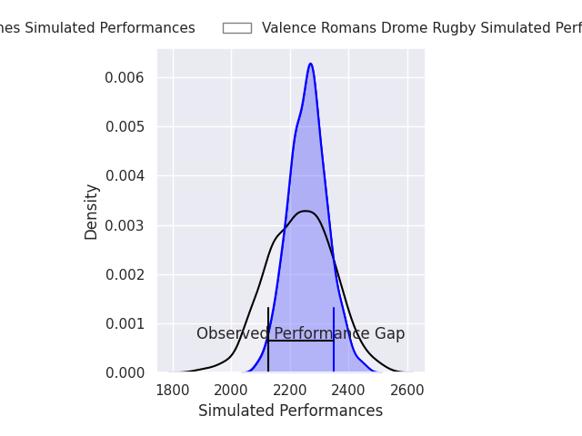
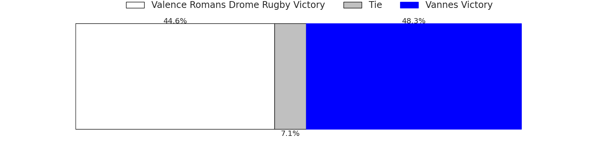
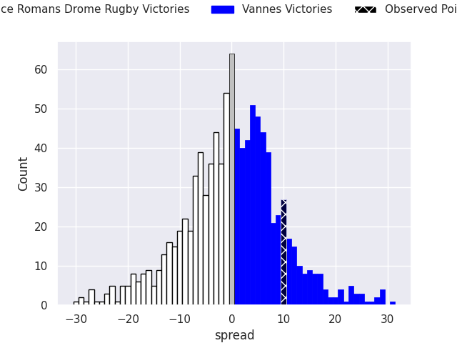

### Oyonnax V Dax on 2026/03/06

Average Margin: Oyonnax by 7.2

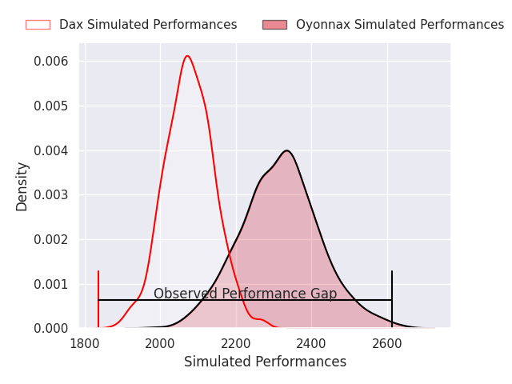

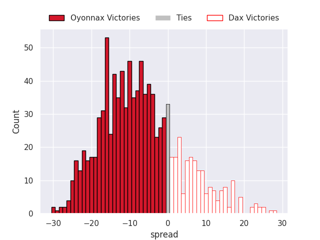

### Aurillac V USON Nevers on 2026/03/06

Average Margin: Aurillac by 5.2

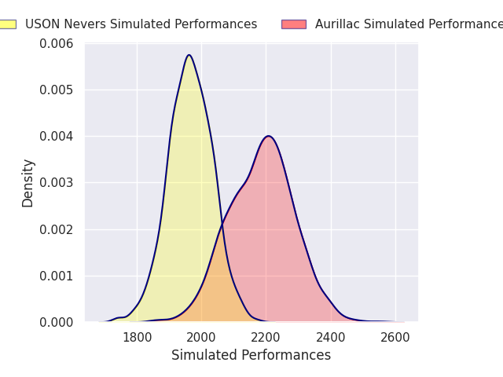
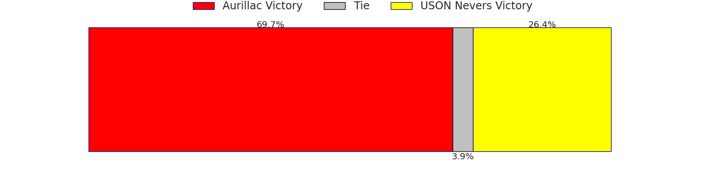
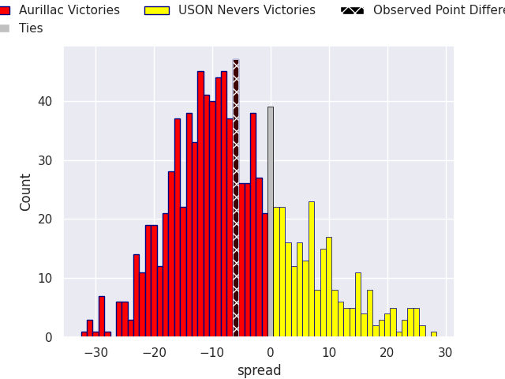

### Mont-de-Marsan V Beziers on 2026/03/06

Average Margin: Mont-de-Marsan by 3.4

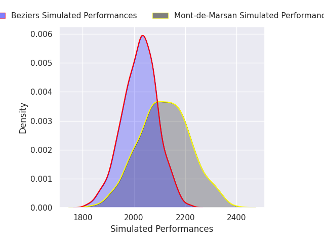
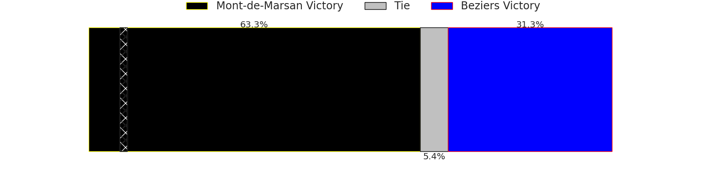
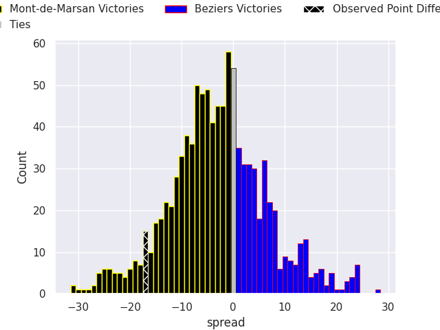

### Grenoble V Soyaux-Angouleme on 2026/03/06

Average Margin: Grenoble by 4.8

### Biarritz Olympique V Provence Rugby on 2026/03/06

Average Margin: Provence Rugby by 0.5

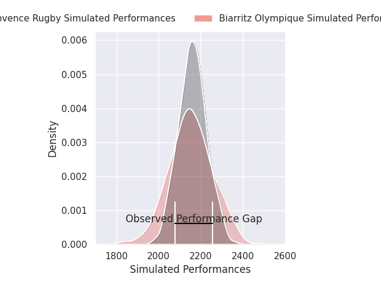

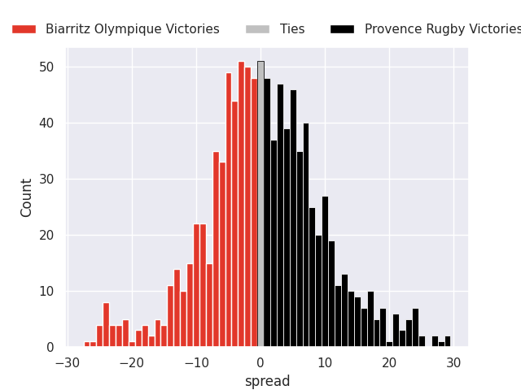

### Agen V Carcassonne on 2026/03/06

Average Margin: Agen by 6.5

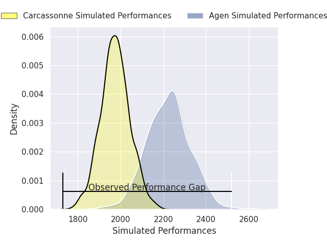

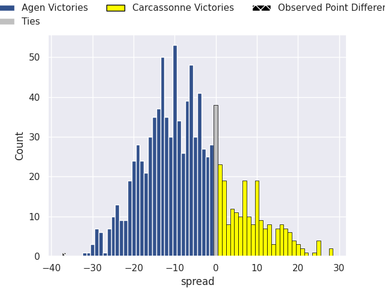

## Week 25

### Valence Romans Drome Rugby V Oyonnax on 2026/03/26

Average Margin: Valence Romans Drome Rugby by 2.6

### Dax V Grenoble on 2026/03/26

Average Margin: Dax by 3.9

### Carcassonne V Mont-de-Marsan on 2026/03/26

Average Margin: Carcassonne by 3.0

### Aurillac V Biarritz Olympique on 2026/03/26

Average Margin: Aurillac by 4.4

### Beziers V Agen on 2026/03/26

Average Margin: Beziers by 2.0

### Vannes V USON Nevers on 2026/03/26

Average Margin: Vannes by 10.9

### Provence Rugby V Colomiers on 2026/03/26

Average Margin: Provence Rugby by 2.8

### Soyaux-Angouleme V Brive on 2026/03/26

Average Margin: Soyaux-Angouleme by 0.4

## Week 26

### USON Nevers V Beziers on 2026/04/02

Average Margin: USON Nevers by 2.7

### Mont-de-Marsan V Aurillac on 2026/04/02

Average Margin: Mont-de-Marsan by 3.0

### Agen V Vannes on 2026/04/02

Average Margin: Vannes by 0.3

### Soyaux-Angouleme V Carcassonne on 2026/04/02

Average Margin: Soyaux-Angouleme by 3.8

### Brive V Provence Rugby on 2026/04/02

Average Margin: Brive by 2.8

### Oyonnax V Biarritz Olympique on 2026/04/02

Average Margin: Oyonnax by 7.9

### Grenoble V Valence Romans Drome Rugby on 2026/04/02

Average Margin: Grenoble by 3.0

### Colomiers V Dax on 2026/04/02

Average Margin: Colomiers by 6.2

## Week 27

### Aurillac V Agen on 2026/04/09

Average Margin: Aurillac by 2.8

### Biarritz Olympique V USON Nevers on 2026/04/09

Average Margin: Biarritz Olympique by 5.2

### Carcassonne V Grenoble on 2026/04/09

Average Margin: Carcassonne by 1.0

### Provence Rugby V Mont-de-Marsan on 2026/04/09

Average Margin: Provence Rugby by 8.2

### Vannes V Beziers on 2026/04/09

Average Margin: Vannes by 9.6

### Oyonnax V Brive on 2026/04/09

Average Margin: Oyonnax by 5.5

### Valence Romans Drome Rugby V Colomiers on 2026/04/09

Average Margin: Valence Romans Drome Rugby by 1.8

### Dax V Soyaux-Angouleme on 2026/04/09

Average Margin: Dax by 5.4

## Week 28

### USON Nevers V Valence Romans Drome Rugby on 2026/04/16

Average Margin: USON Nevers by 0.2

### Agen V Biarritz Olympique on 2026/04/16

Average Margin: Agen by 5.5

### Mont-de-Marsan V Dax on 2026/04/16

Average Margin: Mont-de-Marsan by 1.6

### Soyaux-Angouleme V Vannes on 2026/04/16

Average Margin: Vannes by 2.9

### Beziers V Provence Rugby on 2026/04/16

Average Margin: Provence Rugby by 0.0

### Colomiers V Carcassonne on 2026/04/16

Average Margin: Colomiers by 9.1

### Brive V Aurillac on 2026/04/16

Average Margin: Brive by 5.5

### Grenoble V Oyonnax on 2026/04/16

Average Margin: Grenoble by 1.2

## Week 29

### Valence Romans Drome Rugby V Brive on 2026/04/23

Average Margin: Valence Romans Drome Rugby by 3.4

### Dax V USON Nevers on 2026/04/23

Average Margin: Dax by 6.2

### Carcassonne V Beziers on 2026/04/23

Average Margin: Carcassonne by 2.0

### Vannes V Aurillac on 2026/04/23

Average Margin: Vannes by 9.8

### Oyonnax V Agen on 2026/04/23

Average Margin: Oyonnax by 5.9

### Grenoble V Mont-de-Marsan on 2026/04/23

Average Margin: Grenoble by 5.0

### Biarritz Olympique V Colomiers on 2026/04/23

Average Margin: Colomiers by 0.4

### Provence Rugby V Soyaux-Angouleme on 2026/04/23

Average Margin: Provence Rugby by 7.4

## Week 30

### USON Nevers V Oyonnax on 2026/05/07

Average Margin: Oyonnax by 0.2

### Carcassonne V Brive on 2026/05/07

Average Margin: Brive by 0.9

### Agen V Soyaux-Angouleme on 2026/05/07

Average Margin: Agen by 5.8

### Dax V Valence Romans Drome Rugby on 2026/05/07

Average Margin: Dax by 2.4

### Provence Rugby V Vannes on 2026/05/07

Average Margin: Provence Rugby by 1.0

### Colomiers V Mont-de-Marsan on 2026/05/07

Average Margin: Colomiers by 8.2

### Beziers V Biarritz Olympique on 2026/05/07

Average Margin: Beziers by 3.0

### Aurillac V Grenoble on 2026/05/07

Average Margin: Aurillac by 3.2

## Week 31

### Mont-de-Marsan V Agen on 2026/05/14

Average Margin: Mont-de-Marsan by 1.1

### Biarritz Olympique V Carcassonne on 2026/05/14

Average Margin: Biarritz Olympique by 4.7

### Brive V USON Nevers on 2026/05/14

Average Margin: Brive by 7.3

### Grenoble V Colomiers on 2026/05/14

Average Margin: Grenoble by 0.8

### Oyonnax V Aurillac on 2026/05/14

Average Margin: Oyonnax by 7.7

### Vannes V Dax on 2026/05/14

Average Margin: Vannes by 7.1

### Soyaux-Angouleme V Beziers on 2026/05/14

Average Margin: Soyaux-Angouleme by 3.4

### Valence Romans Drome Rugby V Provence Rugby on 2026/05/14

Average Margin: Valence Romans Drome Rugby by 2.8

