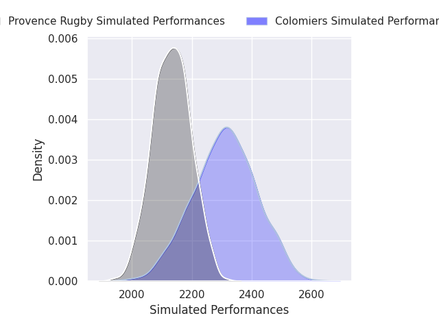
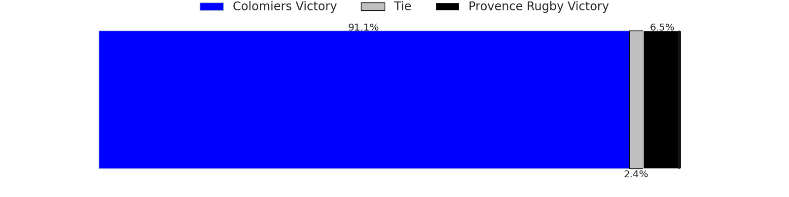
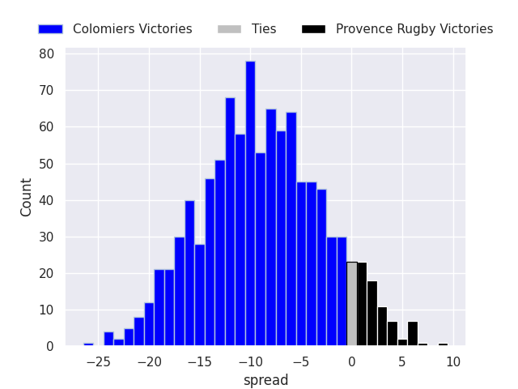

# Team Rankings

# Standings

## Current Standings

| Club                       |   Played |   Wins |   Point Differential |   Losing Bonus Points |   Try Bonus Points |   Competition Points |
|:---------------------------|---------:|-------:|---------------------:|----------------------:|-------------------:|---------------------:|
| Vannes                     |       31 |     25 |                  590 |                     4 |                 12 |                  118 |
| Provence Rugby             |       31 |     20 |                  197 |                     7 |                  9 |                   96 |
| Colomiers                  |       30 |     21 |                  325 |                     4 |                  7 |                   95 |
| Oyonnax                    |       32 |     18 |                  278 |                     9 |                  7 |                   88 |
| Valence Romans Drome Rugby |       31 |     19 |                   18 |                     4 |                  7 |                   87 |
| Brive                      |       31 |     17 |                  246 |                     3 |                  7 |                   80 |
| Agen                       |       30 |     15 |                   46 |                     4 |                  7 |                   71 |
| Dax                        |       30 |     14 |                  -36 |                     8 |                  2 |                   66 |
| Grenoble                   |       30 |     14 |                  -90 |                     6 |                  4 |                   66 |
| Biarritz Olympique         |       30 |     12 |                 -117 |                     4 |                  6 |                   60 |
| USON Nevers                |       30 |     11 |                 -264 |                     5 |                  8 |                   59 |
| Soyaux-Angouleme           |       30 |     13 |                 -194 |                     5 |                  1 |                   58 |
| Beziers                    |       30 |     12 |                 -147 |                     4 |                  5 |                   57 |
| Aurillac                   |       30 |     11 |                 -190 |                     7 |                  5 |                   56 |
| Mont-de-Marsan             |       30 |     11 |                 -249 |                     3 |                  2 |                   51 |
| Carcassonne                |       30 |      7 |                 -413 |                     6 |                  2 |                   38 |

## Projected Remaining Table

| Club           |   To Play |   Projected Wins |   Projected Differential |   Projected Losing Bonus Points | Projected Try Bonus Points   |   Projected Competition Points |
|:---------------|----------:|-----------------:|-------------------------:|--------------------------------:|:-----------------------------|-------------------------------:|
| Colomiers      |         1 |            0.907 |                    8.804 |                           0.069 |                              |                          3.743 |
| Provence Rugby |         1 |            0.07  |                   -8.804 |                           0.316 |                              |                          0.642 |

## Projected Total Table

| Club                       |   Played |   Wins |   Point Differential |   Losing Bonus Points |   Try Bonus Points |   Competition Points |
|:---------------------------|---------:|-------:|---------------------:|----------------------:|-------------------:|---------------------:|
| Vannes                     |       31 | 25     |              590     |                 4     |                 12 |              118     |
| Colomiers                  |       31 | 21.907 |              333.804 |                 4.069 |                  7 |               98.743 |
| Provence Rugby             |       32 | 20.07  |              188.196 |                 7.316 |                  9 |               96.642 |
| Oyonnax                    |       32 | 18     |              278     |                 9     |                  7 |               88     |
| Valence Romans Drome Rugby |       31 | 19     |               18     |                 4     |                  7 |               87     |
| Brive                      |       31 | 17     |              246     |                 3     |                  7 |               80     |
| Agen                       |       30 | 15     |               46     |                 4     |                  7 |               71     |
| Dax                        |       30 | 14     |              -36     |                 8     |                  2 |               66     |
| Grenoble                   |       30 | 14     |              -90     |                 6     |                  4 |               66     |
| Biarritz Olympique         |       30 | 12     |             -117     |                 4     |                  6 |               60     |
| USON Nevers                |       30 | 11     |             -264     |                 5     |                  8 |               59     |
| Soyaux-Angouleme           |       30 | 13     |             -194     |                 5     |                  1 |               58     |
| Beziers                    |       30 | 12     |             -147     |                 4     |                  5 |               57     |
| Aurillac                   |       30 | 11     |             -190     |                 7     |                  5 |               56     |
| Mont-de-Marsan             |       30 | 11     |             -249     |                 3     |                  2 |               51     |
| Carcassonne                |       30 |  7     |             -413     |                 6     |                  2 |               38     |

# Completed Match Review

| Model | Percent Correct Predictions | Spread Error |
| ------ | ------ | ------ |
| Club Level | 74.6% | 13.2 |
| Player Level: Lineup | nan% | nan |
| Player Level: Minutes | nan% | nan |

# Future Predictions

## Week 33

### Colomiers V Provence Rugby on 2026/05/29

Average Margin: Colomiers by 8.8

