# Team Rankings

# Standings

## Current Standings

| Club                       |   Played |   Wins |   Point Differential |   Losing Bonus Points |   Try Bonus Points |   Competition Points |
|:---------------------------|---------:|-------:|---------------------:|----------------------:|-------------------:|---------------------:|
| Vannes                     |       29 |     23 |                  502 |                     4 |                 12 |                  110 |
| Colomiers                  |       29 |     20 |                  303 |                     4 |                  7 |                   91 |
| Provence Rugby             |       29 |     18 |                  166 |                     7 |                  9 |                   88 |
| Valence Romans Drome Rugby |       29 |     19 |                   56 |                     4 |                  7 |                   87 |
| Oyonnax                    |       29 |     16 |                  283 |                     9 |                  7 |                   80 |
| Brive                      |       29 |     16 |                  262 |                     3 |                  7 |                   76 |
| Agen                       |       29 |     15 |                   68 |                     4 |                  7 |                   71 |
| Dax                        |       29 |     14 |                   11 |                     8 |                  2 |                   66 |
| Grenoble                   |       29 |     14 |                  -68 |                     6 |                  4 |                   66 |
| USON Nevers                |       29 |     11 |                 -262 |                     4 |                  8 |                   58 |
| Biarritz Olympique         |       29 |     11 |                 -143 |                     4 |                  6 |                   56 |
| Beziers                    |       29 |     12 |                 -144 |                     3 |                  5 |                   56 |
| Aurillac                   |       29 |     11 |                 -179 |                     7 |                  5 |                   56 |
| Soyaux-Angouleme           |       29 |     12 |                 -197 |                     5 |                  1 |                   54 |
| Mont-de-Marsan             |       29 |     10 |                 -271 |                     3 |                  2 |                   47 |
| Carcassonne                |       29 |      7 |                 -387 |                     6 |                  2 |                   38 |

## Projected Remaining Table

| Club                       |   To Play |   Projected Wins |   Projected Differential |   Projected Losing Bonus Points | Projected Try Bonus Points   |   Projected Competition Points |
|:---------------------------|----------:|-----------------:|-------------------------:|--------------------------------:|:-----------------------------|-------------------------------:|
| Oyonnax                    |         1 |            0.998 |                   17.243 |                           0.001 |                              |                          3.995 |
| Vannes                     |         1 |            0.996 |                   16.39  |                           0.002 |                              |                          3.99  |
| Brive                      |         1 |            0.993 |                   16.013 |                           0.006 |                              |                          3.98  |
| Biarritz Olympique         |         1 |            0.971 |                   11.515 |                           0.024 |                              |                          3.918 |
| Valence Romans Drome Rugby |         1 |            0.833 |                    6.2   |                           0.123 |                              |                          3.529 |
| Soyaux-Angouleme           |         1 |            0.801 |                    5.445 |                           0.136 |                              |                          3.44  |
| Mont-de-Marsan             |         1 |            0.57  |                    1.661 |                           0.31  |                              |                          2.702 |
| Colomiers                  |         1 |            0.537 |                    1.164 |                           0.319 |                              |                          2.607 |
| Grenoble                   |         1 |            0.393 |                   -1.164 |                           0.378 |                              |                          2.09  |
| Agen                       |         1 |            0.374 |                   -1.661 |                           0.386 |                              |                          1.994 |
| Beziers                    |         1 |            0.149 |                   -5.445 |                           0.437 |                              |                          1.133 |
| Provence Rugby             |         1 |            0.13  |                   -6.2   |                           0.43  |                              |                          1.024 |
| Carcassonne                |         1 |            0.024 |                  -11.515 |                           0.215 |                              |                          0.321 |
| USON Nevers                |         1 |            0.006 |                  -16.013 |                           0.066 |                              |                          0.092 |
| Dax                        |         1 |            0.002 |                  -16.39  |                           0.067 |                              |                          0.079 |
| Aurillac                   |         1 |            0.001 |                  -17.243 |                           0.054 |                              |                          0.06  |

## Projected Total Table

| Club                       |   Played |   Wins |   Point Differential |   Losing Bonus Points |   Try Bonus Points |   Competition Points |
|:---------------------------|---------:|-------:|---------------------:|----------------------:|-------------------:|---------------------:|
| Vannes                     |       30 | 23.996 |              518.39  |                 4.002 |                 12 |              113.99  |
| Colomiers                  |       30 | 20.537 |              304.164 |                 4.319 |                  7 |               93.607 |
| Valence Romans Drome Rugby |       30 | 19.833 |               62.2   |                 4.123 |                  7 |               90.529 |
| Provence Rugby             |       30 | 18.13  |              159.8   |                 7.43  |                  9 |               89.024 |
| Oyonnax                    |       30 | 16.998 |              300.243 |                 9.001 |                  7 |               83.995 |
| Brive                      |       30 | 16.993 |              278.013 |                 3.006 |                  7 |               79.98  |
| Agen                       |       30 | 15.374 |               66.339 |                 4.386 |                  7 |               72.994 |
| Grenoble                   |       30 | 14.393 |              -69.164 |                 6.378 |                  4 |               68.09  |
| Dax                        |       30 | 14.002 |               -5.39  |                 8.067 |                  2 |               66.079 |
| Biarritz Olympique         |       30 | 11.971 |             -131.485 |                 4.024 |                  6 |               59.918 |
| USON Nevers                |       30 | 11.006 |             -278.013 |                 4.066 |                  8 |               58.092 |
| Soyaux-Angouleme           |       30 | 12.801 |             -191.555 |                 5.136 |                  1 |               57.44  |
| Beziers                    |       30 | 12.149 |             -149.445 |                 3.437 |                  5 |               57.133 |
| Aurillac                   |       30 | 11.001 |             -196.243 |                 7.054 |                  5 |               56.06  |
| Mont-de-Marsan             |       30 | 10.57  |             -269.339 |                 3.31  |                  2 |               49.702 |
| Carcassonne                |       30 |  7.024 |             -398.515 |                 6.215 |                  2 |               38.321 |

# Completed Match Review

| Model | Percent Correct Predictions | Spread Error |
| ------ | ------ | ------ |
| Club Level | 74.6% | 12.7 |
| Player Level: Lineup | nan% | nan |
| Player Level: Minutes | nan% | nan |

# Future Predictions

## Week 30

### Vannes V Dax on 2026/05/15

Average Margin: Vannes by 16.4

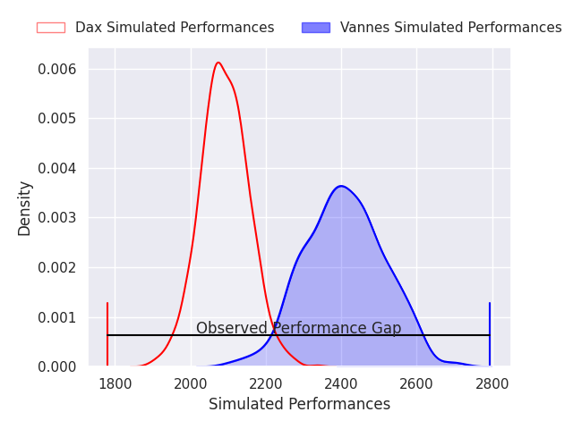
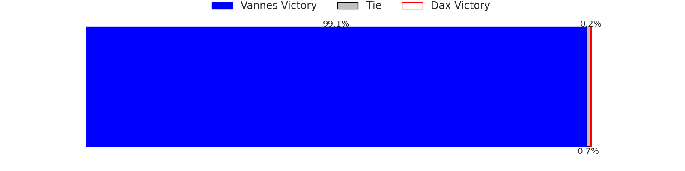
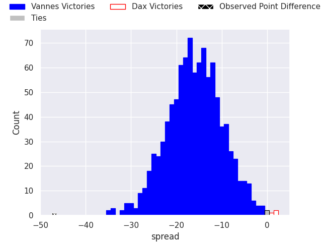

### Grenoble V Colomiers on 2026/05/15

Average Margin: Colomiers by 1.2

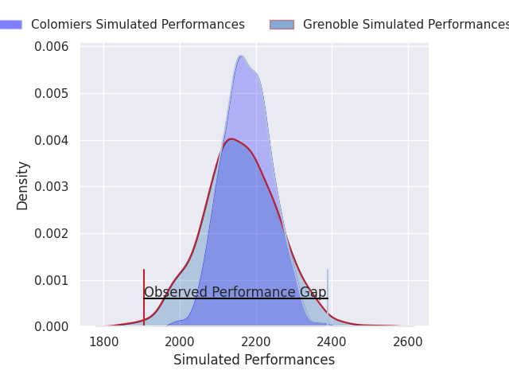

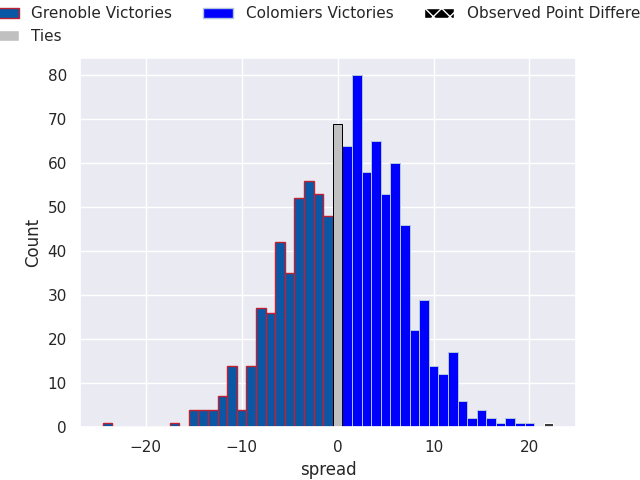

### Biarritz Olympique V Carcassonne on 2026/05/15

Average Margin: Biarritz Olympique by 11.5

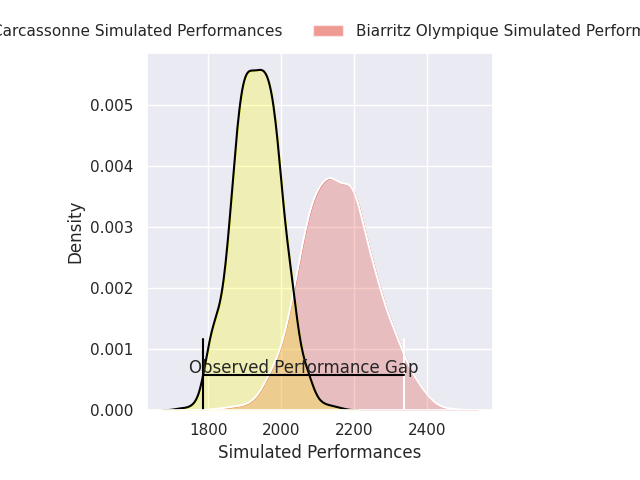
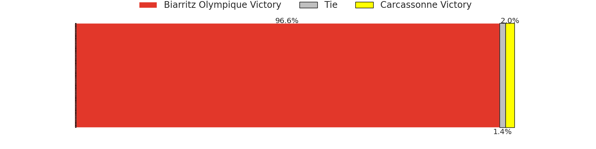
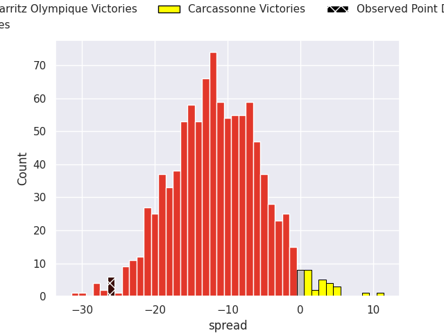

### Oyonnax V Aurillac on 2026/05/15

Average Margin: Oyonnax by 17.2

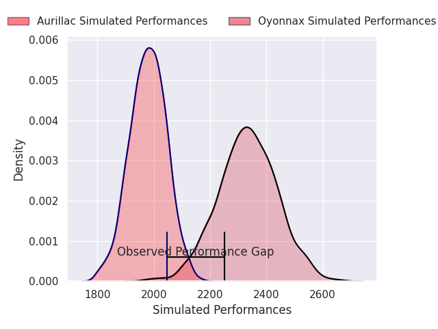
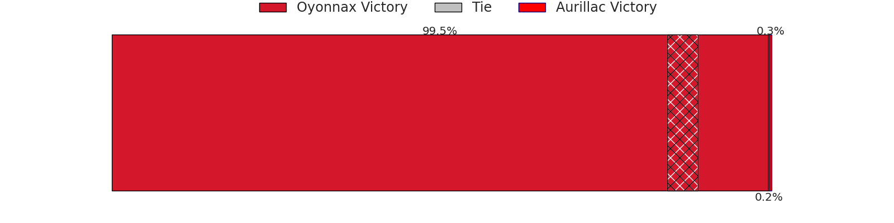
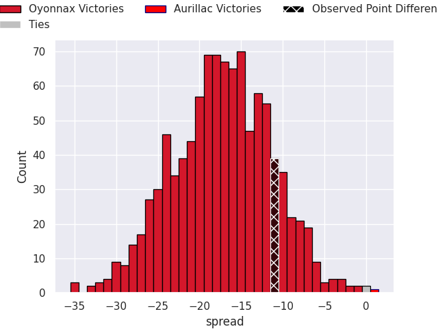

### Mont-de-Marsan V Agen on 2026/05/15

Average Margin: Mont-de-Marsan by 1.7

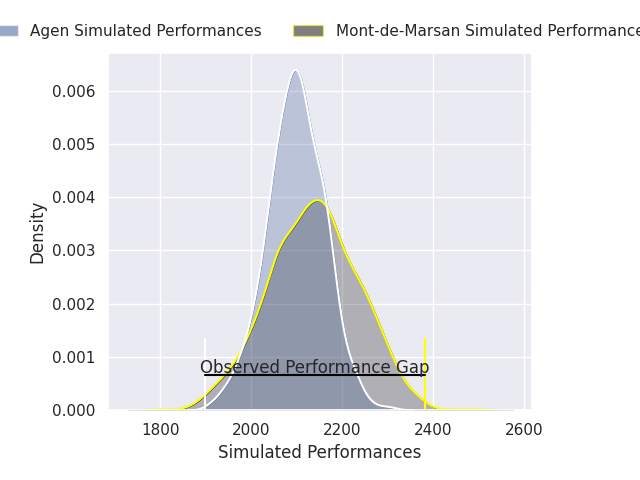

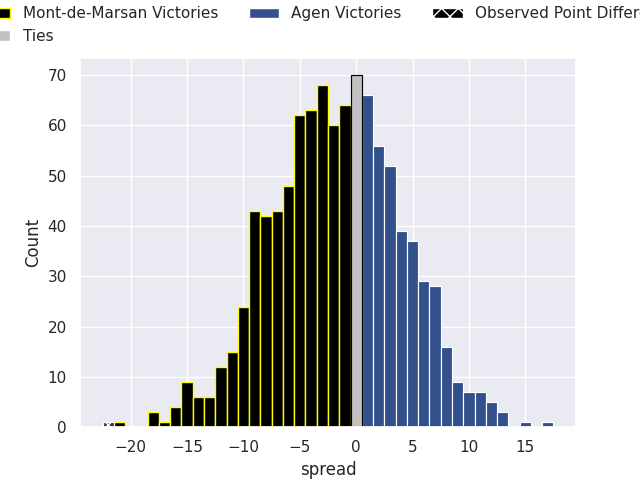

### Brive V USON Nevers on 2026/05/15

Average Margin: Brive by 16.0

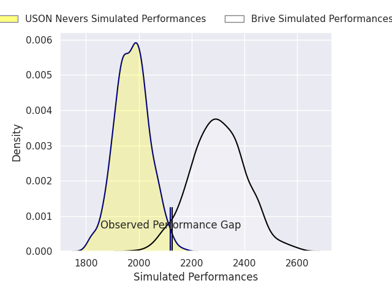
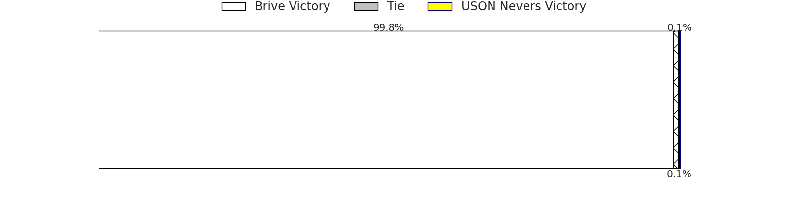
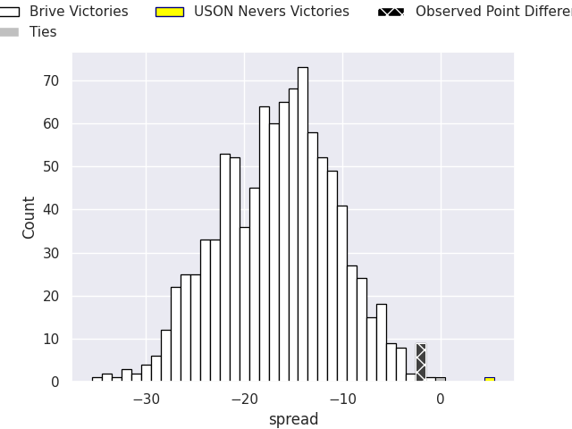

### Valence Romans Drome Rugby V Provence Rugby on 2026/05/15

Average Margin: Valence Romans Drome Rugby by 6.2

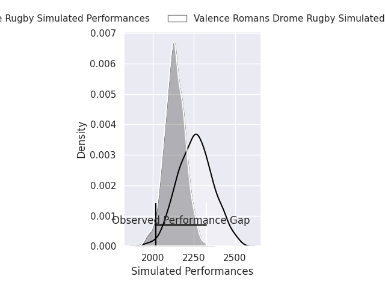
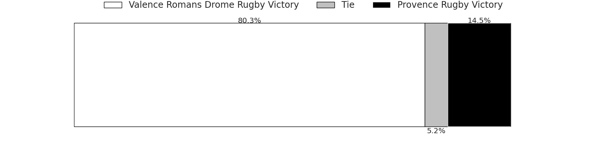
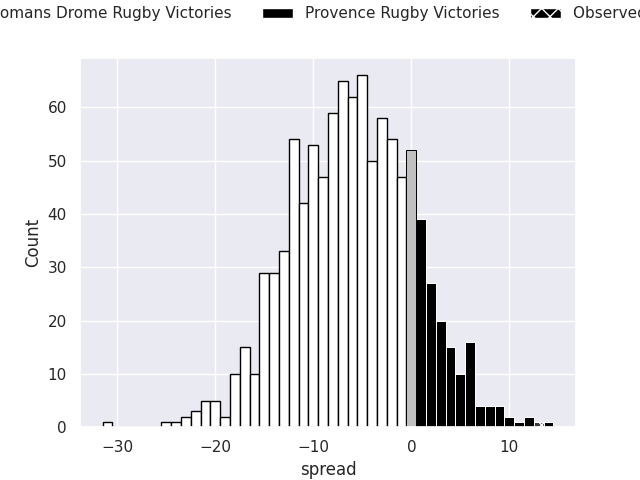

### Soyaux-Angouleme V Beziers on 2026/05/15

Average Margin: Soyaux-Angouleme by 5.4

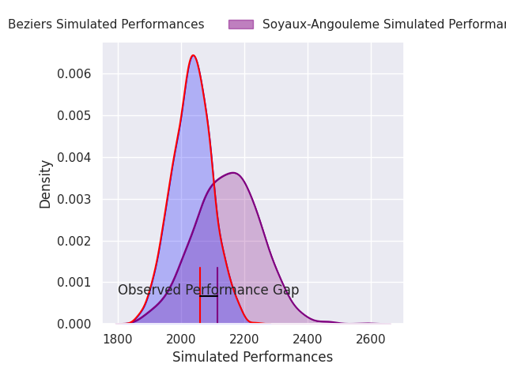
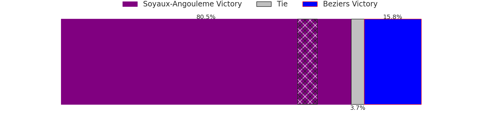
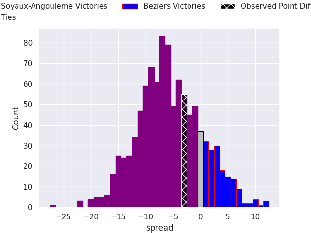

