# Team Rankings

# Standings

## Current Standings

| Club                       |   Played |   Wins |   Point Differential |   Losing Bonus Points |   Try Bonus Points |   Competition Points |
|:---------------------------|---------:|-------:|---------------------:|----------------------:|-------------------:|---------------------:|
| Vannes                     |       29 |     23 |                  502 |                     4 |                 12 |                  110 |
| Provence Rugby             |       29 |     18 |                  166 |                     7 |                  9 |                   88 |
| Colomiers                  |       28 |     19 |                  297 |                     4 |                  7 |                   87 |
| Valence Romans Drome Rugby |       28 |     18 |                   54 |                     4 |                  7 |                   83 |
| Oyonnax                    |       28 |     15 |                  262 |                     9 |                  7 |                   76 |
| Brive                      |       28 |     15 |                  246 |                     3 |                  7 |                   72 |
| Agen                       |       28 |     14 |                   37 |                     4 |                  7 |                   67 |
| Dax                        |       28 |     14 |                   13 |                     7 |                  2 |                   65 |
| Grenoble                   |       28 |     13 |                  -70 |                     6 |                  4 |                   62 |
| USON Nevers                |       28 |     11 |                 -241 |                     4 |                  8 |                   58 |
| Biarritz Olympique         |       28 |     11 |                 -117 |                     4 |                  6 |                   56 |
| Aurillac                   |       28 |     11 |                 -177 |                     6 |                  5 |                   55 |
| Soyaux-Angouleme           |       28 |     12 |                 -166 |                     5 |                  1 |                   54 |
| Beziers                    |       28 |     11 |                 -170 |                     3 |                  5 |                   52 |
| Mont-de-Marsan             |       28 |     10 |                 -265 |                     2 |                  2 |                   46 |
| Carcassonne                |       28 |      7 |                 -371 |                     6 |                  2 |                   38 |

## Projected Remaining Table

| Club                       |   To Play |   Projected Wins |   Projected Differential |   Projected Losing Bonus Points | Projected Try Bonus Points   |   Projected Competition Points |
|:---------------------------|----------:|-----------------:|-------------------------:|--------------------------------:|:-----------------------------|-------------------------------:|
| Brive                      |         2 |            1.801 |                   22.443 |                           0.149 |                              |                          7.439 |
| Oyonnax                    |         2 |            1.677 |                   20.661 |                           0.232 |                              |                          7.042 |
| Colomiers                  |         2 |            1.545 |                   15.825 |                           0.299 |                              |                          6.625 |
| Agen                       |         2 |            1.317 |                    8.798 |                           0.436 |                              |                          5.856 |
| Biarritz Olympique         |         2 |            1.099 |                    5.573 |                           0.473 |                              |                          4.995 |
| Valence Romans Drome Rugby |         2 |            1.011 |                    1.765 |                           0.586 |                              |                          4.84  |
| Beziers                    |         2 |            0.968 |                    0.542 |                           0.555 |                              |                          4.635 |
| Vannes                     |         1 |            0.995 |                   15.369 |                           0.004 |                              |                          3.986 |
| Soyaux-Angouleme           |         2 |            0.822 |                   -5.257 |                           0.384 |                              |                          3.804 |
| Grenoble                   |         2 |            0.557 |                   -5.694 |                           0.869 |                              |                          3.359 |
| Aurillac                   |         2 |            0.756 |                  -12.962 |                           0.204 |                              |                          3.352 |
| Dax                        |         2 |            0.737 |                  -11.154 |                           0.282 |                              |                          3.342 |
| Mont-de-Marsan             |         2 |            0.579 |                  -12.915 |                           0.41  |                              |                          2.87  |
| USON Nevers                |         2 |            0.276 |                  -19.62  |                           0.496 |                              |                          1.706 |
| Carcassonne                |         2 |            0.177 |                  -17.394 |                           0.615 |                              |                          1.439 |
| Provence Rugby             |         1 |            0.151 |                   -5.98  |                           0.389 |                              |                          1.093 |

## Projected Total Table

| Club                       |   Played |   Wins |   Point Differential |   Losing Bonus Points |   Try Bonus Points |   Competition Points |
|:---------------------------|---------:|-------:|---------------------:|----------------------:|-------------------:|---------------------:|
| Vannes                     |       30 | 23.995 |              517.369 |                 4.004 |                 12 |              113.986 |
| Colomiers                  |       30 | 20.545 |              312.825 |                 4.299 |                  7 |               93.625 |
| Provence Rugby             |       30 | 18.151 |              160.02  |                 7.389 |                  9 |               89.093 |
| Valence Romans Drome Rugby |       30 | 19.011 |               55.765 |                 4.586 |                  7 |               87.84  |
| Oyonnax                    |       30 | 16.677 |              282.661 |                 9.232 |                  7 |               83.042 |
| Brive                      |       30 | 16.801 |              268.443 |                 3.149 |                  7 |               79.439 |
| Agen                       |       30 | 15.317 |               45.798 |                 4.436 |                  7 |               72.856 |
| Dax                        |       30 | 14.737 |                1.846 |                 7.282 |                  2 |               68.342 |
| Grenoble                   |       30 | 13.557 |              -75.694 |                 6.869 |                  4 |               65.359 |
| Biarritz Olympique         |       30 | 12.099 |             -111.427 |                 4.473 |                  6 |               60.995 |
| USON Nevers                |       30 | 11.276 |             -260.62  |                 4.496 |                  8 |               59.706 |
| Aurillac                   |       30 | 11.756 |             -189.962 |                 6.204 |                  5 |               58.352 |
| Soyaux-Angouleme           |       30 | 12.822 |             -171.257 |                 5.384 |                  1 |               57.804 |
| Beziers                    |       30 | 11.968 |             -169.458 |                 3.555 |                  5 |               56.635 |
| Mont-de-Marsan             |       30 | 10.579 |             -277.915 |                 2.41  |                  2 |               48.87  |
| Carcassonne                |       30 |  7.177 |             -388.394 |                 6.615 |                  2 |               39.439 |

# Completed Match Review

| Model | Percent Correct Predictions | Spread Error |
| ------ | ------ | ------ |
| Club Level | 75.0% | 12.4 |
| Player Level: Lineup | nan% | nan |
| Player Level: Minutes | nan% | nan |

# Future Predictions

## Week 30

### Dax V Valence Romans Drome Rugby on 2026/05/08

Average Margin: Dax by 4.2

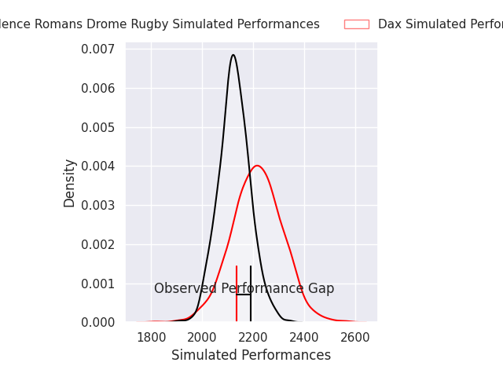
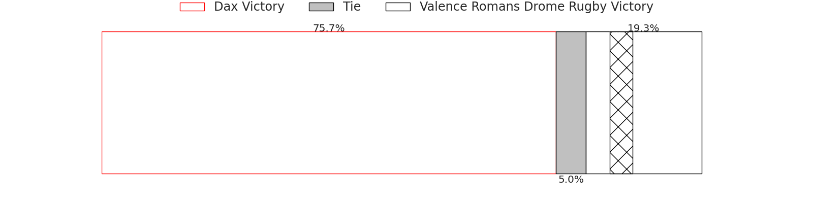
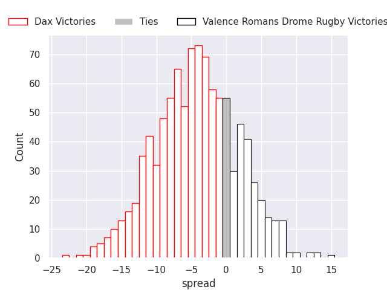

### Beziers V Biarritz Olympique on 2026/05/08

Average Margin: Beziers by 5.8

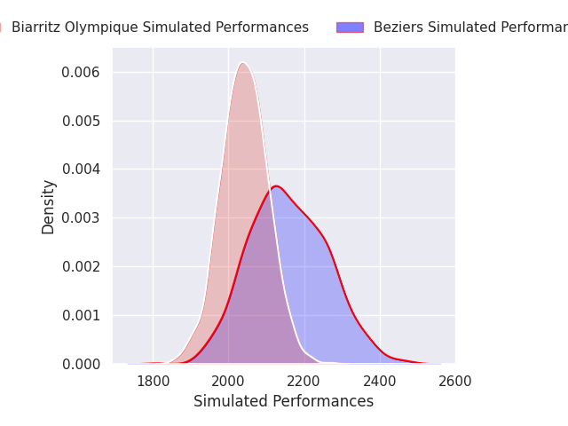

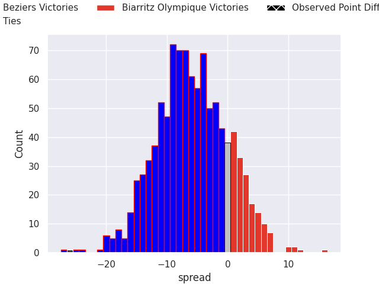

### USON Nevers V Oyonnax on 2026/05/08

Average Margin: Oyonnax by 3.2

### Carcassonne V Brive on 2026/05/08

Average Margin: Brive by 6.0

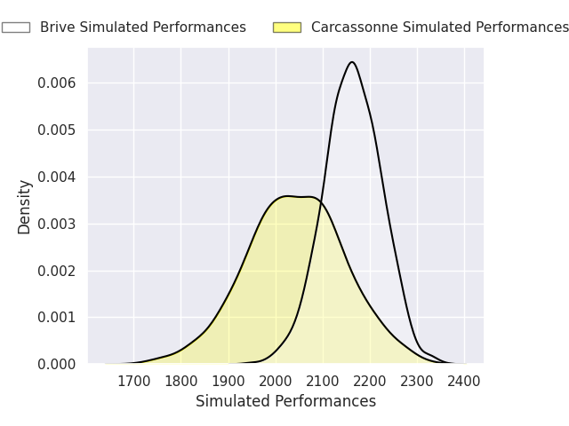
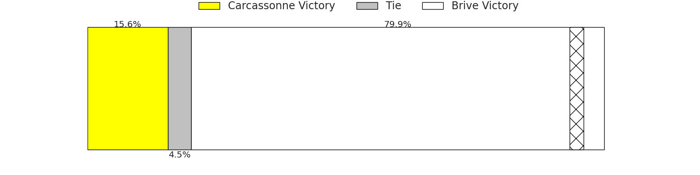
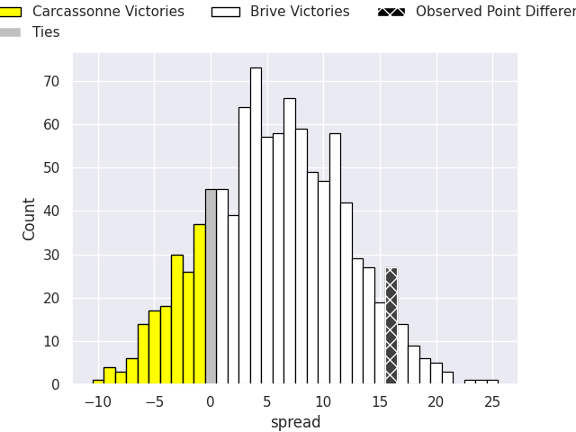

### Aurillac V Grenoble on 2026/05/08

Average Margin: Aurillac by 4.5

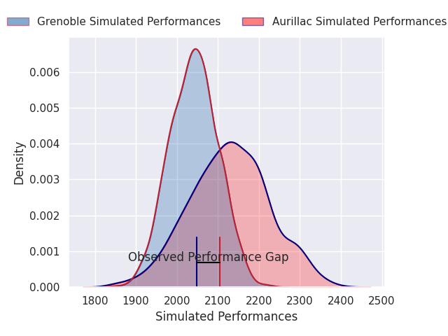
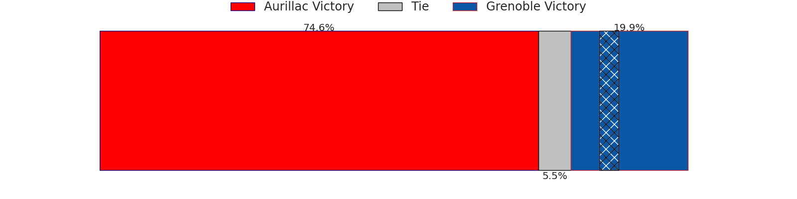
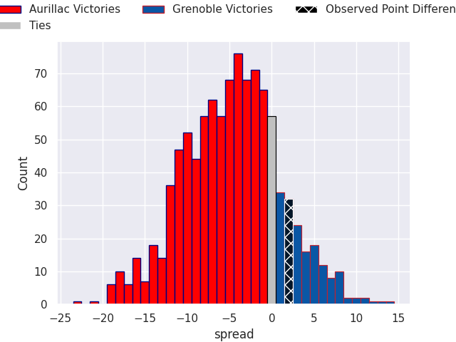

### Colomiers V Mont-de-Marsan on 2026/05/08

Average Margin: Colomiers by 14.6

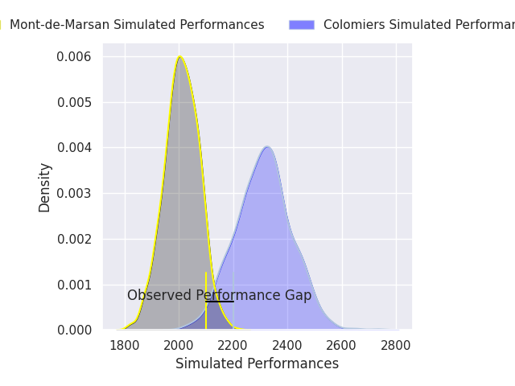
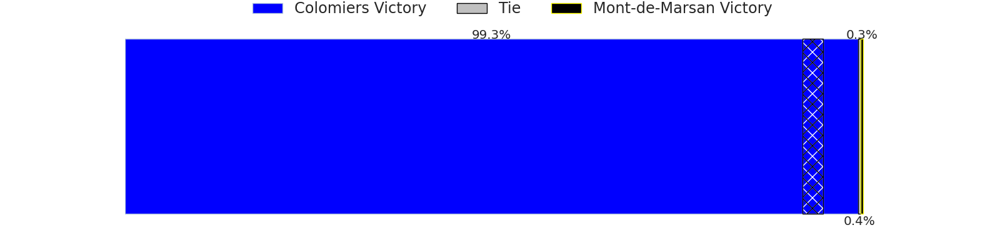
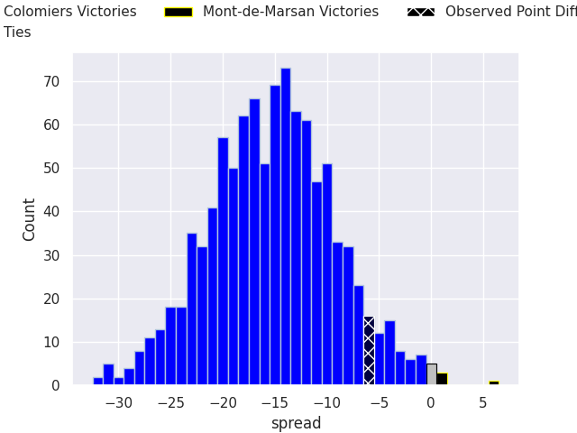

### Agen V Soyaux-Angouleme on 2026/05/08

Average Margin: Agen by 10.5

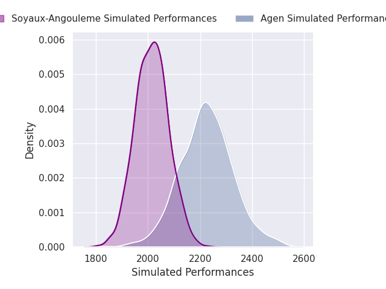

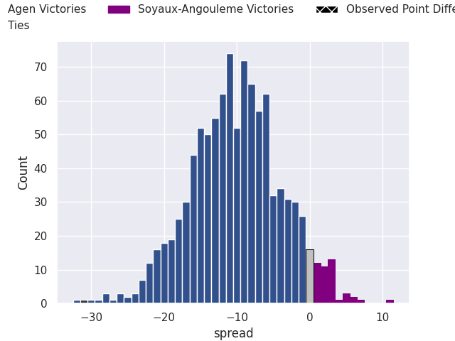

## Week 31

### Mont-de-Marsan V Agen on 2026/05/14

Average Margin: Mont-de-Marsan by 1.7

### Biarritz Olympique V Carcassonne on 2026/05/14

Average Margin: Biarritz Olympique by 11.4

### Brive V USON Nevers on 2026/05/14

Average Margin: Brive by 16.4

### Grenoble V Colomiers on 2026/05/14

Average Margin: Colomiers by 1.2

### Oyonnax V Aurillac on 2026/05/14

Average Margin: Oyonnax by 17.5

### Vannes V Dax on 2026/05/14

Average Margin: Vannes by 15.4

### Soyaux-Angouleme V Beziers on 2026/05/14

Average Margin: Soyaux-Angouleme by 5.3

### Valence Romans Drome Rugby V Provence Rugby on 2026/05/14

Average Margin: Valence Romans Drome Rugby by 6.0

