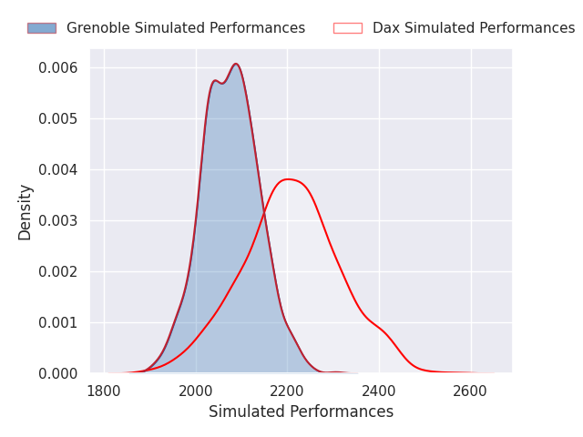
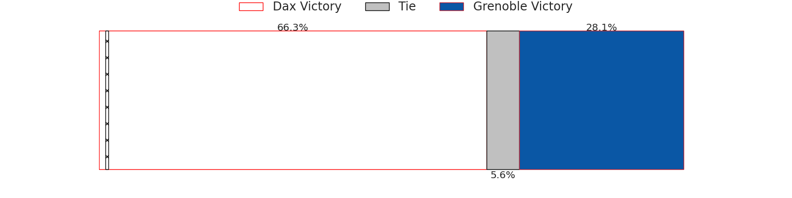
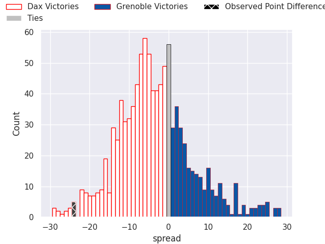

# Team Rankings

# Standings

## Current Standings

| Club                       |   Played |   Wins |   Point Differential |   Losing Bonus Points |   Try Bonus Points |   Competition Points |
|:---------------------------|---------:|-------:|---------------------:|----------------------:|-------------------:|---------------------:|
| Vannes                     |       23 |     19 |                  328 |                     2 |                 12 |                   92 |
| Colomiers                  |       24 |     17 |                  245 |                     3 |                  7 |                   78 |
| Provence Rugby             |       24 |     14 |                  162 |                     7 |                  9 |                   72 |
| Valence Romans Drome Rugby |       23 |     14 |                   17 |                     3 |                  7 |                   66 |
| Oyonnax                    |       23 |     12 |                  210 |                     8 |                  7 |                   63 |
| Brive                      |       23 |     12 |                  142 |                     2 |                  7 |                   59 |
| Agen                       |       23 |     12 |                   74 |                     4 |                  7 |                   59 |
| Aurillac                   |       23 |     11 |                  -44 |                     5 |                  5 |                   54 |
| Grenoble                   |       23 |     11 |                  -43 |                     4 |                  4 |                   52 |
| Dax                        |       23 |     10 |                  -11 |                     7 |                  2 |                   49 |
| Biarritz Olympique         |       23 |      9 |                  -81 |                     3 |                  6 |                   47 |
| USON Nevers                |       23 |      8 |                 -177 |                     4 |                  8 |                   46 |
| Soyaux-Angouleme           |       23 |     10 |                 -153 |                     4 |                  1 |                   45 |
| Beziers                    |       23 |      9 |                 -124 |                     1 |                  5 |                   42 |
| Mont-de-Marsan             |       23 |      8 |                 -252 |                     1 |                  2 |                   37 |
| Carcassonne                |       23 |      6 |                 -293 |                     5 |                  2 |                   33 |

## Projected Remaining Table

| Club                       |   To Play |   Projected Wins |   Projected Differential |   Projected Losing Bonus Points | Projected Try Bonus Points   |   Projected Competition Points |
|:---------------------------|----------:|-----------------:|-------------------------:|--------------------------------:|:-----------------------------|-------------------------------:|
| Vannes                     |         7 |            4.636 |                   42.622 |                           1.153 |                              |                         20.247 |
| Oyonnax                    |         7 |            4.163 |                   21.495 |                           1.34  |                              |                         18.65  |
| Brive                      |         7 |            3.629 |                    9.145 |                           1.555 |                              |                         16.659 |
| Valence Romans Drome Rugby |         7 |            3.477 |                    3.831 |                           1.878 |                              |                         16.556 |
| Dax                        |         7 |            3.558 |                    0.911 |                           1.351 |                              |                         16.131 |
| Colomiers                  |         6 |            3.545 |                   22.366 |                           1.267 |                              |                         15.995 |
| Agen                       |         7 |            3.354 |                    2.718 |                           1.743 |                              |                         15.883 |
| Grenoble                   |         7 |            3.276 |                   -0.571 |                           1.84  |                              |                         15.734 |
| Provence Rugby             |         6 |            3.066 |                    8.41  |                           1.492 |                              |                         14.304 |
| Soyaux-Angouleme           |         7 |            3.002 |                  -10.373 |                           1.572 |                              |                         14.134 |
| Biarritz Olympique         |         7 |            2.921 |                  -10.124 |                           1.664 |                              |                         13.92  |
| Beziers                    |         7 |            2.802 |                  -15.862 |                           1.827 |                              |                         13.713 |
| Aurillac                   |         7 |            2.92  |                  -17.106 |                           1.411 |                              |                         13.673 |
| Carcassonne                |         7 |            2.834 |                  -15.984 |                           1.663 |                              |                         13.631 |
| Mont-de-Marsan             |         7 |            2.778 |                  -16.802 |                           1.697 |                              |                         13.403 |
| USON Nevers                |         7 |            2.558 |                  -24.676 |                           1.601 |                              |                         12.421 |

## Projected Total Table

| Club                       |   Played |   Wins |   Point Differential |   Losing Bonus Points |   Try Bonus Points |   Competition Points |
|:---------------------------|---------:|-------:|---------------------:|----------------------:|-------------------:|---------------------:|
| Vannes                     |       30 | 23.636 |              370.622 |                 3.153 |                 12 |              112.247 |
| Colomiers                  |       30 | 20.545 |              267.366 |                 4.267 |                  7 |               93.995 |
| Provence Rugby             |       30 | 17.066 |              170.41  |                 8.492 |                  9 |               86.304 |
| Valence Romans Drome Rugby |       30 | 17.477 |               20.831 |                 4.878 |                  7 |               82.556 |
| Oyonnax                    |       30 | 16.163 |              231.495 |                 9.34  |                  7 |               81.65  |
| Brive                      |       30 | 15.629 |              151.145 |                 3.555 |                  7 |               75.659 |
| Agen                       |       30 | 15.354 |               76.718 |                 5.743 |                  7 |               74.883 |
| Grenoble                   |       30 | 14.276 |              -43.571 |                 5.84  |                  4 |               67.734 |
| Aurillac                   |       30 | 13.92  |              -61.106 |                 6.411 |                  5 |               67.673 |
| Dax                        |       30 | 13.558 |              -10.089 |                 8.351 |                  2 |               65.131 |
| Biarritz Olympique         |       30 | 11.921 |              -91.124 |                 4.664 |                  6 |               60.92  |
| Soyaux-Angouleme           |       30 | 13.002 |             -163.373 |                 5.572 |                  1 |               59.134 |
| USON Nevers                |       30 | 10.558 |             -201.676 |                 5.601 |                  8 |               58.421 |
| Beziers                    |       30 | 11.802 |             -139.862 |                 2.827 |                  5 |               55.713 |
| Mont-de-Marsan             |       30 | 10.778 |             -268.802 |                 2.697 |                  2 |               50.403 |
| Carcassonne                |       30 |  8.834 |             -308.984 |                 6.663 |                  2 |               46.631 |

# Completed Match Review

| Model | Percent Correct Predictions | Spread Error |
| ------ | ------ | ------ |
| Club Level | 72.5% | 11.6 |
| Player Level: Lineup | nan% | nan |
| Player Level: Minutes | nan% | nan |

# Future Predictions

## Week 25

### Dax V Grenoble on 2026/03/27

Average Margin: Dax by 3.9

### Valence Romans Drome Rugby V Oyonnax on 2026/03/27

Average Margin: Valence Romans Drome Rugby by 2.8

### Beziers V Agen on 2026/03/27

Average Margin: Beziers by 1.4

### Carcassonne V Mont-de-Marsan on 2026/03/27

Average Margin: Carcassonne by 3.0

### Soyaux-Angouleme V Brive on 2026/03/27

Average Margin: Soyaux-Angouleme by 1.4

### Vannes V USON Nevers on 2026/03/27

Average Margin: Vannes by 10.7

### Aurillac V Biarritz Olympique on 2026/03/27

Average Margin: Aurillac by 3.9

## Week 26

### Colomiers V Dax on 2026/04/02

Average Margin: Colomiers by 6.5

### USON Nevers V Beziers on 2026/04/02

Average Margin: USON Nevers by 3.1

### Oyonnax V Biarritz Olympique on 2026/04/02

Average Margin: Oyonnax by 7.6

### Soyaux-Angouleme V Carcassonne on 2026/04/02

Average Margin: Soyaux-Angouleme by 5.2

### Agen V Vannes on 2026/04/02

Average Margin: Vannes by 0.2

### Brive V Provence Rugby on 2026/04/02

Average Margin: Brive by 3.5

### Mont-de-Marsan V Aurillac on 2026/04/02

Average Margin: Mont-de-Marsan by 2.9

### Grenoble V Valence Romans Drome Rugby on 2026/04/02

Average Margin: Grenoble by 1.9

## Week 27

### Carcassonne V Grenoble on 2026/04/09

Average Margin: Carcassonne by 0.6

### Biarritz Olympique V USON Nevers on 2026/04/09

Average Margin: Biarritz Olympique by 4.7

### Valence Romans Drome Rugby V Colomiers on 2026/04/09

Average Margin: Valence Romans Drome Rugby by 1.6

### Aurillac V Agen on 2026/04/09

Average Margin: Aurillac by 1.8

### Oyonnax V Brive on 2026/04/09

Average Margin: Oyonnax by 5.6

### Provence Rugby V Mont-de-Marsan on 2026/04/09

Average Margin: Provence Rugby by 7.0

### Vannes V Beziers on 2026/04/09

Average Margin: Vannes by 10.3

### Dax V Soyaux-Angouleme on 2026/04/09

Average Margin: Dax by 4.9

## Week 28

### USON Nevers V Valence Romans Drome Rugby on 2026/04/16

Average Margin: USON Nevers by 1.2

### Agen V Biarritz Olympique on 2026/04/16

Average Margin: Agen by 5.8

### Mont-de-Marsan V Dax on 2026/04/16

Average Margin: Mont-de-Marsan by 1.8

### Soyaux-Angouleme V Vannes on 2026/04/16

Average Margin: Vannes by 3.2

### Beziers V Provence Rugby on 2026/04/16

Average Margin: Provence Rugby by 0.3

### Colomiers V Carcassonne on 2026/04/16

Average Margin: Colomiers by 10.0

### Brive V Aurillac on 2026/04/16

Average Margin: Brive by 6.7

### Grenoble V Oyonnax on 2026/04/16

Average Margin: Grenoble by 1.0

## Week 29

### Valence Romans Drome Rugby V Brive on 2026/04/23

Average Margin: Valence Romans Drome Rugby by 2.6

### Dax V USON Nevers on 2026/04/23

Average Margin: Dax by 6.3

### Carcassonne V Beziers on 2026/04/23

Average Margin: Carcassonne by 2.2

### Vannes V Aurillac on 2026/04/23

Average Margin: Vannes by 10.0

### Oyonnax V Agen on 2026/04/23

Average Margin: Oyonnax by 5.3

### Grenoble V Mont-de-Marsan on 2026/04/23

Average Margin: Grenoble by 4.4

### Biarritz Olympique V Colomiers on 2026/04/23

Average Margin: Colomiers by 0.1

### Provence Rugby V Soyaux-Angouleme on 2026/04/23

Average Margin: Provence Rugby by 6.7

## Week 30

### USON Nevers V Oyonnax on 2026/05/07

Average Margin: USON Nevers by 0.2

### Carcassonne V Brive on 2026/05/07

Average Margin: Brive by 1.1

### Agen V Soyaux-Angouleme on 2026/05/07

Average Margin: Agen by 6.5

### Dax V Valence Romans Drome Rugby on 2026/05/07

Average Margin: Dax by 2.6

### Provence Rugby V Vannes on 2026/05/07

Average Margin: Provence Rugby by 0.5

### Colomiers V Mont-de-Marsan on 2026/05/07

Average Margin: Colomiers by 7.7

### Beziers V Biarritz Olympique on 2026/05/07

Average Margin: Beziers by 2.9

### Aurillac V Grenoble on 2026/05/07

Average Margin: Aurillac by 3.9

## Week 31

### Mont-de-Marsan V Agen on 2026/05/14

Average Margin: Mont-de-Marsan by 0.7

### Biarritz Olympique V Carcassonne on 2026/05/14

Average Margin: Biarritz Olympique by 5.5

### Brive V USON Nevers on 2026/05/14

Average Margin: Brive by 7.4

### Grenoble V Colomiers on 2026/05/14

Average Margin: Grenoble by 0.4

### Oyonnax V Aurillac on 2026/05/14

Average Margin: Oyonnax by 7.0

### Vannes V Dax on 2026/05/14

Average Margin: Vannes by 8.6

### Soyaux-Angouleme V Beziers on 2026/05/14

Average Margin: Soyaux-Angouleme by 4.3

### Valence Romans Drome Rugby V Provence Rugby on 2026/05/14

Average Margin: Valence Romans Drome Rugby by 2.6

