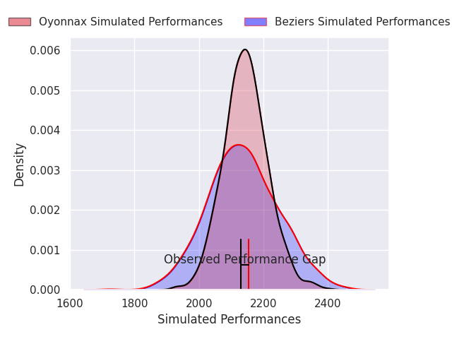
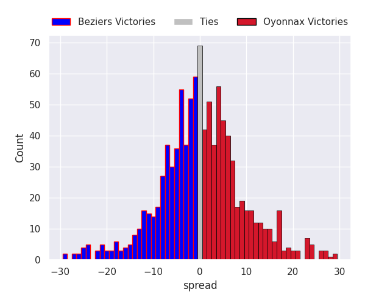

# Team Rankings

# Standings

## Current Standings

| Club                       |   Played |   Wins |   Point Differential |   Losing Bonus Points |   Try Bonus Points |   Competition Points |
|:---------------------------|---------:|-------:|---------------------:|----------------------:|-------------------:|---------------------:|
| Vannes                     |       21 |     17 |                  290 |                     2 |                 12 |                   84 |
| Colomiers                  |       21 |     16 |                  281 |                     3 |                  7 |                   74 |
| Provence Rugby             |       21 |     14 |                  177 |                     5 |                  9 |                   70 |
| Valence Romans Drome Rugby |       22 |     14 |                   27 |                     3 |                  7 |                   66 |
| Oyonnax                    |       21 |     11 |                  175 |                     7 |                  7 |                   58 |
| Brive                      |       21 |     10 |                  105 |                     2 |                  7 |                   51 |
| Agen                       |       21 |     10 |                   35 |                     4 |                  7 |                   51 |
| Dax                        |       21 |     10 |                   49 |                     7 |                  2 |                   49 |
| Aurillac                   |       21 |     10 |                  -48 |                     4 |                  5 |                   49 |
| Grenoble                   |       21 |      9 |                  -48 |                     4 |                  4 |                   44 |
| Soyaux-Angouleme           |       22 |     10 |                 -149 |                     3 |                  1 |                   44 |
| USON Nevers                |       21 |      8 |                 -170 |                     2 |                  8 |                   44 |
| Biarritz Olympique         |       21 |      8 |                  -71 |                     3 |                  6 |                   43 |
| Beziers                    |       21 |      8 |                 -108 |                     1 |                  5 |                   38 |
| Carcassonne                |       21 |      5 |                 -258 |                     5 |                  2 |                   29 |
| Mont-de-Marsan             |       21 |      6 |                 -287 |                     1 |                  2 |                   29 |

## Projected Remaining Table

| Club                       |   To Play |   Projected Wins |   Projected Differential |   Projected Losing Bonus Points | Projected Try Bonus Points   |   Projected Competition Points |
|:---------------------------|----------:|-----------------:|-------------------------:|--------------------------------:|:-----------------------------|-------------------------------:|
| Vannes                     |         9 |            5.635 |                   41.189 |                           1.678 |                              |                         24.978 |
| Oyonnax                    |         9 |            5.418 |                   29.138 |                           1.792 |                              |                         24.256 |
| Provence Rugby             |         9 |            5.074 |                   21.848 |                           1.973 |                              |                         23.123 |
| Colomiers                  |         9 |            5.089 |                   27.237 |                           1.879 |                              |                         23.067 |
| Grenoble                   |         9 |            4.356 |                    3.934 |                           2.343 |                              |                         20.687 |
| Brive                      |         9 |            4.348 |                    0.422 |                           1.997 |                              |                         20.231 |
| Agen                       |         9 |            4.157 |                   -2.521 |                           2.095 |                              |                         19.547 |
| Dax                        |         9 |            4.079 |                   -5.817 |                           1.949 |                              |                         19.049 |
| Aurillac                   |         9 |            4.079 |                  -10.829 |                           1.896 |                              |                         18.984 |
| Valence Romans Drome Rugby |         8 |            3.984 |                    4.719 |                           2.065 |                              |                         18.909 |
| Biarritz Olympique         |         9 |            3.742 |                  -10.693 |                           2.324 |                              |                         18.17  |
| Mont-de-Marsan             |         9 |            3.827 |                  -18.374 |                           2.017 |                              |                         18.157 |
| Carcassonne                |         9 |            3.731 |                  -17.817 |                           2.179 |                              |                         17.959 |
| Beziers                    |         9 |            3.631 |                  -16.158 |                           2.465 |                              |                         17.941 |
| USON Nevers                |         9 |            3.364 |                  -28.143 |                           2.154 |                              |                         16.416 |
| Soyaux-Angouleme           |         8 |            3.165 |                  -18.135 |                           1.864 |                              |                         15.196 |

## Projected Total Table

| Club                       |   Played |   Wins |   Point Differential |   Losing Bonus Points |   Try Bonus Points |   Competition Points |
|:---------------------------|---------:|-------:|---------------------:|----------------------:|-------------------:|---------------------:|
| Vannes                     |       30 | 22.635 |              331.189 |                 3.678 |                 12 |              108.978 |
| Colomiers                  |       30 | 21.089 |              308.237 |                 4.879 |                  7 |               97.067 |
| Provence Rugby             |       30 | 19.074 |              198.848 |                 6.973 |                  9 |               93.123 |
| Valence Romans Drome Rugby |       30 | 17.984 |               31.719 |                 5.065 |                  7 |               84.909 |
| Oyonnax                    |       30 | 16.418 |              204.138 |                 8.792 |                  7 |               82.256 |
| Brive                      |       30 | 14.348 |              105.422 |                 3.997 |                  7 |               71.231 |
| Agen                       |       30 | 14.157 |               32.479 |                 6.095 |                  7 |               70.547 |
| Dax                        |       30 | 14.079 |               43.183 |                 8.949 |                  2 |               68.049 |
| Aurillac                   |       30 | 14.079 |              -58.829 |                 5.896 |                  5 |               67.984 |
| Grenoble                   |       30 | 13.356 |              -44.066 |                 6.343 |                  4 |               64.687 |
| Biarritz Olympique         |       30 | 11.742 |              -81.693 |                 5.324 |                  6 |               61.17  |
| USON Nevers                |       30 | 11.364 |             -198.143 |                 4.154 |                  8 |               60.416 |
| Soyaux-Angouleme           |       30 | 13.165 |             -167.135 |                 4.864 |                  1 |               59.196 |
| Beziers                    |       30 | 11.631 |             -124.158 |                 3.465 |                  5 |               55.941 |
| Mont-de-Marsan             |       30 |  9.827 |             -305.374 |                 3.017 |                  2 |               47.157 |
| Carcassonne                |       30 |  8.731 |             -275.817 |                 7.179 |                  2 |               46.959 |

# Completed Match Review

| Model | Percent Correct Predictions | Spread Error |
| ------ | ------ | ------ |
| Club Level | 75.0% | 11.2 |
| Player Level: Lineup | nan% | nan |
| Player Level: Minutes | nan% | nan |

# Future Predictions

## Week 23

### Vannes V Colomiers on 2026/02/27

Average Margin: Vannes by 4.4

### Brive V Dax on 2026/02/27

Average Margin: Brive by 3.9

### Mont-de-Marsan V Biarritz Olympique on 2026/02/27

Average Margin: Mont-de-Marsan by 2.1

### Beziers V Oyonnax on 2026/02/27

Average Margin: Oyonnax by 0.4

### USON Nevers V Grenoble on 2026/02/27

Average Margin: USON Nevers by 1.3

### Carcassonne V Aurillac on 2026/02/27

Average Margin: Carcassonne by 2.2

### Provence Rugby V Agen on 2026/02/27

Average Margin: Provence Rugby by 6.7

## Week 24

### Agen V Carcassonne on 2026/03/05

Average Margin: Agen by 6.4

### Mont-de-Marsan V Beziers on 2026/03/05

Average Margin: Mont-de-Marsan by 2.5

### Aurillac V USON Nevers on 2026/03/05

Average Margin: Aurillac by 5.9

### Valence Romans Drome Rugby V Vannes on 2026/03/05

Average Margin: Valence Romans Drome Rugby by 0.4

### Grenoble V Soyaux-Angouleme on 2026/03/05

Average Margin: Grenoble by 5.6

### Colomiers V Brive on 2026/03/05

Average Margin: Colomiers by 7.1

### Biarritz Olympique V Provence Rugby on 2026/03/05

Average Margin: Biarritz Olympique by 0.3

### Oyonnax V Dax on 2026/03/05

Average Margin: Oyonnax by 6.1

## Week 25

### Beziers V Agen on 2026/03/26

Average Margin: Beziers by 1.4

### Provence Rugby V Colomiers on 2026/03/26

Average Margin: Provence Rugby by 2.3

### Vannes V USON Nevers on 2026/03/26

Average Margin: Vannes by 9.9

### Soyaux-Angouleme V Brive on 2026/03/26

Average Margin: Soyaux-Angouleme by 1.5

### Aurillac V Biarritz Olympique on 2026/03/26

Average Margin: Aurillac by 3.9

### Carcassonne V Mont-de-Marsan on 2026/03/26

Average Margin: Carcassonne by 2.8

### Dax V Grenoble on 2026/03/26

Average Margin: Dax by 4.5

### Valence Romans Drome Rugby V Oyonnax on 2026/03/26

Average Margin: Valence Romans Drome Rugby by 2.6

## Week 26

### Soyaux-Angouleme V Carcassonne on 2026/04/02

Average Margin: Soyaux-Angouleme by 4.2

### Oyonnax V Biarritz Olympique on 2026/04/02

Average Margin: Oyonnax by 7.2

### Brive V Provence Rugby on 2026/04/02

Average Margin: Brive by 2.9

### Mont-de-Marsan V Aurillac on 2026/04/02

Average Margin: Mont-de-Marsan by 2.4

### Agen V Vannes on 2026/04/02

Average Margin: Vannes by 0.6

### Colomiers V Dax on 2026/04/02

Average Margin: Colomiers by 7.5

### Grenoble V Valence Romans Drome Rugby on 2026/04/02

Average Margin: Grenoble by 2.1

### USON Nevers V Beziers on 2026/04/02

Average Margin: USON Nevers by 3.2

## Week 27

### Valence Romans Drome Rugby V Colomiers on 2026/04/09

Average Margin: Valence Romans Drome Rugby by 0.9

### Oyonnax V Brive on 2026/04/09

Average Margin: Oyonnax by 5.7

### Aurillac V Agen on 2026/04/09

Average Margin: Aurillac by 3.0

### Dax V Soyaux-Angouleme on 2026/04/09

Average Margin: Dax by 5.2

### Vannes V Beziers on 2026/04/09

Average Margin: Vannes by 8.9

### Provence Rugby V Mont-de-Marsan on 2026/04/09

Average Margin: Provence Rugby by 8.7

### Carcassonne V Grenoble on 2026/04/09

Average Margin: Carcassonne by 0.9

### Biarritz Olympique V USON Nevers on 2026/04/09

Average Margin: Biarritz Olympique by 5.4

## Week 28

### USON Nevers V Valence Romans Drome Rugby on 2026/04/16

Average Margin: USON Nevers by 0.6

### Agen V Biarritz Olympique on 2026/04/16

Average Margin: Agen by 4.4

### Mont-de-Marsan V Dax on 2026/04/16

Average Margin: Mont-de-Marsan by 0.7

### Soyaux-Angouleme V Vannes on 2026/04/16

Average Margin: Vannes by 3.0

### Beziers V Provence Rugby on 2026/04/16

Average Margin: Provence Rugby by 0.6

### Colomiers V Carcassonne on 2026/04/16

Average Margin: Colomiers by 9.5

### Brive V Aurillac on 2026/04/16

Average Margin: Brive by 5.9

### Grenoble V Oyonnax on 2026/04/16

Average Margin: Grenoble by 0.9

## Week 29

### Valence Romans Drome Rugby V Brive on 2026/04/23

Average Margin: Valence Romans Drome Rugby by 3.9

### Dax V USON Nevers on 2026/04/23

Average Margin: Dax by 6.2

### Carcassonne V Beziers on 2026/04/23

Average Margin: Carcassonne by 1.6

### Vannes V Aurillac on 2026/04/23

Average Margin: Vannes by 9.4

### Oyonnax V Agen on 2026/04/23

Average Margin: Oyonnax by 6.0

### Grenoble V Mont-de-Marsan on 2026/04/23

Average Margin: Grenoble by 6.0

### Biarritz Olympique V Colomiers on 2026/04/23

Average Margin: Colomiers by 0.9

### Provence Rugby V Soyaux-Angouleme on 2026/04/23

Average Margin: Provence Rugby by 8.1

## Week 30

### USON Nevers V Oyonnax on 2026/05/07

Average Margin: USON Nevers by 0.1

### Carcassonne V Brive on 2026/05/07

Average Margin: Brive by 0.0

### Agen V Soyaux-Angouleme on 2026/05/07

Average Margin: Agen by 5.3

### Dax V Valence Romans Drome Rugby on 2026/05/07

Average Margin: Dax by 3.1

### Provence Rugby V Vannes on 2026/05/07

Average Margin: Provence Rugby by 1.4

### Colomiers V Mont-de-Marsan on 2026/05/07

Average Margin: Colomiers by 9.4

### Beziers V Biarritz Olympique on 2026/05/07

Average Margin: Beziers by 3.0

### Aurillac V Grenoble on 2026/05/07

Average Margin: Aurillac by 3.5

## Week 31

### Mont-de-Marsan V Agen on 2026/05/14

Average Margin: Mont-de-Marsan by 0.9

### Biarritz Olympique V Carcassonne on 2026/05/14

Average Margin: Biarritz Olympique by 5.2

### Brive V USON Nevers on 2026/05/14

Average Margin: Brive by 5.9

### Grenoble V Colomiers on 2026/05/14

Average Margin: Colomiers by 0.5

### Oyonnax V Aurillac on 2026/05/14

Average Margin: Oyonnax by 7.3

### Vannes V Dax on 2026/05/14

Average Margin: Vannes by 6.6

### Soyaux-Angouleme V Beziers on 2026/05/14

Average Margin: Soyaux-Angouleme by 3.4

### Valence Romans Drome Rugby V Provence Rugby on 2026/05/14

Average Margin: Valence Romans Drome Rugby by 2.7

