# Team Rankings

# Standings

## Current Standings

| Club                       |   Played |   Wins |   Point Differential |   Losing Bonus Points |   Try Bonus Points |   Competition Points |
|:---------------------------|---------:|-------:|---------------------:|----------------------:|-------------------:|---------------------:|
| Vannes                     |       19 |     15 |                  257 |                     2 |                 12 |                   76 |
| Colomiers                  |       19 |     14 |                  251 |                     3 |                  7 |                   66 |
| Provence Rugby             |       19 |     13 |                  188 |                     5 |                  9 |                   66 |
| Valence Romans Drome Rugby |       19 |     13 |                   36 |                     2 |                  7 |                   61 |
| Oyonnax                    |       19 |     10 |                  110 |                     6 |                  7 |                   53 |
| Brive                      |       19 |      9 |                  102 |                     1 |                  7 |                   46 |
| Agen                       |       19 |      9 |                   29 |                     3 |                  7 |                   46 |
| Aurillac                   |       19 |      9 |                  -59 |                     3 |                  5 |                   44 |
| USON Nevers                |       19 |      8 |                 -147 |                     2 |                  8 |                   44 |
| Dax                        |       19 |      8 |                   33 |                     7 |                  2 |                   41 |
| Biarritz Olympique         |       19 |      8 |                  -58 |                     1 |                  6 |                   41 |
| Grenoble                   |       19 |      8 |                  -41 |                     4 |                  4 |                   40 |
| Soyaux-Angouleme           |       19 |      8 |                 -148 |                     3 |                  1 |                   36 |
| Beziers                    |       19 |      7 |                  -99 |                     1 |                  5 |                   34 |
| Mont-de-Marsan             |       19 |      6 |                 -211 |                     1 |                  2 |                   29 |
| Carcassonne                |       19 |      4 |                 -243 |                     5 |                  2 |                   25 |

## Projected Remaining Table

| Club                       |   To Play |   Projected Wins |   Projected Differential |   Projected Losing Bonus Points | Projected Try Bonus Points   |   Projected Competition Points |
|:---------------------------|----------:|-----------------:|-------------------------:|--------------------------------:|:-----------------------------|-------------------------------:|
| Vannes                     |        11 |            6.771 |                   47.474 |                           2.061 |                              |                         30.137 |
| Provence Rugby             |        11 |            6.418 |                   31.396 |                           2.374 |                              |                         29.046 |
| Oyonnax                    |        11 |            6.308 |                   28.994 |                           2.202 |                              |                         28.324 |
| Colomiers                  |        11 |            6.237 |                   33.016 |                           2.306 |                              |                         28.168 |
| Valence Romans Drome Rugby |        11 |            5.621 |                   10.42  |                           2.723 |                              |                         26.397 |
| Grenoble                   |        11 |            5.421 |                    5.42  |                           2.776 |                              |                         25.654 |
| Dax                        |        11 |            5.325 |                   -0.692 |                           2.409 |                              |                         24.615 |
| Brive                      |        11 |            5.214 |                   -0.67  |                           2.513 |                              |                         24.401 |
| Agen                       |        11 |            5.02  |                   -4.627 |                           2.641 |                              |                         23.705 |
| Aurillac                   |        11 |            4.93  |                  -12.773 |                           2.441 |                              |                         23.091 |
| Soyaux-Angouleme           |        11 |            4.693 |                  -15.819 |                           2.566 |                              |                         22.35  |
| Biarritz Olympique         |        11 |            4.489 |                  -16.551 |                           2.867 |                              |                         21.821 |
| Mont-de-Marsan             |        11 |            4.525 |                  -24.42  |                           2.501 |                              |                         21.631 |
| Beziers                    |        11 |            4.439 |                  -22.974 |                           2.777 |                              |                         21.623 |
| Carcassonne                |        11 |            4.472 |                  -27.157 |                           2.563 |                              |                         21.441 |
| USON Nevers                |        11 |            4.068 |                  -31.037 |                           2.778 |                              |                         20.094 |

## Projected Total Table

| Club                       |   Played |   Wins |   Point Differential |   Losing Bonus Points |   Try Bonus Points |   Competition Points |
|:---------------------------|---------:|-------:|---------------------:|----------------------:|-------------------:|---------------------:|
| Vannes                     |       30 | 21.771 |              304.474 |                 4.061 |                 12 |              106.137 |
| Provence Rugby             |       30 | 19.418 |              219.396 |                 7.374 |                  9 |               95.046 |
| Colomiers                  |       30 | 20.237 |              284.016 |                 5.306 |                  7 |               94.168 |
| Valence Romans Drome Rugby |       30 | 18.621 |               46.42  |                 4.723 |                  7 |               87.397 |
| Oyonnax                    |       30 | 16.308 |              138.994 |                 8.202 |                  7 |               81.324 |
| Brive                      |       30 | 14.214 |              101.33  |                 3.513 |                  7 |               70.401 |
| Agen                       |       30 | 14.02  |               24.373 |                 5.641 |                  7 |               69.705 |
| Aurillac                   |       30 | 13.93  |              -71.773 |                 5.441 |                  5 |               67.091 |
| Grenoble                   |       30 | 13.421 |              -35.58  |                 6.776 |                  4 |               65.654 |
| Dax                        |       30 | 13.325 |               32.308 |                 9.409 |                  2 |               65.615 |
| USON Nevers                |       30 | 12.068 |             -178.037 |                 4.778 |                  8 |               64.094 |
| Biarritz Olympique         |       30 | 12.489 |              -74.551 |                 3.867 |                  6 |               62.821 |
| Soyaux-Angouleme           |       30 | 12.693 |             -163.819 |                 5.566 |                  1 |               58.35  |
| Beziers                    |       30 | 11.439 |             -121.974 |                 3.777 |                  5 |               55.623 |
| Mont-de-Marsan             |       30 | 10.525 |             -235.42  |                 3.501 |                  2 |               50.631 |
| Carcassonne                |       30 |  8.472 |             -270.157 |                 7.563 |                  2 |               46.441 |

# Completed Match Review

| Model | Percent Correct Predictions | Spread Error |
| ------ | ------ | ------ |
| Club Level | 70.8% | 11.3 |
| Player Level: Lineup | nan% | nan |
| Player Level: Minutes | nan% | nan |

# Future Predictions

## Week 20

### USON Nevers V Colomiers on 2026/02/12

Average Margin: Colomiers by 1.6

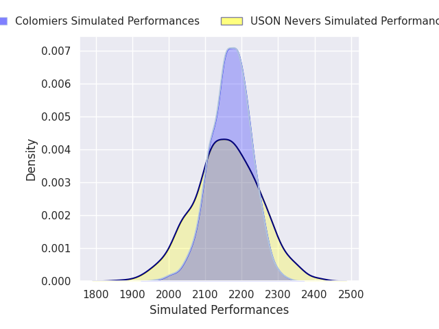
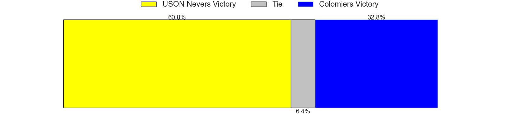
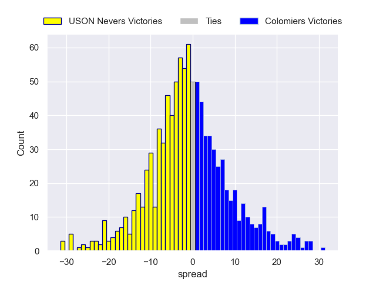

### Beziers V Grenoble on 2026/02/13

Average Margin: Beziers by 1.8

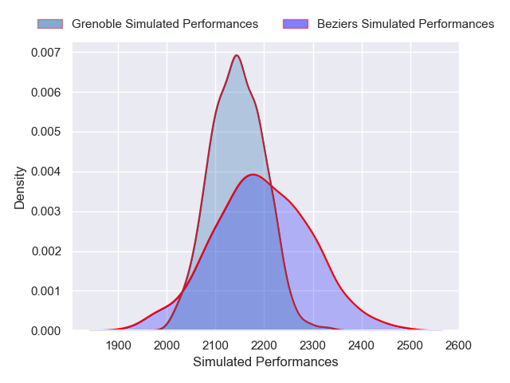

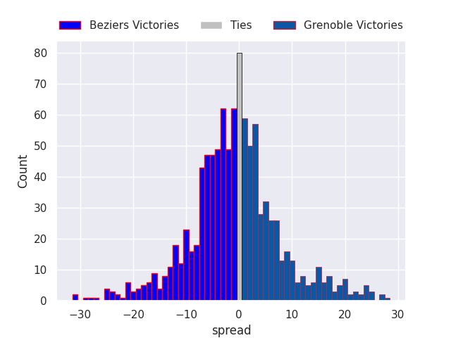

### Dax V Aurillac on 2026/02/13

Average Margin: Dax by 5.3

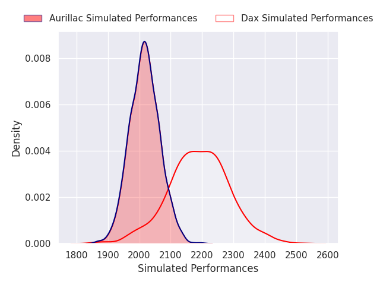
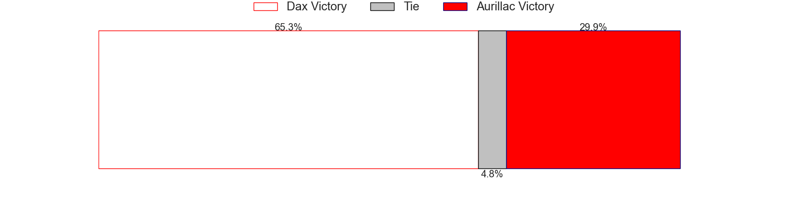
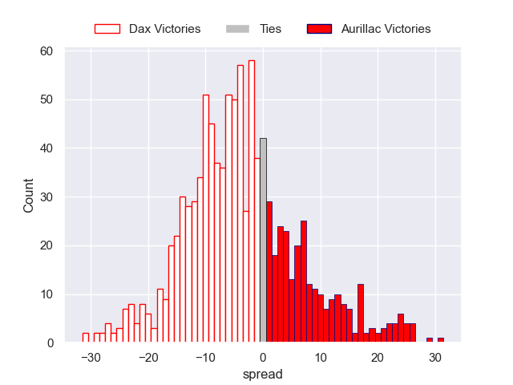

### Brive V Agen on 2026/02/13

Average Margin: Brive by 4.3

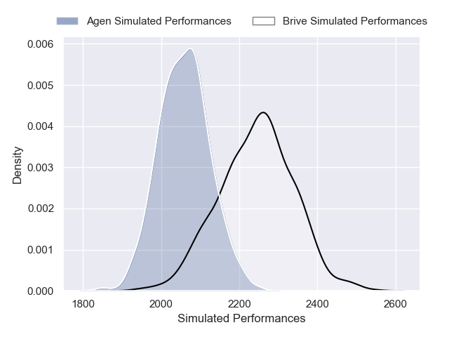
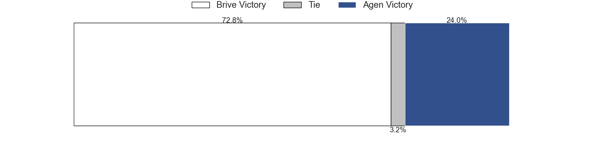
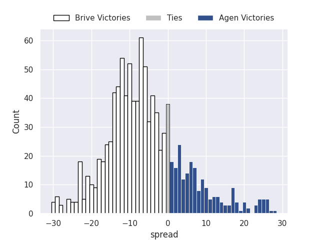

### Soyaux-Angouleme V Mont-de-Marsan on 2026/02/13

Average Margin: Soyaux-Angouleme by 4.1

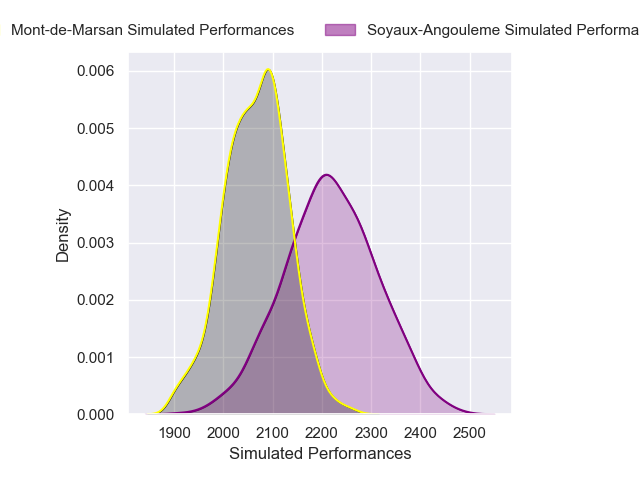

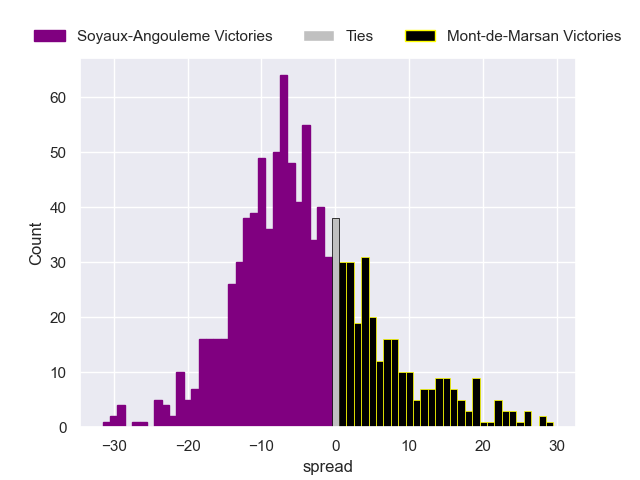

### Vannes V Carcassonne on 2026/02/13

Average Margin: Vannes by 10.3

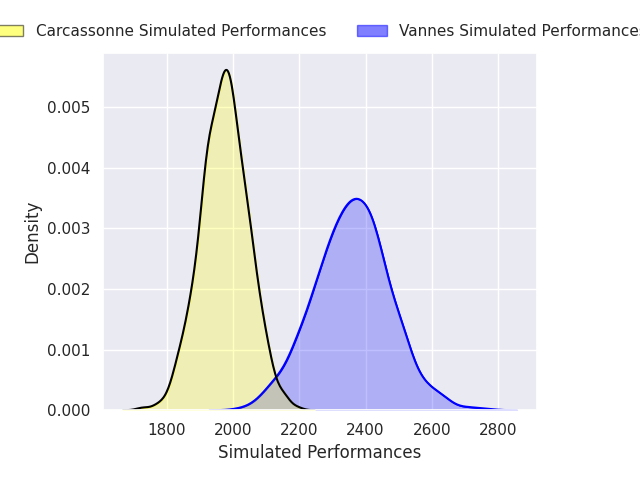

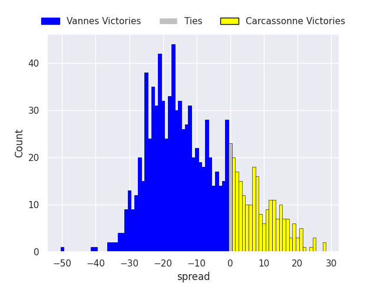

### Valence Romans Drome Rugby V Biarritz Olympique on 2026/02/13

Average Margin: Valence Romans Drome Rugby by 6.3

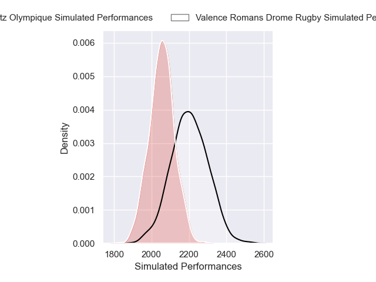
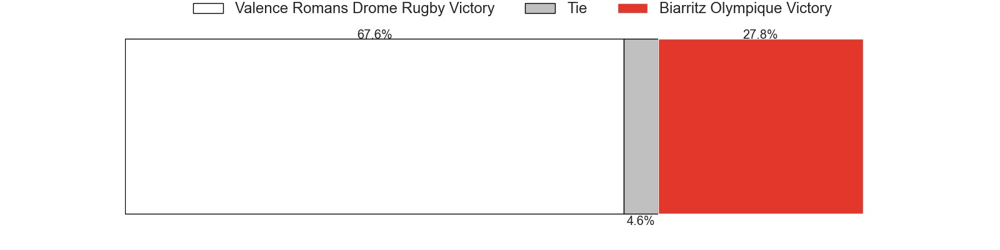
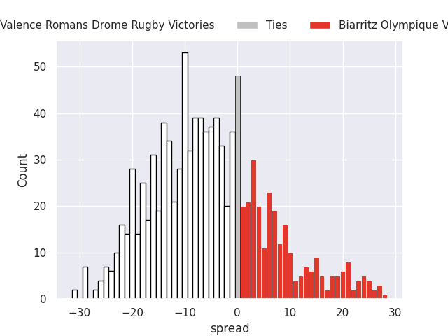

### Provence Rugby V Oyonnax on 2026/02/13

Average Margin: Provence Rugby by 5.2

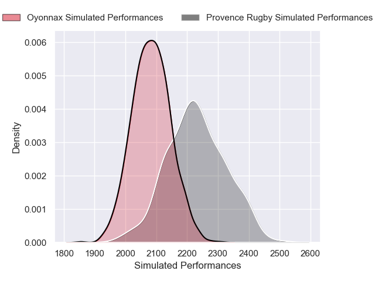
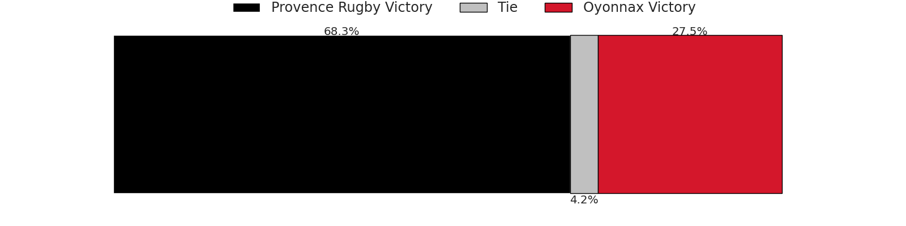
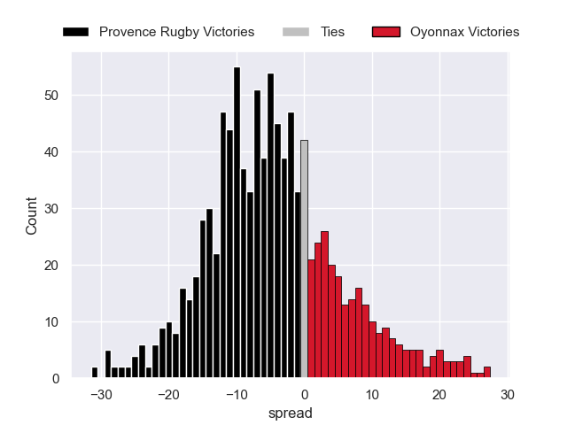

## Week 21

### Grenoble V Brive on 2026/02/19

Average Margin: Grenoble by 2.6

### Aurillac V Soyaux-Angouleme on 2026/02/20

Average Margin: Aurillac by 4.2

### Oyonnax V Mont-de-Marsan on 2026/02/20

Average Margin: Oyonnax by 8.0

### Dax V Provence Rugby on 2026/02/20

Average Margin: Provence Rugby by 0.1

### Carcassonne V USON Nevers on 2026/02/20

Average Margin: Carcassonne by 2.6

### Biarritz Olympique V Vannes on 2026/02/20

Average Margin: Vannes by 1.8

### Agen V Valence Romans Drome Rugby on 2026/02/20

Average Margin: Agen by 2.6

### Colomiers V Beziers on 2026/02/20

Average Margin: Colomiers by 8.9

## Week 22

### Mont-de-Marsan V Biarritz Olympique on 2026/02/26

Average Margin: Mont-de-Marsan by 2.1

### Carcassonne V Aurillac on 2026/02/26

Average Margin: Carcassonne by 2.1

### USON Nevers V Grenoble on 2026/02/26

Average Margin: USON Nevers by 1.1

### Soyaux-Angouleme V Valence Romans Drome Rugby on 2026/02/26

Average Margin: Soyaux-Angouleme by 0.3

### Provence Rugby V Agen on 2026/02/26

Average Margin: Provence Rugby by 7.0

### Brive V Dax on 2026/02/26

Average Margin: Brive by 4.0

### Beziers V Oyonnax on 2026/02/26

Average Margin: Oyonnax by 0.2

### Vannes V Colomiers on 2026/02/26

Average Margin: Vannes by 4.8

## Week 23

### Agen V Carcassonne on 2026/03/05

Average Margin: Agen by 6.7

### Mont-de-Marsan V Beziers on 2026/03/05

Average Margin: Mont-de-Marsan by 3.1

### Aurillac V USON Nevers on 2026/03/05

Average Margin: Aurillac by 5.7

### Valence Romans Drome Rugby V Vannes on 2026/03/05

Average Margin: Valence Romans Drome Rugby by 1.6

### Grenoble V Soyaux-Angouleme on 2026/03/05

Average Margin: Grenoble by 5.2

### Colomiers V Brive on 2026/03/05

Average Margin: Colomiers by 7.3

### Biarritz Olympique V Provence Rugby on 2026/03/05

Average Margin: Provence Rugby by 0.2

### Oyonnax V Dax on 2026/03/05

Average Margin: Oyonnax by 6.1

## Week 24

### Beziers V Agen on 2026/03/26

Average Margin: Beziers by 1.2

### Provence Rugby V Colomiers on 2026/03/26

Average Margin: Provence Rugby by 3.0

### Vannes V USON Nevers on 2026/03/26

Average Margin: Vannes by 9.2

### Soyaux-Angouleme V Brive on 2026/03/26

Average Margin: Soyaux-Angouleme by 1.8

### Aurillac V Biarritz Olympique on 2026/03/26

Average Margin: Aurillac by 3.1

### Carcassonne V Mont-de-Marsan on 2026/03/26

Average Margin: Carcassonne by 2.5

### Dax V Grenoble on 2026/03/26

Average Margin: Dax by 4.2

### Valence Romans Drome Rugby V Oyonnax on 2026/03/26

Average Margin: Valence Romans Drome Rugby by 3.3

## Week 25

### Oyonnax V Biarritz Olympique on 2026/04/02

Average Margin: Oyonnax by 6.9

### USON Nevers V Beziers on 2026/04/02

Average Margin: USON Nevers by 3.4

### Grenoble V Valence Romans Drome Rugby on 2026/04/02

Average Margin: Grenoble by 2.3

### Agen V Vannes on 2026/04/02

Average Margin: Vannes by 0.3

### Mont-de-Marsan V Aurillac on 2026/04/02

Average Margin: Mont-de-Marsan by 3.3

### Brive V Provence Rugby on 2026/04/02

Average Margin: Brive by 1.7

### Soyaux-Angouleme V Carcassonne on 2026/04/02

Average Margin: Soyaux-Angouleme by 4.8

### Colomiers V Dax on 2026/04/02

Average Margin: Colomiers by 6.2

## Week 26

### Carcassonne V Grenoble on 2026/04/09

Average Margin: Carcassonne by 0.6

### Biarritz Olympique V USON Nevers on 2026/04/09

Average Margin: Biarritz Olympique by 5.6

### Dax V Soyaux-Angouleme on 2026/04/09

Average Margin: Dax by 5.2

### Vannes V Beziers on 2026/04/09

Average Margin: Vannes by 8.1

### Aurillac V Agen on 2026/04/09

Average Margin: Aurillac by 2.6

### Provence Rugby V Mont-de-Marsan on 2026/04/09

Average Margin: Provence Rugby by 8.1

### Oyonnax V Brive on 2026/04/09

Average Margin: Oyonnax by 5.5

### Valence Romans Drome Rugby V Colomiers on 2026/04/09

Average Margin: Valence Romans Drome Rugby by 1.0

## Week 27

### USON Nevers V Valence Romans Drome Rugby on 2026/04/16

Average Margin: USON Nevers by 0.8

### Agen V Biarritz Olympique on 2026/04/16

Average Margin: Agen by 3.9

### Mont-de-Marsan V Dax on 2026/04/16

Average Margin: Mont-de-Marsan by 1.4

### Soyaux-Angouleme V Vannes on 2026/04/16

Average Margin: Vannes by 1.7

### Beziers V Provence Rugby on 2026/04/16

Average Margin: Provence Rugby by 0.8

### Colomiers V Carcassonne on 2026/04/16

Average Margin: Colomiers by 9.2

### Brive V Aurillac on 2026/04/16

Average Margin: Brive by 5.5

### Grenoble V Oyonnax on 2026/04/16

Average Margin: Grenoble by 1.3

## Week 28

### Valence Romans Drome Rugby V Brive on 2026/04/23

Average Margin: Valence Romans Drome Rugby by 4.6

### Dax V USON Nevers on 2026/04/23

Average Margin: Dax by 6.3

### Carcassonne V Beziers on 2026/04/23

Average Margin: Carcassonne by 1.4

### Vannes V Aurillac on 2026/04/23

Average Margin: Vannes by 8.6

### Oyonnax V Agen on 2026/04/23

Average Margin: Oyonnax by 5.9

### Grenoble V Mont-de-Marsan on 2026/04/23

Average Margin: Grenoble by 5.4

### Biarritz Olympique V Colomiers on 2026/04/23

Average Margin: Colomiers by 0.4

### Provence Rugby V Soyaux-Angouleme on 2026/04/23

Average Margin: Provence Rugby by 8.6

## Week 29

### USON Nevers V Oyonnax on 2026/05/07

Average Margin: USON Nevers by 0.7

### Carcassonne V Brive on 2026/05/07

Average Margin: Carcassonne by 0.3

### Agen V Soyaux-Angouleme on 2026/05/07

Average Margin: Agen by 5.1

### Dax V Valence Romans Drome Rugby on 2026/05/07

Average Margin: Dax by 2.6

### Provence Rugby V Vannes on 2026/05/07

Average Margin: Provence Rugby by 2.2

### Colomiers V Mont-de-Marsan on 2026/05/07

Average Margin: Colomiers by 8.0

### Beziers V Biarritz Olympique on 2026/05/07

Average Margin: Beziers by 3.2

### Aurillac V Grenoble on 2026/05/07

Average Margin: Aurillac by 3.5

## Week 30

### Mont-de-Marsan V Agen on 2026/05/14

Average Margin: Mont-de-Marsan by 1.8

### Biarritz Olympique V Carcassonne on 2026/05/14

Average Margin: Biarritz Olympique by 5.8

### Brive V USON Nevers on 2026/05/14

Average Margin: Brive by 6.2

### Grenoble V Colomiers on 2026/05/14

Average Margin: Colomiers by 0.2

### Oyonnax V Aurillac on 2026/05/14

Average Margin: Oyonnax by 7.0

### Vannes V Dax on 2026/05/14

Average Margin: Vannes by 6.5

### Soyaux-Angouleme V Beziers on 2026/05/14

Average Margin: Soyaux-Angouleme by 3.3

### Valence Romans Drome Rugby V Provence Rugby on 2026/05/14

Average Margin: Valence Romans Drome Rugby by 2.2

