# Team Rankings

# Standings

## Current Standings

| Club                       |   Played |   Wins |   Point Differential |   Losing Bonus Points |   Try Bonus Points |   Competition Points |
|:---------------------------|---------:|-------:|---------------------:|----------------------:|-------------------:|---------------------:|
| Vannes                     |       21 |     17 |                  290 |                     2 |                 12 |                   84 |
| Colomiers                  |       21 |     16 |                  281 |                     3 |                  7 |                   74 |
| Provence Rugby             |       21 |     14 |                  177 |                     5 |                  9 |                   70 |
| Valence Romans Drome Rugby |       21 |     14 |                   31 |                     2 |                  7 |                   65 |
| Oyonnax                    |       21 |     11 |                  175 |                     7 |                  7 |                   58 |
| Brive                      |       21 |     10 |                  105 |                     2 |                  7 |                   51 |
| Agen                       |       21 |     10 |                   35 |                     4 |                  7 |                   51 |
| Dax                        |       21 |     10 |                   49 |                     7 |                  2 |                   49 |
| Aurillac                   |       21 |     10 |                  -48 |                     4 |                  5 |                   49 |
| Grenoble                   |       21 |      9 |                  -48 |                     4 |                  4 |                   44 |
| USON Nevers                |       21 |      8 |                 -170 |                     2 |                  8 |                   44 |
| Biarritz Olympique         |       21 |      8 |                  -71 |                     3 |                  6 |                   43 |
| Soyaux-Angouleme           |       21 |      9 |                 -153 |                     3 |                  1 |                   40 |
| Beziers                    |       21 |      8 |                 -108 |                     1 |                  5 |                   38 |
| Carcassonne                |       21 |      5 |                 -258 |                     5 |                  2 |                   29 |
| Mont-de-Marsan             |       21 |      6 |                 -287 |                     1 |                  2 |                   29 |

## Projected Remaining Table

| Club                       |   To Play |   Projected Wins |   Projected Differential |   Projected Losing Bonus Points | Projected Try Bonus Points   |   Projected Competition Points |
|:---------------------------|----------:|-----------------:|-------------------------:|--------------------------------:|:-----------------------------|-------------------------------:|
| Vannes                     |         9 |            5.722 |                   43.478 |                           1.664 |                              |                         25.332 |
| Oyonnax                    |         9 |            5.464 |                   29.881 |                           1.76  |                              |                         24.35  |
| Provence Rugby             |         9 |            5.058 |                   22.267 |                           2.072 |                              |                         23.142 |
| Colomiers                  |         9 |            4.951 |                   24.876 |                           1.95  |                              |                         22.562 |
| Valence Romans Drome Rugby |         9 |            4.423 |                    4.069 |                           2.428 |                              |                         21.08  |
| Grenoble                   |         9 |            4.358 |                    3.042 |                           2.305 |                              |                         20.635 |
| Brive                      |         9 |            4.327 |                   -0.588 |                           1.984 |                              |                         20.12  |
| Agen                       |         9 |            4.143 |                   -0.817 |                           2.236 |                              |                         19.678 |
| Dax                        |         9 |            4.248 |                   -4.246 |                           1.867 |                              |                         19.601 |
| Aurillac                   |         9 |            4.026 |                  -12.27  |                           1.881 |                              |                         18.721 |
| Biarritz Olympique         |         9 |            3.892 |                   -8.482 |                           2.29  |                              |                         18.684 |
| Mont-de-Marsan             |         9 |            3.747 |                  -18.568 |                           2.142 |                              |                         18.024 |
| Beziers                    |         9 |            3.615 |                  -16.223 |                           2.523 |                              |                         17.869 |
| Carcassonne                |         9 |            3.7   |                  -19.106 |                           2.147 |                              |                         17.847 |
| Soyaux-Angouleme           |         9 |            3.67  |                  -17.207 |                           2.119 |                              |                         17.663 |
| USON Nevers                |         9 |            3.332 |                  -30.106 |                           2.045 |                              |                         16.105 |

## Projected Total Table

| Club                       |   Played |   Wins |   Point Differential |   Losing Bonus Points |   Try Bonus Points |   Competition Points |
|:---------------------------|---------:|-------:|---------------------:|----------------------:|-------------------:|---------------------:|
| Vannes                     |       30 | 22.722 |              333.478 |                 3.664 |                 12 |              109.332 |
| Colomiers                  |       30 | 20.951 |              305.876 |                 4.95  |                  7 |               96.562 |
| Provence Rugby             |       30 | 19.058 |              199.267 |                 7.072 |                  9 |               93.142 |
| Valence Romans Drome Rugby |       30 | 18.423 |               35.069 |                 4.428 |                  7 |               86.08  |
| Oyonnax                    |       30 | 16.464 |              204.881 |                 8.76  |                  7 |               82.35  |
| Brive                      |       30 | 14.327 |              104.412 |                 3.984 |                  7 |               71.12  |
| Agen                       |       30 | 14.143 |               34.183 |                 6.236 |                  7 |               70.678 |
| Dax                        |       30 | 14.248 |               44.754 |                 8.867 |                  2 |               68.601 |
| Aurillac                   |       30 | 14.026 |              -60.27  |                 5.881 |                  5 |               67.721 |
| Grenoble                   |       30 | 13.358 |              -44.958 |                 6.305 |                  4 |               64.635 |
| Biarritz Olympique         |       30 | 11.892 |              -79.482 |                 5.29  |                  6 |               61.684 |
| USON Nevers                |       30 | 11.332 |             -200.106 |                 4.045 |                  8 |               60.105 |
| Soyaux-Angouleme           |       30 | 12.67  |             -170.207 |                 5.119 |                  1 |               57.663 |
| Beziers                    |       30 | 11.615 |             -124.223 |                 3.523 |                  5 |               55.869 |
| Mont-de-Marsan             |       30 |  9.747 |             -305.568 |                 3.142 |                  2 |               47.024 |
| Carcassonne                |       30 |  8.7   |             -277.106 |                 7.147 |                  2 |               46.847 |

# Completed Match Review

| Model | Percent Correct Predictions | Spread Error |
| ------ | ------ | ------ |
| Club Level | 73.3% | 11.7 |
| Player Level: Lineup | nan% | nan |
| Player Level: Minutes | nan% | nan |

# Future Predictions

## Week 22

### Mont-de-Marsan V Biarritz Olympique on 2026/02/26

Average Margin: Mont-de-Marsan by 1.7

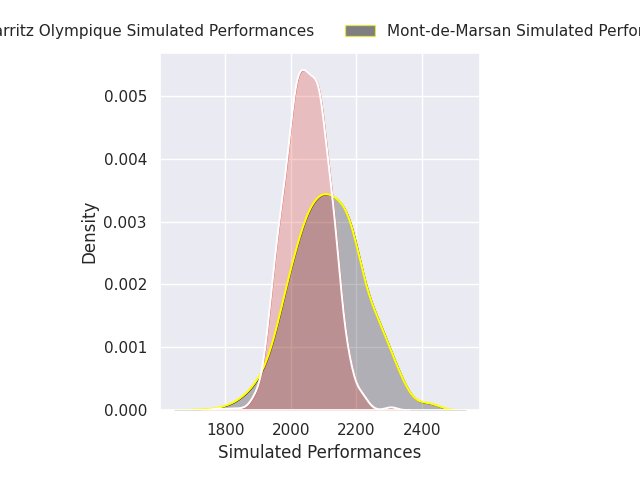

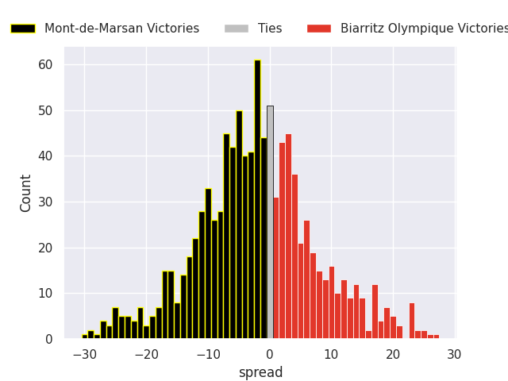

### USON Nevers V Grenoble on 2026/02/26

Average Margin: USON Nevers by 1.5

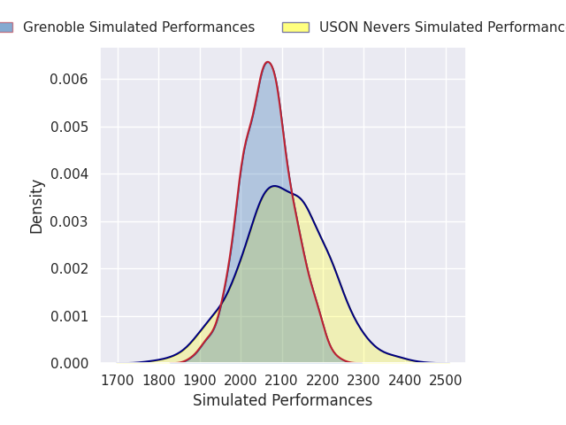

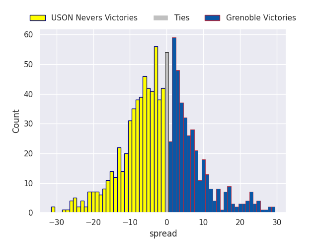

### Carcassonne V Aurillac on 2026/02/26

Average Margin: Carcassonne by 1.8

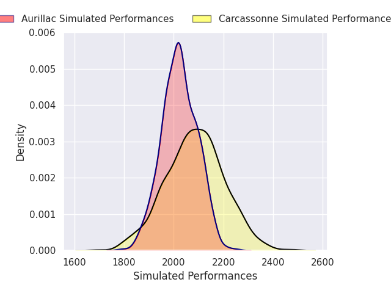

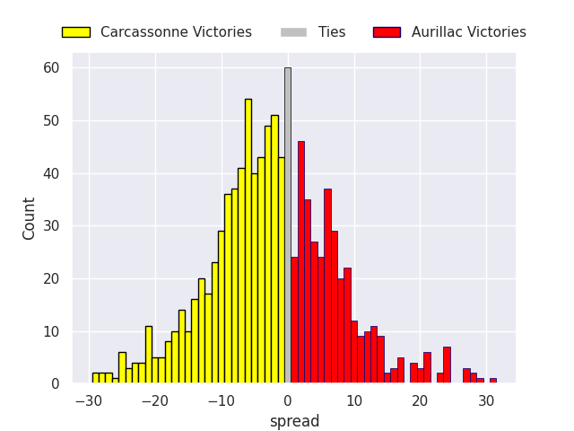

### Vannes V Colomiers on 2026/02/26

Average Margin: Vannes by 4.2

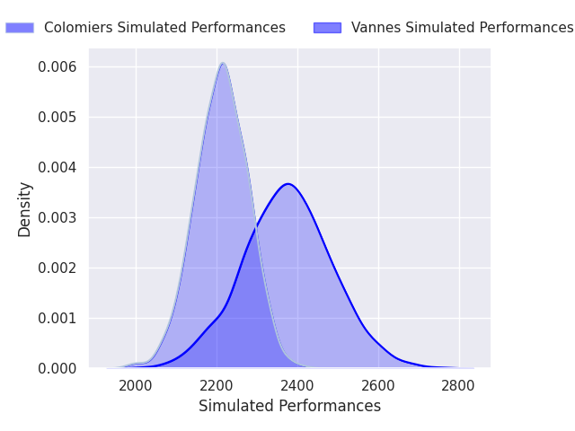

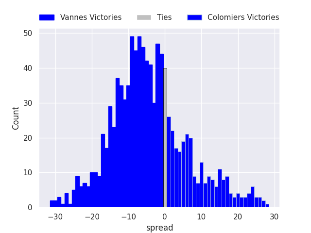

### Brive V Dax on 2026/02/26

Average Margin: Brive by 3.8

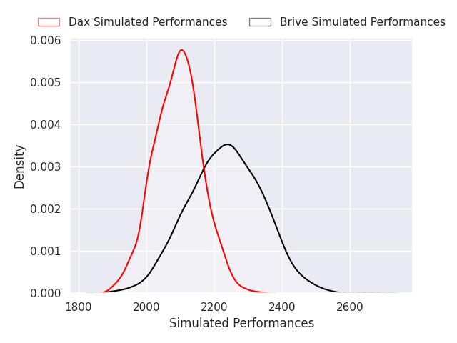
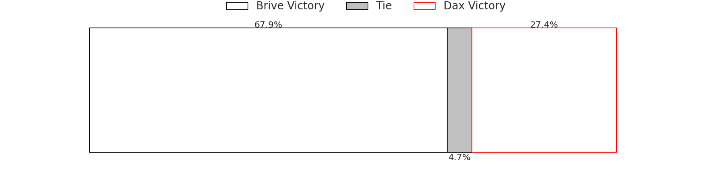
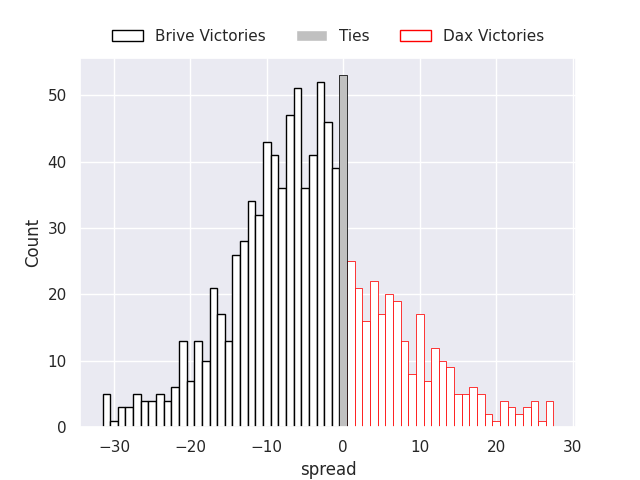

### Beziers V Oyonnax on 2026/02/26

Average Margin: Oyonnax by 0.1

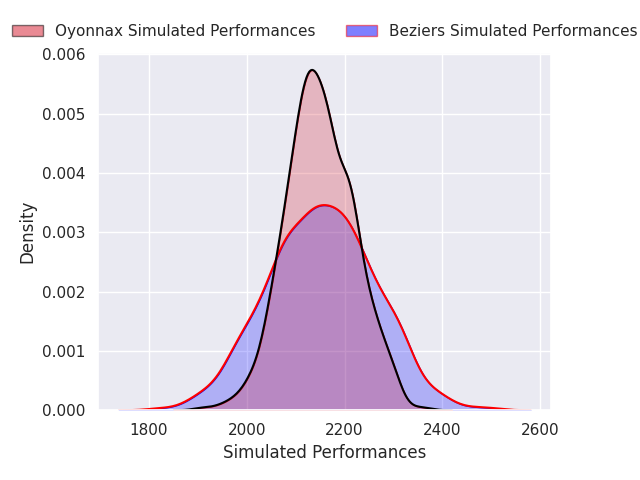

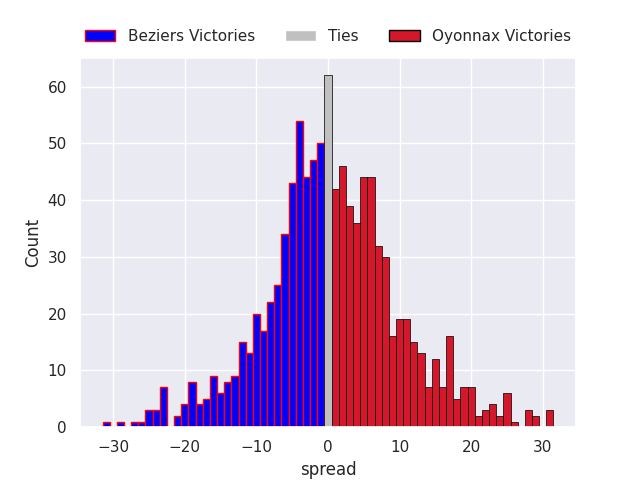

### Provence Rugby V Agen on 2026/02/26

Average Margin: Provence Rugby by 6.0

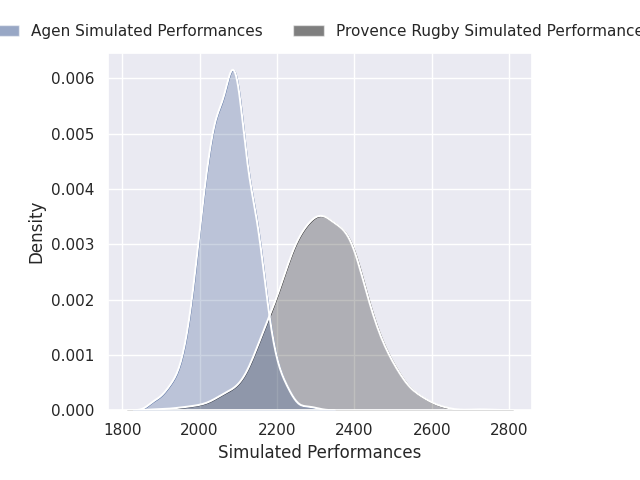

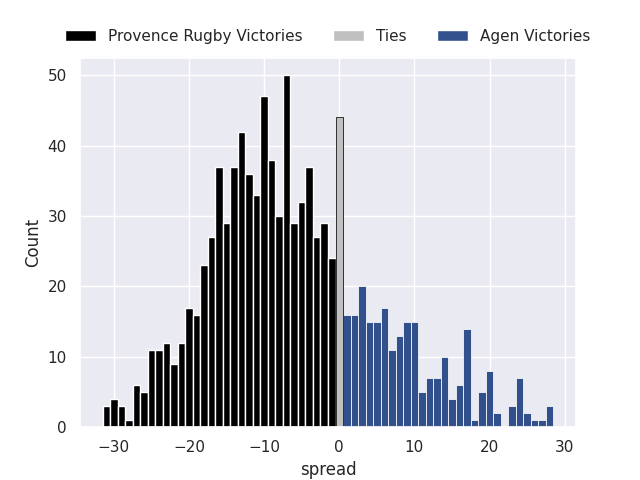

### Soyaux-Angouleme V Valence Romans Drome Rugby on 2026/02/26

Average Margin: Soyaux-Angouleme by 0.8

## Week 23

### Agen V Carcassonne on 2026/03/05

Average Margin: Agen by 7.1

### Mont-de-Marsan V Beziers on 2026/03/05

Average Margin: Mont-de-Marsan by 2.4

### Aurillac V USON Nevers on 2026/03/05

Average Margin: Aurillac by 5.4

### Valence Romans Drome Rugby V Vannes on 2026/03/05

Average Margin: Vannes by 0.3

### Grenoble V Soyaux-Angouleme on 2026/03/05

Average Margin: Grenoble by 4.2

### Colomiers V Brive on 2026/03/05

Average Margin: Colomiers by 6.6

### Biarritz Olympique V Provence Rugby on 2026/03/05

Average Margin: Provence Rugby by 0.1

### Oyonnax V Dax on 2026/03/05

Average Margin: Oyonnax by 6.5

## Week 24

### Beziers V Agen on 2026/03/26

Average Margin: Beziers by 1.3

### Provence Rugby V Colomiers on 2026/03/26

Average Margin: Provence Rugby by 2.2

### Vannes V USON Nevers on 2026/03/26

Average Margin: Vannes by 11.4

### Soyaux-Angouleme V Brive on 2026/03/26

Average Margin: Soyaux-Angouleme by 1.5

### Aurillac V Biarritz Olympique on 2026/03/26

Average Margin: Aurillac by 3.2

### Carcassonne V Mont-de-Marsan on 2026/03/26

Average Margin: Carcassonne by 3.4

### Dax V Grenoble on 2026/03/26

Average Margin: Dax by 4.6

### Valence Romans Drome Rugby V Oyonnax on 2026/03/26

Average Margin: Valence Romans Drome Rugby by 2.5

## Week 25

### Grenoble V Valence Romans Drome Rugby on 2026/04/02

Average Margin: Grenoble by 2.1

### USON Nevers V Beziers on 2026/04/02

Average Margin: USON Nevers by 2.9

### Soyaux-Angouleme V Carcassonne on 2026/04/02

Average Margin: Soyaux-Angouleme by 4.1

### Agen V Vannes on 2026/04/02

Average Margin: Vannes by 0.8

### Brive V Provence Rugby on 2026/04/02

Average Margin: Brive by 2.1

### Oyonnax V Biarritz Olympique on 2026/04/02

Average Margin: Oyonnax by 6.8

### Colomiers V Dax on 2026/04/02

Average Margin: Colomiers by 6.7

### Mont-de-Marsan V Aurillac on 2026/04/02

Average Margin: Mont-de-Marsan by 2.5

## Week 26

### Vannes V Beziers on 2026/04/09

Average Margin: Vannes by 9.3

### Oyonnax V Brive on 2026/04/09

Average Margin: Oyonnax by 6.0

### Biarritz Olympique V USON Nevers on 2026/04/09

Average Margin: Biarritz Olympique by 5.2

### Carcassonne V Grenoble on 2026/04/09

Average Margin: Carcassonne by 0.9

### Dax V Soyaux-Angouleme on 2026/04/09

Average Margin: Dax by 5.9

### Aurillac V Agen on 2026/04/09

Average Margin: Aurillac by 2.6

### Valence Romans Drome Rugby V Colomiers on 2026/04/09

Average Margin: Valence Romans Drome Rugby by 1.2

### Provence Rugby V Mont-de-Marsan on 2026/04/09

Average Margin: Provence Rugby by 8.5

## Week 27

### USON Nevers V Valence Romans Drome Rugby on 2026/04/16

Average Margin: USON Nevers by 0.6

### Agen V Biarritz Olympique on 2026/04/16

Average Margin: Agen by 4.0

### Mont-de-Marsan V Dax on 2026/04/16

Average Margin: Mont-de-Marsan by 0.1

### Soyaux-Angouleme V Vannes on 2026/04/16

Average Margin: Vannes by 2.7

### Beziers V Provence Rugby on 2026/04/16

Average Margin: Provence Rugby by 0.5

### Colomiers V Carcassonne on 2026/04/16

Average Margin: Colomiers by 10.4

### Brive V Aurillac on 2026/04/16

Average Margin: Brive by 5.4

### Grenoble V Oyonnax on 2026/04/16

Average Margin: Grenoble by 1.2

## Week 28

### Valence Romans Drome Rugby V Brive on 2026/04/23

Average Margin: Valence Romans Drome Rugby by 4.4

### Dax V USON Nevers on 2026/04/23

Average Margin: Dax by 6.3

### Carcassonne V Beziers on 2026/04/23

Average Margin: Carcassonne by 1.7

### Vannes V Aurillac on 2026/04/23

Average Margin: Vannes by 9.6

### Oyonnax V Agen on 2026/04/23

Average Margin: Oyonnax by 6.1

### Grenoble V Mont-de-Marsan on 2026/04/23

Average Margin: Grenoble by 5.8

### Biarritz Olympique V Colomiers on 2026/04/23

Average Margin: Colomiers by 0.6

### Provence Rugby V Soyaux-Angouleme on 2026/04/23

Average Margin: Provence Rugby by 8.0

## Week 29

### USON Nevers V Oyonnax on 2026/05/07

Average Margin: Oyonnax by 0.0

### Carcassonne V Brive on 2026/05/07

Average Margin: Brive by 0.0

### Agen V Soyaux-Angouleme on 2026/05/07

Average Margin: Agen by 6.0

### Dax V Valence Romans Drome Rugby on 2026/05/07

Average Margin: Dax by 2.9

### Provence Rugby V Vannes on 2026/05/07

Average Margin: Provence Rugby by 1.5

### Colomiers V Mont-de-Marsan on 2026/05/07

Average Margin: Colomiers by 8.7

### Beziers V Biarritz Olympique on 2026/05/07

Average Margin: Beziers by 2.6

### Aurillac V Grenoble on 2026/05/07

Average Margin: Aurillac by 3.7

## Week 30

### Mont-de-Marsan V Agen on 2026/05/14

Average Margin: Mont-de-Marsan by 1.1

### Biarritz Olympique V Carcassonne on 2026/05/14

Average Margin: Biarritz Olympique by 5.4

### Brive V USON Nevers on 2026/05/14

Average Margin: Brive by 6.7

### Grenoble V Colomiers on 2026/05/14

Average Margin: Grenoble by 0.3

### Oyonnax V Aurillac on 2026/05/14

Average Margin: Oyonnax by 7.9

### Vannes V Dax on 2026/05/14

Average Margin: Vannes by 6.8

### Soyaux-Angouleme V Beziers on 2026/05/14

Average Margin: Soyaux-Angouleme by 3.2

### Valence Romans Drome Rugby V Provence Rugby on 2026/05/14

Average Margin: Valence Romans Drome Rugby by 2.5

