# Team Rankings

# Standings

## Current Standings

| Club                       |   Played |   Wins |   Point Differential |   Losing Bonus Points |   Try Bonus Points |   Competition Points |
|:---------------------------|---------:|-------:|---------------------:|----------------------:|-------------------:|---------------------:|
| Vannes                     |       18 |     14 |                  254 |                     2 |                 11 |                   71 |
| Provence Rugby             |       18 |     12 |                  184 |                     5 |                  9 |                   62 |
| Colomiers                  |       18 |     13 |                  209 |                     3 |                  6 |                   61 |
| Valence Romans Drome Rugby |       18 |     13 |                   40 |                     1 |                  7 |                   60 |
| Oyonnax                    |       18 |     10 |                  113 |                     5 |                  6 |                   51 |
| Brive                      |       18 |      9 |                  119 |                     1 |                  7 |                   46 |
| USON Nevers                |       18 |      8 |                 -101 |                     2 |                  8 |                   44 |
| Agen                       |       18 |      8 |                  -17 |                     3 |                  6 |                   41 |
| Dax                        |       18 |      8 |                   37 |                     6 |                  2 |                   40 |
| Grenoble                   |       18 |      8 |                  -31 |                     4 |                  4 |                   40 |
| Aurillac                   |       18 |      8 |                  -63 |                     3 |                  4 |                   39 |
| Biarritz Olympique         |       18 |      7 |                  -68 |                     1 |                  6 |                   37 |
| Soyaux-Angouleme           |       18 |      8 |                 -106 |                     3 |                  1 |                   36 |
| Beziers                    |       18 |      6 |                 -103 |                     1 |                  5 |                   30 |
| Mont-de-Marsan             |       18 |      5 |                 -228 |                     1 |                  2 |                   25 |
| Carcassonne                |       18 |      4 |                 -239 |                     4 |                  2 |                   24 |

## Projected Remaining Table

| Club                       |   To Play |   Projected Wins |   Projected Differential |   Projected Losing Bonus Points | Projected Try Bonus Points   |   Projected Competition Points |
|:---------------------------|----------:|-----------------:|-------------------------:|--------------------------------:|:-----------------------------|-------------------------------:|
| Vannes                     |        12 |            7.226 |                   45.009 |                           2.47  |                              |                         32.45  |
| Provence Rugby             |        12 |            6.953 |                   30.847 |                           2.682 |                              |                         31.74  |
| Oyonnax                    |        12 |            6.622 |                   25.007 |                           2.632 |                              |                         30.196 |
| Colomiers                  |        12 |            6.599 |                   29.159 |                           2.618 |                              |                         29.98  |
| Grenoble                   |        12 |            6.351 |                   15.99  |                           3.134 |                              |                         29.894 |
| Valence Romans Drome Rugby |        12 |            5.974 |                    6.826 |                           3.2   |                              |                         28.414 |
| Brive                      |        12 |            5.954 |                    8.383 |                           2.957 |                              |                         27.867 |
| Agen                       |        12 |            5.389 |                   -7.889 |                           2.999 |                              |                         25.767 |
| Dax                        |        12 |            5.405 |                   -9.429 |                           2.836 |                              |                         25.624 |
| Aurillac                   |        12 |            5.44  |                  -14.234 |                           2.663 |                              |                         25.517 |
| Soyaux-Angouleme           |        12 |            5.158 |                  -16.012 |                           2.813 |                              |                         24.507 |
| Beziers                    |        12 |            4.961 |                  -18.828 |                           3.211 |                              |                         24.277 |
| Carcassonne                |        12 |            5.012 |                  -22.905 |                           2.874 |                              |                         24.084 |
| Biarritz Olympique         |        12 |            4.799 |                  -17.972 |                           3.419 |                              |                         23.823 |
| Mont-de-Marsan             |        12 |            5.012 |                  -26.324 |                           2.626 |                              |                         23.8   |
| USON Nevers                |        12 |            4.491 |                  -27.628 |                           3.238 |                              |                         22.432 |

## Projected Total Table

| Club                       |   Played |   Wins |   Point Differential |   Losing Bonus Points |   Try Bonus Points |   Competition Points |
|:---------------------------|---------:|-------:|---------------------:|----------------------:|-------------------:|---------------------:|
| Vannes                     |       30 | 21.226 |              299.009 |                 4.47  |                 11 |              103.45  |
| Provence Rugby             |       30 | 18.953 |              214.847 |                 7.682 |                  9 |               93.74  |
| Colomiers                  |       30 | 19.599 |              238.159 |                 5.618 |                  6 |               90.98  |
| Valence Romans Drome Rugby |       30 | 18.974 |               46.826 |                 4.2   |                  7 |               88.414 |
| Oyonnax                    |       30 | 16.622 |              138.007 |                 7.632 |                  6 |               81.196 |
| Brive                      |       30 | 14.954 |              127.383 |                 3.957 |                  7 |               73.867 |
| Grenoble                   |       30 | 14.351 |              -15.01  |                 7.134 |                  4 |               69.894 |
| Agen                       |       30 | 13.389 |              -24.889 |                 5.999 |                  6 |               66.767 |
| USON Nevers                |       30 | 12.491 |             -128.628 |                 5.238 |                  8 |               66.432 |
| Dax                        |       30 | 13.405 |               27.571 |                 8.836 |                  2 |               65.624 |
| Aurillac                   |       30 | 13.44  |              -77.234 |                 5.663 |                  4 |               64.517 |
| Biarritz Olympique         |       30 | 11.799 |              -85.972 |                 4.419 |                  6 |               60.823 |
| Soyaux-Angouleme           |       30 | 13.158 |             -122.012 |                 5.813 |                  1 |               60.507 |
| Beziers                    |       30 | 10.961 |             -121.828 |                 4.211 |                  5 |               54.277 |
| Mont-de-Marsan             |       30 | 10.012 |             -254.324 |                 3.626 |                  2 |               48.8   |
| Carcassonne                |       30 |  9.012 |             -261.905 |                 6.874 |                  2 |               48.084 |

# Completed Match Review

| Model | Percent Correct Predictions | Spread Error |
| ------ | ------ | ------ |
| Club Level | 67.1% | 11.4 |
| Player Level: Lineup | nan% | nan |
| Player Level: Minutes | nan% | nan |

# Future Predictions

## Week 19

### Oyonnax V Vannes on 2026/01/29

Average Margin: Oyonnax by 2.0

### Mont-de-Marsan V Brive on 2026/01/30

Average Margin: Brive by 0.0

### Biarritz Olympique V Grenoble on 2026/01/30

Average Margin: Biarritz Olympique by 1.0

### Colomiers V Soyaux-Angouleme on 2026/01/30

Average Margin: Colomiers by 7.4

### Beziers V Dax on 2026/01/30

Average Margin: Beziers by 2.4

### Aurillac V Valence Romans Drome Rugby on 2026/01/30

Average Margin: Aurillac by 1.2

### Carcassonne V Provence Rugby on 2026/01/30

Average Margin: Provence Rugby by 1.9

### Agen V USON Nevers on 2026/01/30

Average Margin: Agen by 4.8

## Week 20

### USON Nevers V Colomiers on 2026/02/12

Average Margin: USON Nevers by 0.2

### Brive V Agen on 2026/02/13

Average Margin: Brive by 6.0

### Valence Romans Drome Rugby V Biarritz Olympique on 2026/02/13

Average Margin: Valence Romans Drome Rugby by 5.8

### Dax V Aurillac on 2026/02/13

Average Margin: Dax by 4.8

### Soyaux-Angouleme V Mont-de-Marsan on 2026/02/13

Average Margin: Soyaux-Angouleme by 4.8

### Vannes V Carcassonne on 2026/02/13

Average Margin: Vannes by 9.7

### Beziers V Grenoble on 2026/02/13

Average Margin: Beziers by 0.8

### Provence Rugby V Oyonnax on 2026/02/13

Average Margin: Provence Rugby by 5.3

## Week 21

### Dax V Provence Rugby on 2026/02/19

Average Margin: Dax by 0.3

### Carcassonne V USON Nevers on 2026/02/19

Average Margin: Carcassonne by 3.0

### Agen V Valence Romans Drome Rugby on 2026/02/19

Average Margin: Agen by 1.7

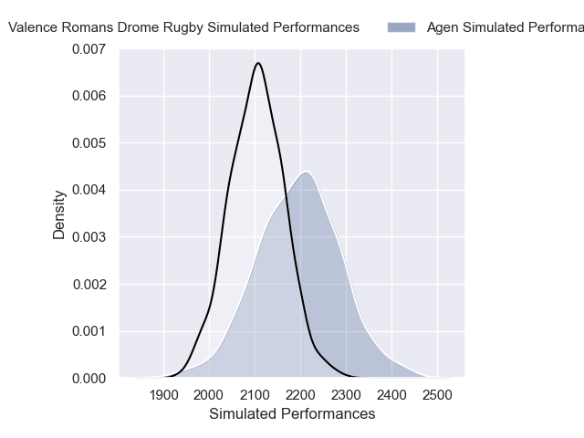

### Aurillac V Soyaux-Angouleme on 2026/02/19

Average Margin: Aurillac by 3.6

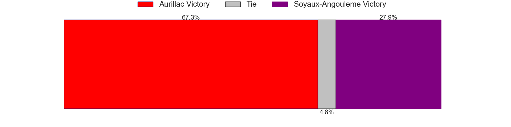

### Grenoble V Brive on 2026/02/19

Average Margin: Grenoble by 3.2

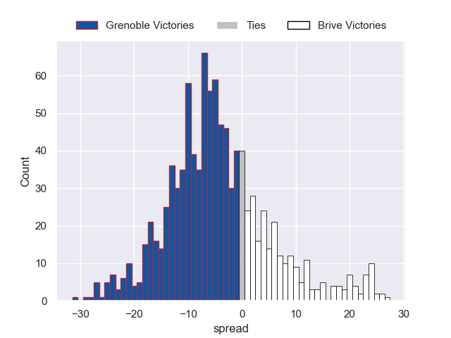

### Colomiers V Beziers on 2026/02/19

Average Margin: Colomiers by 7.4

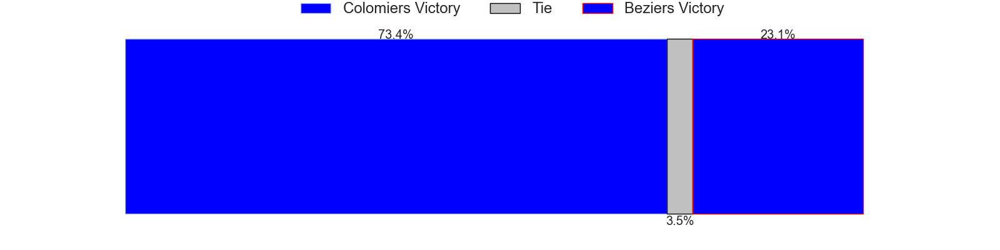
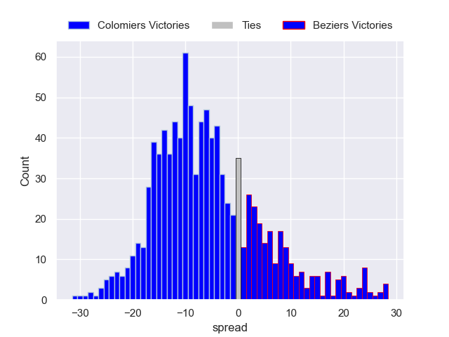

### Biarritz Olympique V Vannes on 2026/02/19

Average Margin: Vannes by 2.0

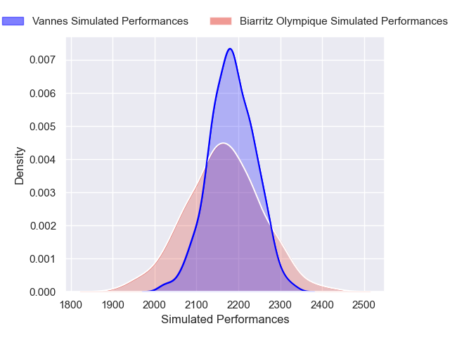

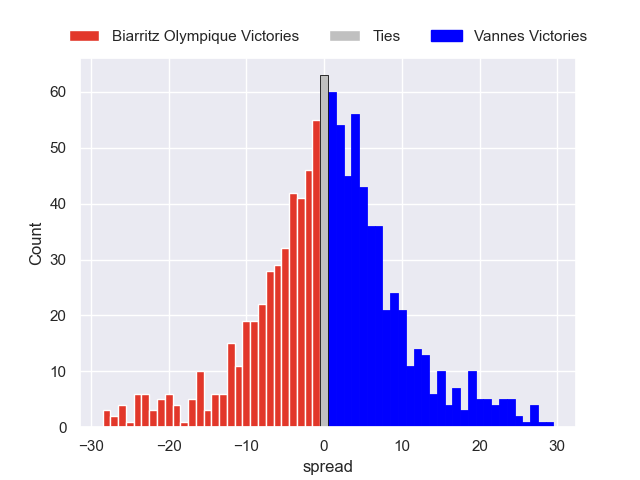

### Oyonnax V Mont-de-Marsan on 2026/02/19

Average Margin: Oyonnax by 7.4

## Week 22

### Beziers V Oyonnax on 2026/02/26

Average Margin: Beziers by 0.8

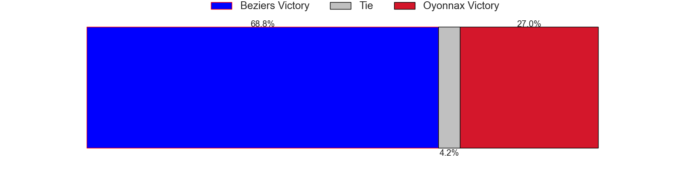

### Brive V Dax on 2026/02/26

Average Margin: Brive by 5.4

### Provence Rugby V Agen on 2026/02/26

Average Margin: Provence Rugby by 6.7

### Vannes V Colomiers on 2026/02/26

Average Margin: Vannes by 4.8

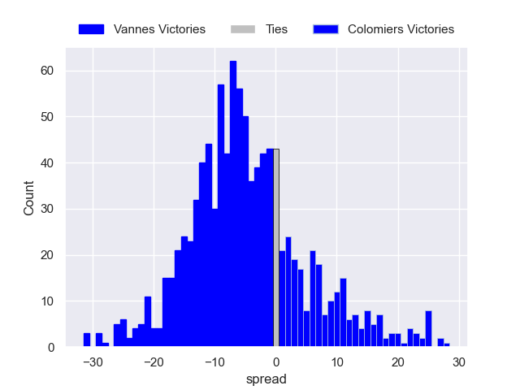

### Soyaux-Angouleme V Valence Romans Drome Rugby on 2026/02/26

Average Margin: Soyaux-Angouleme by 1.5

### Mont-de-Marsan V Biarritz Olympique on 2026/02/26

Average Margin: Mont-de-Marsan by 2.5

### Carcassonne V Aurillac on 2026/02/26

Average Margin: Carcassonne by 2.0

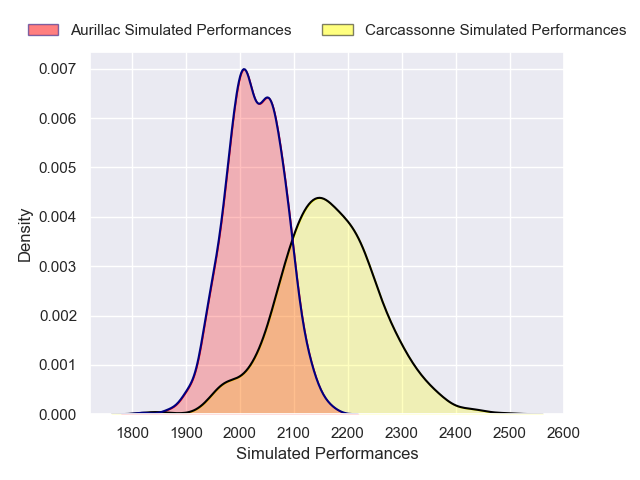

### USON Nevers V Grenoble on 2026/02/26

Average Margin: USON Nevers by 1.2

## Week 23

### Valence Romans Drome Rugby V Vannes on 2026/03/05

Average Margin: Valence Romans Drome Rugby by 1.2

### Agen V Carcassonne on 2026/03/05

Average Margin: Agen by 5.3

### Mont-de-Marsan V Beziers on 2026/03/05

Average Margin: Mont-de-Marsan by 2.6

### Aurillac V USON Nevers on 2026/03/05

Average Margin: Aurillac by 4.1

### Biarritz Olympique V Provence Rugby on 2026/03/05

Average Margin: Provence Rugby by 0.4

### Grenoble V Soyaux-Angouleme on 2026/03/05

Average Margin: Grenoble by 4.7

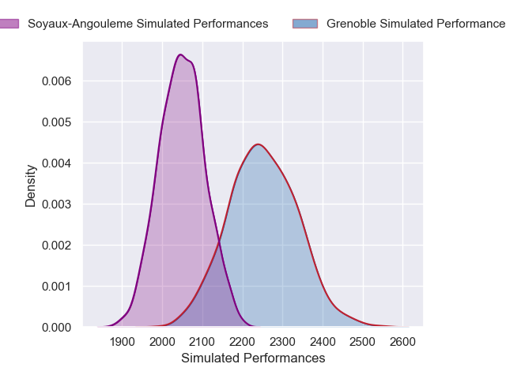

### Colomiers V Brive on 2026/03/05

Average Margin: Colomiers by 4.9

### Oyonnax V Dax on 2026/03/05

Average Margin: Oyonnax by 6.3

## Week 24

### Carcassonne V Mont-de-Marsan on 2026/03/26

Average Margin: Carcassonne by 3.7

### Valence Romans Drome Rugby V Oyonnax on 2026/03/26

Average Margin: Valence Romans Drome Rugby by 3.5

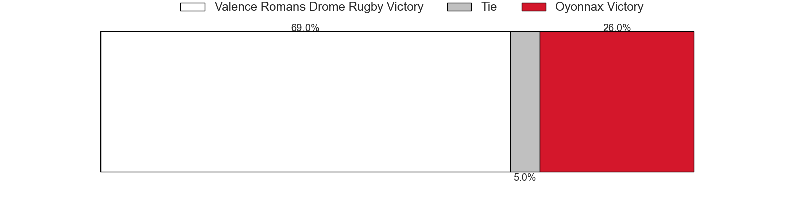

### Dax V Grenoble on 2026/03/26

Average Margin: Dax by 2.2

### Aurillac V Biarritz Olympique on 2026/03/26

Average Margin: Aurillac by 3.9

### Beziers V Agen on 2026/03/26

Average Margin: Beziers by 2.6

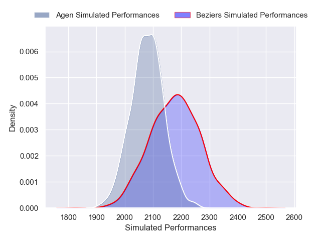

### Vannes V USON Nevers on 2026/03/26

Average Margin: Vannes by 8.4

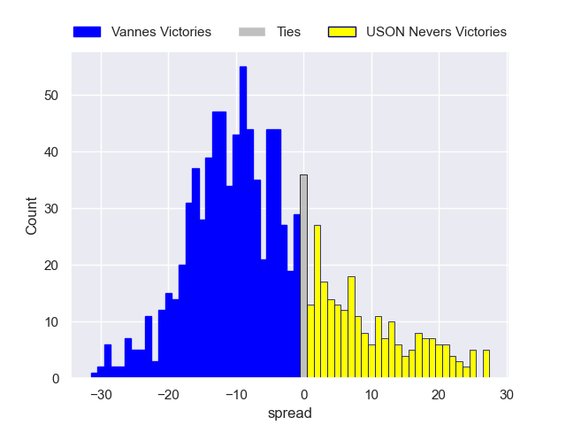

### Provence Rugby V Colomiers on 2026/03/26

Average Margin: Provence Rugby by 3.5

### Soyaux-Angouleme V Brive on 2026/03/26

Average Margin: Soyaux-Angouleme by 1.5

## Week 25

### Brive V Provence Rugby on 2026/04/02

Average Margin: Brive by 2.6

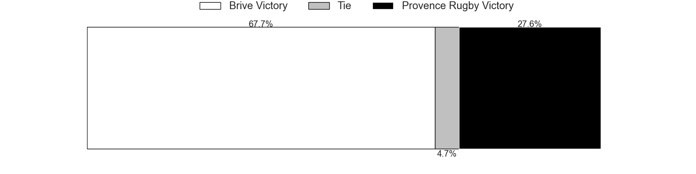

### Colomiers V Dax on 2026/04/02

Average Margin: Colomiers by 6.3

### Grenoble V Valence Romans Drome Rugby on 2026/04/02

Average Margin: Grenoble by 3.2

### Oyonnax V Biarritz Olympique on 2026/04/02

Average Margin: Oyonnax by 5.8

### Soyaux-Angouleme V Carcassonne on 2026/04/02

Average Margin: Soyaux-Angouleme by 4.8

### Mont-de-Marsan V Aurillac on 2026/04/02

Average Margin: Mont-de-Marsan by 3.4

### Agen V Vannes on 2026/04/02

Average Margin: Vannes by 1.1

### USON Nevers V Beziers on 2026/04/02

Average Margin: USON Nevers by 4.3

## Week 26

### Valence Romans Drome Rugby V Colomiers on 2026/04/09

Average Margin: Valence Romans Drome Rugby by 2.5

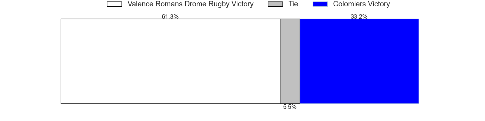

### Dax V Soyaux-Angouleme on 2026/04/09

Average Margin: Dax by 4.4

### Carcassonne V Grenoble on 2026/04/09

Average Margin: Grenoble by 0.1

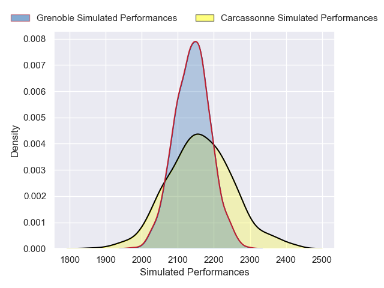

### Aurillac V Agen on 2026/04/09

Average Margin: Aurillac by 2.7

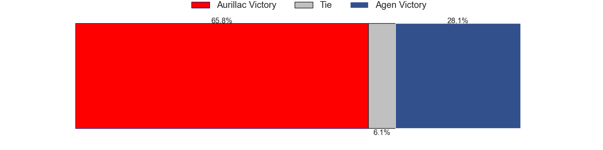

### Provence Rugby V Mont-de-Marsan on 2026/04/09

Average Margin: Provence Rugby by 8.2

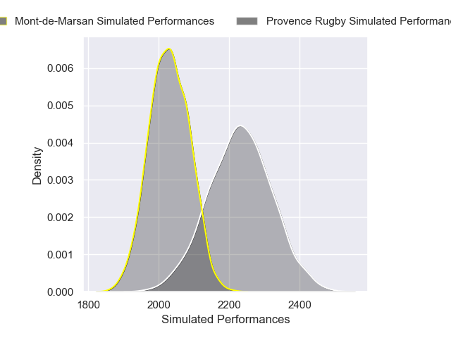

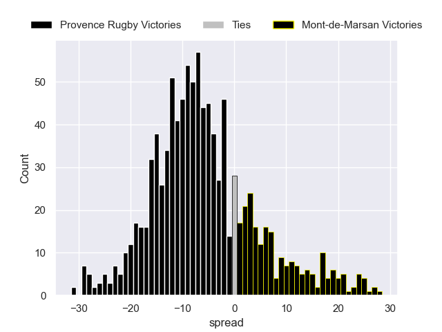

### Oyonnax V Brive on 2026/04/09

Average Margin: Oyonnax by 4.5

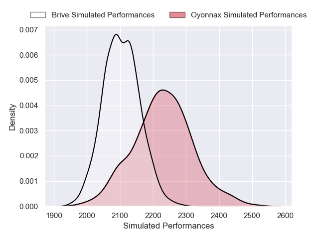

### Biarritz Olympique V USON Nevers on 2026/04/09

Average Margin: Biarritz Olympique by 4.4

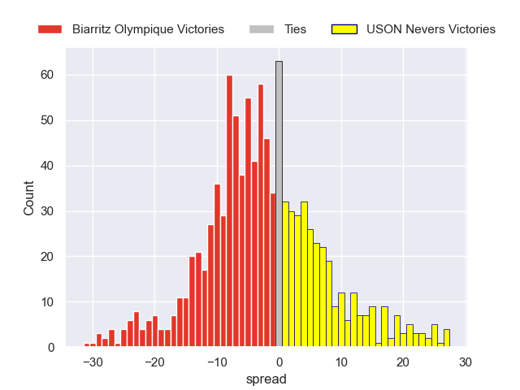

### Vannes V Beziers on 2026/04/09

Average Margin: Vannes by 7.8

## Week 27

### Beziers V Provence Rugby on 2026/04/16

Average Margin: Provence Rugby by 0.5

### Brive V Aurillac on 2026/04/16

Average Margin: Brive by 6.0

### Colomiers V Carcassonne on 2026/04/16

Average Margin: Colomiers by 8.3

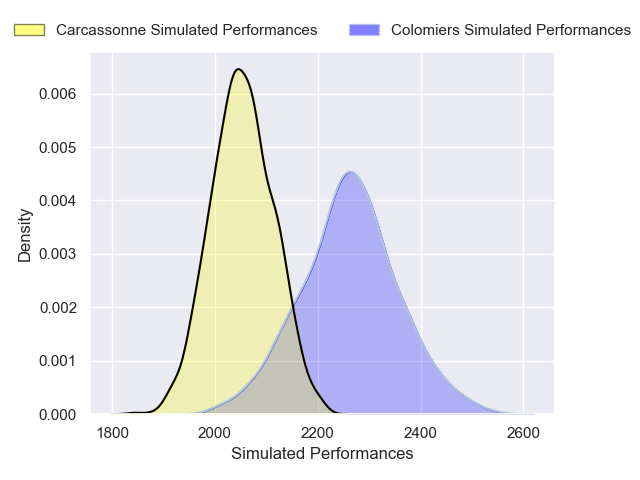
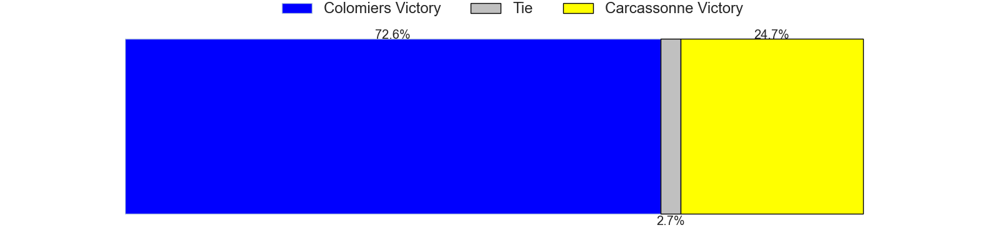

### Grenoble V Oyonnax on 2026/04/16

Average Margin: Grenoble by 3.2

### Soyaux-Angouleme V Vannes on 2026/04/16

Average Margin: Vannes by 1.3

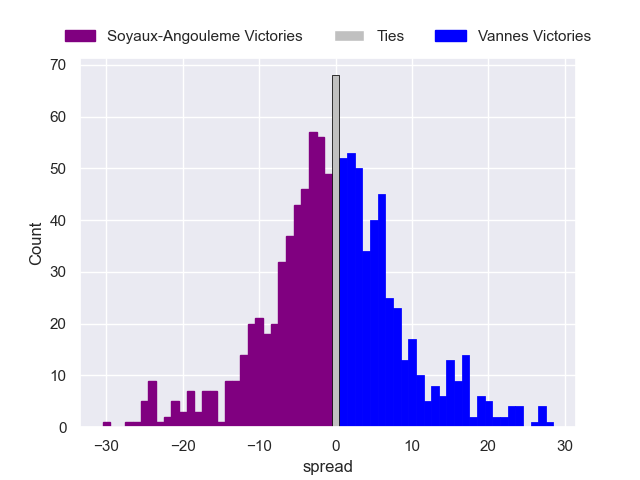

### Mont-de-Marsan V Dax on 2026/04/16

Average Margin: Mont-de-Marsan by 1.5

### Agen V Biarritz Olympique on 2026/04/16

Average Margin: Agen by 3.7

### USON Nevers V Valence Romans Drome Rugby on 2026/04/16

Average Margin: USON Nevers by 2.2

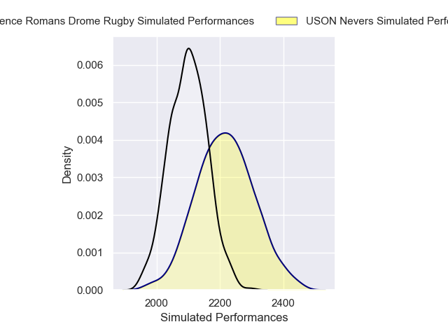

## Week 28

### Valence Romans Drome Rugby V Brive on 2026/04/23

Average Margin: Valence Romans Drome Rugby by 3.8

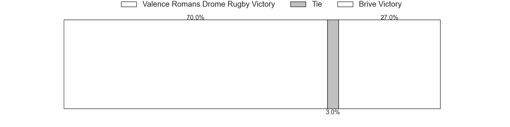

### Carcassonne V Beziers on 2026/04/23

Average Margin: Carcassonne by 2.8

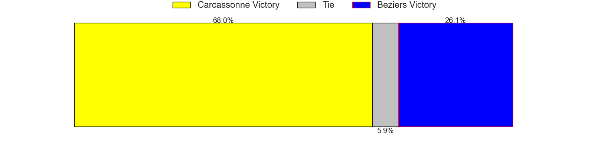

### Vannes V Aurillac on 2026/04/23

Average Margin: Vannes by 8.7

### Dax V USON Nevers on 2026/04/23

Average Margin: Dax by 5.4

### Oyonnax V Agen on 2026/04/23

Average Margin: Oyonnax by 6.5

### Grenoble V Mont-de-Marsan on 2026/04/23

Average Margin: Grenoble by 6.5

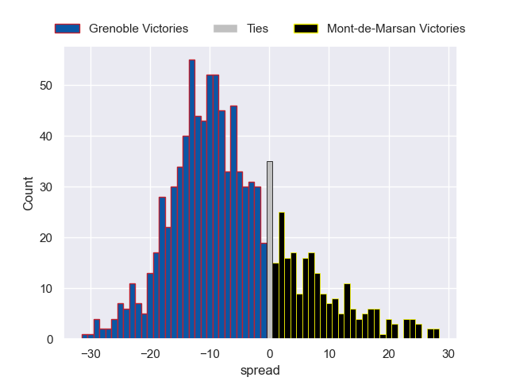

### Biarritz Olympique V Colomiers on 2026/04/23

Average Margin: Colomiers by 0.4

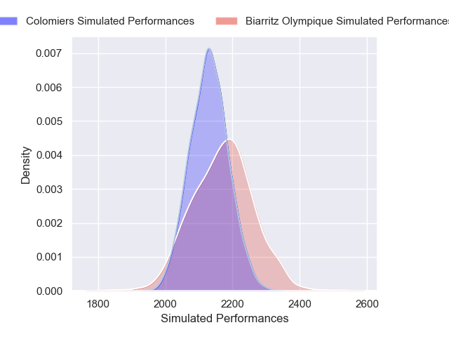

### Provence Rugby V Soyaux-Angouleme on 2026/04/23

Average Margin: Provence Rugby by 6.8

## Week 29

### USON Nevers V Oyonnax on 2026/05/07

Average Margin: USON Nevers by 1.0

### Dax V Valence Romans Drome Rugby on 2026/05/07

Average Margin: Dax by 2.3

### Agen V Soyaux-Angouleme on 2026/05/07

Average Margin: Agen by 4.1

### Carcassonne V Brive on 2026/05/07

Average Margin: Carcassonne by 0.2

### Provence Rugby V Vannes on 2026/05/07

Average Margin: Provence Rugby by 2.4

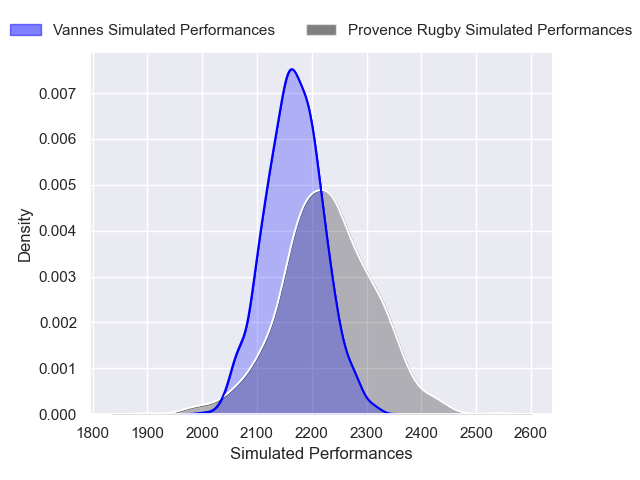

### Colomiers V Mont-de-Marsan on 2026/05/07

Average Margin: Colomiers by 7.5

### Beziers V Biarritz Olympique on 2026/05/07

Average Margin: Beziers by 3.4

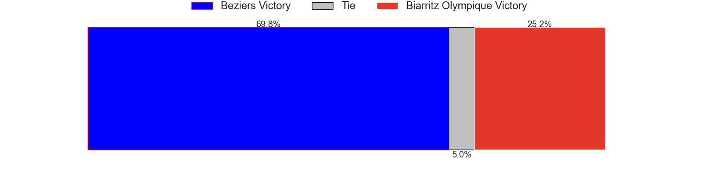

### Aurillac V Grenoble on 2026/05/07

Average Margin: Aurillac by 1.8

## Week 30

### Mont-de-Marsan V Agen on 2026/05/14

Average Margin: Mont-de-Marsan by 1.9

### Biarritz Olympique V Carcassonne on 2026/05/14

Average Margin: Biarritz Olympique by 4.4

### Brive V USON Nevers on 2026/05/14

Average Margin: Brive by 6.4

### Grenoble V Colomiers on 2026/05/14

Average Margin: Grenoble by 1.9

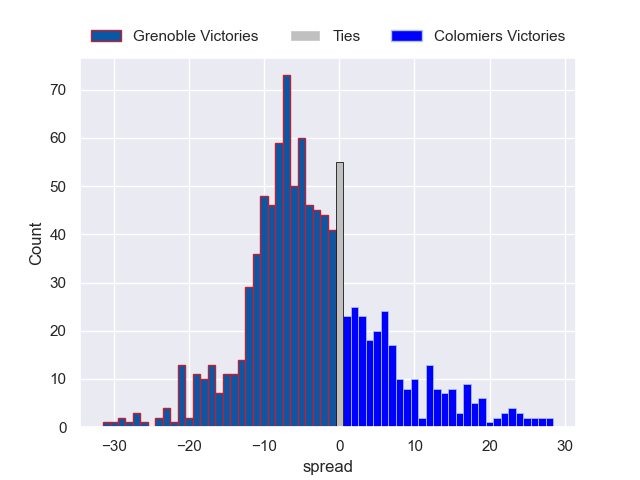

### Oyonnax V Aurillac on 2026/05/14

Average Margin: Oyonnax by 6.5

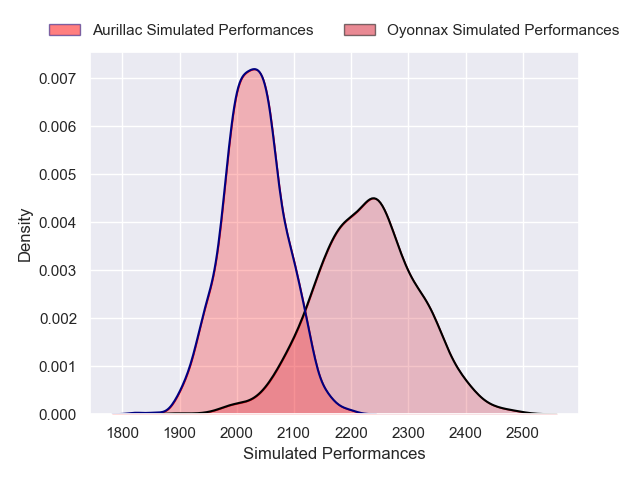

### Vannes V Dax on 2026/05/14

Average Margin: Vannes by 6.9

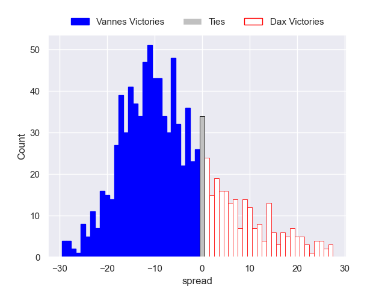

### Soyaux-Angouleme V Beziers on 2026/05/14

Average Margin: Soyaux-Angouleme by 3.5

### Valence Romans Drome Rugby V Provence Rugby on 2026/05/14

Average Margin: Valence Romans Drome Rugby by 2.0

