# Team Rankings

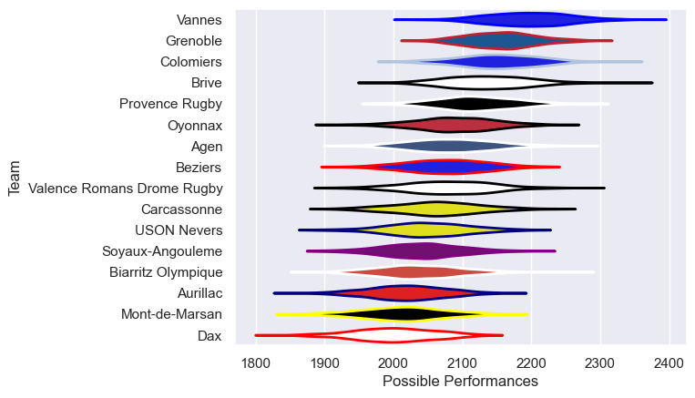
# Standings

## Current Standings

| Club                       |   Played |   Wins |   Point Differential |   Losing Bonus Points |   Try Bonus Points |   Competition Points |
|:---------------------------|---------:|-------:|---------------------:|----------------------:|-------------------:|---------------------:|
| Vannes                     |       19 |     15 |                  257 |                     2 |                 12 |                   76 |
| Colomiers                  |       19 |     14 |                  251 |                     3 |                  7 |                   66 |
| Provence Rugby             |       19 |     13 |                  188 |                     5 |                  9 |                   66 |
| Valence Romans Drome Rugby |       19 |     13 |                   36 |                     2 |                  7 |                   61 |
| Oyonnax                    |       19 |     10 |                  110 |                     6 |                  7 |                   53 |
| Brive                      |       19 |      9 |                  102 |                     1 |                  7 |                   46 |
| Agen                       |       19 |      9 |                   29 |                     3 |                  7 |                   46 |
| Aurillac                   |       19 |      9 |                  -59 |                     3 |                  5 |                   44 |
| USON Nevers                |       19 |      8 |                 -147 |                     2 |                  8 |                   44 |
| Dax                        |       19 |      8 |                   33 |                     7 |                  2 |                   41 |
| Biarritz Olympique         |       19 |      8 |                  -58 |                     1 |                  6 |                   41 |
| Grenoble                   |       19 |      8 |                  -41 |                     4 |                  4 |                   40 |
| Soyaux-Angouleme           |       19 |      8 |                 -148 |                     3 |                  1 |                   36 |
| Beziers                    |       19 |      7 |                  -99 |                     1 |                  5 |                   34 |
| Mont-de-Marsan             |       19 |      6 |                 -211 |                     1 |                  2 |                   29 |
| Carcassonne                |       19 |      4 |                 -243 |                     5 |                  2 |                   25 |

## Projected Remaining Table

| Club                       |   To Play |   Projected Wins |   Projected Differential |   Projected Losing Bonus Points | Projected Try Bonus Points   |   Projected Competition Points |
|:---------------------------|----------:|-----------------:|-------------------------:|--------------------------------:|:-----------------------------|-------------------------------:|
| Vannes                     |        11 |            6.841 |                   48.279 |                           2.014 |                              |                         30.368 |
| Provence Rugby             |        11 |            6.37  |                   30.422 |                           2.353 |                              |                         28.937 |
| Colomiers                  |        11 |            6.199 |                   31.509 |                           2.323 |                              |                         28.047 |
| Oyonnax                    |        11 |            6.192 |                   27.465 |                           2.25  |                              |                         27.962 |
| Valence Romans Drome Rugby |        11 |            5.585 |                    9.12  |                           2.783 |                              |                         26.305 |
| Grenoble                   |        11 |            5.489 |                    6.758 |                           2.744 |                              |                         25.872 |
| Brive                      |        11 |            5.344 |                    1.597 |                           2.473 |                              |                         24.843 |
| Dax                        |        11 |            5.279 |                   -1.948 |                           2.393 |                              |                         24.489 |
| Agen                       |        11 |            5.03  |                   -3.692 |                           2.667 |                              |                         23.887 |
| Aurillac                   |        11 |            4.886 |                  -13.891 |                           2.412 |                              |                         22.96  |
| Biarritz Olympique         |        11 |            4.545 |                  -12.792 |                           2.969 |                              |                         22.193 |
| Soyaux-Angouleme           |        11 |            4.627 |                  -17.5   |                           2.654 |                              |                         22.118 |
| Carcassonne                |        11 |            4.573 |                  -24.508 |                           2.537 |                              |                         21.859 |
| Mont-de-Marsan             |        11 |            4.521 |                  -24.595 |                           2.46  |                              |                         21.55  |
| Beziers                    |        11 |            4.269 |                  -24.704 |                           2.91  |                              |                         21.16  |
| USON Nevers                |        11 |            4.097 |                  -31.52  |                           2.749 |                              |                         20.141 |

## Projected Total Table

| Club                       |   Played |   Wins |   Point Differential |   Losing Bonus Points |   Try Bonus Points |   Competition Points |
|:---------------------------|---------:|-------:|---------------------:|----------------------:|-------------------:|---------------------:|
| Vannes                     |       30 | 21.841 |              305.279 |                 4.014 |                 12 |              106.368 |
| Provence Rugby             |       30 | 19.37  |              218.422 |                 7.353 |                  9 |               94.937 |
| Colomiers                  |       30 | 20.199 |              282.509 |                 5.323 |                  7 |               94.047 |
| Valence Romans Drome Rugby |       30 | 18.585 |               45.12  |                 4.783 |                  7 |               87.305 |
| Oyonnax                    |       30 | 16.192 |              137.465 |                 8.25  |                  7 |               80.962 |
| Brive                      |       30 | 14.344 |              103.597 |                 3.473 |                  7 |               70.843 |
| Agen                       |       30 | 14.03  |               25.308 |                 5.667 |                  7 |               69.887 |
| Aurillac                   |       30 | 13.886 |              -72.891 |                 5.412 |                  5 |               66.96  |
| Grenoble                   |       30 | 13.489 |              -34.242 |                 6.744 |                  4 |               65.872 |
| Dax                        |       30 | 13.279 |               31.052 |                 9.393 |                  2 |               65.489 |
| USON Nevers                |       30 | 12.097 |             -178.52  |                 4.749 |                  8 |               64.141 |
| Biarritz Olympique         |       30 | 12.545 |              -70.792 |                 3.969 |                  6 |               63.193 |
| Soyaux-Angouleme           |       30 | 12.627 |             -165.5   |                 5.654 |                  1 |               58.118 |
| Beziers                    |       30 | 11.269 |             -123.704 |                 3.91  |                  5 |               55.16  |
| Mont-de-Marsan             |       30 | 10.521 |             -235.595 |                 3.46  |                  2 |               50.55  |
| Carcassonne                |       30 |  8.573 |             -267.508 |                 7.537 |                  2 |               46.859 |

# Completed Match Review

| Model | Percent Correct Predictions | Spread Error |
| ------ | ------ | ------ |
| Club Level | 72.1% | 11.2 |
| Player Level: Lineup | nan% | nan |
| Player Level: Minutes | nan% | nan |

# Future Predictions

## Week 20

### USON Nevers V Colomiers on 2026/02/12

Average Margin: Colomiers by 1.9

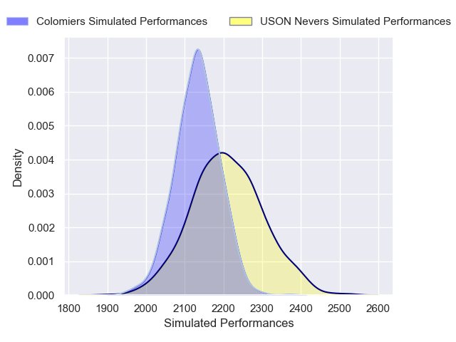

### Vannes V Carcassonne on 2026/02/13

Average Margin: Vannes by 10.5

### Valence Romans Drome Rugby V Biarritz Olympique on 2026/02/13

Average Margin: Valence Romans Drome Rugby by 5.2

### Brive V Agen on 2026/02/13

Average Margin: Brive by 4.2

### Dax V Aurillac on 2026/02/13

Average Margin: Dax by 5.8

### Beziers V Grenoble on 2026/02/13

Average Margin: Beziers by 1.4

### Provence Rugby V Oyonnax on 2026/02/13

Average Margin: Provence Rugby by 4.7

### Soyaux-Angouleme V Mont-de-Marsan on 2026/02/13

Average Margin: Soyaux-Angouleme by 4.2

## Week 21

### Grenoble V Brive on 2026/02/19

Average Margin: Grenoble by 2.9

### Aurillac V Soyaux-Angouleme on 2026/02/20

Average Margin: Aurillac by 4.6

### Colomiers V Beziers on 2026/02/20

Average Margin: Colomiers by 8.4

### Agen V Valence Romans Drome Rugby on 2026/02/20

Average Margin: Agen by 2.8

### Dax V Provence Rugby on 2026/02/20

Average Margin: Provence Rugby by 0.2

### Carcassonne V USON Nevers on 2026/02/20

Average Margin: Carcassonne by 3.6

### Biarritz Olympique V Vannes on 2026/02/20

Average Margin: Vannes by 1.7

### Oyonnax V Mont-de-Marsan on 2026/02/20

Average Margin: Oyonnax by 8.1

## Week 22

### Mont-de-Marsan V Biarritz Olympique on 2026/02/26

Average Margin: Mont-de-Marsan by 2.1

### Carcassonne V Aurillac on 2026/02/26

Average Margin: Carcassonne by 1.8

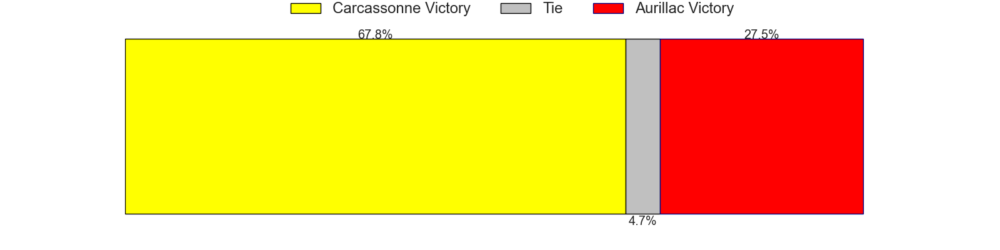

### USON Nevers V Grenoble on 2026/02/26

Average Margin: USON Nevers by 1.2

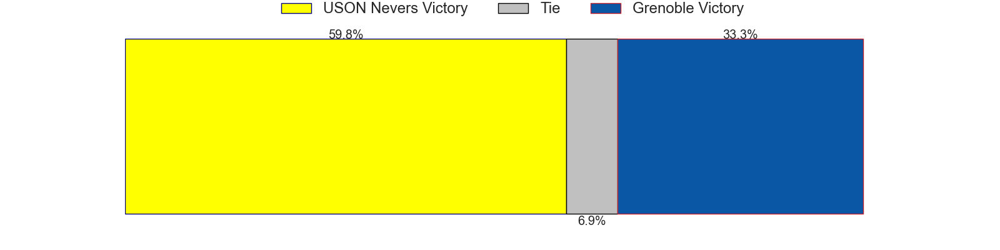

### Soyaux-Angouleme V Valence Romans Drome Rugby on 2026/02/26

Average Margin: Soyaux-Angouleme by 0.2

### Provence Rugby V Agen on 2026/02/26

Average Margin: Provence Rugby by 6.6

### Brive V Dax on 2026/02/26

Average Margin: Brive by 4.3

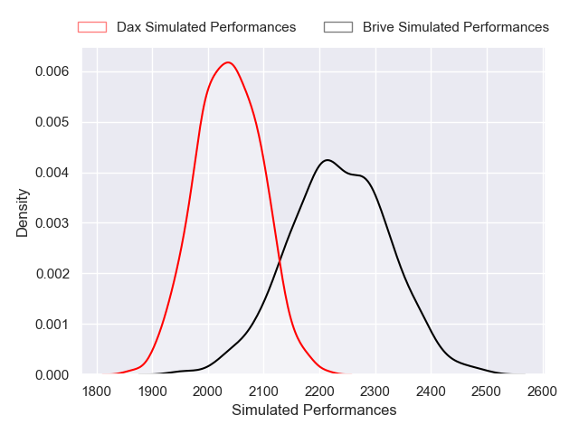

### Beziers V Oyonnax on 2026/02/26

Average Margin: Oyonnax by 0.1

### Vannes V Colomiers on 2026/02/26

Average Margin: Vannes by 4.4

## Week 23

### Agen V Carcassonne on 2026/03/05

Average Margin: Agen by 6.6

### Mont-de-Marsan V Beziers on 2026/03/05

Average Margin: Mont-de-Marsan by 3.5

### Aurillac V USON Nevers on 2026/03/05

Average Margin: Aurillac by 4.9

### Valence Romans Drome Rugby V Vannes on 2026/03/05

Average Margin: Valence Romans Drome Rugby by 1.2

### Grenoble V Soyaux-Angouleme on 2026/03/05

Average Margin: Grenoble by 5.4

### Colomiers V Brive on 2026/03/05

Average Margin: Colomiers by 6.8

### Biarritz Olympique V Provence Rugby on 2026/03/05

Average Margin: Provence Rugby by 0.0

### Oyonnax V Dax on 2026/03/05

Average Margin: Oyonnax by 6.0

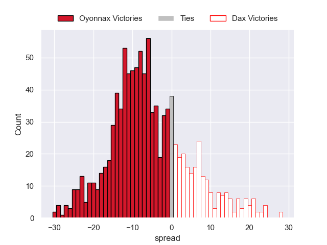

## Week 24

### Beziers V Agen on 2026/03/26

Average Margin: Beziers by 1.6

### Provence Rugby V Colomiers on 2026/03/26

Average Margin: Provence Rugby by 3.2

### Vannes V USON Nevers on 2026/03/26

Average Margin: Vannes by 10.2

### Soyaux-Angouleme V Brive on 2026/03/26

Average Margin: Soyaux-Angouleme by 1.3

### Aurillac V Biarritz Olympique on 2026/03/26

Average Margin: Aurillac by 3.0

### Carcassonne V Mont-de-Marsan on 2026/03/26

Average Margin: Carcassonne by 2.7

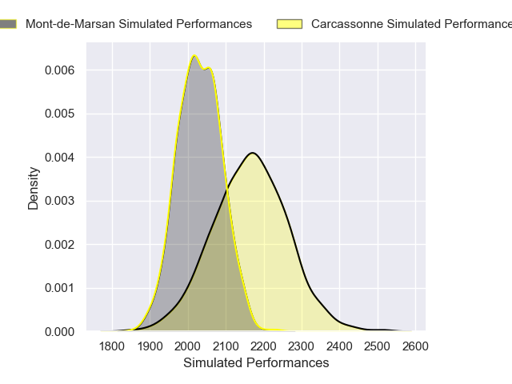

### Dax V Grenoble on 2026/03/26

Average Margin: Dax by 3.8

### Valence Romans Drome Rugby V Oyonnax on 2026/03/26

Average Margin: Valence Romans Drome Rugby by 3.4

## Week 25

### Agen V Vannes on 2026/04/02

Average Margin: Vannes by 0.1

### Mont-de-Marsan V Aurillac on 2026/04/02

Average Margin: Mont-de-Marsan by 3.5

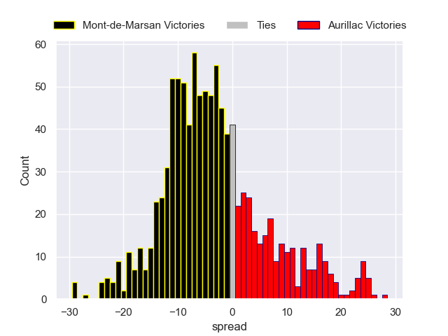

### Brive V Provence Rugby on 2026/04/02

Average Margin: Brive by 1.7

### Grenoble V Valence Romans Drome Rugby on 2026/04/02

Average Margin: Grenoble by 2.3

### Soyaux-Angouleme V Carcassonne on 2026/04/02

Average Margin: Soyaux-Angouleme by 4.3

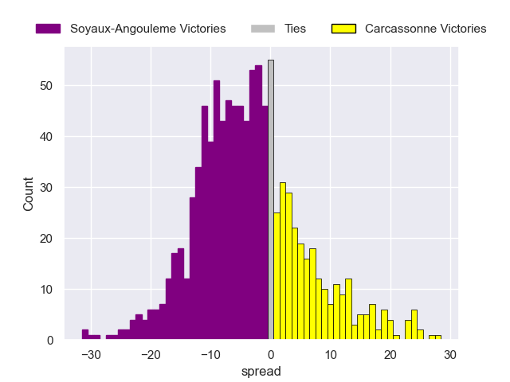

### Colomiers V Dax on 2026/04/02

Average Margin: Colomiers by 6.0

### Oyonnax V Biarritz Olympique on 2026/04/02

Average Margin: Oyonnax by 5.6

### USON Nevers V Beziers on 2026/04/02

Average Margin: USON Nevers by 3.5

## Week 26

### Biarritz Olympique V USON Nevers on 2026/04/09

Average Margin: Biarritz Olympique by 5.5

### Valence Romans Drome Rugby V Colomiers on 2026/04/09

Average Margin: Valence Romans Drome Rugby by 2.0

### Dax V Soyaux-Angouleme on 2026/04/09

Average Margin: Dax by 4.8

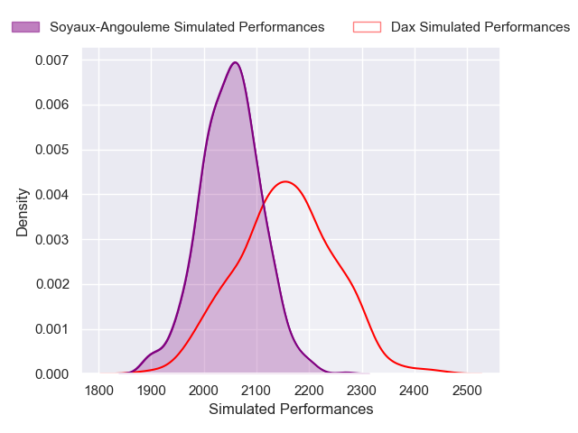
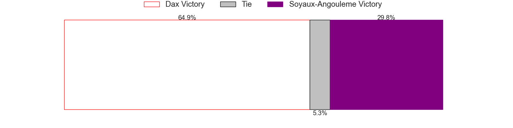

### Aurillac V Agen on 2026/04/09

Average Margin: Aurillac by 2.2

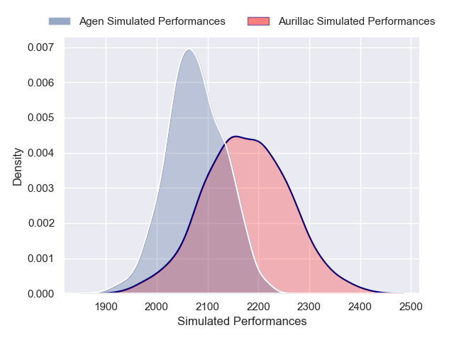

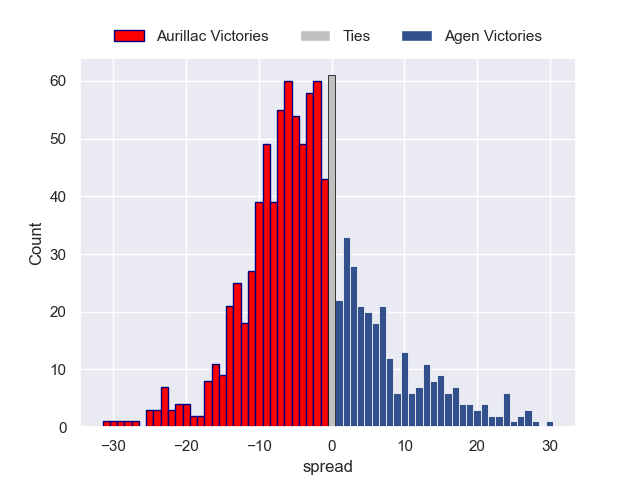

### Vannes V Beziers on 2026/04/09

Average Margin: Vannes by 8.1

### Oyonnax V Brive on 2026/04/09

Average Margin: Oyonnax by 6.3

### Carcassonne V Grenoble on 2026/04/09

Average Margin: Carcassonne by 1.0

### Provence Rugby V Mont-de-Marsan on 2026/04/09

Average Margin: Provence Rugby by 8.0

## Week 27

### USON Nevers V Valence Romans Drome Rugby on 2026/04/16

Average Margin: USON Nevers by 1.1

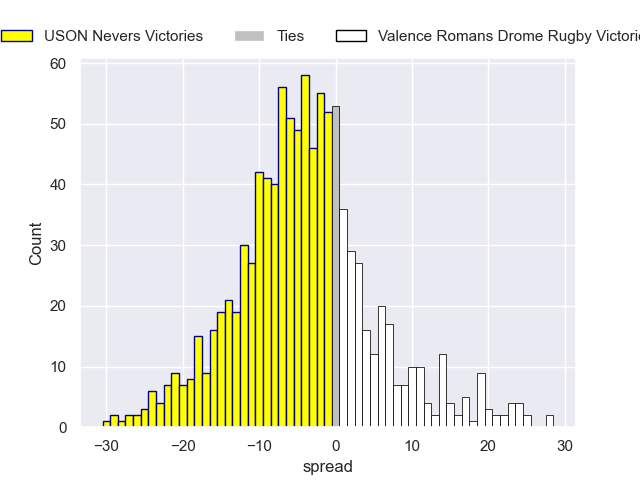

### Agen V Biarritz Olympique on 2026/04/16

Average Margin: Agen by 3.8

### Mont-de-Marsan V Dax on 2026/04/16

Average Margin: Mont-de-Marsan by 1.4

### Soyaux-Angouleme V Vannes on 2026/04/16

Average Margin: Vannes by 2.1

### Beziers V Provence Rugby on 2026/04/16

Average Margin: Provence Rugby by 0.8

### Colomiers V Carcassonne on 2026/04/16

Average Margin: Colomiers by 9.4

### Brive V Aurillac on 2026/04/16

Average Margin: Brive by 6.0

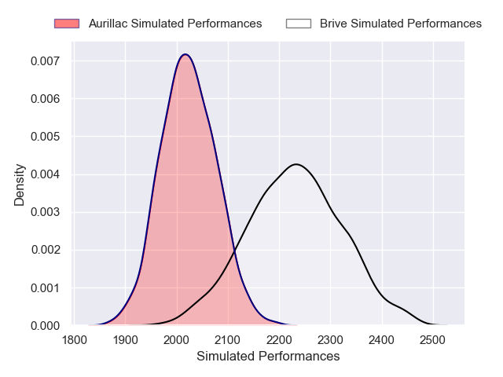

### Grenoble V Oyonnax on 2026/04/16

Average Margin: Grenoble by 1.7

## Week 28

### Valence Romans Drome Rugby V Brive on 2026/04/23

Average Margin: Valence Romans Drome Rugby by 3.8

### Dax V USON Nevers on 2026/04/23

Average Margin: Dax by 5.9

### Carcassonne V Beziers on 2026/04/23

Average Margin: Carcassonne by 2.4

### Vannes V Aurillac on 2026/04/23

Average Margin: Vannes by 8.3

### Oyonnax V Agen on 2026/04/23

Average Margin: Oyonnax by 6.0

### Grenoble V Mont-de-Marsan on 2026/04/23

Average Margin: Grenoble by 5.5

### Biarritz Olympique V Colomiers on 2026/04/23

Average Margin: Colomiers by 0.2

### Provence Rugby V Soyaux-Angouleme on 2026/04/23

Average Margin: Provence Rugby by 8.3

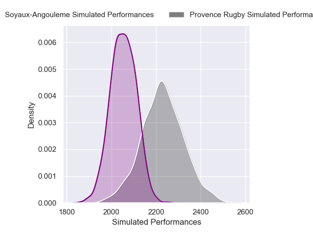

## Week 29

### USON Nevers V Oyonnax on 2026/05/07

Average Margin: USON Nevers by 1.4

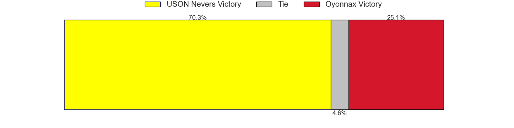

### Carcassonne V Brive on 2026/05/07

Average Margin: Carcassonne by 0.2

### Agen V Soyaux-Angouleme on 2026/05/07

Average Margin: Agen by 5.4

### Dax V Valence Romans Drome Rugby on 2026/05/07

Average Margin: Dax by 2.4

### Provence Rugby V Vannes on 2026/05/07

Average Margin: Provence Rugby by 2.5

### Colomiers V Mont-de-Marsan on 2026/05/07

Average Margin: Colomiers by 8.2

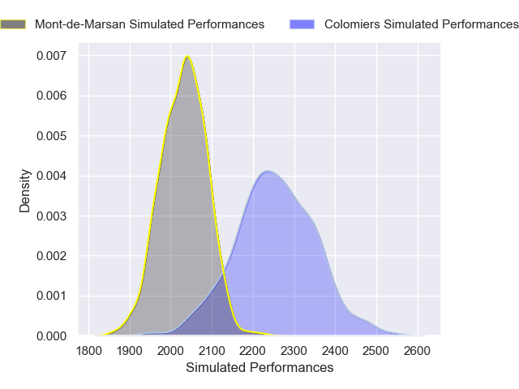

### Beziers V Biarritz Olympique on 2026/05/07

Average Margin: Beziers by 2.2

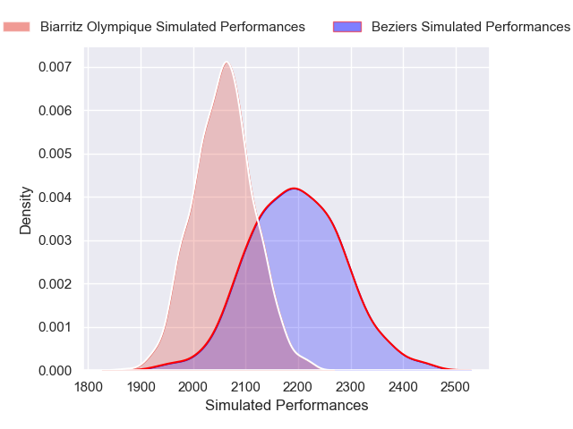

### Aurillac V Grenoble on 2026/05/07

Average Margin: Aurillac by 3.5

## Week 30

### Mont-de-Marsan V Agen on 2026/05/14

Average Margin: Mont-de-Marsan by 1.5

### Biarritz Olympique V Carcassonne on 2026/05/14

Average Margin: Biarritz Olympique by 5.4

### Brive V USON Nevers on 2026/05/14

Average Margin: Brive by 6.7

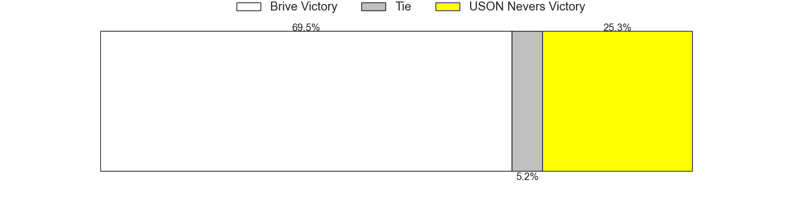

### Grenoble V Colomiers on 2026/05/14

Average Margin: Colomiers by 0.2

### Oyonnax V Aurillac on 2026/05/14

Average Margin: Oyonnax by 6.6

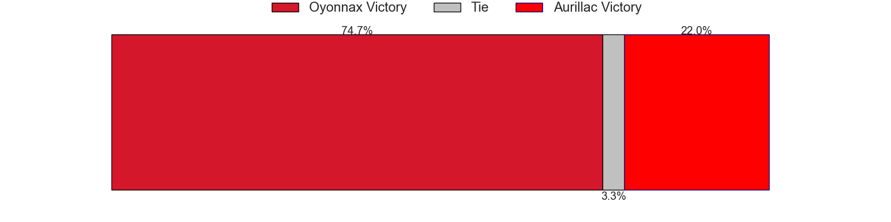

### Vannes V Dax on 2026/05/14

Average Margin: Vannes by 6.6

### Soyaux-Angouleme V Beziers on 2026/05/14

Average Margin: Soyaux-Angouleme by 3.1

### Valence Romans Drome Rugby V Provence Rugby on 2026/05/14

Average Margin: Valence Romans Drome Rugby by 2.2

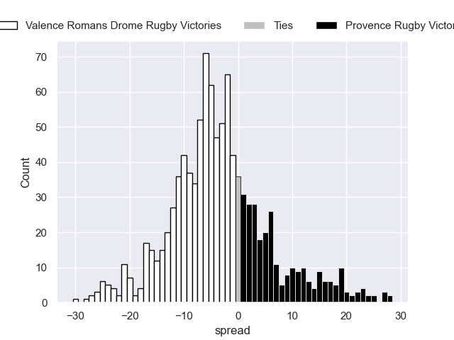

