# Team Rankings

# Standings

## Current Standings

| Club                       |   Played |   Wins |   Point Differential |   Losing Bonus Points |   Try Bonus Points |   Competition Points |
|:---------------------------|---------:|-------:|---------------------:|----------------------:|-------------------:|---------------------:|
| Vannes                     |       16 |     12 |                  223 |                     2 |                  9 |                   61 |
| Valence Romans Drome Rugby |       16 |     12 |                   38 |                     0 |                  7 |                   55 |
| Colomiers                  |       16 |     11 |                  198 |                     3 |                  5 |                   52 |
| Provence Rugby             |       16 |     10 |                  133 |                     5 |                  7 |                   52 |
| Oyonnax                    |       16 |      9 |                  102 |                     4 |                  6 |                   46 |
| Brive                      |       16 |      8 |                  110 |                     1 |                  6 |                   41 |
| USON Nevers                |       16 |      8 |                  -66 |                     2 |                  7 |                   41 |
| Agen                       |       16 |      8 |                    2 |                     3 |                  5 |                   40 |
| Aurillac                   |       16 |      8 |                  -32 |                     3 |                  4 |                   39 |
| Soyaux-Angouleme           |       16 |      8 |                  -70 |                     3 |                  1 |                   36 |
| Dax                        |       16 |      7 |                   33 |                     5 |                  2 |                   35 |
| Grenoble                   |       16 |      7 |                  -37 |                     3 |                  3 |                   34 |
| Biarritz Olympique         |       16 |      6 |                  -83 |                     1 |                  5 |                   32 |
| Beziers                    |       16 |      5 |                  -81 |                     1 |                  5 |                   26 |
| Mont-de-Marsan             |       16 |      4 |                 -233 |                     1 |                  2 |                   19 |
| Carcassonne                |       16 |      3 |                 -237 |                     3 |                  2 |                   19 |

## Projected Remaining Table

| Club                       |   To Play |   Projected Wins |   Projected Differential |   Projected Losing Bonus Points | Projected Try Bonus Points   |   Projected Competition Points |
|:---------------------------|----------:|-----------------:|-------------------------:|--------------------------------:|:-----------------------------|-------------------------------:|
| Vannes                     |        14 |            8.318 |                   48.027 |                           3.052 |                              |                         37.658 |
| Provence Rugby             |        14 |            7.929 |                   30.895 |                           3.198 |                              |                         36.326 |
| Grenoble                   |        14 |            7.647 |                   20.319 |                           3.458 |                              |                         35.628 |
| Colomiers                  |        14 |            7.593 |                   30.936 |                           3.238 |                              |                         34.834 |
| Valence Romans Drome Rugby |        14 |            7.197 |                   14.403 |                           3.6   |                              |                         33.898 |
| Oyonnax                    |        14 |            7.036 |                   14.388 |                           3.321 |                              |                         32.723 |
| Brive                      |        14 |            6.895 |                    6.63  |                           3.269 |                              |                         32.045 |
| Dax                        |        14 |            6.524 |                   -7.016 |                           3.241 |                              |                         30.663 |
| Soyaux-Angouleme           |        14 |            6.336 |                   -8.227 |                           3.456 |                              |                         30.168 |
| Agen                       |        14 |            6.276 |                   -6.549 |                           3.637 |                              |                         30.141 |
| USON Nevers                |        14 |            6.111 |                  -13.544 |                           3.613 |                              |                         29.487 |
| Beziers                    |        14 |            5.977 |                  -20.348 |                           3.603 |                              |                         28.807 |
| Aurillac                   |        14 |            5.925 |                  -23.347 |                           3.235 |                              |                         28.245 |
| Biarritz Olympique         |        14 |            5.702 |                  -19.25  |                           3.877 |                              |                         28.105 |
| Carcassonne                |        14 |            5.608 |                  -31.762 |                           3.432 |                              |                         27.208 |
| Mont-de-Marsan             |        14 |            5.498 |                  -35.555 |                           3.283 |                              |                         26.577 |

## Projected Total Table

| Club                       |   Played |   Wins |   Point Differential |   Losing Bonus Points |   Try Bonus Points |   Competition Points |
|:---------------------------|---------:|-------:|---------------------:|----------------------:|-------------------:|---------------------:|
| Vannes                     |       30 | 20.318 |              271.027 |                 5.052 |                  9 |               98.658 |
| Valence Romans Drome Rugby |       30 | 19.197 |               52.403 |                 3.6   |                  7 |               88.898 |
| Provence Rugby             |       30 | 17.929 |              163.895 |                 8.198 |                  7 |               88.326 |
| Colomiers                  |       30 | 18.593 |              228.936 |                 6.238 |                  5 |               86.834 |
| Oyonnax                    |       30 | 16.036 |              116.388 |                 7.321 |                  6 |               78.723 |
| Brive                      |       30 | 14.895 |              116.63  |                 4.269 |                  6 |               73.045 |
| USON Nevers                |       30 | 14.111 |              -79.544 |                 5.613 |                  7 |               70.487 |
| Agen                       |       30 | 14.276 |               -4.549 |                 6.637 |                  5 |               70.141 |
| Grenoble                   |       30 | 14.647 |              -16.681 |                 6.458 |                  3 |               69.628 |
| Aurillac                   |       30 | 13.925 |              -55.347 |                 6.235 |                  4 |               67.245 |
| Soyaux-Angouleme           |       30 | 14.336 |              -78.227 |                 6.456 |                  1 |               66.168 |
| Dax                        |       30 | 13.524 |               25.984 |                 8.241 |                  2 |               65.663 |
| Biarritz Olympique         |       30 | 11.702 |             -102.25  |                 4.877 |                  5 |               60.105 |
| Beziers                    |       30 | 10.977 |             -101.348 |                 4.603 |                  5 |               54.807 |
| Carcassonne                |       30 |  8.608 |             -268.762 |                 6.432 |                  2 |               46.208 |
| Mont-de-Marsan             |       30 |  9.498 |             -268.555 |                 4.283 |                  2 |               45.577 |

# Completed Match Review

| Model | Percent Correct Predictions | Spread Error |
| ------ | ------ | ------ |
| Club Level | 70.4% | 10.3 |
| Player Level: Lineup | nan% | nan |
| Player Level: Minutes | nan% | nan |

# Future Predictions

## Week 17

### Carcassonne V Dax on 2026/01/16

Average Margin: Carcassonne by 0.9

### Colomiers V Oyonnax on 2026/01/16

Average Margin: Colomiers by 5.4

### Mont-de-Marsan V Valence Romans Drome Rugby on 2026/01/16

Average Margin: Valence Romans Drome Rugby by 0.1

### Grenoble V Agen on 2026/01/16

Average Margin: Grenoble by 4.4

### USON Nevers V Provence Rugby on 2026/01/16

Average Margin: USON Nevers by 0.4

### Biarritz Olympique V Soyaux-Angouleme on 2026/01/16

Average Margin: Biarritz Olympique by 3.0

### Beziers V Aurillac on 2026/01/16

Average Margin: Beziers by 3.8

### Vannes V Brive on 2026/01/17

Average Margin: Vannes by 6.0

## Week 18

### Agen V Colomiers on 2026/01/22

Average Margin: Agen by 1.1

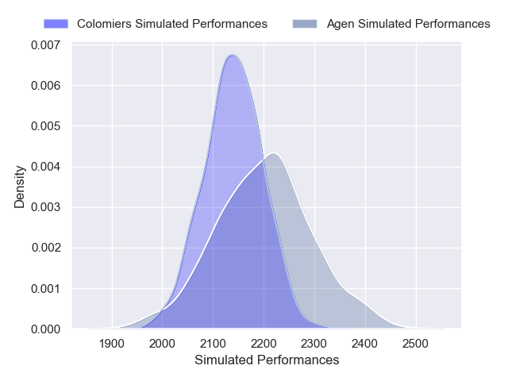

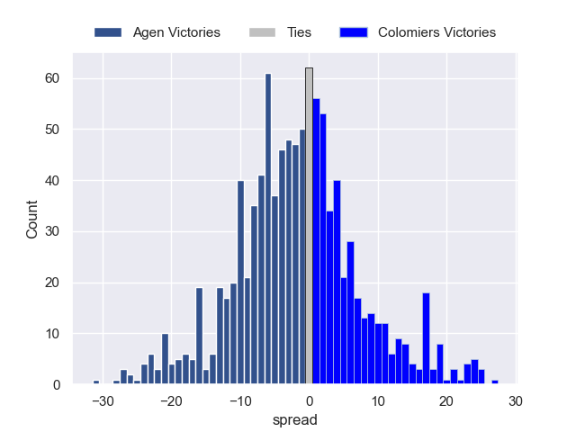

### Soyaux-Angouleme V Oyonnax on 2026/01/23

Average Margin: Soyaux-Angouleme by 2.3

### Dax V Biarritz Olympique on 2026/01/23

Average Margin: Dax by 4.7

### Valence Romans Drome Rugby V Carcassonne on 2026/01/23

Average Margin: Valence Romans Drome Rugby by 7.0

### USON Nevers V Mont-de-Marsan on 2026/01/23

Average Margin: USON Nevers by 5.9

### Provence Rugby V Aurillac on 2026/01/23

Average Margin: Provence Rugby by 7.2

### Grenoble V Vannes on 2026/01/23

Average Margin: Grenoble by 0.3

### Brive V Beziers on 2026/01/23

Average Margin: Brive by 6.0

## Week 19

### Oyonnax V Vannes on 2026/01/29

Average Margin: Oyonnax by 1.2

### Aurillac V Valence Romans Drome Rugby on 2026/01/30

Average Margin: Aurillac by 1.3

### Beziers V Dax on 2026/01/30

Average Margin: Beziers by 2.3

### Mont-de-Marsan V Brive on 2026/01/30

Average Margin: Brive by 0.0

### Carcassonne V Provence Rugby on 2026/01/30

Average Margin: Provence Rugby by 1.9

### Agen V USON Nevers on 2026/01/30

Average Margin: Agen by 4.6

### Biarritz Olympique V Grenoble on 2026/01/30

Average Margin: Biarritz Olympique by 0.9

### Colomiers V Soyaux-Angouleme on 2026/01/30

Average Margin: Colomiers by 6.6

## Week 20

### Valence Romans Drome Rugby V Biarritz Olympique on 2026/02/12

Average Margin: Valence Romans Drome Rugby by 6.0

### USON Nevers V Colomiers on 2026/02/12

Average Margin: USON Nevers by 0.5

### Dax V Aurillac on 2026/02/12

Average Margin: Dax by 4.7

### Soyaux-Angouleme V Mont-de-Marsan on 2026/02/12

Average Margin: Soyaux-Angouleme by 5.6

### Brive V Agen on 2026/02/12

Average Margin: Brive by 5.2

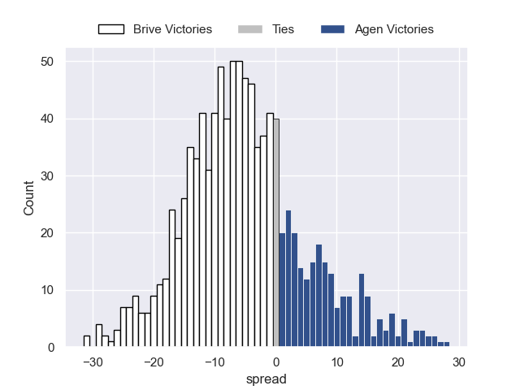

### Provence Rugby V Oyonnax on 2026/02/12

Average Margin: Provence Rugby by 4.5

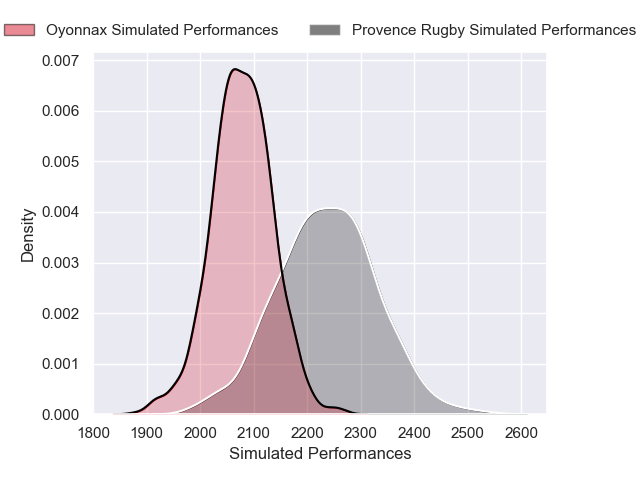

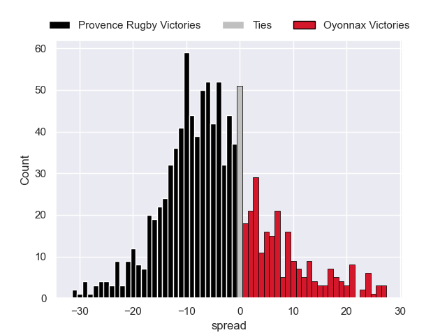

### Beziers V Grenoble on 2026/02/12

Average Margin: Beziers by 1.2

### Vannes V Carcassonne on 2026/02/12

Average Margin: Vannes by 9.4

## Week 21

### Biarritz Olympique V Vannes on 2026/02/19

Average Margin: Vannes by 1.5

### Colomiers V Beziers on 2026/02/19

Average Margin: Colomiers by 7.4

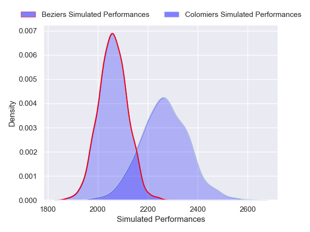

### Grenoble V Brive on 2026/02/19

Average Margin: Grenoble by 3.2

### Oyonnax V Mont-de-Marsan on 2026/02/19

Average Margin: Oyonnax by 7.9

### Aurillac V Soyaux-Angouleme on 2026/02/19

Average Margin: Aurillac by 3.4

### Agen V Valence Romans Drome Rugby on 2026/02/19

Average Margin: Agen by 2.4

### Carcassonne V USON Nevers on 2026/02/19

Average Margin: Carcassonne by 1.9

### Dax V Provence Rugby on 2026/02/19

Average Margin: Dax by 1.0

## Week 22

### Carcassonne V Aurillac on 2026/02/26

Average Margin: Carcassonne by 2.5

### Mont-de-Marsan V Biarritz Olympique on 2026/02/26

Average Margin: Mont-de-Marsan by 2.2

### Soyaux-Angouleme V Valence Romans Drome Rugby on 2026/02/26

Average Margin: Soyaux-Angouleme by 2.2

### USON Nevers V Grenoble on 2026/02/26

Average Margin: USON Nevers by 1.4

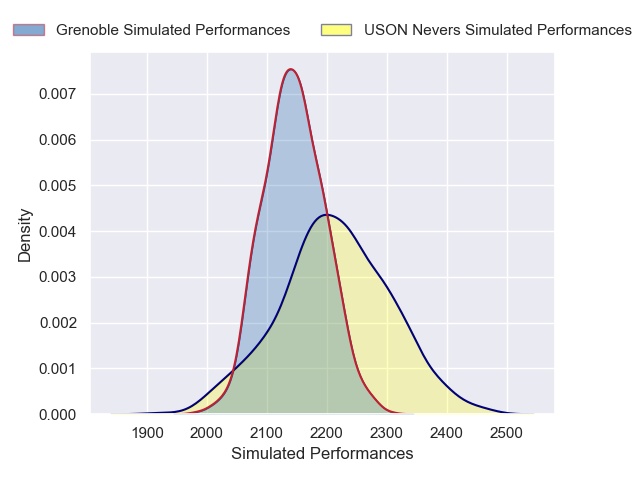

### Provence Rugby V Agen on 2026/02/26

Average Margin: Provence Rugby by 5.4

### Brive V Dax on 2026/02/26

Average Margin: Brive by 5.3

### Beziers V Oyonnax on 2026/02/26

Average Margin: Beziers by 1.5

### Vannes V Colomiers on 2026/02/26

Average Margin: Vannes by 5.0

## Week 23

### Agen V Carcassonne on 2026/03/05

Average Margin: Agen by 5.7

### Mont-de-Marsan V Beziers on 2026/03/05

Average Margin: Mont-de-Marsan by 2.2

### Aurillac V USON Nevers on 2026/03/05

Average Margin: Aurillac by 3.9

### Valence Romans Drome Rugby V Vannes on 2026/03/05

Average Margin: Valence Romans Drome Rugby by 1.5

### Grenoble V Soyaux-Angouleme on 2026/03/05

Average Margin: Grenoble by 4.9

### Colomiers V Brive on 2026/03/05

Average Margin: Colomiers by 5.4

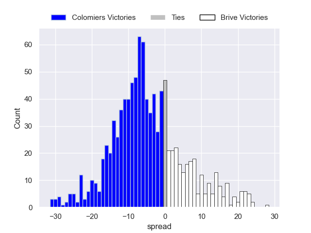

### Biarritz Olympique V Provence Rugby on 2026/03/05

Average Margin: Biarritz Olympique by 0.6

### Oyonnax V Dax on 2026/03/05

Average Margin: Oyonnax by 5.8

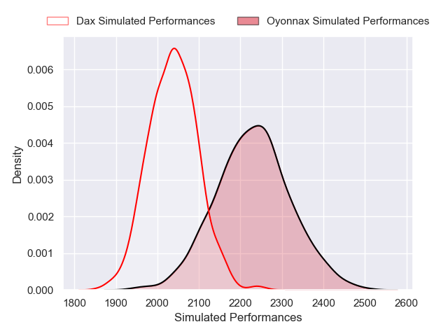

## Week 24

### Beziers V Agen on 2026/03/26

Average Margin: Beziers by 2.5

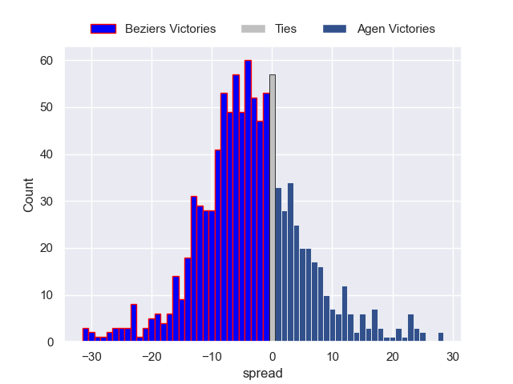

### Provence Rugby V Colomiers on 2026/03/26

Average Margin: Provence Rugby by 3.4

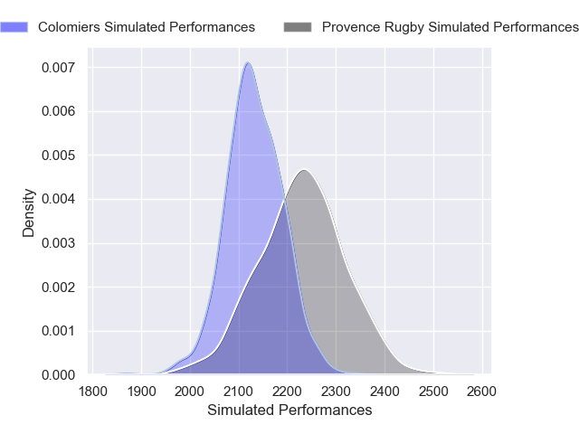

### Vannes V USON Nevers on 2026/03/26

Average Margin: Vannes by 7.6

### Soyaux-Angouleme V Brive on 2026/03/26

Average Margin: Soyaux-Angouleme by 2.0

### Aurillac V Biarritz Olympique on 2026/03/26

Average Margin: Aurillac by 3.8

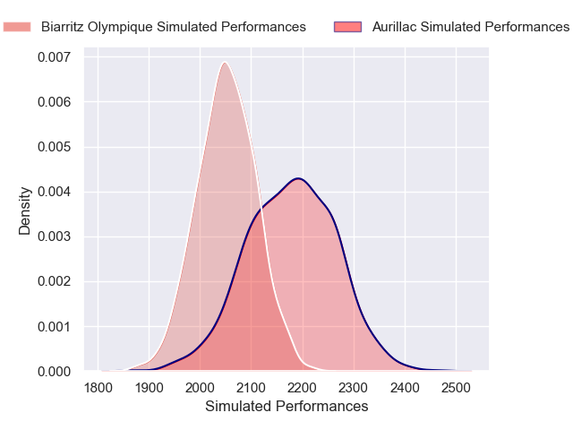

### Carcassonne V Mont-de-Marsan on 2026/03/26

Average Margin: Carcassonne by 3.9

### Dax V Grenoble on 2026/03/26

Average Margin: Dax by 2.3

### Valence Romans Drome Rugby V Oyonnax on 2026/03/26

Average Margin: Valence Romans Drome Rugby by 3.9

## Week 25

### Colomiers V Dax on 2026/04/02

Average Margin: Colomiers by 6.6

### Mont-de-Marsan V Aurillac on 2026/04/02

Average Margin: Mont-de-Marsan by 2.4

### Brive V Provence Rugby on 2026/04/02

Average Margin: Brive by 2.6

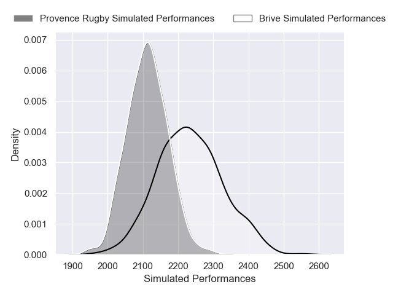

### USON Nevers V Beziers on 2026/04/02

Average Margin: USON Nevers by 4.6

### Oyonnax V Biarritz Olympique on 2026/04/02

Average Margin: Oyonnax by 6.4

### Soyaux-Angouleme V Carcassonne on 2026/04/02

Average Margin: Soyaux-Angouleme by 5.7

### Grenoble V Valence Romans Drome Rugby on 2026/04/02

Average Margin: Grenoble by 3.5

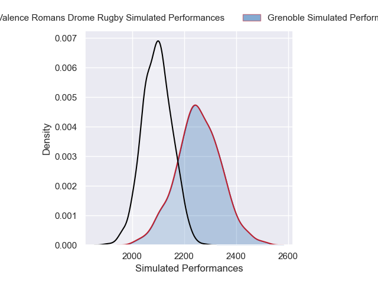

### Agen V Vannes on 2026/04/02

Average Margin: Vannes by 0.4

## Week 26

### Vannes V Beziers on 2026/04/09

Average Margin: Vannes by 8.1

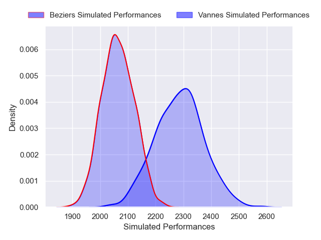

### Valence Romans Drome Rugby V Colomiers on 2026/04/09

Average Margin: Valence Romans Drome Rugby by 3.3

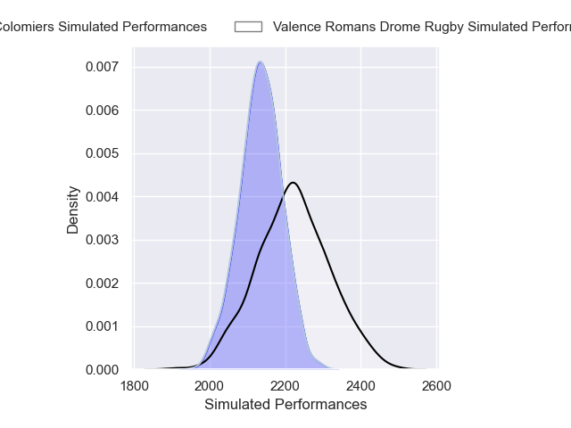

### Aurillac V Agen on 2026/04/09

Average Margin: Aurillac by 3.6

### Biarritz Olympique V USON Nevers on 2026/04/09

Average Margin: Biarritz Olympique by 3.3

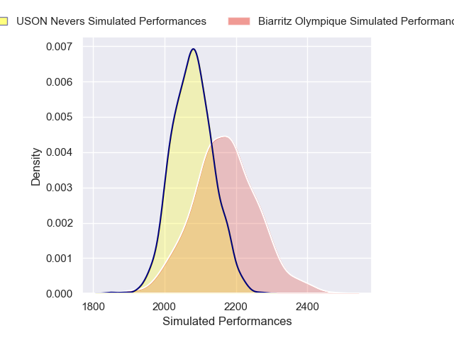

### Dax V Soyaux-Angouleme on 2026/04/09

Average Margin: Dax by 3.4

### Carcassonne V Grenoble on 2026/04/09

Average Margin: Grenoble by 0.4

### Oyonnax V Brive on 2026/04/09

Average Margin: Oyonnax by 4.3

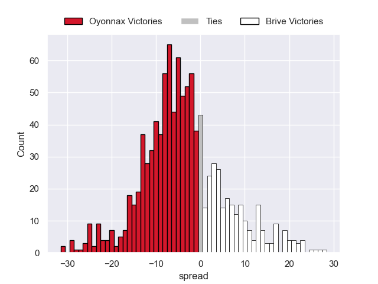

### Provence Rugby V Mont-de-Marsan on 2026/04/09

Average Margin: Provence Rugby by 7.8

## Week 27

### Beziers V Provence Rugby on 2026/04/16

Average Margin: Beziers by 0.1

### Brive V Aurillac on 2026/04/16

Average Margin: Brive by 5.8

### Colomiers V Carcassonne on 2026/04/16

Average Margin: Colomiers by 7.7

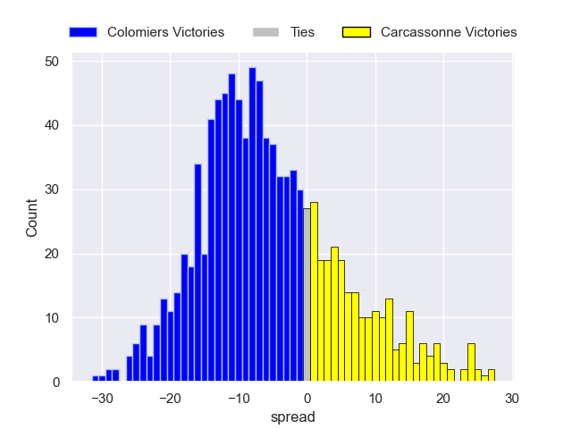

### Grenoble V Oyonnax on 2026/04/16

Average Margin: Grenoble by 3.3

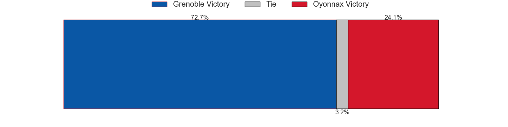

### Soyaux-Angouleme V Vannes on 2026/04/16

Average Margin: Soyaux-Angouleme by 0.1

### Mont-de-Marsan V Dax on 2026/04/16

Average Margin: Mont-de-Marsan by 1.3

### Agen V Biarritz Olympique on 2026/04/16

Average Margin: Agen by 4.6

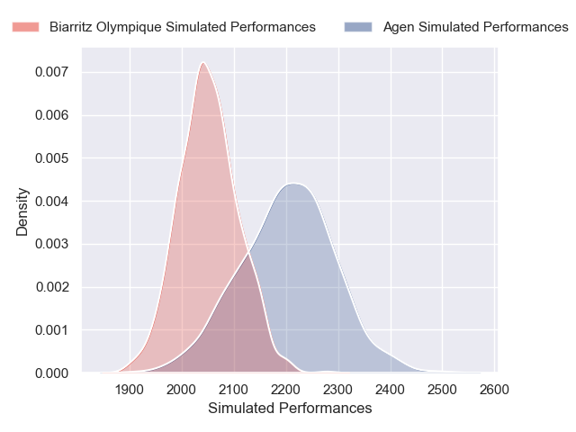

### USON Nevers V Valence Romans Drome Rugby on 2026/04/16

Average Margin: USON Nevers by 2.1

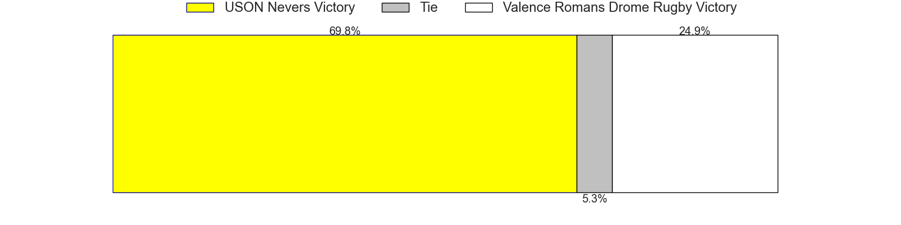

## Week 28

### Carcassonne V Beziers on 2026/04/23

Average Margin: Carcassonne by 2.1

### Dax V USON Nevers on 2026/04/23

Average Margin: Dax by 3.9

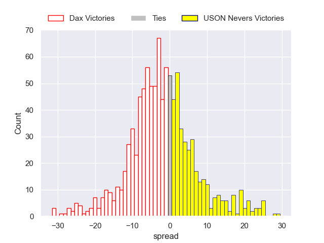

### Valence Romans Drome Rugby V Brive on 2026/04/23

Average Margin: Valence Romans Drome Rugby by 3.5

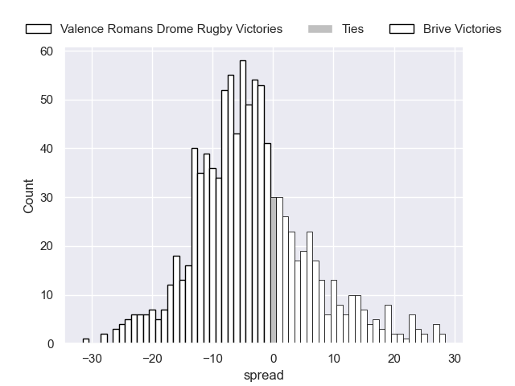

### Vannes V Aurillac on 2026/04/23

Average Margin: Vannes by 8.7

### Grenoble V Mont-de-Marsan on 2026/04/23

Average Margin: Grenoble by 6.2

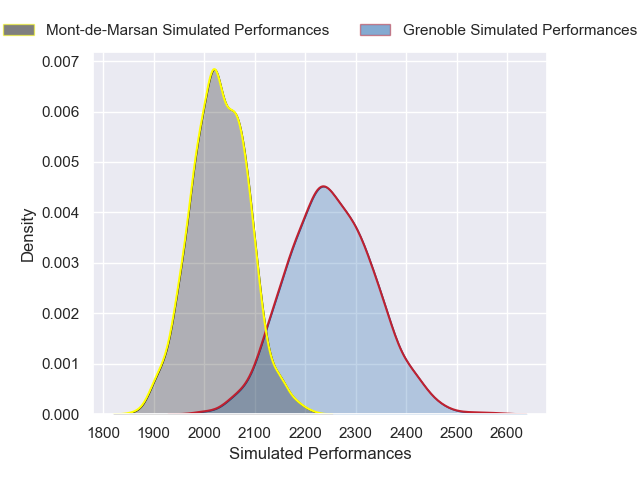

### Oyonnax V Agen on 2026/04/23

Average Margin: Oyonnax by 5.6

### Biarritz Olympique V Colomiers on 2026/04/23

Average Margin: Biarritz Olympique by 0.1

### Provence Rugby V Soyaux-Angouleme on 2026/04/23

Average Margin: Provence Rugby by 5.8

## Week 29

### USON Nevers V Oyonnax on 2026/05/07

Average Margin: USON Nevers by 2.7

### Carcassonne V Brive on 2026/05/07

Average Margin: Brive by 0.4

### Agen V Soyaux-Angouleme on 2026/05/07

Average Margin: Agen by 3.5

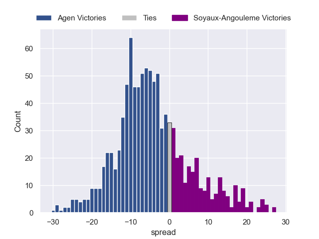

### Dax V Valence Romans Drome Rugby on 2026/05/07

Average Margin: Dax by 2.1

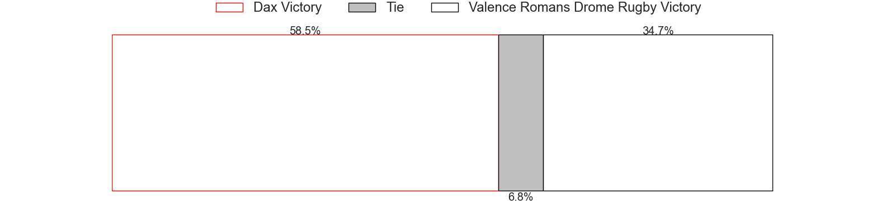
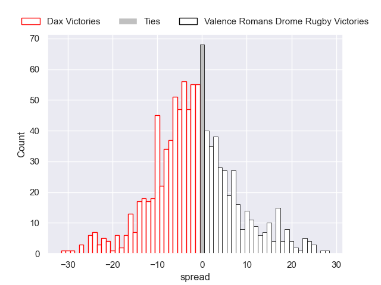

### Provence Rugby V Vannes on 2026/05/07

Average Margin: Provence Rugby by 2.2

### Colomiers V Mont-de-Marsan on 2026/05/07

Average Margin: Colomiers by 7.8

### Beziers V Biarritz Olympique on 2026/05/07

Average Margin: Beziers by 3.0

### Aurillac V Grenoble on 2026/05/07

Average Margin: Aurillac by 2.6

## Week 30

### Mont-de-Marsan V Agen on 2026/05/14

Average Margin: Mont-de-Marsan by 1.3

### Biarritz Olympique V Carcassonne on 2026/05/14

Average Margin: Biarritz Olympique by 4.9

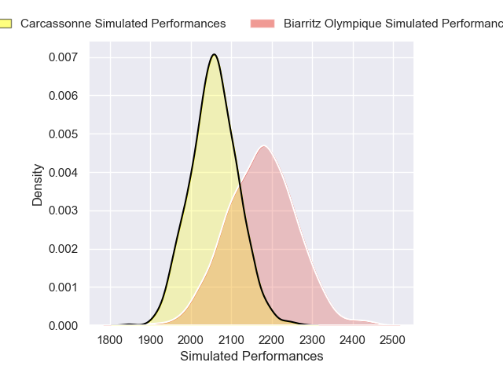

### Brive V USON Nevers on 2026/05/14

Average Margin: Brive by 5.7

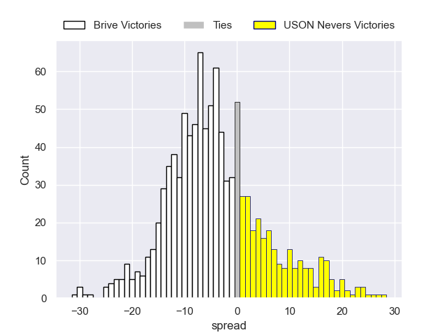

### Grenoble V Colomiers on 2026/05/14

Average Margin: Grenoble by 2.5

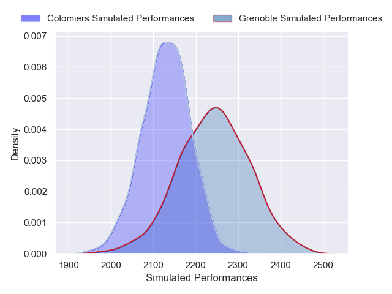

### Oyonnax V Aurillac on 2026/05/14

Average Margin: Oyonnax by 6.8

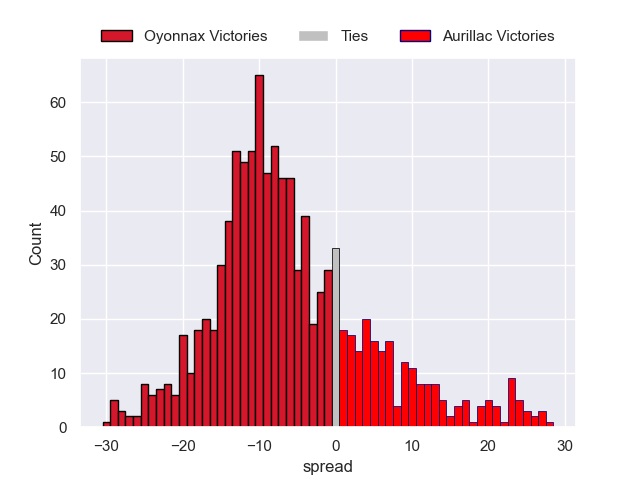

### Vannes V Dax on 2026/05/14

Average Margin: Vannes by 6.8

### Soyaux-Angouleme V Beziers on 2026/05/14

Average Margin: Soyaux-Angouleme by 4.4

### Valence Romans Drome Rugby V Provence Rugby on 2026/05/14

Average Margin: Valence Romans Drome Rugby by 2.6

