# Team Rankings

# Standings

## Current Standings

| Club                       |   Played |   Wins |   Point Differential |   Losing Bonus Points |   Try Bonus Points |   Competition Points |
|:---------------------------|---------:|-------:|---------------------:|----------------------:|-------------------:|---------------------:|
| Vannes                     |       19 |     15 |                  257 |                     2 |                 12 |                   76 |
| Colomiers                  |       19 |     14 |                  251 |                     3 |                  7 |                   66 |
| Provence Rugby             |       19 |     13 |                  188 |                     5 |                  9 |                   66 |
| Valence Romans Drome Rugby |       19 |     13 |                   36 |                     2 |                  7 |                   61 |
| Oyonnax                    |       19 |     10 |                  110 |                     6 |                  7 |                   53 |
| Brive                      |       19 |      9 |                  102 |                     1 |                  7 |                   46 |
| Agen                       |       19 |      9 |                   29 |                     3 |                  7 |                   46 |
| Aurillac                   |       19 |      9 |                  -59 |                     3 |                  5 |                   44 |
| USON Nevers                |       19 |      8 |                 -147 |                     2 |                  8 |                   44 |
| Dax                        |       19 |      8 |                   33 |                     7 |                  2 |                   41 |
| Biarritz Olympique         |       19 |      8 |                  -58 |                     1 |                  6 |                   41 |
| Grenoble                   |       19 |      8 |                  -41 |                     4 |                  4 |                   40 |
| Soyaux-Angouleme           |       19 |      8 |                 -148 |                     3 |                  1 |                   36 |
| Beziers                    |       19 |      7 |                  -99 |                     1 |                  5 |                   34 |
| Mont-de-Marsan             |       19 |      6 |                 -211 |                     1 |                  2 |                   29 |
| Carcassonne                |       19 |      4 |                 -243 |                     5 |                  2 |                   25 |

## Projected Remaining Table

| Club                       |   To Play |   Projected Wins |   Projected Differential |   Projected Losing Bonus Points | Projected Try Bonus Points   |   Projected Competition Points |
|:---------------------------|----------:|-----------------:|-------------------------:|--------------------------------:|:-----------------------------|-------------------------------:|
| Vannes                     |        11 |            6.845 |                   49.061 |                           2.103 |                              |                         30.345 |
| Provence Rugby             |        11 |            6.355 |                   31.056 |                           2.344 |                              |                         28.774 |
| Oyonnax                    |        11 |            6.197 |                   27.249 |                           2.237 |                              |                         28.017 |
| Colomiers                  |        11 |            6.159 |                   30.324 |                           2.277 |                              |                         27.869 |
| Valence Romans Drome Rugby |        11 |            5.588 |                    9.72  |                           2.788 |                              |                         26.282 |
| Grenoble                   |        11 |            5.591 |                    8.648 |                           2.747 |                              |                         26.263 |
| Brive                      |        11 |            5.248 |                    1.034 |                           2.585 |                              |                         24.677 |
| Dax                        |        11 |            5.169 |                   -5.225 |                           2.384 |                              |                         24.046 |
| Agen                       |        11 |            5.058 |                   -4.254 |                           2.674 |                              |                         23.844 |
| Aurillac                   |        11 |            4.96  |                  -12.596 |                           2.305 |                              |                         23.117 |
| Soyaux-Angouleme           |        11 |            4.69  |                  -15.923 |                           2.655 |                              |                         22.437 |
| Beziers                    |        11 |            4.414 |                  -22.118 |                           2.845 |                              |                         21.685 |
| Biarritz Olympique         |        11 |            4.435 |                  -16.304 |                           2.931 |                              |                         21.665 |
| Carcassonne                |        11 |            4.482 |                  -26.505 |                           2.559 |                              |                         21.521 |
| Mont-de-Marsan             |        11 |            4.497 |                  -25.706 |                           2.441 |                              |                         21.519 |
| USON Nevers                |        11 |            4.189 |                  -28.461 |                           2.784 |                              |                         20.598 |

## Projected Total Table

| Club                       |   Played |   Wins |   Point Differential |   Losing Bonus Points |   Try Bonus Points |   Competition Points |
|:---------------------------|---------:|-------:|---------------------:|----------------------:|-------------------:|---------------------:|
| Vannes                     |       30 | 21.845 |              306.061 |                 4.103 |                 12 |              106.345 |
| Provence Rugby             |       30 | 19.355 |              219.056 |                 7.344 |                  9 |               94.774 |
| Colomiers                  |       30 | 20.159 |              281.324 |                 5.277 |                  7 |               93.869 |
| Valence Romans Drome Rugby |       30 | 18.588 |               45.72  |                 4.788 |                  7 |               87.282 |
| Oyonnax                    |       30 | 16.197 |              137.249 |                 8.237 |                  7 |               81.017 |
| Brive                      |       30 | 14.248 |              103.034 |                 3.585 |                  7 |               70.677 |
| Agen                       |       30 | 14.058 |               24.746 |                 5.674 |                  7 |               69.844 |
| Aurillac                   |       30 | 13.96  |              -71.596 |                 5.305 |                  5 |               67.117 |
| Grenoble                   |       30 | 13.591 |              -32.352 |                 6.747 |                  4 |               66.263 |
| Dax                        |       30 | 13.169 |               27.775 |                 9.384 |                  2 |               65.046 |
| USON Nevers                |       30 | 12.189 |             -175.461 |                 4.784 |                  8 |               64.598 |
| Biarritz Olympique         |       30 | 12.435 |              -74.304 |                 3.931 |                  6 |               62.665 |
| Soyaux-Angouleme           |       30 | 12.69  |             -163.923 |                 5.655 |                  1 |               58.437 |
| Beziers                    |       30 | 11.414 |             -121.118 |                 3.845 |                  5 |               55.685 |
| Mont-de-Marsan             |       30 | 10.497 |             -236.706 |                 3.441 |                  2 |               50.519 |
| Carcassonne                |       30 |  8.482 |             -269.505 |                 7.559 |                  2 |               46.521 |

# Completed Match Review

| Model | Percent Correct Predictions | Spread Error |
| ------ | ------ | ------ |
| Club Level | 66.7% | 11.6 |
| Player Level: Lineup | nan% | nan |
| Player Level: Minutes | nan% | nan |

# Future Predictions

## Week 20

### USON Nevers V Colomiers on 2026/02/12

Average Margin: Colomiers by 1.9

### Provence Rugby V Oyonnax on 2026/02/13

Average Margin: Provence Rugby by 5.4

### Soyaux-Angouleme V Mont-de-Marsan on 2026/02/13

Average Margin: Soyaux-Angouleme by 3.8

### Valence Romans Drome Rugby V Biarritz Olympique on 2026/02/13

Average Margin: Valence Romans Drome Rugby by 6.1

### Vannes V Carcassonne on 2026/02/13

Average Margin: Vannes by 9.8

### Beziers V Grenoble on 2026/02/13

Average Margin: Beziers by 1.5

### Dax V Aurillac on 2026/02/13

Average Margin: Dax by 5.1

### Brive V Agen on 2026/02/13

Average Margin: Brive by 4.3

## Week 21

### Grenoble V Brive on 2026/02/19

Average Margin: Grenoble by 3.2

### Carcassonne V USON Nevers on 2026/02/20

Average Margin: Carcassonne by 2.8

### Aurillac V Soyaux-Angouleme on 2026/02/20

Average Margin: Aurillac by 4.7

### Agen V Valence Romans Drome Rugby on 2026/02/20

Average Margin: Agen by 2.1

### Dax V Provence Rugby on 2026/02/20

Average Margin: Dax by 0.7

### Colomiers V Beziers on 2026/02/20

Average Margin: Colomiers by 8.0

### Biarritz Olympique V Vannes on 2026/02/20

Average Margin: Vannes by 1.6

### Oyonnax V Mont-de-Marsan on 2026/02/20

Average Margin: Oyonnax by 8.5

## Week 22

### Mont-de-Marsan V Biarritz Olympique on 2026/02/26

Average Margin: Mont-de-Marsan by 2.0

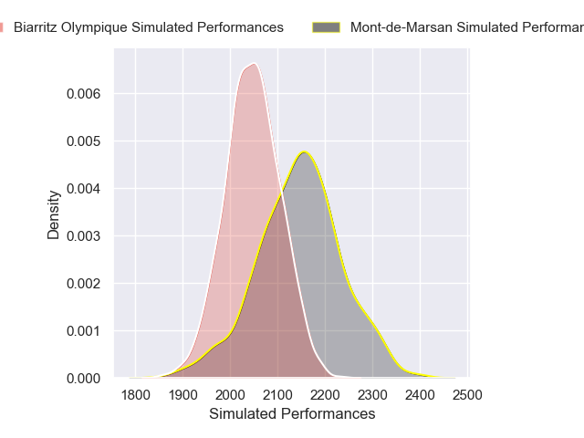

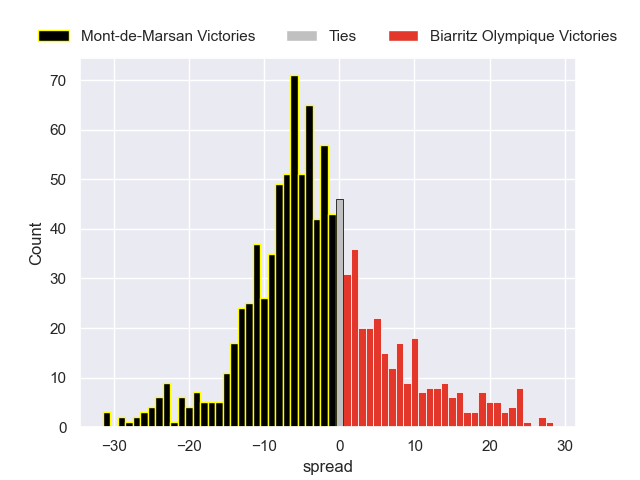

### Carcassonne V Aurillac on 2026/02/26

Average Margin: Carcassonne by 1.8

### USON Nevers V Grenoble on 2026/02/26

Average Margin: USON Nevers by 1.4

### Soyaux-Angouleme V Valence Romans Drome Rugby on 2026/02/26

Average Margin: Soyaux-Angouleme by 0.7

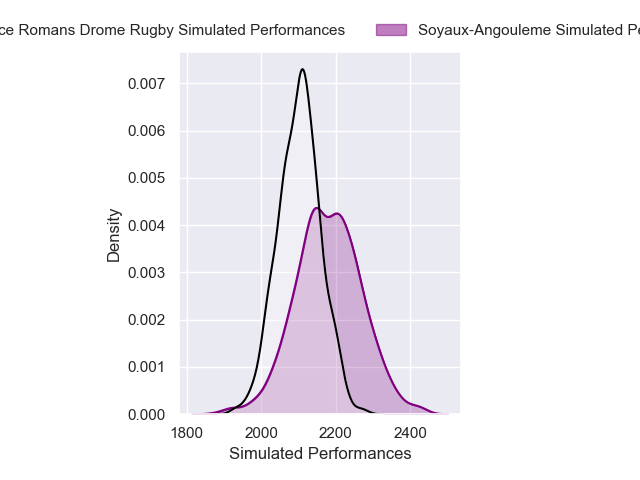

### Provence Rugby V Agen on 2026/02/26

Average Margin: Provence Rugby by 6.9

### Brive V Dax on 2026/02/26

Average Margin: Brive by 4.3

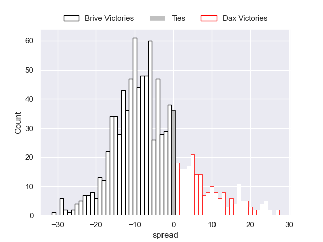

### Beziers V Oyonnax on 2026/02/26

Average Margin: Beziers by 0.3

### Vannes V Colomiers on 2026/02/26

Average Margin: Vannes by 5.0

## Week 23

### Agen V Carcassonne on 2026/03/05

Average Margin: Agen by 6.4

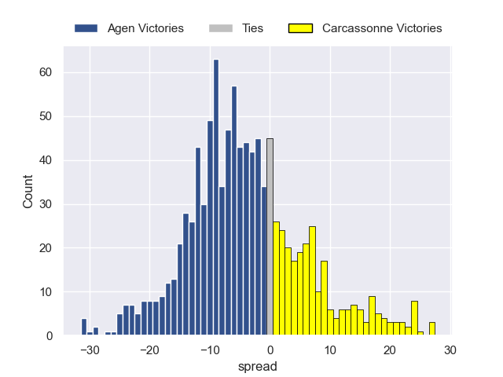

### Mont-de-Marsan V Beziers on 2026/03/05

Average Margin: Mont-de-Marsan by 2.9

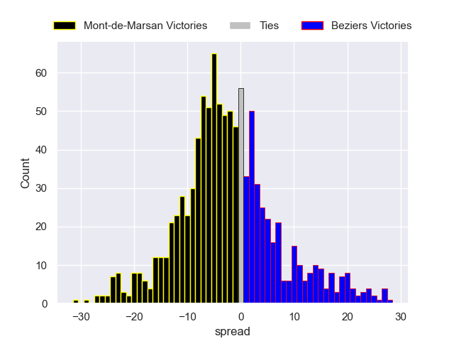

### Aurillac V USON Nevers on 2026/03/05

Average Margin: Aurillac by 5.1

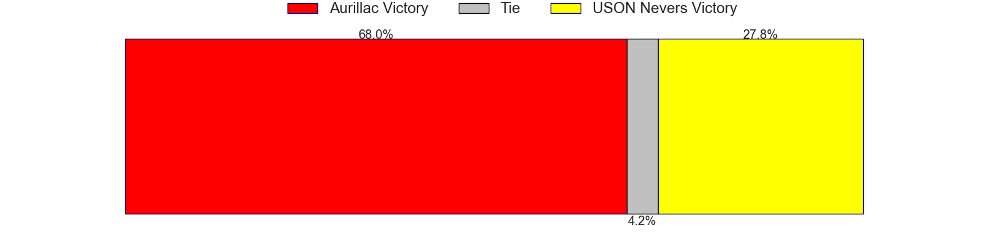

### Valence Romans Drome Rugby V Vannes on 2026/03/05

Average Margin: Valence Romans Drome Rugby by 0.5

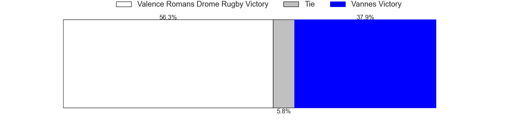

### Grenoble V Soyaux-Angouleme on 2026/03/05

Average Margin: Grenoble by 5.2

### Colomiers V Brive on 2026/03/05

Average Margin: Colomiers by 6.5

### Biarritz Olympique V Provence Rugby on 2026/03/05

Average Margin: Provence Rugby by 0.3

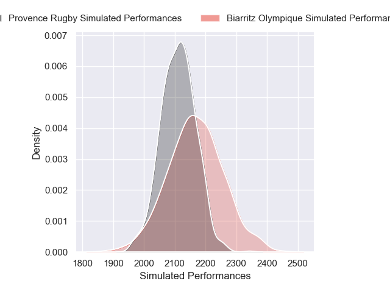

### Oyonnax V Dax on 2026/03/05

Average Margin: Oyonnax by 6.1

## Week 24

### Beziers V Agen on 2026/03/26

Average Margin: Beziers by 1.5

### Provence Rugby V Colomiers on 2026/03/26

Average Margin: Provence Rugby by 3.7

### Vannes V USON Nevers on 2026/03/26

Average Margin: Vannes by 9.1

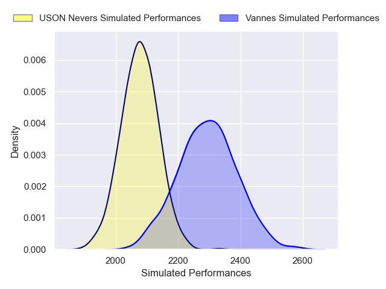

### Soyaux-Angouleme V Brive on 2026/03/26

Average Margin: Soyaux-Angouleme by 1.5

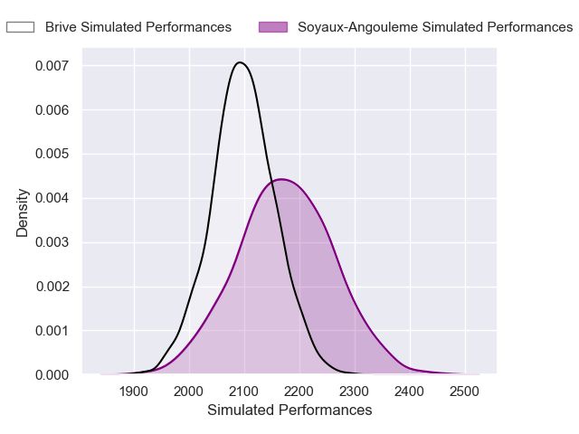

### Aurillac V Biarritz Olympique on 2026/03/26

Average Margin: Aurillac by 3.6

### Carcassonne V Mont-de-Marsan on 2026/03/26

Average Margin: Carcassonne by 2.4

### Dax V Grenoble on 2026/03/26

Average Margin: Dax by 3.4

### Valence Romans Drome Rugby V Oyonnax on 2026/03/26

Average Margin: Valence Romans Drome Rugby by 3.7

## Week 25

### Mont-de-Marsan V Aurillac on 2026/04/02

Average Margin: Mont-de-Marsan by 3.3

### Brive V Provence Rugby on 2026/04/02

Average Margin: Brive by 1.5

### Grenoble V Valence Romans Drome Rugby on 2026/04/02

Average Margin: Grenoble by 2.3

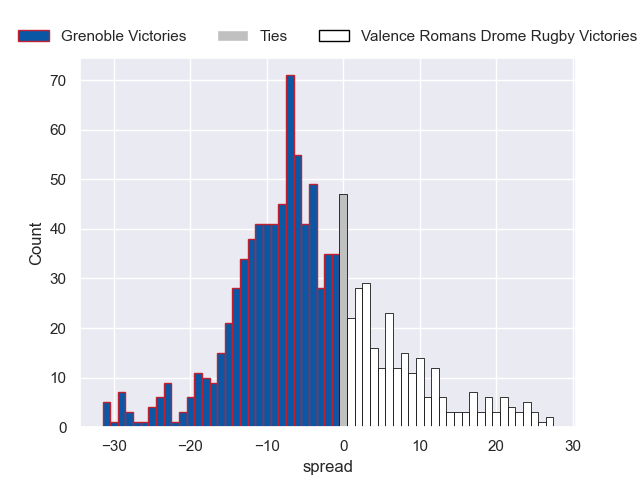

### Soyaux-Angouleme V Carcassonne on 2026/04/02

Average Margin: Soyaux-Angouleme by 4.9

### Colomiers V Dax on 2026/04/02

Average Margin: Colomiers by 6.9

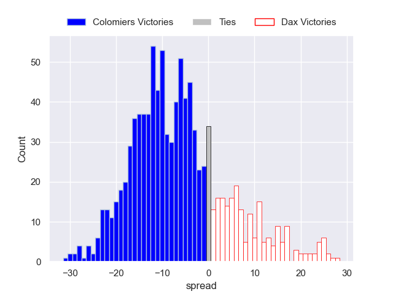

### Oyonnax V Biarritz Olympique on 2026/04/02

Average Margin: Oyonnax by 6.6

### USON Nevers V Beziers on 2026/04/02

Average Margin: USON Nevers by 3.3

### Agen V Vannes on 2026/04/02

Average Margin: Agen by 0.2

## Week 26

### Biarritz Olympique V USON Nevers on 2026/04/09

Average Margin: Biarritz Olympique by 5.1

### Carcassonne V Grenoble on 2026/04/09

Average Margin: Carcassonne by 0.3

### Aurillac V Agen on 2026/04/09

Average Margin: Aurillac by 2.5

### Oyonnax V Brive on 2026/04/09

Average Margin: Oyonnax by 5.6

### Vannes V Beziers on 2026/04/09

Average Margin: Vannes by 8.4

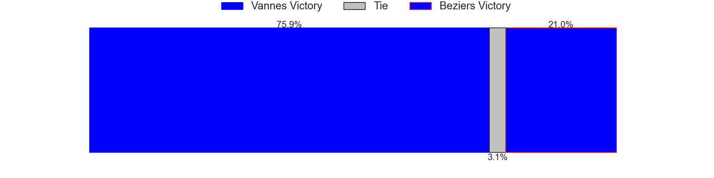
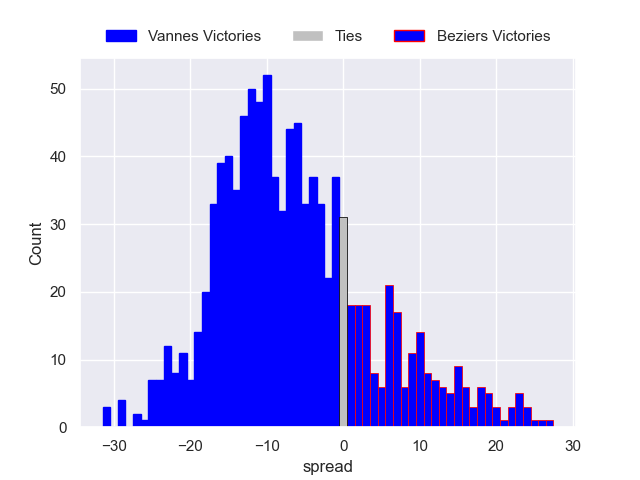

### Provence Rugby V Mont-de-Marsan on 2026/04/09

Average Margin: Provence Rugby by 8.3

### Valence Romans Drome Rugby V Colomiers on 2026/04/09

Average Margin: Valence Romans Drome Rugby by 1.4

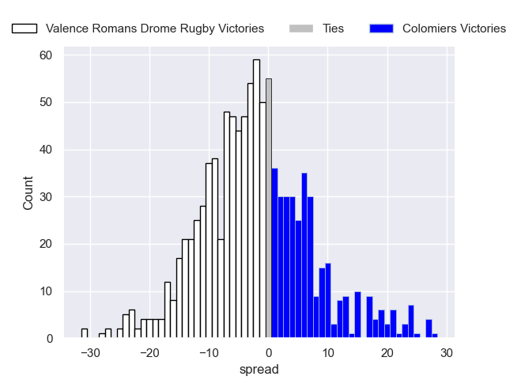

### Dax V Soyaux-Angouleme on 2026/04/09

Average Margin: Dax by 4.8

## Week 27

### USON Nevers V Valence Romans Drome Rugby on 2026/04/16

Average Margin: USON Nevers by 0.9

### Agen V Biarritz Olympique on 2026/04/16

Average Margin: Agen by 4.3

### Mont-de-Marsan V Dax on 2026/04/16

Average Margin: Mont-de-Marsan by 1.8

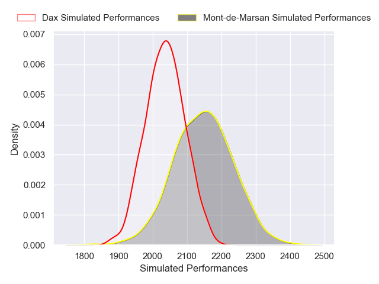

### Soyaux-Angouleme V Vannes on 2026/04/16

Average Margin: Vannes by 2.1

### Beziers V Provence Rugby on 2026/04/16

Average Margin: Provence Rugby by 0.3

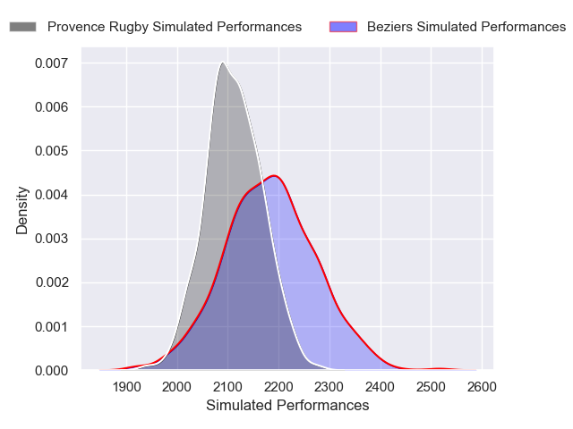

### Colomiers V Carcassonne on 2026/04/16

Average Margin: Colomiers by 9.0

### Brive V Aurillac on 2026/04/16

Average Margin: Brive by 6.4

### Grenoble V Oyonnax on 2026/04/16

Average Margin: Grenoble by 1.8

## Week 28

### Valence Romans Drome Rugby V Brive on 2026/04/23

Average Margin: Valence Romans Drome Rugby by 4.3

### Dax V USON Nevers on 2026/04/23

Average Margin: Dax by 4.9

### Carcassonne V Beziers on 2026/04/23

Average Margin: Carcassonne by 1.5

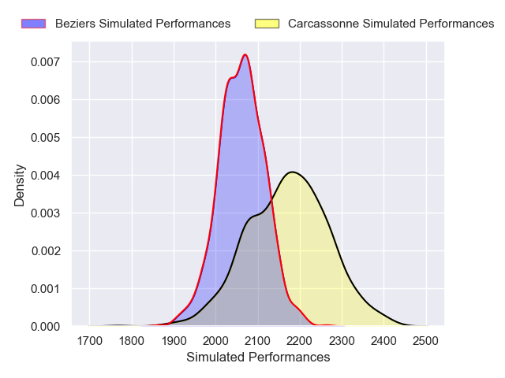

### Vannes V Aurillac on 2026/04/23

Average Margin: Vannes by 8.8

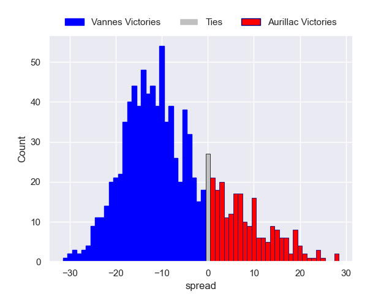

### Oyonnax V Agen on 2026/04/23

Average Margin: Oyonnax by 6.0

### Grenoble V Mont-de-Marsan on 2026/04/23

Average Margin: Grenoble by 5.4

### Biarritz Olympique V Colomiers on 2026/04/23

Average Margin: Colomiers by 0.2

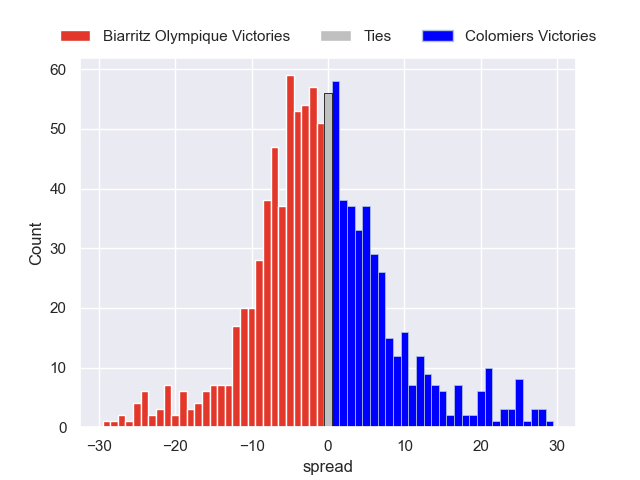

### Provence Rugby V Soyaux-Angouleme on 2026/04/23

Average Margin: Provence Rugby by 8.0

## Week 29

### USON Nevers V Oyonnax on 2026/05/07

Average Margin: USON Nevers by 0.9

### Carcassonne V Brive on 2026/05/07

Average Margin: Carcassonne by 0.4

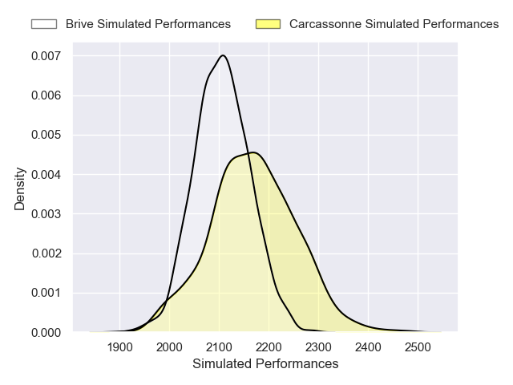

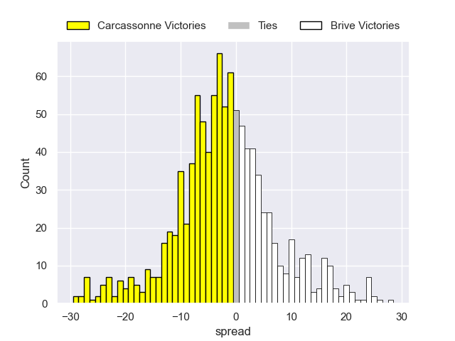

### Agen V Soyaux-Angouleme on 2026/05/07

Average Margin: Agen by 5.3

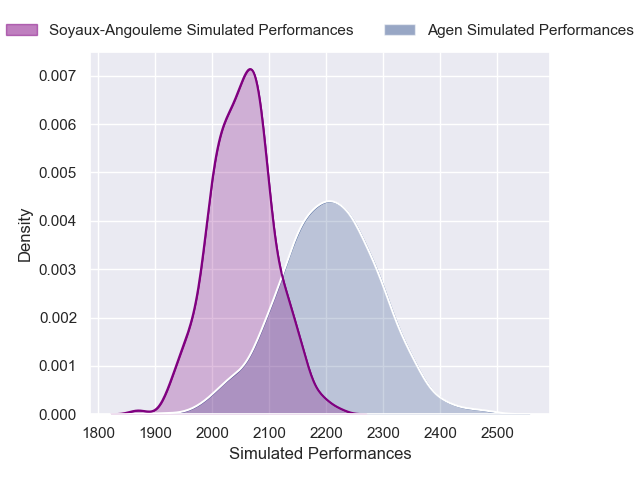

### Dax V Valence Romans Drome Rugby on 2026/05/07

Average Margin: Dax by 2.1

### Provence Rugby V Vannes on 2026/05/07

Average Margin: Provence Rugby by 2.2

### Colomiers V Mont-de-Marsan on 2026/05/07

Average Margin: Colomiers by 8.6

### Beziers V Biarritz Olympique on 2026/05/07

Average Margin: Beziers by 2.2

### Aurillac V Grenoble on 2026/05/07

Average Margin: Aurillac by 3.3

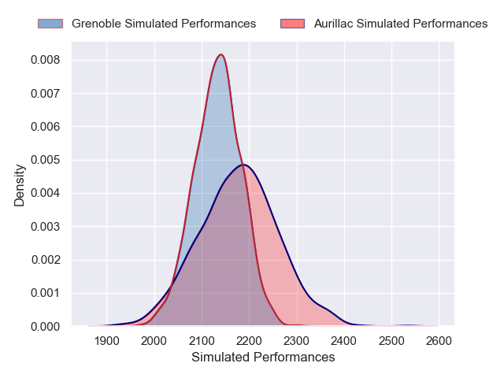

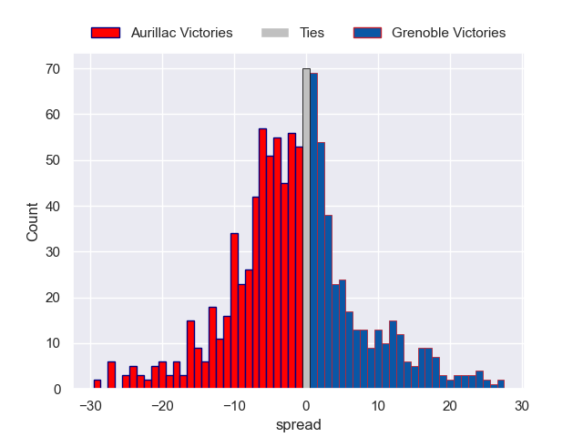

## Week 30

### Mont-de-Marsan V Agen on 2026/05/14

Average Margin: Mont-de-Marsan by 1.3

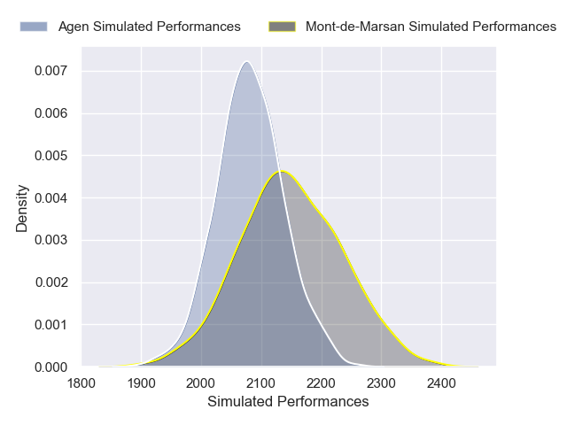

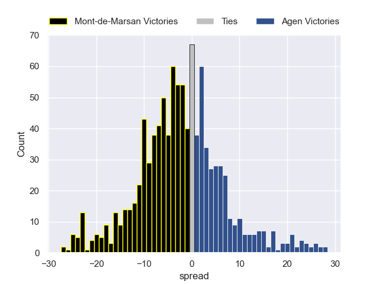

### Biarritz Olympique V Carcassonne on 2026/05/14

Average Margin: Biarritz Olympique by 5.5

### Brive V USON Nevers on 2026/05/14

Average Margin: Brive by 6.1

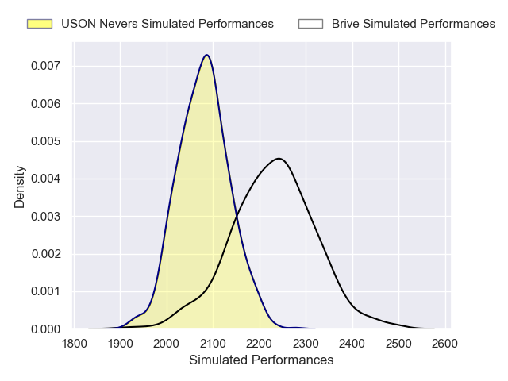

### Grenoble V Colomiers on 2026/05/14

Average Margin: Grenoble by 0.8

### Oyonnax V Aurillac on 2026/05/14

Average Margin: Oyonnax by 6.5

### Vannes V Dax on 2026/05/14

Average Margin: Vannes by 7.1

### Soyaux-Angouleme V Beziers on 2026/05/14

Average Margin: Soyaux-Angouleme by 3.2

### Valence Romans Drome Rugby V Provence Rugby on 2026/05/14

Average Margin: Valence Romans Drome Rugby by 1.8

