# Team Rankings

# Standings

## Current Standings

| Club                       |   Played |   Wins |   Point Differential |   Losing Bonus Points | Try Bonus Points   |   Competition Points |
|:---------------------------|---------:|-------:|---------------------:|----------------------:|:-------------------|---------------------:|
| Provence Rugby             |        2 |      2 |                   39 |                     0 |                    |                    8 |
| Dax                        |        1 |      1 |                   38 |                     0 |                    |                    4 |
| Biarritz Olympique         |        1 |      1 |                   31 |                     0 |                    |                    4 |
| Grenoble                   |        1 |      1 |                   24 |                     0 |                    |                    4 |
| Soyaux-Angouleme           |        1 |      1 |                   12 |                     0 |                    |                    4 |
| Oyonnax                    |        1 |      1 |                   10 |                     0 |                    |                    4 |
| US Montauban               |        1 |      1 |                    4 |                     0 |                    |                    4 |
| Brive                      |        1 |      1 |                    2 |                     0 |                    |                    4 |
| Valence Romans Drome Rugby |        1 |      0 |                   -2 |                     1 |                    |                    1 |
| USON Nevers                |        1 |      0 |                   -4 |                     1 |                    |                    1 |
| Colomiers                  |        2 |      0 |                  -17 |                     1 |                    |                    1 |
| Beziers                    |        1 |      0 |                  -10 |                     0 |                    |                    0 |
| Aurillac                   |        1 |      0 |                  -24 |                     0 |                    |                    0 |
| Nice                       |        1 |      0 |                  -31 |                     0 |                    |                    0 |
| Agen                       |        1 |      0 |                  -34 |                     0 |                    |                    0 |
| Narbonne                   |        1 |      0 |                  -38 |                     0 |                    |                    0 |

## Projected Remaining Table

| Club                       |   To Play |   Projected Wins |   Projected Differential |   Projected Losing Bonus Points | Projected Try Bonus Points   |   Projected Competition Points |
|:---------------------------|----------:|-----------------:|-------------------------:|--------------------------------:|:-----------------------------|-------------------------------:|
| Oyonnax                    |         1 |            0.984 |                   14.764 |                           0.009 |                              |                          3.959 |
| Narbonne                   |         1 |            0.942 |                   11.546 |                           0.036 |                              |                          3.838 |
| Valence Romans Drome Rugby |         1 |            0.94  |                   10.696 |                           0.04  |                              |                          3.834 |
| Nice                       |         1 |            0.74  |                    5.05  |                           0.182 |                              |                          3.242 |
| Agen                       |         1 |            0.67  |                    3.577 |                           0.226 |                              |                          2.99  |
| Grenoble                   |         1 |            0.549 |                    1.298 |                           0.292 |                              |                          2.612 |
| Aurillac                   |         1 |            0.527 |                    0.537 |                           0.3   |                              |                          2.516 |
| Dax                        |         1 |            0.419 |                   -0.537 |                           0.382 |                              |                          2.166 |
| US Montauban               |         1 |            0.389 |                   -1.298 |                           0.37  |                              |                          2.05  |
| Brive                      |         1 |            0.288 |                   -3.577 |                           0.368 |                              |                          1.604 |
| Beziers                    |         1 |            0.21  |                   -5.05  |                           0.379 |                              |                          1.319 |
| Soyaux-Angouleme           |         1 |            0.043 |                  -10.696 |                           0.262 |                              |                          0.468 |
| USON Nevers                |         1 |            0.041 |                  -11.546 |                           0.219 |                              |                          0.417 |
| Biarritz Olympique         |         1 |            0.009 |                  -14.764 |                           0.129 |                              |                          0.179 |

## Projected Total Table

| Club                       |   Played |   Wins |   Point Differential |   Losing Bonus Points | Try Bonus Points   |   Competition Points |
|:---------------------------|---------:|-------:|---------------------:|----------------------:|:-------------------|---------------------:|
| Provence Rugby             |        2 |  2     |               39     |                 0     |                    |                8     |
| Oyonnax                    |        2 |  1.984 |               24.764 |                 0.009 |                    |                7.959 |
| Grenoble                   |        2 |  1.549 |               25.298 |                 0.292 |                    |                6.612 |
| Dax                        |        2 |  1.419 |               37.463 |                 0.382 |                    |                6.166 |
| US Montauban               |        2 |  1.389 |                2.702 |                 0.37  |                    |                6.05  |
| Brive                      |        2 |  1.288 |               -1.577 |                 0.368 |                    |                5.604 |
| Valence Romans Drome Rugby |        2 |  0.94  |                8.696 |                 1.04  |                    |                4.834 |
| Soyaux-Angouleme           |        2 |  1.043 |                1.304 |                 0.262 |                    |                4.468 |
| Biarritz Olympique         |        2 |  1.009 |               16.236 |                 0.129 |                    |                4.179 |
| Narbonne                   |        2 |  0.942 |              -26.454 |                 0.036 |                    |                3.838 |
| Nice                       |        2 |  0.74  |              -25.95  |                 0.182 |                    |                3.242 |
| Agen                       |        2 |  0.67  |              -30.423 |                 0.226 |                    |                2.99  |
| Aurillac                   |        2 |  0.527 |              -23.463 |                 0.3   |                    |                2.516 |
| USON Nevers                |        2 |  0.041 |              -15.546 |                 1.219 |                    |                1.417 |
| Beziers                    |        2 |  0.21  |              -15.05  |                 0.379 |                    |                1.319 |
| Colomiers                  |        2 |  0     |              -17     |                 1     |                    |                1     |

# Completed Match Review

| Model | Percent Correct Predictions | Spread Error |
| ------ | ------ | ------ |
| Club Level | 81.2% | 9.8 |
| Player Level: Lineup | nan% | nan |
| Player Level: Minutes | nan% | nan |

# Future Predictions

## Week 3

### Oyonnax V Biarritz Olympique on 2026/09/04

Average Margin: Oyonnax by 14.8

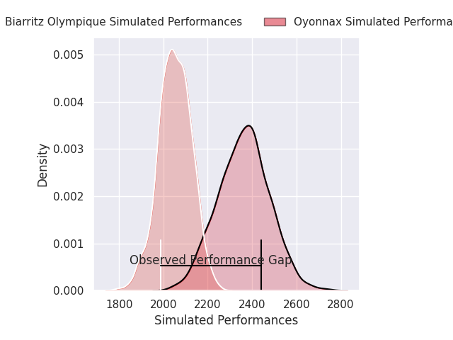
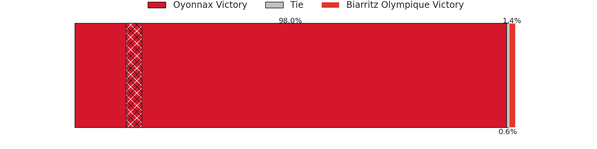
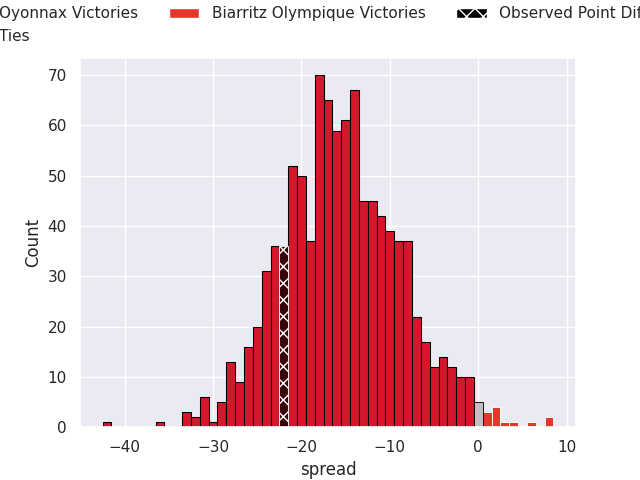

### Aurillac V Dax on 2026/09/04

Average Margin: Aurillac by 0.5

### Agen V Brive on 2026/09/04

Average Margin: Agen by 3.6

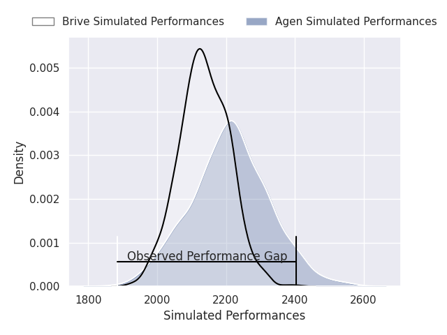

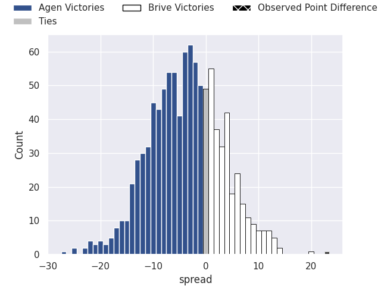

### US Montauban V Grenoble on 2026/09/04

Average Margin: Grenoble by 1.3

### Valence Romans Drome Rugby V Soyaux-Angouleme on 2026/09/04

Average Margin: Valence Romans Drome Rugby by 10.7

### Narbonne V USON Nevers on 2026/09/04

Average Margin: Narbonne by 11.5

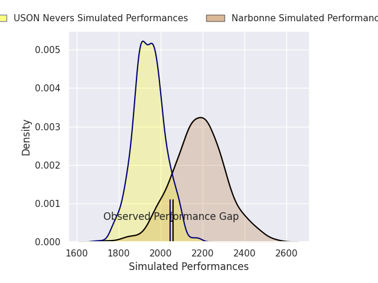
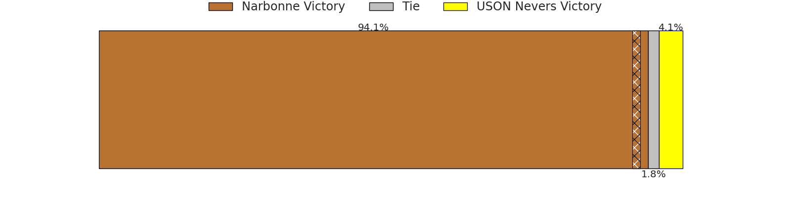
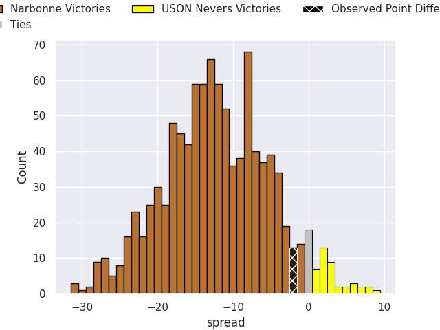

### Nice V Beziers on 2026/09/04

Average Margin: Nice by 5.0

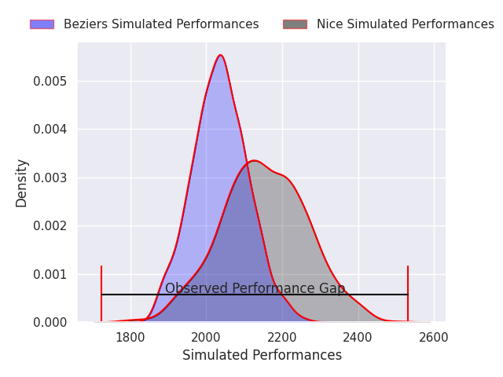
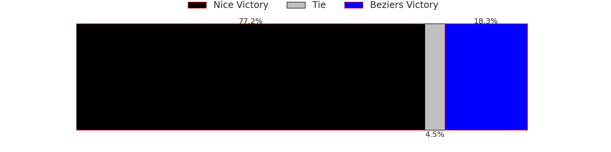
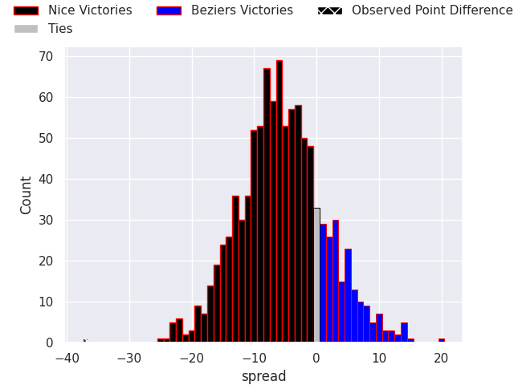

