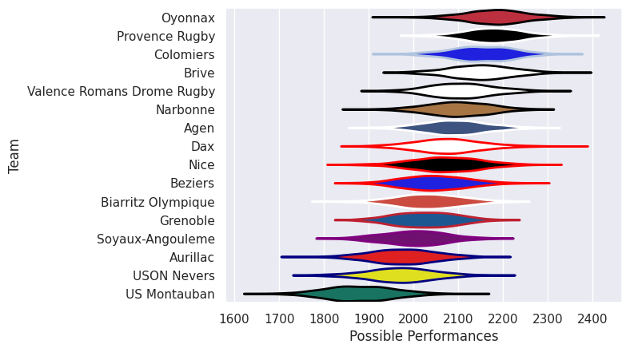
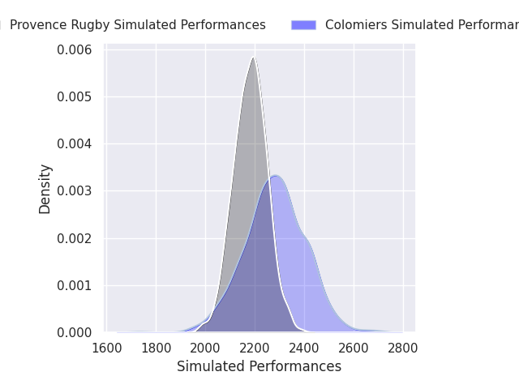
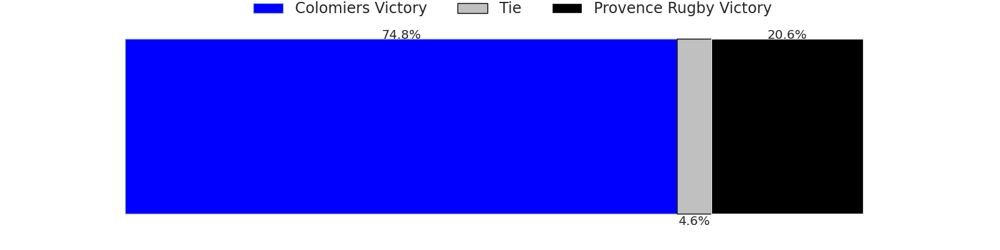
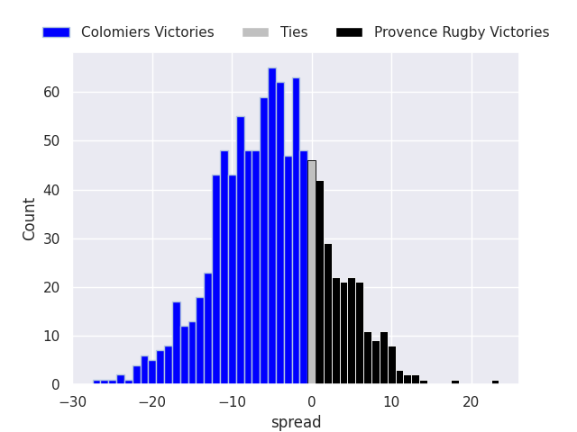

# Team Rankings

# Standings

## Current Standings

| Club                       |   Played |   Wins |   Point Differential |   Losing Bonus Points | Try Bonus Points   |   Competition Points |
|:---------------------------|---------:|-------:|---------------------:|----------------------:|:-------------------|---------------------:|
| Dax                        |        1 |      1 |                   38 |                     0 |                    |                    4 |
| Provence Rugby             |        1 |      1 |                   34 |                     0 |                    |                    4 |
| Biarritz Olympique         |        1 |      1 |                   31 |                     0 |                    |                    4 |
| Grenoble                   |        1 |      1 |                   24 |                     0 |                    |                    4 |
| Soyaux-Angouleme           |        1 |      1 |                   12 |                     0 |                    |                    4 |
| Oyonnax                    |        1 |      1 |                   10 |                     0 |                    |                    4 |
| US Montauban               |        1 |      1 |                    4 |                     0 |                    |                    4 |
| Brive                      |        1 |      1 |                    2 |                     0 |                    |                    4 |
| Valence Romans Drome Rugby |        1 |      0 |                   -2 |                     1 |                    |                    1 |
| USON Nevers                |        1 |      0 |                   -4 |                     1 |                    |                    1 |
| Beziers                    |        1 |      0 |                  -10 |                     0 |                    |                    0 |
| Colomiers                  |        1 |      0 |                  -12 |                     0 |                    |                    0 |
| Aurillac                   |        1 |      0 |                  -24 |                     0 |                    |                    0 |
| Nice                       |        1 |      0 |                  -31 |                     0 |                    |                    0 |
| Agen                       |        1 |      0 |                  -34 |                     0 |                    |                    0 |
| Narbonne                   |        1 |      0 |                  -38 |                     0 |                    |                    0 |

## Projected Remaining Table

| Club           |   To Play |   Projected Wins |   Projected Differential |   Projected Losing Bonus Points | Projected Try Bonus Points   |   Projected Competition Points |
|:---------------|----------:|-----------------:|-------------------------:|--------------------------------:|:-----------------------------|-------------------------------:|
| Colomiers      |         1 |            0.748 |                    4.946 |                           0.168 |                              |                          3.252 |
| Provence Rugby |         1 |            0.206 |                   -4.946 |                           0.392 |                              |                          1.308 |

## Projected Total Table

| Club                       |   Played |   Wins |   Point Differential |   Losing Bonus Points | Try Bonus Points   |   Competition Points |
|:---------------------------|---------:|-------:|---------------------:|----------------------:|:-------------------|---------------------:|
| Provence Rugby             |        2 |  1.206 |               29.054 |                 0.392 |                    |                5.308 |
| Dax                        |        1 |  1     |               38     |                 0     |                    |                4     |
| Biarritz Olympique         |        1 |  1     |               31     |                 0     |                    |                4     |
| Grenoble                   |        1 |  1     |               24     |                 0     |                    |                4     |
| Soyaux-Angouleme           |        1 |  1     |               12     |                 0     |                    |                4     |
| Oyonnax                    |        1 |  1     |               10     |                 0     |                    |                4     |
| US Montauban               |        1 |  1     |                4     |                 0     |                    |                4     |
| Brive                      |        1 |  1     |                2     |                 0     |                    |                4     |
| Colomiers                  |        2 |  0.748 |               -7.054 |                 0.168 |                    |                3.252 |
| Valence Romans Drome Rugby |        1 |  0     |               -2     |                 1     |                    |                1     |
| USON Nevers                |        1 |  0     |               -4     |                 1     |                    |                1     |
| Beziers                    |        1 |  0     |              -10     |                 0     |                    |                0     |
| Aurillac                   |        1 |  0     |              -24     |                 0     |                    |                0     |
| Nice                       |        1 |  0     |              -31     |                 0     |                    |                0     |
| Agen                       |        1 |  0     |              -34     |                 0     |                    |                0     |
| Narbonne                   |        1 |  0     |              -38     |                 0     |                    |                0     |

# Completed Match Review

| Model | Percent Correct Predictions | Spread Error |
| ------ | ------ | ------ |
| Club Level | 77.8% | 16.2 |
| Player Level: Lineup | nan% | nan |
| Player Level: Minutes | nan% | nan |

# Future Predictions

## Week 2

### Colomiers V Provence Rugby on 2026/09/03

Average Margin: Colomiers by 4.9

