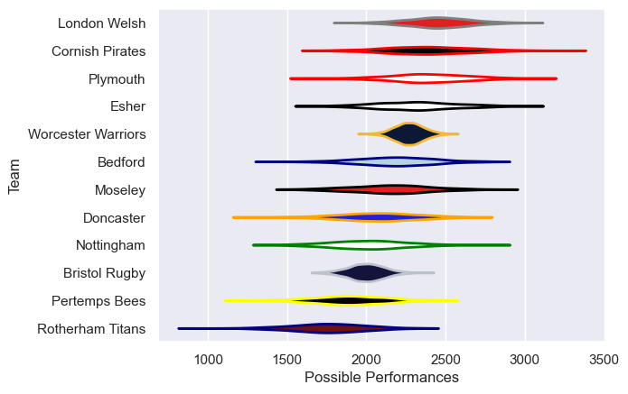

---  
title: "RFU Championship 10/11"  
date: 2025-07-29 6:00:00 -0500  
categories: model review projection  
layout: article  
aside:  
    toc: true  
---
# Current Team Rankings

# Standings

## Current Standings

| Club               |   Played |   Wins |   Point Differential |   Losing Bonus Points | Try Bonus Points   |   Competition Points |
|:-------------------|---------:|-------:|---------------------:|----------------------:|:-------------------|---------------------:|
| Worcester Warriors |        6 |      6 |                  153 |                     0 |                    |                   24 |
| Cornish Pirates    |        6 |      6 |                   96 |                     0 |                    |                   24 |
| London Welsh       |        6 |      4 |                   84 |                     1 |                    |                   17 |
| Moseley            |        6 |      4 |                   19 |                     1 |                    |                   17 |
| Esher              |        6 |      4 |                   17 |                     1 |                    |                   17 |
| Doncaster          |        6 |      3 |                   27 |                     2 |                    |                   14 |
| Bedford            |        6 |      3 |                   79 |                     1 |                    |                   13 |
| Plymouth           |        6 |      3 |                   12 |                     1 |                    |                   13 |
| Pertemps Bees      |        6 |      1 |                  -48 |                     1 |                    |                    5 |
| Nottingham         |        6 |      1 |                  -65 |                     1 |                    |                    5 |
| Bristol Rugby      |        6 |      1 |                 -172 |                     0 |                    |                    4 |
| Rotherham Titans   |        6 |      0 |                 -202 |                     0 |                    |                    0 |

# Completed Match Review

| Model | Percent Correct Predictions | Spread Error |
| ------ | ------ | ------ |
| Club Level | 63.9% | 16.9 |
| Player Level: Lineup | nan% | nan |
| Player Level: Minutes | nan% | nan |

