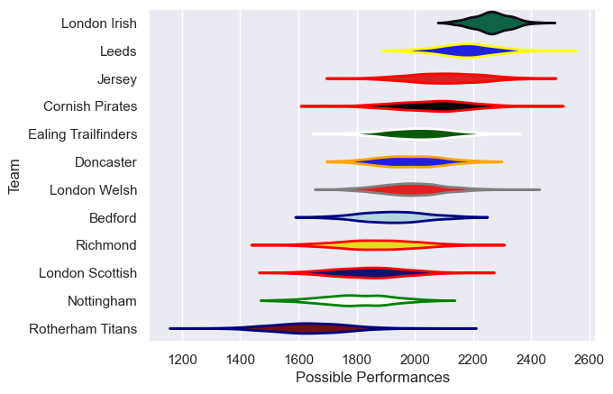

---  
title: "RFU Championship 16/17 Status"  
date: 2025-07-28 6:00:00 -0500  
categories: model review projection  
layout: article  
aside:  
    toc: true  
---
# Current Team Rankings

# Standings

## Current Standings

| Club                |   Played |   Wins |   Point Differential |   Losing Bonus Points |   Try Bonus Points |   Competition Points |
|:--------------------|---------:|-------:|---------------------:|----------------------:|-------------------:|---------------------:|
| London Irish        |       25 |     24 |                  512 |                     1 |                  1 |                   98 |
| Leeds               |       25 |     17 |                  157 |                     5 |                  1 |                   74 |
| Ealing Trailfinders |       23 |     14 |                  149 |                     3 |                    |                   61 |
| Jersey              |       21 |     11 |                    3 |                     8 |                    |                   52 |
| Cornish Pirates     |       21 |     10 |                   68 |                     7 |                    |                   51 |
| Doncaster           |       23 |     12 |                   37 |                     2 |                    |                   50 |
| Nottingham          |       21 |      7 |                 -127 |                     6 |                    |                   36 |
| Bedford             |       21 |      7 |                  -60 |                     5 |                    |                   35 |
| London Scottish     |       22 |      7 |                 -199 |                     5 |                    |                   33 |
| London Welsh        |       12 |      6 |                   50 |                     3 |                    |                   27 |
| Rotherham Titans    |       21 |      5 |                 -324 |                     2 |                    |                   24 |
| Richmond            |       21 |      5 |                 -266 |                     2 |                    |                   22 |

# Completed Match Review

| Model | Percent Correct Predictions | Spread Error |
| ------ | ------ | ------ |
| Club Level | 59.4% | 14.4 |
| Player Level: Lineup | nan% | nan |
| Player Level: Minutes | nan% | nan |

