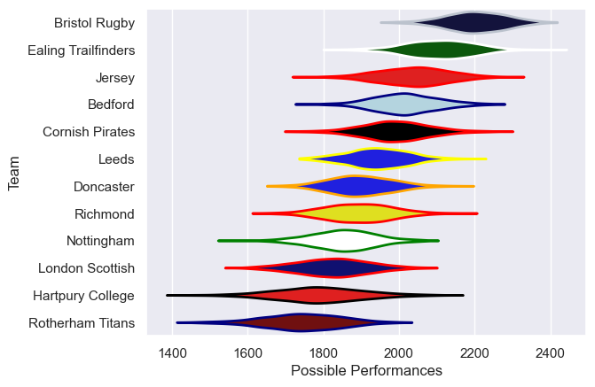

---  
title: "RFU Championship 17/18"  
date: 2025-07-29 6:00:00 -0500  
categories: model review projection  
layout: article  
aside:  
    toc: true  
---
# Current Team Rankings

# Standings

## Current Standings

| Club                |   Played |   Wins |   Point Differential |   Losing Bonus Points | Try Bonus Points   |   Competition Points |
|:--------------------|---------:|-------:|---------------------:|----------------------:|:-------------------|---------------------:|
| Bristol Rugby       |       22 |     21 |                  532 |                     1 |                    |                   85 |
| Ealing Trailfinders |       22 |     16 |                  244 |                     2 |                    |                   68 |
| Cornish Pirates     |       22 |     12 |                  107 |                     9 |                    |                   57 |
| Jersey              |       22 |     13 |                   62 |                     3 |                    |                   57 |
| Bedford             |       22 |     11 |                   78 |                     6 |                    |                   54 |
| Leeds               |       22 |     12 |                  -31 |                     2 |                    |                   54 |
| Nottingham          |       22 |     10 |                  -72 |                     3 |                    |                   45 |
| Doncaster           |       22 |      9 |                  -36 |                     6 |                    |                   44 |
| Richmond            |       22 |      9 |                 -151 |                     4 |                    |                   40 |
| Hartpury College    |       22 |      6 |                 -143 |                     7 |                    |                   33 |
| London Scottish     |       22 |      6 |                 -184 |                     6 |                    |                   32 |
| Rotherham Titans    |       22 |      2 |                 -406 |                     4 |                    |                   12 |

# Completed Match Review

| Model | Percent Correct Predictions | Spread Error |
| ------ | ------ | ------ |
| Club Level | 69.7% | 11.7 |
| Player Level: Lineup | nan% | nan |
| Player Level: Minutes | nan% | nan |

