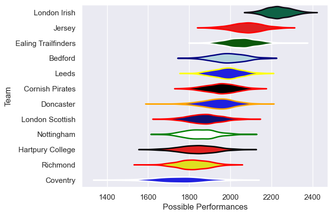

---  
title: "RFU Championship 18/19"  
date: 2025-07-29 6:00:00 -0500  
categories: model review projection  
layout: article  
aside:  
    toc: true  
---
# Current Team Rankings

# Standings

## Current Standings

| Club                |   Played |   Wins |   Point Differential |   Losing Bonus Points | Try Bonus Points   |   Competition Points |
|:--------------------|---------:|-------:|---------------------:|----------------------:|:-------------------|---------------------:|
| London Irish        |       22 |     20 |                  495 |                     1 |                    |                   81 |
| Ealing Trailfinders |       22 |     17 |                  230 |                     2 |                    |                   70 |
| Bedford             |       22 |     13 |                   29 |                     6 |                    |                   58 |
| Jersey              |       22 |     12 |                  112 |                     6 |                    |                   54 |
| Cornish Pirates     |       22 |     10 |                   49 |                     7 |                    |                   47 |
| Leeds               |       22 |     11 |                  -79 |                     3 |                    |                   47 |
| Nottingham          |       22 |     10 |                  -89 |                     3 |                    |                   45 |
| Coventry            |       22 |      9 |                 -135 |                     6 |                    |                   44 |
| Doncaster           |       22 |      8 |                  -71 |                     4 |                    |                   36 |
| London Scottish     |       22 |      8 |                 -148 |                     4 |                    |                   36 |
| Hartpury College    |       22 |      7 |                 -219 |                     4 |                    |                   32 |
| Richmond            |       22 |      6 |                 -174 |                     5 |                    |                   29 |

# Completed Match Review

| Model | Percent Correct Predictions | Spread Error |
| ------ | ------ | ------ |
| Club Level | 67.4% | 12.4 |
| Player Level: Lineup | nan% | nan |
| Player Level: Minutes | nan% | nan |

