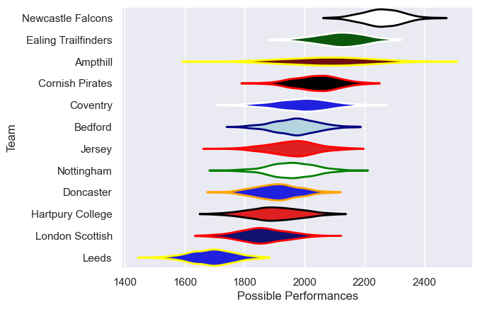

---  
title: "RFU Championship 19/20"  
date: 2025-07-29 6:00:00 -0500  
categories: model review projection  
layout: article  
aside:  
    toc: true  
---
# Current Team Rankings

# Standings

## Current Standings

| Club                |   Played |   Wins |   Point Differential |   Losing Bonus Points | Try Bonus Points   |   Competition Points |
|:--------------------|---------:|-------:|---------------------:|----------------------:|:-------------------|---------------------:|
| Newcastle Falcons   |       15 |     15 |                  333 |                     0 |                    |                   60 |
| Ealing Trailfinders |       14 |     11 |                  238 |                     0 |                    |                   46 |
| Cornish Pirates     |       15 |     11 |                  143 |                     2 |                    |                   46 |
| Coventry            |       15 |      8 |                   81 |                     4 |                    |                   38 |
| Ampthill            |       15 |      8 |                  -29 |                     0 |                    |                   34 |
| Nottingham          |       14 |      6 |                   61 |                     4 |                    |                   28 |
| Bedford             |       15 |      6 |                  -72 |                     4 |                    |                   28 |
| Jersey              |       14 |      6 |                  -30 |                     3 |                    |                   27 |
| Doncaster           |       15 |      6 |                  -83 |                     1 |                    |                   25 |
| London Scottish     |       14 |      4 |                  -22 |                     5 |                    |                   23 |
| Hartpury College    |       14 |      4 |                  -92 |                     5 |                    |                   21 |
| Leeds               |       14 |      0 |                 -528 |                     0 |                    |                    0 |

# Completed Match Review

| Model | Percent Correct Predictions | Spread Error |
| ------ | ------ | ------ |
| Club Level | 74.7% | 14.1 |
| Player Level: Lineup | nan% | nan |
| Player Level: Minutes | nan% | nan |

