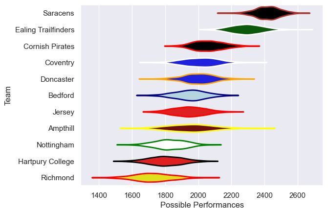

---  
title: "RFU Championship 20/21"  
date: 2025-07-29 6:00:00 -0500  
categories: model review projection  
layout: article  
aside:  
    toc: true  
---
# Current Team Rankings

# Standings

## Current Standings

| Club                |   Played |   Wins |   Point Differential |   Losing Bonus Points | Try Bonus Points   |   Competition Points |
|:--------------------|---------:|-------:|---------------------:|----------------------:|:-------------------|---------------------:|
| Ealing Trailfinders |       10 |      9 |                  344 |                     0 |                    |                   36 |
| Saracens            |        9 |      8 |                  343 |                     0 |                    |                   32 |
| Doncaster           |       10 |      8 |                   11 |                     0 |                    |                   32 |
| Cornish Pirates     |       10 |      6 |                   58 |                     3 |                    |                   27 |
| Coventry            |       10 |      6 |                  -30 |                     1 |                    |                   25 |
| Jersey              |       10 |      5 |                  -28 |                     0 |                    |                   20 |
| Ampthill            |       10 |      4 |                 -108 |                     2 |                    |                   18 |
| Bedford             |       10 |      3 |                  -55 |                     3 |                    |                   15 |
| Nottingham          |       10 |      2 |                 -175 |                     2 |                    |                   10 |
| Hartpury College    |        9 |      2 |                 -132 |                     1 |                    |                    9 |
| Richmond            |       10 |      1 |                 -228 |                     0 |                    |                    4 |

# Completed Match Review

| Model | Percent Correct Predictions | Spread Error |
| ------ | ------ | ------ |
| Club Level | 75.9% | 15.4 |
| Player Level: Lineup | nan% | nan |
| Player Level: Minutes | nan% | nan |

