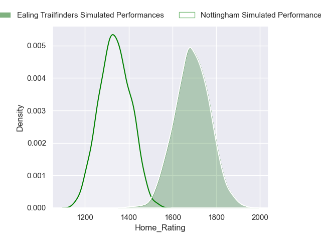
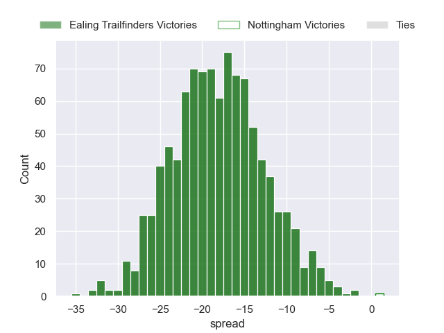
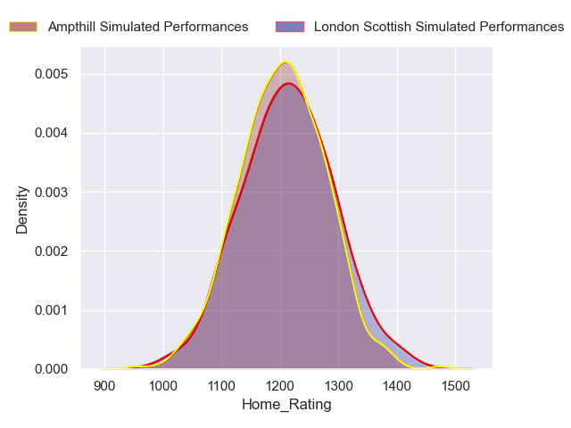
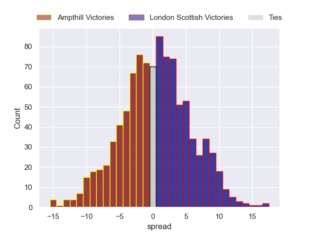

---  
title: "RFU Championship 2023 Status"  
date: 2023-11-13 6:00:00 -0500  
categories: model review projection  
layout: article  
aside:  
    toc: true  
---
# Current Team Rankings

# Standings

## Current Standings

| Club                |   Played |   Wins |   Point Differential |   Losing Bonus Points |   Try Bonus Points |   Competition Points |
|:--------------------|---------:|-------:|---------------------:|----------------------:|-------------------:|---------------------:|
| Ealing Trailfinders |        3 |      3 |                   85 |                     0 |                  3 |                   15 |
| Doncaster           |        3 |      3 |                   60 |                     0 |                  2 |                   14 |
| Ampthill            |        3 |      2 |                   -1 |                     0 |                  3 |                   11 |
| Nottingham          |        3 |      2 |                   15 |                     0 |                  2 |                   10 |
| Bedford             |        3 |      2 |                   23 |                     0 |                  1 |                    9 |
| Coventry            |        2 |      1 |                   30 |                     0 |                  2 |                    6 |
| Caldy               |        3 |      1 |                  -43 |                     0 |                  2 |                    6 |
| Cornish Pirates     |        2 |      1 |                   19 |                     1 |                  0 |                    5 |
| Cambridge           |        3 |      0 |                 -106 |                     1 |                  1 |                    2 |
| Hartpury College    |        3 |      0 |                  -51 |                     1 |                  0 |                    1 |
| London Scottish     |        2 |      0 |                  -31 |                     0 |                  0 |                    0 |

## Projected Remaining Table

| Club                |   Matches Remaining |   Wins |   Point Differential |   Losing Bonus Points |   Try Bonus Points |   Competition Points |
|:--------------------|--------------------:|-------:|---------------------:|----------------------:|-------------------:|---------------------:|
| Ealing Trailfinders |                  19 |   18.4 |                365.5 |                   0.5 |               18.2 |                 92.1 |
| Coventry            |                  21 |   17.2 |                217.6 |                   2.4 |               17   |                 88.1 |
| Jersey              |                  19 |   16.8 |                291.4 |                   1.5 |               16.6 |                 85.1 |
| Bedford             |                  20 |   14   |                119.2 |                   3   |               13.7 |                 72.6 |
| Cornish Pirates     |                  20 |   13.3 |                103.5 |                   3.2 |               13   |                 69.3 |
| Doncaster           |                  19 |    8.7 |                -19.8 |                   4.1 |                8.5 |                 47.4 |
| Hartpury College    |                  19 |    8   |                -49.2 |                   4.4 |                7.8 |                 44.3 |
| Nottingham          |                  20 |    7.2 |                -84.5 |                   4   |                7.1 |                 39.8 |
| Ampthill            |                  19 |    5.3 |               -142.9 |                   4.2 |                5.2 |                 30.7 |
| London Scottish     |                  19 |    3.9 |               -174.5 |                   4.2 |                3.8 |                 23.7 |
| Caldy               |                  19 |    3.6 |               -183.4 |                   3.9 |                3.5 |                 21.8 |
| Cambridge           |                  20 |    0.6 |               -442.2 |                   1.6 |                0.7 |                  4.8 |

## Projected Total Table

| Club                |   Total Matches |   Wins |   Point Differential |   Losing Bonus Points |   Try Bonus Points |   Competition Points |
|:--------------------|----------------:|-------:|---------------------:|----------------------:|-------------------:|---------------------:|
| Ealing Trailfinders |              22 |   21.4 |                450.5 |                   0.5 |               21.2 |                107.1 |
| Coventry            |              23 |   18.2 |                247.6 |                   2.4 |               19   |                 94.1 |
| Jersey              |              19 |   16.8 |                291.4 |                   1.5 |               16.6 |                 85.1 |
| Bedford             |              23 |   16   |                142.2 |                   3   |               14.7 |                 81.6 |
| Cornish Pirates     |              22 |   14.3 |                122.5 |                   4.2 |               13   |                 74.3 |
| Doncaster           |              22 |   11.7 |                 40.2 |                   4.1 |               10.5 |                 61.4 |
| Nottingham          |              23 |    9.2 |                -69.5 |                   4   |                9.1 |                 49.8 |
| Hartpury College    |              22 |    8   |               -100.2 |                   5.4 |                7.8 |                 45.3 |
| Ampthill            |              22 |    7.3 |               -143.9 |                   4.2 |                8.2 |                 41.7 |
| Caldy               |              22 |    4.6 |               -226.4 |                   3.9 |                5.5 |                 27.8 |
| London Scottish     |              21 |    3.9 |               -205.5 |                   4.2 |                3.8 |                 23.7 |
| Cambridge           |              23 |    0.6 |               -548.2 |                   2.6 |                1.7 |                  6.8 |

# Completed Match Review

| Model | Percent Correct Predictions | Spread Error |
| ------ | ------ | ------ |
| Club Level | 80.0% | 13.4 |
| Player Level: Lineup | 66.7% | 17.0 |
| Player Level: Minutes | 66.7% | 16.8 |

# Future Predictions

## Week 4

### Nottingham V Ealing Trailfinders on 2023/11/17

Average Margin: Ealing Trailfinders by 18.1

### London Scottish V Ampthill on 2023/11/17

Average Margin: London Scottish by 0.4

### Cambridge V Hartpury College on 2023/11/18

Average Margin: Hartpury College by 15.6

### Cornish Pirates V Caldy on 2023/11/18

Average Margin: Cornish Pirates by 15.5

### Coventry V Doncaster on 2023/11/18

Average Margin: Coventry by 12.4

### Jersey V Bedford on 2023/11/18

Average Margin: Jersey by 12.6

## Week 5

### Ampthill V Cornish Pirates on 2023/11/25

Average Margin: Cornish Pirates by 6.6

### Bedford V Cambridge on 2023/11/25

Average Margin: Bedford by 31.5

### Ealing Trailfinders V Coventry on 2023/11/25

Average Margin: Ealing Trailfinders by 12.2

### Hartpury College V Nottingham on 2023/11/25

Average Margin: Hartpury College by 2.6

### Caldy V Jersey on 2023/11/25

Average Margin: Jersey by 19.4

### Doncaster V London Scottish on 2023/11/25

Average Margin: Doncaster by 12.9

## Week 6

### Caldy V Bedford on 2023/12/02

Average Margin: Bedford by 10.3

### London Scottish V Ealing Trailfinders on 2023/12/02

Average Margin: Ealing Trailfinders by 24.0

### Nottingham V Cambridge on 2023/12/02

Average Margin: Nottingham by 22.5

### Coventry V Hartpury College on 2023/12/02

Average Margin: Coventry by 16.7

### Jersey V Ampthill on 2023/12/02

Average Margin: Jersey by 23.4

### Cornish Pirates V Doncaster on 2023/12/02

Average Margin: Cornish Pirates by 6.3

## Week 7

### Doncaster V Jersey on 2023/12/15

Average Margin: Jersey by 10.1

### Ampthill V Caldy on 2023/12/16

Average Margin: Ampthill by 6.1

### Hartpury College V London Scottish on 2023/12/16

Average Margin: Hartpury College by 8.4

### Ealing Trailfinders V Cornish Pirates on 2023/12/16

Average Margin: Ealing Trailfinders by 17.9

### Cambridge V Coventry on 2023/12/16

Average Margin: Coventry by 28.4

### Bedford V Nottingham on 2023/12/16

Average Margin: Bedford by 11.1

## Week 8

### Jersey V Ealing Trailfinders on 2023/12/22

Average Margin: Ealing Trailfinders by 0.8

### Coventry V Nottingham on 2023/12/23

Average Margin: Coventry by 15.8

### Caldy V Doncaster on 2023/12/23

Average Margin: Doncaster by 5.7

### Cornish Pirates V Hartpury College on 2023/12/23

Average Margin: Cornish Pirates by 10.7

### Ampthill V Bedford on 2023/12/23

Average Margin: Bedford by 7.6

### London Scottish V Cambridge on 2023/12/23

Average Margin: London Scottish by 16.3

## Week 9

### Coventry V Nottingham on 2023/12/26

Average Margin: Coventry by 15.5

## Week 10

### Bedford V Coventry on 2024/01/01

Average Margin: Coventry by 1.2

## Week 11

### Hartpury College V Jersey on 2024/01/13

Average Margin: Jersey by 14.2

### Doncaster V Ampthill on 2024/01/13

Average Margin: Doncaster by 9.9

### Nottingham V London Scottish on 2024/01/13

Average Margin: Nottingham by 9.7

### Ealing Trailfinders V Caldy on 2024/01/13

Average Margin: Ealing Trailfinders by 29.9

### Bedford V Coventry on 2024/01/13

Average Margin: Coventry by 1.3

### Cambridge V Cornish Pirates on 2024/01/13

Average Margin: Cornish Pirates by 21.4

## Week 12

### Jersey V Cambridge on 2024/01/20

Average Margin: Jersey by 38.3

### Caldy V Hartpury College on 2024/01/20

Average Margin: Hartpury College by 1.2

### Doncaster V Bedford on 2024/01/20

Average Margin: Bedford by 1.0

### London Scottish V Coventry on 2024/01/20

Average Margin: Coventry by 15.2

### Ampthill V Ealing Trailfinders on 2024/01/20

Average Margin: Ealing Trailfinders by 21.0

### Cornish Pirates V Nottingham on 2024/01/20

Average Margin: Cornish Pirates by 9.8

## Week 13

### Nottingham V Jersey on 2024/01/26

Average Margin: Jersey by 13.4

### Ealing Trailfinders V Doncaster on 2024/01/27

Average Margin: Ealing Trailfinders by 20.8

### Coventry V Cornish Pirates on 2024/01/27

Average Margin: Coventry by 9.0

### Cambridge V Caldy on 2024/01/27

Average Margin: Caldy by 9.4

### Hartpury College V Ampthill on 2024/01/27

Average Margin: Hartpury College by 5.6

### Bedford V London Scottish on 2024/01/27

Average Margin: Bedford by 17.4

## Week 14

### Caldy V Coventry on 2024/02/03

Average Margin: Coventry by 14.6

### Bedford V Cornish Pirates on 2024/02/03

Average Margin: Bedford by 4.7

### Doncaster V Cambridge on 2024/02/03

Average Margin: Doncaster by 24.4

### Ealing Trailfinders V Hartpury College on 2024/02/03

Average Margin: Ealing Trailfinders by 25.4

### Ampthill V Nottingham on 2024/02/03

Average Margin: Ampthill by 0.4

### Jersey V London Scottish on 2024/02/03

Average Margin: Jersey by 26.0

## Week 15

### Cornish Pirates V Jersey on 2024/02/23

Average Margin: Jersey by 6.9

### London Scottish V Caldy on 2024/02/24

Average Margin: London Scottish by 2.6

### Hartpury College V Bedford on 2024/02/24

Average Margin: Bedford by 5.4

### Coventry V Ampthill on 2024/02/24

Average Margin: Coventry by 18.6

### Nottingham V Doncaster on 2024/02/24

Average Margin: Doncaster by 0.0

### Cambridge V Ealing Trailfinders on 2024/02/24

Average Margin: Ealing Trailfinders by 35.7

## Week 16

### Ealing Trailfinders V Nottingham on 2024/03/02

Average Margin: Ealing Trailfinders by 24.5

### Hartpury College V Cambridge on 2024/03/02

Average Margin: Hartpury College by 20.1

### Doncaster V Coventry on 2024/03/02

Average Margin: Coventry by 5.6

### Caldy V Cornish Pirates on 2024/03/02

Average Margin: Cornish Pirates by 9.0

### Ampthill V London Scottish on 2024/03/02

Average Margin: Ampthill by 6.2

### Bedford V Jersey on 2024/03/02

Average Margin: Jersey by 5.7

## Week 17

### Jersey V Caldy on 2024/03/09

Average Margin: Jersey by 25.5

### London Scottish V Doncaster on 2024/03/09

Average Margin: Doncaster by 6.1

### Nottingham V Hartpury College on 2024/03/09

Average Margin: Nottingham by 4.2

### Cornish Pirates V Ampthill on 2024/03/09

Average Margin: Cornish Pirates by 12.8

### Cambridge V Bedford on 2024/03/09

Average Margin: Bedford by 22.3

### Coventry V Ealing Trailfinders on 2024/03/09

Average Margin: Ealing Trailfinders by 5.5

## Week 18

### Doncaster V Cornish Pirates on 2024/03/23

Average Margin: Doncaster by 0.2

### Hartpury College V Coventry on 2024/03/23

Average Margin: Coventry by 9.6

### Cambridge V Nottingham on 2024/03/23

Average Margin: Nottingham by 14.4

### Bedford V Caldy on 2024/03/23

Average Margin: Bedford by 16.5

### Ealing Trailfinders V London Scottish on 2024/03/23

Average Margin: Ealing Trailfinders by 30.1

### Ampthill V Jersey on 2024/03/23

Average Margin: Jersey by 16.4

## Week 19

### Nottingham V Bedford on 2024/04/06

Average Margin: Bedford by 4.5

### Jersey V Doncaster on 2024/04/06

Average Margin: Jersey by 16.5

### Caldy V Ampthill on 2024/04/06

Average Margin: Caldy by 0.9

### Cornish Pirates V Ealing Trailfinders on 2024/04/06

Average Margin: Ealing Trailfinders by 10.9

### London Scottish V Hartpury College on 2024/04/06

Average Margin: Hartpury College by 2.0

### Coventry V Cambridge on 2024/04/06

Average Margin: Coventry by 32.2

## Week 20

### Doncaster V Caldy on 2024/04/13

Average Margin: Doncaster by 12.3

### Bedford V Ampthill on 2024/04/13

Average Margin: Bedford by 14.2

### Nottingham V Coventry on 2024/04/13

Average Margin: Coventry by 8.9

### Cambridge V London Scottish on 2024/04/13

Average Margin: London Scottish by 7.6

### Hartpury College V Cornish Pirates on 2024/04/13

Average Margin: Cornish Pirates by 3.8

### Ealing Trailfinders V Jersey on 2024/04/13

Average Margin: Ealing Trailfinders by 7.6

## Week 21

### London Scottish V Nottingham on 2024/04/20

Average Margin: Nottingham by 2.6

### Coventry V Bedford on 2024/04/20

Average Margin: Coventry by 7.6

### Jersey V Hartpury College on 2024/04/20

Average Margin: Jersey by 21.1

### Cambridge V Cornish Pirates on 2024/04/20

Average Margin: Cornish Pirates by 20.3

### Ampthill V Doncaster on 2024/04/20

Average Margin: Doncaster by 2.8

### Caldy V Ealing Trailfinders on 2024/04/20

Average Margin: Ealing Trailfinders by 23.3

### Cornish Pirates V Cambridge on 2024/04/21

Average Margin: Cornish Pirates by 27.1

## Week 22

### Ealing Trailfinders V Ampthill on 2024/05/04

Average Margin: Ealing Trailfinders by 27.5

### Nottingham V Cornish Pirates on 2024/05/04

Average Margin: Cornish Pirates by 3.1

### Cambridge V Jersey on 2024/05/04

Average Margin: Jersey by 30.0

### Bedford V Doncaster on 2024/05/04

Average Margin: Bedford by 7.6

### Coventry V London Scottish on 2024/05/04

Average Margin: Coventry by 21.6

### Hartpury College V Caldy on 2024/05/04

Average Margin: Hartpury College by 8.0

## Week 23

### Jersey V Nottingham on 2024/05/11

Average Margin: Jersey by 19.9

### London Scottish V Bedford on 2024/05/11

Average Margin: Bedford by 10.4

### Cornish Pirates V Coventry on 2024/05/11

Average Margin: Coventry by 2.3

### Doncaster V Ealing Trailfinders on 2024/05/11

Average Margin: Ealing Trailfinders by 14.4

### Ampthill V Hartpury College on 2024/05/11

Average Margin: Ampthill by 1.1

### Caldy V Cambridge on 2024/05/11

Average Margin: Caldy by 14.7

## Week 24

### Ealing Trailfinders V Bedford on 2024/05/25

Average Margin: Ealing Trailfinders by 16.3

### London Scottish V Cornish Pirates on 2024/05/25

Average Margin: Cornish Pirates by 9.3

### Nottingham V Caldy on 2024/05/25

Average Margin: Nottingham by 9.1

### Hartpury College V Doncaster on 2024/05/25

Average Margin: Doncaster by 0.8

### Coventry V Jersey on 2024/05/25

Average Margin: Jersey by 0.9

### Cambridge V Ampthill on 2024/05/25

Average Margin: Ampthill by 10.4

