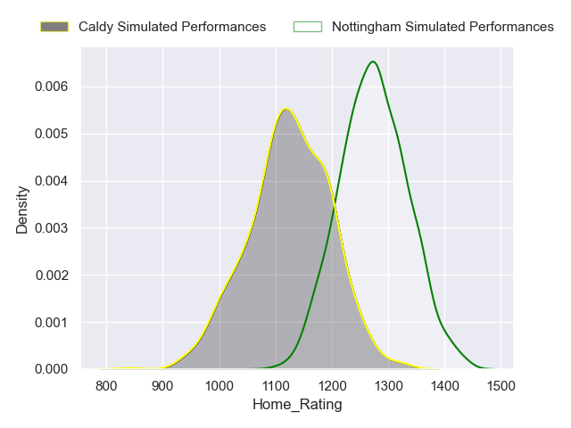
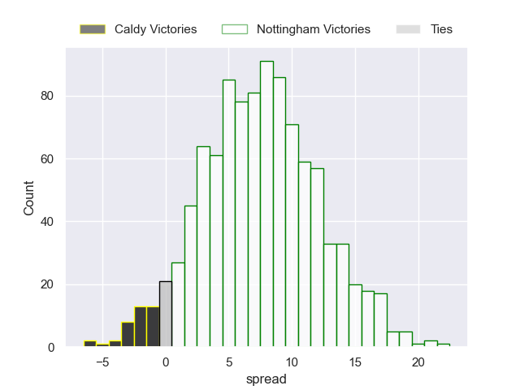

---  
title: "RFU Championship 2023 Status"  
date: 2024-05-20 6:00:00 -0500  
categories: model review projection  
layout: article  
aside:  
    toc: true  
---
# Current Team Rankings

# Standings

## Current Standings

| Club                |   Played |   Wins |   Point Differential |   Losing Bonus Points |   Try Bonus Points |   Competition Points |
|:--------------------|---------:|-------:|---------------------:|----------------------:|-------------------:|---------------------:|
| Ealing Trailfinders |       19 |     15 |                  359 |                     2 |                nan |                   76 |
| Coventry            |       20 |     14 |                  270 |                     2 |                nan |                   72 |
| Cornish Pirates     |       19 |     14 |                  167 |                     1 |                nan |                   69 |
| Bedford             |       19 |     12 |                   74 |                     4 |                nan |                   63 |
| Hartpury College    |       21 |     12 |                   81 |                     4 |                nan |                   60 |
| Doncaster           |       19 |     11 |                    9 |                     2 |                nan |                   56 |
| Ampthill            |       20 |      9 |                  -51 |                     2 |                nan |                   50 |
| Nottingham          |       19 |      7 |                 -143 |                     2 |                nan |                   42 |
| London Scottish     |       19 |      4 |                  -95 |                     7 |                nan |                   33 |
| Caldy               |       20 |      5 |                 -261 |                     1 |                nan |                   29 |
| Cambridge           |       19 |      2 |                 -410 |                     5 |                nan |                   18 |

## Projected Remaining Table

| Club                |   Matches Remaining |   Wins |   Point Differential |   Losing Bonus Points |   Try Bonus Points |   Competition Points |
|:--------------------|--------------------:|-------:|---------------------:|----------------------:|-------------------:|---------------------:|
| Ealing Trailfinders |                   1 |    1   |             14.9944  |                   0   |                0.8 |                  4.8 |
| Cornish Pirates     |                   1 |    1   |              9.35156 |                   0   |                0.8 |                  4.7 |
| Nottingham          |                   1 |    1   |              7.49911 |                   0   |                0.3 |                  4.2 |
| Ampthill            |                   1 |    0.9 |              6.74278 |                   0.1 |                0.7 |                  4.2 |
| Hartpury College    |                   1 |    0.8 |              3.27235 |                   0.2 |                0.3 |                  3.7 |
| Jersey              |                   1 |    0.6 |              1.10642 |                   0.3 |                0.4 |                  3   |
| Coventry            |                   1 |    0.4 |             -1.10642 |                   0.4 |                0.2 |                  2.3 |
| Doncaster           |                   1 |    0.2 |             -3.27235 |                   0.6 |                0.4 |                  1.8 |
| Cambridge           |                   1 |    0.1 |             -6.74278 |                   0.4 |                0.2 |                  1.1 |
| Caldy               |                   1 |    0   |             -7.49911 |                   0.4 |                0.2 |                  0.8 |
| London Scottish     |                   1 |    0   |             -9.35156 |                   0.3 |                0.1 |                  0.5 |
| Bedford             |                   1 |    0   |            -14.9944  |                   0   |                0.1 |                  0.1 |

## Projected Total Table

| Club                |   Total Matches |   Wins |   Point Differential |   Losing Bonus Points |   Try Bonus Points |   Competition Points |
|:--------------------|----------------:|-------:|---------------------:|----------------------:|-------------------:|---------------------:|
| Ealing Trailfinders |              20 |   16   |            373.994   |                   2   |                0.8 |                 80.8 |
| Coventry            |              21 |   14.4 |            268.894   |                   2.4 |                0.2 |                 74.3 |
| Cornish Pirates     |              20 |   15   |            176.352   |                   1   |                0.8 |                 73.7 |
| Hartpury College    |              22 |   12.8 |             84.2723  |                   4.2 |                0.3 |                 63.7 |
| Bedford             |              20 |   12   |             59.0056  |                   4   |                0.1 |                 63.1 |
| Doncaster           |              20 |   11.2 |              5.72765 |                   2.6 |                0.4 |                 57.8 |
| Ampthill            |              21 |    9.9 |            -44.2572  |                   2.1 |                0.7 |                 54.2 |
| Nottingham          |              20 |    8   |           -135.501   |                   2   |                0.3 |                 46.2 |
| London Scottish     |              20 |    4   |           -104.352   |                   7.3 |                0.1 |                 33.5 |
| Caldy               |              21 |    5   |           -268.499   |                   1.4 |                0.2 |                 29.8 |
| Cambridge           |              20 |    2.1 |           -416.743   |                   5.4 |                0.2 |                 19.1 |
| Jersey              |               1 |    0.6 |              1.10642 |                   0.3 |                0.4 |                  3   |

# Completed Match Review

| Model | Percent Correct Predictions | Spread Error |
| ------ | ------ | ------ |
| Club Level | 66.7% | 12.9 |
| Player Level: Lineup | 66.3% | 13.9 |
| Player Level: Minutes | 65.3% | 14.0 |

# Future Predictions

## Week 22

### Nottingham V Caldy on 2024/05/24

Average Margin: Nottingham by 7.5

Average Scoreline: 30-22

### Coventry V Jersey on 2024/05/25

Average Margin: Jersey by 1.1

Average Scoreline: 31-30

### Ealing Trailfinders V Bedford on 2024/05/25

Average Margin: Ealing Trailfinders by 15.0

Average Scoreline: 36-21

### Hartpury College V Doncaster on 2024/05/25

Average Margin: Hartpury College by 3.3

Average Scoreline: 33-30

### London Scottish V Cornish Pirates on 2024/05/25

Average Margin: Cornish Pirates by 9.4

Average Scoreline: 38-28

### Cambridge V Ampthill on 2024/05/25

Average Margin: Ampthill by 6.7

Average Scoreline: 34-27

