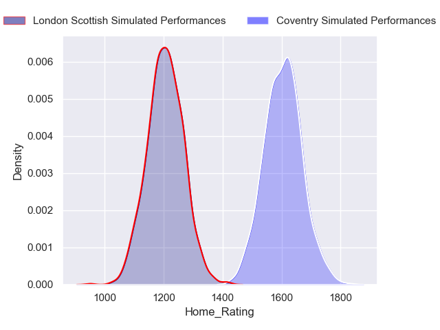
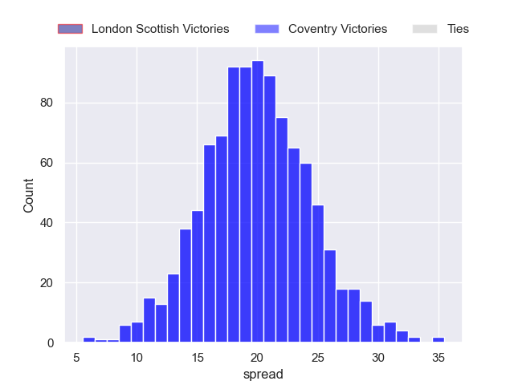
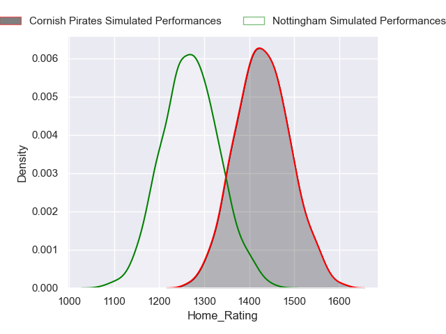
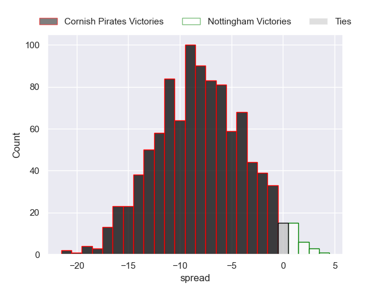

---  
title: "RFU Championship 2023 Status"  
date: 2024-04-29 6:00:00 -0500  
categories: model review projection  
layout: article  
aside:  
    toc: true  
---
# Current Team Rankings

# Standings

## Current Standings

| Club                |   Played |   Wins |   Point Differential |   Losing Bonus Points |   Try Bonus Points |   Competition Points |
|:--------------------|---------:|-------:|---------------------:|----------------------:|-------------------:|---------------------:|
| Ealing Trailfinders |       20 |     17 |                  431 |                     2 |                 17 |                   87 |
| Coventry            |       21 |     16 |                  345 |                     2 |                 16 |                   82 |
| Cornish Pirates     |       18 |     13 |                  162 |                     1 |                 11 |                   66 |
| Bedford             |       19 |     10 |                   27 |                     5 |                 12 |                   57 |
| Ampthill            |       19 |     10 |                   20 |                     2 |                 13 |                   55 |
| Doncaster           |       19 |     10 |                  -51 |                     1 |                  8 |                   51 |
| Hartpury College    |       18 |      9 |                   29 |                     4 |                  9 |                   49 |
| Nottingham          |       20 |      7 |                 -165 |                     2 |                 14 |                   44 |
| London Scottish     |       19 |      6 |                  -61 |                     6 |                  9 |                   39 |
| Caldy               |       19 |      5 |                 -253 |                     1 |                  7 |                   28 |
| Cambridge           |       20 |      2 |                 -484 |                     4 |                  5 |                   17 |

## Projected Remaining Table

| Club                |   Matches Remaining |   Wins |   Point Differential |   Losing Bonus Points |   Try Bonus Points |   Competition Points |
|:--------------------|--------------------:|-------:|---------------------:|----------------------:|-------------------:|---------------------:|
| Ealing Trailfinders |                   3 |    3   |             51.4232  |                   0   |                2.5 |                 14.5 |
| Jersey              |                   3 |    2.5 |             49.8133  |                   0.4 |                2.1 |                 12.5 |
| Cornish Pirates     |                   3 |    2.3 |             13.9937  |                   0.6 |                1.6 |                 11.2 |
| Coventry            |                   3 |    2.1 |             21.3903  |                   0.7 |                1.2 |                 10.5 |
| Hartpury College    |                   3 |    2.1 |             13.3933  |                   0.7 |                1.3 |                 10.4 |
| Bedford             |                   3 |    1.7 |             -7.45465 |                   0.3 |                1.3 |                  8.5 |
| Ampthill            |                   3 |    1.7 |             -7.03546 |                   0.3 |                1.3 |                  8.4 |
| Caldy               |                   3 |    1   |             -8.42538 |                   0.7 |                1   |                  5.8 |
| Nottingham          |                   3 |    0.9 |            -25.7343  |                   0.5 |                1.1 |                  5.3 |
| Doncaster           |                   3 |    0.2 |            -25.4927  |                   1.1 |                0.9 |                  2.7 |
| London Scottish     |                   3 |    0.2 |            -31.1748  |                   1   |                0.6 |                  2.6 |
| Cambridge           |                   3 |    0.1 |            -44.6966  |                   0.5 |                0.6 |                  1.6 |

## Projected Total Table

| Club                |   Total Matches |   Wins |   Point Differential |   Losing Bonus Points |   Try Bonus Points |   Competition Points |
|:--------------------|----------------:|-------:|---------------------:|----------------------:|-------------------:|---------------------:|
| Ealing Trailfinders |              23 |   20   |             482.423  |                   2   |               19.5 |                101.5 |
| Coventry            |              24 |   18.1 |             366.39   |                   2.7 |               17.2 |                 92.5 |
| Cornish Pirates     |              21 |   15.3 |             175.994  |                   1.6 |               12.6 |                 77.2 |
| Bedford             |              22 |   11.7 |              19.5453 |                   5.3 |               13.3 |                 65.5 |
| Ampthill            |              22 |   11.7 |              12.9645 |                   2.3 |               14.3 |                 63.4 |
| Hartpury College    |              21 |   11.1 |              42.3933 |                   4.7 |               10.3 |                 59.4 |
| Doncaster           |              22 |   10.2 |             -76.4927 |                   2.1 |                8.9 |                 53.7 |
| Nottingham          |              23 |    7.9 |            -190.734  |                   2.5 |               15.1 |                 49.3 |
| London Scottish     |              22 |    6.2 |             -92.1748 |                   7   |                9.6 |                 41.6 |
| Caldy               |              22 |    6   |            -261.425  |                   1.7 |                8   |                 33.8 |
| Cambridge           |              23 |    2.1 |            -528.697  |                   4.5 |                5.6 |                 18.6 |
| Jersey              |               3 |    2.5 |              49.8133 |                   0.4 |                2.1 |                 12.5 |

# Completed Match Review

| Model | Percent Correct Predictions | Spread Error |
| ------ | ------ | ------ |
| Club Level | 66.3% | 13.0 |
| Player Level: Lineup | 66.3% | 13.8 |
| Player Level: Minutes | 65.3% | 14.0 |

# Future Predictions

## Week 22

### Coventry V London Scottish on 2024/05/03

Average Margin: Coventry by 19.9

Average Scoreline: 36-16

### Nottingham V Cornish Pirates on 2024/05/03

Average Margin: Cornish Pirates by 8.0

Average Scoreline: 39-31

### Ealing Trailfinders V Ampthill on 2024/05/04

Average Margin: Ealing Trailfinders by 19.9

Average Scoreline: 39-19

### Cambridge V Jersey on 2024/05/04

Average Margin: Jersey by 25.5

Average Scoreline: 34-8

### Bedford V Doncaster on 2024/05/04

Average Margin: Bedford by 6.8

Average Scoreline: 30-23

### Hartpury College V Caldy on 2024/05/04

Average Margin: Hartpury College by 11.6

Average Scoreline: 32-21

## Week 23

### London Scottish V Bedford on 2024/05/11

Average Margin: Bedford by 3.4

Average Scoreline: 34-31

### Jersey V Nottingham on 2024/05/11

Average Margin: Jersey by 23.8

Average Scoreline: 40-16

### Caldy V Cambridge on 2024/05/11

Average Margin: Caldy by 9.3

Average Scoreline: 30-20

### Cornish Pirates V Coventry on 2024/05/11

Average Margin: Coventry by 1.9

Average Scoreline: 25-24

### Ampthill V Hartpury College on 2024/05/11

Average Margin: Ampthill by 2.9

Average Scoreline: 32-29

### Doncaster V Ealing Trailfinders on 2024/05/11

Average Margin: Ealing Trailfinders by 14.0

Average Scoreline: 34-20

## Week 24

### Coventry V Jersey on 2024/05/25

Average Margin: Jersey by 0.5

Average Scoreline: 25-25

### Cambridge V Ampthill on 2024/05/25

Average Margin: Ampthill by 9.9

Average Scoreline: 38-29

### Ealing Trailfinders V Bedford on 2024/05/25

Average Margin: Ealing Trailfinders by 17.6

Average Scoreline: 39-22

### London Scottish V Cornish Pirates on 2024/05/25

Average Margin: Cornish Pirates by 7.9

Average Scoreline: 36-28

### Nottingham V Caldy on 2024/05/25

Average Margin: Nottingham by 6.1

Average Scoreline: 31-25

### Hartpury College V Doncaster on 2024/05/25

Average Margin: Hartpury College by 4.8

Average Scoreline: 35-31

