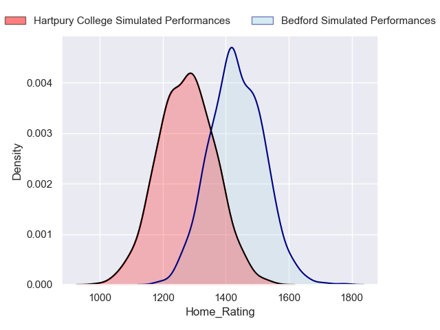
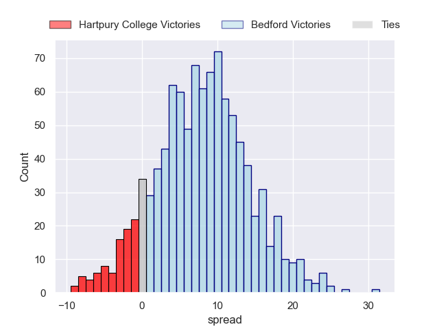

---  
title: "RFU Championship 2023 Status"  
date: 2023-11-05 6:00:00 -0500  
categories: model review projection  
layout: article  
aside:  
    toc: true  
---
# Current Team Rankings

# Standings

## Current Standings

| Club                |   Played |   Wins |   Point Differential |   Losing Bonus Points |   Try Bonus Points |   Competition Points |
|:--------------------|---------:|-------:|---------------------:|----------------------:|-------------------:|---------------------:|
| Ampthill            |        3 |      2 |                   -1 |                     0 |                  3 |                   11 |
| Ealing Trailfinders |        2 |      2 |                   28 |                     0 |                  2 |                   10 |
| Nottingham          |        2 |      2 |                   26 |                     0 |                  2 |                   10 |
| Doncaster           |        2 |      2 |                   49 |                     0 |                  1 |                    9 |
| Coventry            |        2 |      1 |                   30 |                     0 |                  2 |                    6 |
| Caldy               |        3 |      1 |                  -43 |                     0 |                  2 |                    6 |
| Cornish Pirates     |        2 |      1 |                   19 |                     1 |                  0 |                    5 |
| Bedford             |        2 |      1 |                  -18 |                     0 |                  0 |                    4 |
| Cambridge           |        2 |      0 |                  -49 |                     1 |                  1 |                    2 |
| Hartpury College    |        2 |      0 |                  -10 |                     1 |                  0 |                    1 |
| London Scottish     |        2 |      0 |                  -31 |                     0 |                  0 |                    0 |

## Projected Remaining Table

| Club                |   Matches Remaining |   Wins |   Point Differential |   Losing Bonus Points |   Try Bonus Points |   Competition Points |
|:--------------------|--------------------:|-------:|---------------------:|----------------------:|-------------------:|---------------------:|
| Ealing Trailfinders |                  17 |   16.7 |                318.2 |                   0.3 |               16.6 |                 83.8 |
| Coventry            |                  18 |   14.5 |                168.1 |                   2.1 |               14.3 |                 74.3 |
| Bedford             |                  18 |   12.6 |                106.9 |                   3.2 |               12.4 |                 66.3 |
| Cornish Pirates     |                  18 |   11.1 |                 64.4 |                   3.8 |               10.7 |                 58.8 |
| Hartpury College    |                  18 |    8.8 |                 17.3 |                   4.7 |                8.5 |                 48.6 |
| Doncaster           |                  17 |    8.6 |                 14.7 |                   4.4 |                8.2 |                 47   |
| Nottingham          |                  17 |    7.7 |                  1.6 |                   4.4 |                7.5 |                 42.6 |
| Ampthill            |                  17 |    6.8 |                -46   |                   4.4 |                6.6 |                 38.3 |
| London Scottish     |                  18 |    4.8 |                -93.5 |                   4.6 |                4.6 |                 28.5 |
| Caldy               |                  17 |    3.4 |               -123   |                   4.1 |                3.3 |                 21   |
| Cambridge           |                  17 |    0.9 |               -429   |                   1.1 |                0.9 |                  5.4 |

## Projected Total Table

| Club                |   Total Matches |   Wins |   Point Differential |   Losing Bonus Points |   Try Bonus Points |   Competition Points |
|:--------------------|----------------:|-------:|---------------------:|----------------------:|-------------------:|---------------------:|
| Ealing Trailfinders |              19 |   18.7 |                346.2 |                   0.3 |               18.6 |                 93.8 |
| Coventry            |              20 |   15.5 |                198.1 |                   2.1 |               16.3 |                 80.3 |
| Bedford             |              20 |   13.6 |                 88.9 |                   3.2 |               12.4 |                 70.3 |
| Cornish Pirates     |              20 |   12.1 |                 83.4 |                   4.8 |               10.7 |                 63.8 |
| Doncaster           |              19 |   10.6 |                 63.7 |                   4.4 |                9.2 |                 56   |
| Nottingham          |              19 |    9.7 |                 27.6 |                   4.4 |                9.5 |                 52.6 |
| Hartpury College    |              20 |    8.8 |                  7.3 |                   5.7 |                8.5 |                 49.6 |
| Ampthill            |              20 |    8.8 |                -47   |                   4.4 |                9.6 |                 49.3 |
| London Scottish     |              20 |    4.8 |               -124.5 |                   4.6 |                4.6 |                 28.5 |
| Caldy               |              20 |    4.4 |               -166   |                   4.1 |                5.3 |                 27   |
| Cambridge           |              19 |    0.9 |               -478   |                   2.1 |                1.9 |                  7.4 |

# Completed Match Review

| Model | Percent Correct Predictions | Spread Error |
| ------ | ------ | ------ |
| Club Level | 58.3% | 15.0 |
| Player Level: Lineup | 58.3% | 15.1 |
| Player Level: Minutes | 58.3% | 15.0 |

# Future Predictions

## Week 18

### Bedford V Hartpury College on 2023/11/11

Average Margin: Bedford by 7.9

## Week 19

### London Scottish V Ampthill on 2023/11/18

Average Margin: Ampthill by 0.1

### Coventry V Doncaster on 2023/11/18

Average Margin: Coventry by 10.2

### Cornish Pirates V Caldy on 2023/11/18

Average Margin: Cornish Pirates by 13.9

### Cambridge V Hartpury College on 2023/11/18

Average Margin: Hartpury College by 26.3

### Nottingham V Ealing Trailfinders on 2023/11/18

Average Margin: Ealing Trailfinders by 14.6

## Week 20

### Bedford V Cambridge on 2023/11/25

Average Margin: Bedford by 36.2

### Ampthill V Cornish Pirates on 2023/11/25

Average Margin: Cornish Pirates by 2.1

### Hartpury College V Nottingham on 2023/11/25

Average Margin: Hartpury College by 3.0

### Ealing Trailfinders V Coventry on 2023/11/25

Average Margin: Ealing Trailfinders by 12.6

### Doncaster V London Scottish on 2023/11/25

Average Margin: Doncaster by 10.9

## Week 21

### London Scottish V Ealing Trailfinders on 2023/12/02

Average Margin: Ealing Trailfinders by 19.9

### Coventry V Hartpury College on 2023/12/02

Average Margin: Coventry by 12.5

### Cornish Pirates V Doncaster on 2023/12/02

Average Margin: Cornish Pirates by 4.9

### Caldy V Bedford on 2023/12/02

Average Margin: Bedford by 7.4

### Nottingham V Cambridge on 2023/12/02

Average Margin: Nottingham by 31.1

## Week 22

### Ampthill V Caldy on 2023/12/16

Average Margin: Ampthill by 8.5

### Cambridge V Coventry on 2023/12/16

Average Margin: Coventry by 33.3

### Ealing Trailfinders V Cornish Pirates on 2023/12/16

Average Margin: Ealing Trailfinders by 16.9

### Bedford V Nottingham on 2023/12/16

Average Margin: Bedford by 7.5

### Hartpury College V London Scottish on 2023/12/16

Average Margin: Hartpury College by 8.1

## Week 23

### Caldy V Doncaster on 2023/12/23

Average Margin: Doncaster by 5.7

### Cornish Pirates V Hartpury College on 2023/12/23

Average Margin: Cornish Pirates by 7.7

### Coventry V Nottingham on 2023/12/23

Average Margin: Coventry by 12.0

### Ampthill V Bedford on 2023/12/23

Average Margin: Bedford by 2.1

### London Scottish V Cambridge on 2023/12/23

Average Margin: London Scottish by 26.0

## Week 4

### Doncaster V Ampthill on 2024/01/13

Average Margin: Doncaster by 6.9

### Nottingham V London Scottish on 2024/01/13

Average Margin: Nottingham by 8.7

### Cambridge V Cornish Pirates on 2024/01/13

Average Margin: Cornish Pirates by 25.6

### Ealing Trailfinders V Caldy on 2024/01/13

Average Margin: Ealing Trailfinders by 27.6

### Bedford V Coventry on 2024/01/13

Average Margin: Coventry by 1.2

## Week 5

### London Scottish V Coventry on 2024/01/20

Average Margin: Coventry by 10.4

### Doncaster V Bedford on 2024/01/20

Average Margin: Doncaster by 1.6

### Cornish Pirates V Nottingham on 2024/01/20

Average Margin: Cornish Pirates by 7.6

### Caldy V Hartpury College on 2024/01/20

Average Margin: Hartpury College by 2.8

### Ampthill V Ealing Trailfinders on 2024/01/20

Average Margin: Ealing Trailfinders by 16.0

## Week 6

### Hartpury College V Ampthill on 2024/01/27

Average Margin: Hartpury College by 4.5

### Coventry V Cornish Pirates on 2024/01/27

Average Margin: Coventry by 8.2

### Cambridge V Caldy on 2024/01/27

Average Margin: Caldy by 15.3

### Bedford V London Scottish on 2024/01/27

Average Margin: Bedford by 12.2

### Ealing Trailfinders V Doncaster on 2024/01/27

Average Margin: Ealing Trailfinders by 18.5

## Week 7

### Ampthill V Nottingham on 2024/02/03

Average Margin: Ampthill by 2.2

### Caldy V Coventry on 2024/02/03

Average Margin: Coventry by 11.8

### Bedford V Cornish Pirates on 2024/02/03

Average Margin: Bedford by 3.4

### Doncaster V Cambridge on 2024/02/03

Average Margin: Doncaster by 28.2

### Ealing Trailfinders V Hartpury College on 2024/02/03

Average Margin: Ealing Trailfinders by 21.4

## Week 8

### Cambridge V Ealing Trailfinders on 2024/02/24

Average Margin: Ealing Trailfinders by 37.9

### Nottingham V Doncaster on 2024/02/24

Average Margin: Nottingham by 1.5

### London Scottish V Caldy on 2024/02/24

Average Margin: London Scottish by 4.9

### Hartpury College V Bedford on 2024/02/24

Average Margin: Bedford by 1.2

### Coventry V Ampthill on 2024/02/24

Average Margin: Coventry by 13.5

## Week 9

### Ampthill V London Scottish on 2024/03/02

Average Margin: Ampthill by 7.1

### Caldy V Cornish Pirates on 2024/03/02

Average Margin: Cornish Pirates by 6.9

### Doncaster V Coventry on 2024/03/02

Average Margin: Coventry by 3.0

### Hartpury College V Cambridge on 2024/03/02

Average Margin: Hartpury College by 25.8

### Ealing Trailfinders V Nottingham on 2024/03/02

Average Margin: Ealing Trailfinders by 20.8

## Week 10

### Nottingham V Hartpury College on 2024/03/09

Average Margin: Nottingham by 3.7

### London Scottish V Doncaster on 2024/03/09

Average Margin: Doncaster by 3.8

### Cambridge V Bedford on 2024/03/09

Average Margin: Bedford by 23.2

### Coventry V Ealing Trailfinders on 2024/03/09

Average Margin: Ealing Trailfinders by 5.2

### Cornish Pirates V Ampthill on 2024/03/09

Average Margin: Cornish Pirates by 8.6

## Week 11

### Ealing Trailfinders V London Scottish on 2024/03/23

Average Margin: Ealing Trailfinders by 25.9

### Doncaster V Cornish Pirates on 2024/03/23

Average Margin: Doncaster by 1.7

### Hartpury College V Coventry on 2024/03/23

Average Margin: Coventry by 5.6

### Bedford V Caldy on 2024/03/23

Average Margin: Bedford by 14.0

### Cambridge V Nottingham on 2024/03/23

Average Margin: Nottingham by 19.0

## Week 12

### Caldy V Ampthill on 2024/04/06

Average Margin: Ampthill by 1.9

### Cornish Pirates V Ealing Trailfinders on 2024/04/06

Average Margin: Ealing Trailfinders by 10.2

### Coventry V Cambridge on 2024/04/06

Average Margin: Coventry by 33.4

### Nottingham V Bedford on 2024/04/06

Average Margin: Bedford by 0.6

### London Scottish V Hartpury College on 2024/04/06

Average Margin: Hartpury College by 0.9

## Week 13

### Cambridge V London Scottish on 2024/04/13

Average Margin: London Scottish by 12.6

### Bedford V Ampthill on 2024/04/13

Average Margin: Bedford by 8.8

### Doncaster V Caldy on 2024/04/13

Average Margin: Doncaster by 12.0

### Hartpury College V Cornish Pirates on 2024/04/13

Average Margin: Cornish Pirates by 1.1

### Nottingham V Coventry on 2024/04/13

Average Margin: Coventry by 5.2

## Week 14

### Ampthill V Doncaster on 2024/04/20

Average Margin: Ampthill by 0.1

### Caldy V Ealing Trailfinders on 2024/04/20

Average Margin: Ealing Trailfinders by 20.3

### Coventry V Bedford on 2024/04/20

Average Margin: Coventry by 7.9

### Cambridge V Cornish Pirates on 2024/04/20

Average Margin: Cornish Pirates by 22.0

### London Scottish V Nottingham on 2024/04/20

Average Margin: Nottingham by 1.7

## Week 15

### Bedford V Doncaster on 2024/05/04

Average Margin: Bedford by 5.1

### Nottingham V Cornish Pirates on 2024/05/04

Average Margin: Cornish Pirates by 0.6

### Hartpury College V Caldy on 2024/05/04

Average Margin: Hartpury College by 8.9

### Coventry V London Scottish on 2024/05/04

Average Margin: Coventry by 16.9

### Ealing Trailfinders V Ampthill on 2024/05/04

Average Margin: Ealing Trailfinders by 22.1

## Week 16

### London Scottish V Bedford on 2024/05/11

Average Margin: Bedford by 5.4

### Cornish Pirates V Coventry on 2024/05/11

Average Margin: Coventry by 1.4

### Caldy V Cambridge on 2024/05/11

Average Margin: Caldy by 17.8

### Ampthill V Hartpury College on 2024/05/11

Average Margin: Ampthill by 2.5

### Doncaster V Ealing Trailfinders on 2024/05/11

Average Margin: Ealing Trailfinders by 12.1

## Week 17

### London Scottish V Cornish Pirates on 2024/05/25

Average Margin: Cornish Pirates by 5.5

### Nottingham V Caldy on 2024/05/25

Average Margin: Nottingham by 9.9

### Hartpury College V Doncaster on 2024/05/25

Average Margin: Hartpury College by 0.7

### Cambridge V Ampthill on 2024/05/25

Average Margin: Ampthill by 15.9

### Ealing Trailfinders V Bedford on 2024/05/25

Average Margin: Ealing Trailfinders by 16.8

