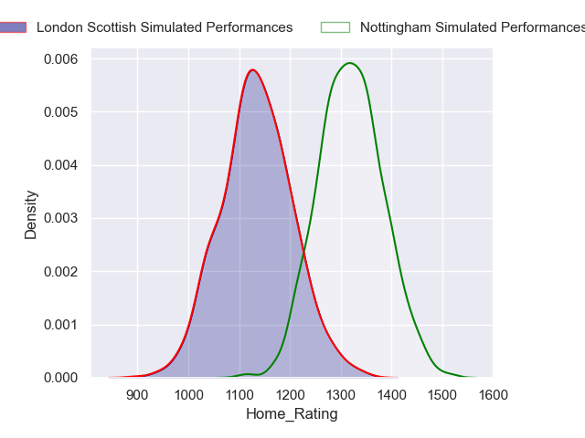
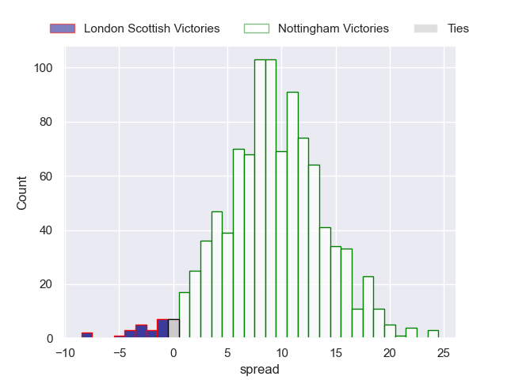

---  
title: "RFU Championship 2023 Status"  
date: 2024-03-11 6:00:00 -0500  
categories: model review projection  
layout: article  
aside:  
    toc: true  
---
# Current Team Rankings

# Standings

## Current Standings

| Club                |   Played |   Wins |   Point Differential |   Losing Bonus Points |   Try Bonus Points |   Competition Points |
|:--------------------|---------:|-------:|---------------------:|----------------------:|-------------------:|---------------------:|
| Ealing Trailfinders |       13 |     11 |                  275 |                     2 |                nan |                   55 |
| Coventry            |       14 |      9 |                  124 |                     2 |                nan |                   46 |
| Cornish Pirates     |       13 |     10 |                  112 |                     1 |                nan |                   46 |
| Hartpury College    |       15 |      9 |                   67 |                     2 |                nan |                   44 |
| Doncaster           |       14 |      9 |                   22 |                     1 |                nan |                   43 |
| Bedford             |       14 |      8 |                   79 |                     4 |                nan |                   42 |
| Ampthill            |       13 |      5 |                  -54 |                     2 |                nan |                   29 |
| Nottingham          |       13 |      5 |                  -75 |                     2 |                nan |                   29 |
| Caldy               |       13 |      4 |                 -147 |                     1 |                nan |                   24 |
| Cambridge           |       14 |      2 |                 -293 |                     3 |                nan |                   16 |
| London Scottish     |       12 |      1 |                 -110 |                     5 |                nan |                   14 |

## Projected Remaining Table

| Club                |   Matches Remaining |   Wins |   Point Differential |   Losing Bonus Points |   Try Bonus Points |   Competition Points |
|:--------------------|--------------------:|-------:|---------------------:|----------------------:|-------------------:|---------------------:|
| Ealing Trailfinders |                   7 |    6.7 |            115.433   |                   0.2 |                5.6 |                 32.8 |
| Jersey              |                   7 |    5.9 |             90.3952  |                   0.7 |                4.9 |                 29.2 |
| Cornish Pirates     |                   8 |    5.7 |             42.4434  |                   1.7 |                4.3 |                 28.8 |
| Coventry            |                   7 |    5.4 |             57.0824  |                   1.2 |                4.7 |                 27.6 |
| Bedford             |                   7 |    4.6 |             16.4759  |                   0.7 |                3.5 |                 22.8 |
| Hartpury College    |                   7 |    4.2 |              5.08789 |                   1.6 |                2.5 |                 20.7 |
| Nottingham          |                   8 |    3.8 |            -13.6635  |                   2.1 |                3.3 |                 20.4 |
| Doncaster           |                   7 |    2.3 |            -27.2756  |                   2.1 |                2.7 |                 14   |
| Ampthill            |                   7 |    1.4 |            -60.1998  |                   2.2 |                2.6 |                 10.6 |
| Cambridge           |                   8 |    1.7 |            -78.1422  |                   1.7 |                1.4 |                  9.9 |
| Caldy               |                   7 |    1.5 |            -56.9467  |                   1.3 |                2.3 |                  9.6 |
| London Scottish     |                   8 |    0.8 |            -90.6903  |                   2.2 |                1.2 |                  6.3 |

## Projected Total Table

| Club                |   Total Matches |   Wins |   Point Differential |   Losing Bonus Points |   Try Bonus Points |   Competition Points |
|:--------------------|----------------:|-------:|---------------------:|----------------------:|-------------------:|---------------------:|
| Ealing Trailfinders |              20 |   17.7 |            390.433   |                   2.2 |                5.6 |                 87.8 |
| Cornish Pirates     |              21 |   15.7 |            154.443   |                   2.7 |                4.3 |                 74.8 |
| Coventry            |              21 |   14.4 |            181.082   |                   3.2 |                4.7 |                 73.6 |
| Bedford             |              21 |   12.6 |             95.4759  |                   4.7 |                3.5 |                 64.8 |
| Hartpury College    |              22 |   13.2 |             72.0879  |                   3.6 |                2.5 |                 64.7 |
| Doncaster           |              21 |   11.3 |             -5.27558 |                   3.1 |                2.7 |                 57   |
| Nottingham          |              21 |    8.8 |            -88.6635  |                   4.1 |                3.3 |                 49.4 |
| Ampthill            |              20 |    6.4 |           -114.2     |                   4.2 |                2.6 |                 39.6 |
| Caldy               |              20 |    5.5 |           -203.947   |                   2.3 |                2.3 |                 33.6 |
| Jersey              |               7 |    5.9 |             90.3952  |                   0.7 |                4.9 |                 29.2 |
| Cambridge           |              22 |    3.7 |           -371.142   |                   4.7 |                1.4 |                 25.9 |
| London Scottish     |              20 |    1.8 |           -200.69    |                   7.2 |                1.2 |                 20.3 |

# Completed Match Review

| Model | Percent Correct Predictions | Spread Error |
| ------ | ------ | ------ |
| Club Level | 65.8% | 12.6 |
| Player Level: Lineup | 63.9% | 14.3 |
| Player Level: Minutes | 65.6% | 14.2 |

# Future Predictions

## Week 16

### Nottingham V London Scottish on 2024/03/15

Average Margin: Nottingham by 9.3

Average Scoreline: 29-19

## Week 17

### Hartpury College V Coventry on 2024/03/23

Average Margin: Coventry by 3.5

Average Scoreline: 35-32

### Ealing Trailfinders V London Scottish on 2024/03/23

Average Margin: Ealing Trailfinders by 28.9

Average Scoreline: 42-13

### Doncaster V Cornish Pirates on 2024/03/23

Average Margin: Cornish Pirates by 1.7

Average Scoreline: 37-36

### Cambridge V Nottingham on 2024/03/23

Average Margin: Nottingham by 3.1

Average Scoreline: 39-36

### Bedford V Caldy on 2024/03/23

Average Margin: Bedford by 13.4

Average Scoreline: 35-21

### Ampthill V Jersey on 2024/03/23

Average Margin: Jersey by 16.9

Average Scoreline: 40-23

## Week 18

### Cornish Pirates V Ealing Trailfinders on 2024/04/06

Average Margin: Ealing Trailfinders by 7.4

Average Scoreline: 39-31

### Nottingham V Bedford on 2024/04/06

Average Margin: Bedford by 2.5

Average Scoreline: 39-36

### London Scottish V Hartpury College on 2024/04/06

Average Margin: Hartpury College by 7.0

Average Scoreline: 38-31

### Caldy V Ampthill on 2024/04/06

Average Margin: Caldy by 1.5

Average Scoreline: 33-31

### Jersey V Doncaster on 2024/04/06

Average Margin: Jersey by 17.2

Average Scoreline: 37-20

### Coventry V Cambridge on 2024/04/06

Average Margin: Coventry by 20.9

Average Scoreline: 36-15

## Week 19

### Doncaster V Caldy on 2024/04/13

Average Margin: Doncaster by 11.2

Average Scoreline: 30-18

### Bedford V Ampthill on 2024/04/13

Average Margin: Bedford by 11.7

Average Scoreline: 29-17

### Nottingham V Coventry on 2024/04/13

Average Margin: Coventry by 7.7

Average Scoreline: 38-30

### Hartpury College V Cornish Pirates on 2024/04/13

Average Margin: Cornish Pirates by 0.9

Average Scoreline: 30-29

### Ealing Trailfinders V Jersey on 2024/04/13

Average Margin: Ealing Trailfinders by 5.0

Average Scoreline: 27-22

### Cambridge V London Scottish on 2024/04/13

Average Margin: Cambridge by 2.8

Average Scoreline: 30-27

## Week 20

### Ampthill V Doncaster on 2024/04/20

Average Margin: Doncaster by 2.5

Average Scoreline: 34-32

### Caldy V Ealing Trailfinders on 2024/04/20

Average Margin: Ealing Trailfinders by 19.9

Average Scoreline: 46-26

### London Scottish V Nottingham on 2024/04/20

Average Margin: Nottingham by 2.8

Average Scoreline: 35-32

### Jersey V Hartpury College on 2024/04/20

Average Margin: Jersey by 16.6

Average Scoreline: 40-23

### Cambridge V Cornish Pirates on 2024/04/20

Average Margin: Cornish Pirates by 12.0

Average Scoreline: 44-32

### Coventry V Bedford on 2024/04/20

Average Margin: Coventry by 8.4

Average Scoreline: 30-22

### Cornish Pirates V Cambridge on 2024/04/21

Average Margin: Cornish Pirates by 18.3

Average Scoreline: 32-14

## Week 21

### Bedford V Doncaster on 2024/05/04

Average Margin: Bedford by 5.7

Average Scoreline: 33-27

### Nottingham V Cornish Pirates on 2024/05/04

Average Margin: Cornish Pirates by 5.1

Average Scoreline: 36-31

### Coventry V London Scottish on 2024/05/04

Average Margin: Coventry by 20.5

Average Scoreline: 36-16

### Hartpury College V Caldy on 2024/05/04

Average Margin: Hartpury College by 11.8

Average Scoreline: 28-16

### Cambridge V Jersey on 2024/05/04

Average Margin: Jersey by 20.5

Average Scoreline: 40-19

### Ealing Trailfinders V Ampthill on 2024/05/04

Average Margin: Ealing Trailfinders by 25.0

Average Scoreline: 43-18

## Week 22

### Doncaster V Ealing Trailfinders on 2024/05/11

Average Margin: Ealing Trailfinders by 12.3

Average Scoreline: 39-27

### Jersey V Nottingham on 2024/05/11

Average Margin: Jersey by 21.0

Average Scoreline: 44-23

### Cornish Pirates V Coventry on 2024/05/11

Average Margin: Cornish Pirates by 0.7

Average Scoreline: 37-36

### Ampthill V Hartpury College on 2024/05/11

Average Margin: Hartpury College by 3.2

Average Scoreline: 34-31

### London Scottish V Bedford on 2024/05/11

Average Margin: Bedford by 8.4

Average Scoreline: 40-32

### Caldy V Cambridge on 2024/05/11

Average Margin: Caldy by 5.6

Average Scoreline: 28-22

## Week 23

### Ealing Trailfinders V Bedford on 2024/05/25

Average Margin: Ealing Trailfinders by 16.9

Average Scoreline: 41-24

### Nottingham V Caldy on 2024/05/25

Average Margin: Nottingham by 7.6

Average Scoreline: 28-20

### Hartpury College V Doncaster on 2024/05/25

Average Margin: Hartpury College by 4.1

Average Scoreline: 32-28

### London Scottish V Cornish Pirates on 2024/05/25

Average Margin: Cornish Pirates by 11.1

Average Scoreline: 40-29

### Coventry V Jersey on 2024/05/25

Average Margin: Jersey by 3.2

Average Scoreline: 33-30

### Cambridge V Ampthill on 2024/05/25

Average Margin: Ampthill by 0.6

Average Scoreline: 38-37

