---  
title: "RFU Championship 2023 Status"  
date: 2023-09-30 6:00:00 -0500  
categories: model review projection  
layout: article  
aside:  
    toc: true  
---
# Current Team Rankings

# Standings

## Projected Total Table

| Club                |   Total Matches |   Wins |   Point Differential |   Losing Bonus Points |   Try Bonus Points |   Competition Points |
|:--------------------|----------------:|-------:|---------------------:|----------------------:|-------------------:|---------------------:|
| Ealing Trailfinders |              22 |   20.8 |                327.8 |                   1   |               20.6 |                105   |
| Jersey              |              22 |   19.8 |                266.6 |                   1.6 |               19.5 |                100.3 |
| Coventry            |              22 |   17.1 |                154.8 |                   3   |               16.8 |                 88.2 |
| Cambridge           |              22 |   15.1 |                 79.9 |                   3.7 |               14.7 |                 78.8 |
| Bedford             |              22 |   12.2 |                 14.7 |                   4.8 |               12   |                 65.7 |
| Cornish Pirates     |              22 |   11.4 |                  2.3 |                   5.4 |               10.9 |                 61.7 |
| Doncaster           |              22 |    9   |                -60.9 |                   5.9 |                8.6 |                 50.4 |
| Hartpury College    |              22 |    6.7 |               -117.4 |                   6.2 |                6.4 |                 39.6 |
| Nottingham          |              22 |    6.2 |               -129.1 |                   6.1 |                6   |                 37.1 |
| Ampthill            |              22 |    5.2 |               -156.2 |                   6   |                5   |                 31.9 |
| London Scottish     |              22 |    4.8 |               -167   |                   6.1 |                4.4 |                 29.9 |
| Caldy               |              22 |    3.5 |               -214.8 |                   5.4 |                3.4 |                 22.9 |

# Future Predictions

## Week 15

### Jersey V Coventry on 2023/10/21

Average Margin: Jersey by 8.3

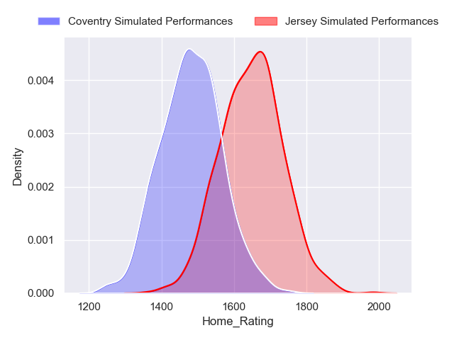

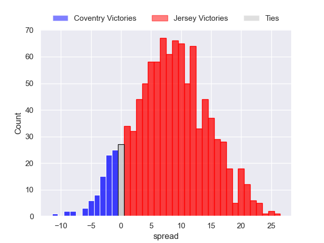

### Cornish Pirates V London Scottish on 2023/10/21

Average Margin: Cornish Pirates by 11.2

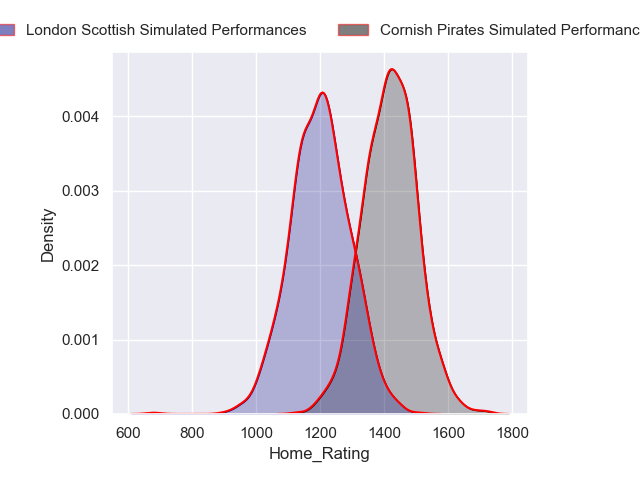

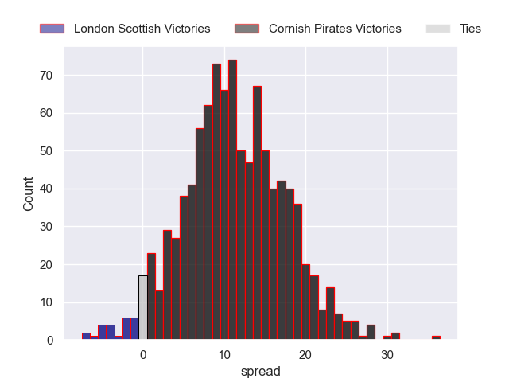

### Caldy V Nottingham on 2023/10/21

Average Margin: Nottingham by 0.1

### Bedford V Ealing Trailfinders on 2023/10/21

Average Margin: Ealing Trailfinders by 10.2

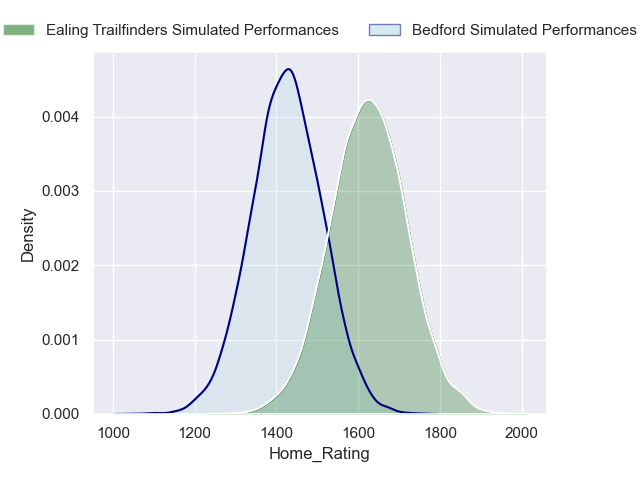

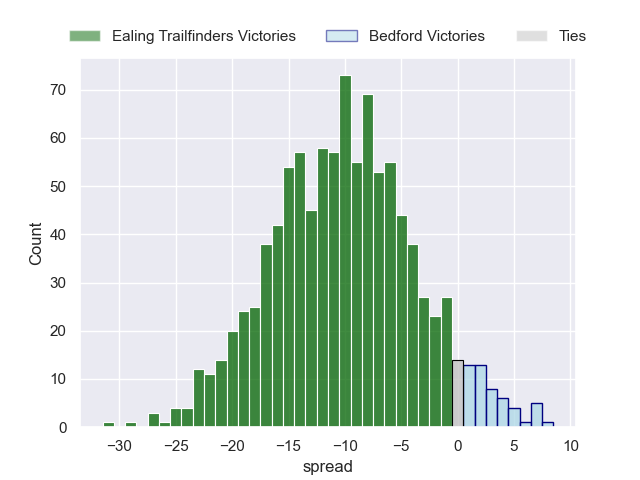

### Doncaster V Hartpury College on 2023/10/21

Average Margin: Doncaster by 5.8

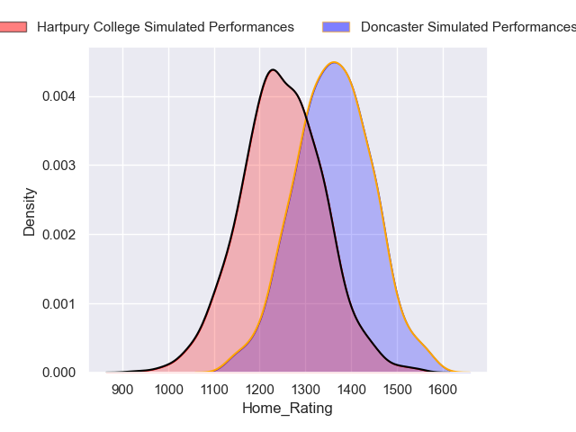
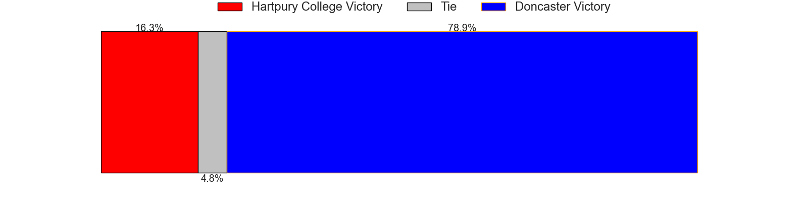
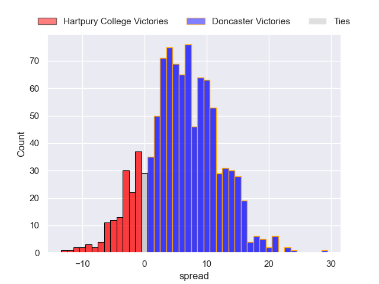

### Ampthill V Cambridge on 2023/10/21

Average Margin: Cambridge by 6.2

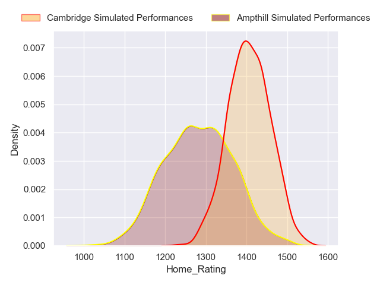

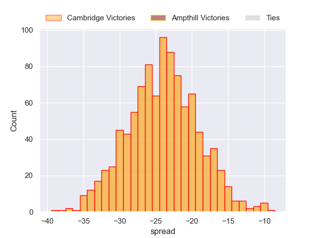

## Week 16

### Cambridge V Doncaster on 2023/10/28

Average Margin: Cambridge by 9.1

### Cornish Pirates V Bedford on 2023/10/28

Average Margin: Cornish Pirates by 3.1

### Coventry V Caldy on 2023/10/28

Average Margin: Coventry by 19.6

### Hartpury College V Ealing Trailfinders on 2023/10/28

Average Margin: Ealing Trailfinders by 16.0

### Nottingham V Ampthill on 2023/10/28

Average Margin: Nottingham by 4.5

### London Scottish V Jersey on 2023/10/28

Average Margin: Jersey by 15.3

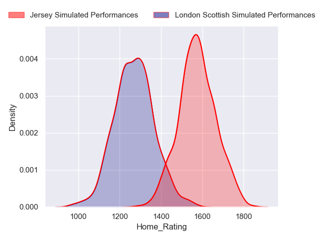

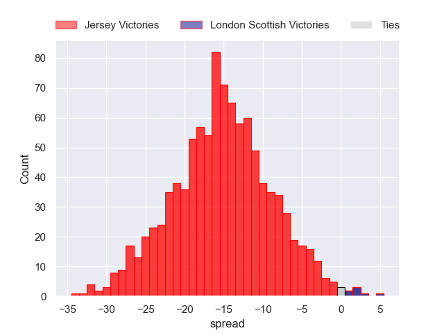

## Week 17

### Caldy V London Scottish on 2023/11/04

Average Margin: Caldy by 1.0

### Bedford V Hartpury College on 2023/11/04

Average Margin: Bedford by 9.1

### Ampthill V Coventry on 2023/11/04

Average Margin: Coventry by 9.9

### Doncaster V Nottingham on 2023/11/04

Average Margin: Doncaster by 6.2

### Ealing Trailfinders V Cambridge on 2023/11/04

Average Margin: Ealing Trailfinders by 14.3

### Jersey V Cornish Pirates on 2023/11/04

Average Margin: Jersey by 14.4

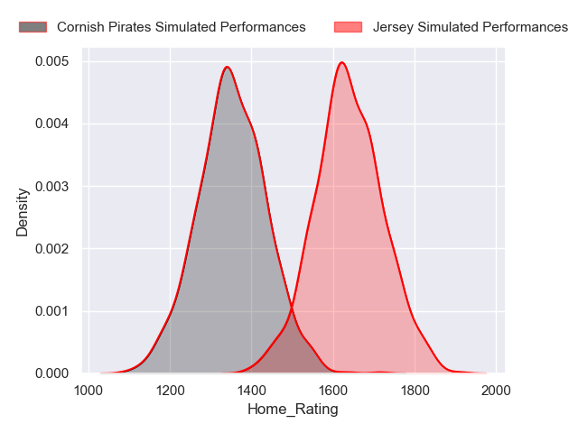

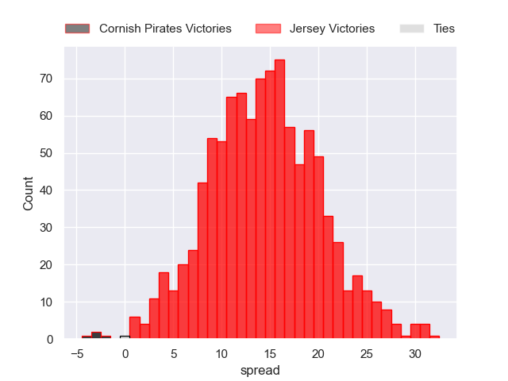

## Week 18

### Nottingham V Ealing Trailfinders on 2023/11/18

Average Margin: Ealing Trailfinders by 16.1

### London Scottish V Ampthill on 2023/11/18

Average Margin: London Scottish by 2.7

### Coventry V Doncaster on 2023/11/18

Average Margin: Coventry by 12.4

### Cambridge V Hartpury College on 2023/11/18

Average Margin: Cambridge by 11.1

### Jersey V Bedford on 2023/11/18

Average Margin: Jersey by 13.8

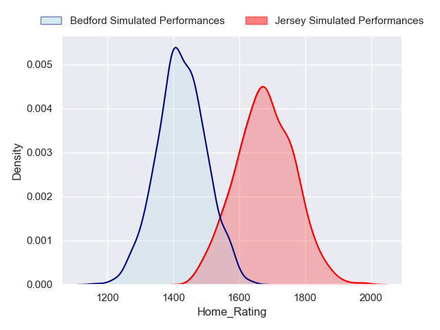

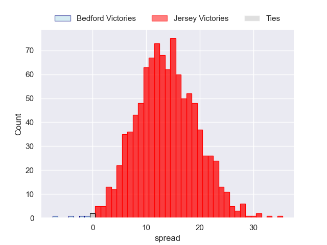

### Cornish Pirates V Caldy on 2023/11/18

Average Margin: Cornish Pirates by 12.6

## Week 19

### Ampthill V Cornish Pirates on 2023/11/25

Average Margin: Cornish Pirates by 3.9

### Bedford V Cambridge on 2023/11/25

Average Margin: Bedford by 0.9

### Caldy V Jersey on 2023/11/25

Average Margin: Jersey by 17.2

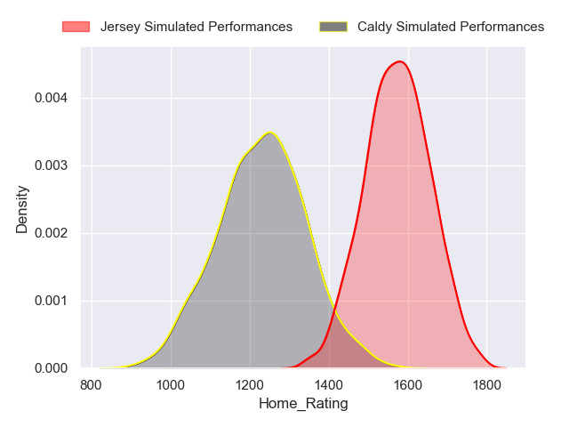

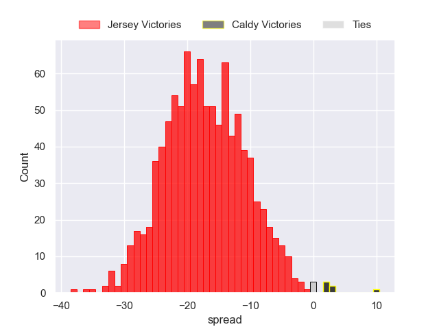

### Doncaster V London Scottish on 2023/11/25

Average Margin: Doncaster by 7.9

### Ealing Trailfinders V Coventry on 2023/11/25

Average Margin: Ealing Trailfinders by 10.9

### Hartpury College V Nottingham on 2023/11/25

Average Margin: Hartpury College by 3.9

## Week 20

### Nottingham V Cambridge on 2023/12/02

Average Margin: Cambridge by 5.1

### Jersey V Ampthill on 2023/12/02

Average Margin: Jersey by 21.2

### Coventry V Hartpury College on 2023/12/02

Average Margin: Coventry by 14.9

### London Scottish V Ealing Trailfinders on 2023/12/02

Average Margin: Ealing Trailfinders by 17.5

### Cornish Pirates V Doncaster on 2023/12/02

Average Margin: Cornish Pirates by 6.4

### Caldy V Bedford on 2023/12/02

Average Margin: Bedford by 6.4

## Week 21

### Doncaster V Jersey on 2023/12/16

Average Margin: Jersey by 10.5

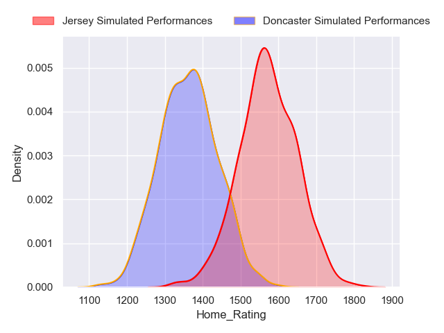

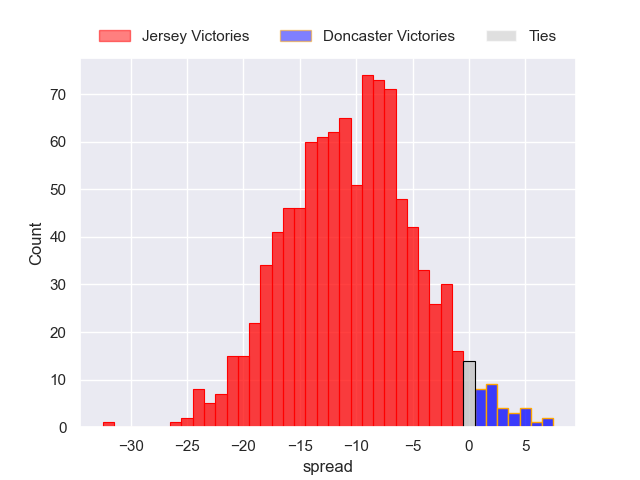

### Cambridge V Coventry on 2023/12/16

Average Margin: Coventry by 0.1

### Bedford V Nottingham on 2023/12/16

Average Margin: Bedford by 9.6

### Hartpury College V London Scottish on 2023/12/16

Average Margin: Hartpury College by 5.1

### Ealing Trailfinders V Cornish Pirates on 2023/12/16

Average Margin: Ealing Trailfinders by 16.6

### Ampthill V Caldy on 2023/12/16

Average Margin: Ampthill by 5.9

## Week 22

### Ampthill V Bedford on 2023/12/23

Average Margin: Bedford by 3.9

### Caldy V Doncaster on 2023/12/23

Average Margin: Doncaster by 3.1

### Coventry V Nottingham on 2023/12/23

Average Margin: Coventry by 15.4

### Jersey V Ealing Trailfinders on 2023/12/23

Average Margin: Jersey by 0.9

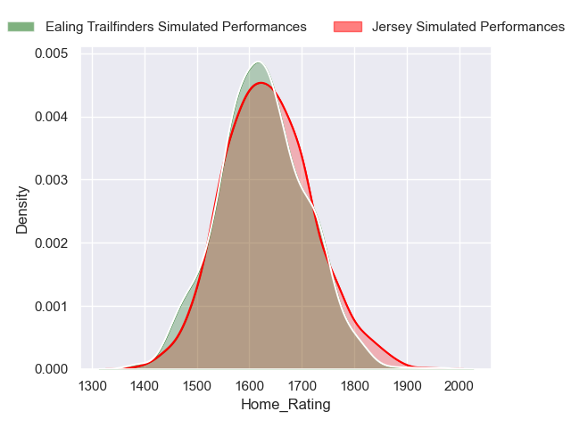

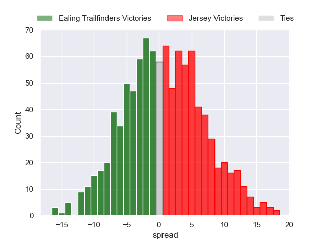

### London Scottish V Cambridge on 2023/12/23

Average Margin: Cambridge by 7.0

### Cornish Pirates V Hartpury College on 2023/12/23

Average Margin: Cornish Pirates by 8.4

## Week 1

### Hartpury College V Jersey on 2024/01/13

Average Margin: Jersey by 12.8

### Cambridge V Cornish Pirates on 2024/01/13

Average Margin: Cambridge by 5.9

### Doncaster V Ampthill on 2024/01/13

Average Margin: Doncaster by 7.3

### Ealing Trailfinders V Caldy on 2024/01/13

Average Margin: Ealing Trailfinders by 26.1

### Bedford V Coventry on 2024/01/13

Average Margin: Coventry by 2.6

### Nottingham V London Scottish on 2024/01/13

Average Margin: Nottingham by 4.9

## Week 2

### Caldy V Hartpury College on 2024/01/20

Average Margin: Hartpury College by 0.6

### Ampthill V Ealing Trailfinders on 2024/01/20

Average Margin: Ealing Trailfinders by 17.0

### Jersey V Cambridge on 2024/01/20

Average Margin: Jersey by 11.4

### London Scottish V Coventry on 2024/01/20

Average Margin: Coventry by 10.4

### Doncaster V Bedford on 2024/01/20

Average Margin: Doncaster by 0.2

### Cornish Pirates V Nottingham on 2024/01/20

Average Margin: Cornish Pirates by 9.1

## Week 3

### Ealing Trailfinders V Doncaster on 2024/01/27

Average Margin: Ealing Trailfinders by 19.3

### Bedford V London Scottish on 2024/01/27

Average Margin: Bedford by 10.4

### Cambridge V Caldy on 2024/01/27

Average Margin: Cambridge by 15.6

### Coventry V Cornish Pirates on 2024/01/27

Average Margin: Coventry by 9.6

### Hartpury College V Ampthill on 2024/01/27

Average Margin: Hartpury College by 5.1

### Nottingham V Jersey on 2024/01/27

Average Margin: Jersey by 13.1

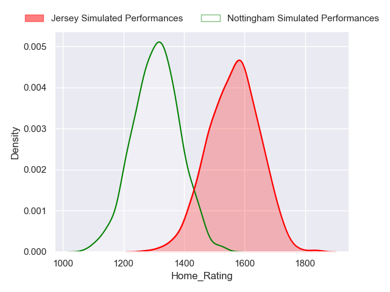

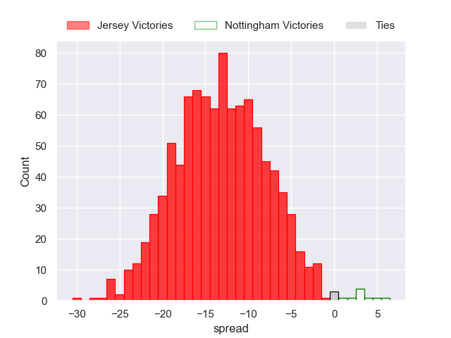

## Week 4

### Ealing Trailfinders V Hartpury College on 2024/02/03

Average Margin: Ealing Trailfinders by 21.7

### Caldy V Coventry on 2024/02/03

Average Margin: Coventry by 12.0

### Bedford V Cornish Pirates on 2024/02/03

Average Margin: Bedford by 3.8

### Jersey V London Scottish on 2024/02/03

Average Margin: Jersey by 21.1

### Ampthill V Nottingham on 2024/02/03

Average Margin: Ampthill by 2.2

### Doncaster V Cambridge on 2024/02/03

Average Margin: Cambridge by 2.0

## Week 5

### Coventry V Ampthill on 2024/02/24

Average Margin: Coventry by 16.0

### London Scottish V Caldy on 2024/02/24

Average Margin: London Scottish by 5.2

### Nottingham V Doncaster on 2024/02/24

Average Margin: Nottingham by 0.7

### Cornish Pirates V Jersey on 2024/02/24

Average Margin: Jersey by 7.3

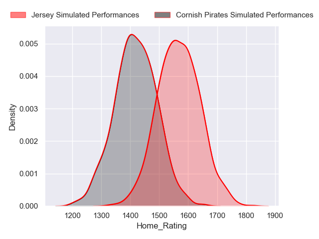

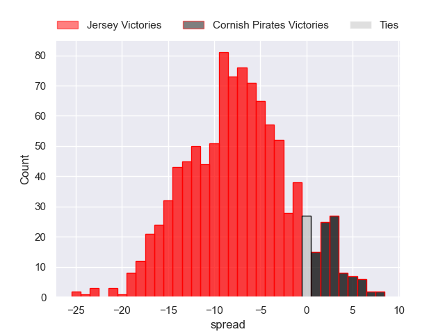

### Hartpury College V Bedford on 2024/02/24

Average Margin: Bedford by 2.1

### Cambridge V Ealing Trailfinders on 2024/02/24

Average Margin: Ealing Trailfinders by 7.1

## Week 6

### Ealing Trailfinders V Nottingham on 2024/03/02

Average Margin: Ealing Trailfinders by 22.4

### Hartpury College V Cambridge on 2024/03/02

Average Margin: Cambridge by 4.9

### Doncaster V Coventry on 2024/03/02

Average Margin: Coventry by 5.6

### Caldy V Cornish Pirates on 2024/03/02

Average Margin: Cornish Pirates by 5.8

### Bedford V Jersey on 2024/03/02

Average Margin: Jersey by 7.0

### Ampthill V London Scottish on 2024/03/02

Average Margin: Ampthill by 3.9

## Week 7

### Nottingham V Hartpury College on 2024/03/09

Average Margin: Nottingham by 2.9

### London Scottish V Doncaster on 2024/03/09

Average Margin: Doncaster by 1.0

### Coventry V Ealing Trailfinders on 2024/03/09

Average Margin: Ealing Trailfinders by 3.7

### Cornish Pirates V Ampthill on 2024/03/09

Average Margin: Cornish Pirates by 10.1

### Cambridge V Bedford on 2024/03/09

Average Margin: Cambridge by 6.0

### Jersey V Caldy on 2024/03/09

Average Margin: Jersey by 23.2

## Week 8

### Hartpury College V Coventry on 2024/03/23

Average Margin: Coventry by 7.7

### Ealing Trailfinders V London Scottish on 2024/03/23

Average Margin: Ealing Trailfinders by 23.7

### Doncaster V Cornish Pirates on 2024/03/23

Average Margin: Doncaster by 0.5

### Cambridge V Nottingham on 2024/03/23

Average Margin: Cambridge by 11.5

### Bedford V Caldy on 2024/03/23

Average Margin: Bedford by 12.7

### Ampthill V Jersey on 2024/03/23

Average Margin: Jersey by 14.0

## Week 9

### Coventry V Cambridge on 2024/04/06

Average Margin: Coventry by 6.7

### Cornish Pirates V Ealing Trailfinders on 2024/04/06

Average Margin: Ealing Trailfinders by 9.8

### Jersey V Doncaster on 2024/04/06

Average Margin: Jersey by 16.9

### Nottingham V Bedford on 2024/04/06

Average Margin: Bedford by 2.7

### Caldy V Ampthill on 2024/04/06

Average Margin: Caldy by 1.2

### London Scottish V Hartpury College on 2024/04/06

Average Margin: London Scottish by 1.2

## Week 10

### Ealing Trailfinders V Jersey on 2024/04/13

Average Margin: Ealing Trailfinders by 5.8

### Doncaster V Caldy on 2024/04/13

Average Margin: Doncaster by 9.5

### Bedford V Ampthill on 2024/04/13

Average Margin: Bedford by 10.5

### Cambridge V London Scottish on 2024/04/13

Average Margin: Cambridge by 13.4

### Nottingham V Coventry on 2024/04/13

Average Margin: Coventry by 8.4

### Hartpury College V Cornish Pirates on 2024/04/13

Average Margin: Cornish Pirates by 1.8

## Week 11

### Coventry V Bedford on 2024/04/20

Average Margin: Coventry by 9.0

### Caldy V Ealing Trailfinders on 2024/04/20

Average Margin: Ealing Trailfinders by 18.9

### Ampthill V Doncaster on 2024/04/20

Average Margin: Doncaster by 0.6

### Cambridge V Cornish Pirates on 2024/04/20

Average Margin: Cambridge by 6.0

### Jersey V Hartpury College on 2024/04/20

Average Margin: Jersey by 19.1

### London Scottish V Nottingham on 2024/04/20

Average Margin: London Scottish by 1.8

## Week 12

### Bedford V Doncaster on 2024/05/04

Average Margin: Bedford by 6.8

### Nottingham V Cornish Pirates on 2024/05/04

Average Margin: Cornish Pirates by 2.3

### Hartpury College V Caldy on 2024/05/04

Average Margin: Hartpury College by 7.6

### Coventry V London Scottish on 2024/05/04

Average Margin: Coventry by 16.4

### Ealing Trailfinders V Ampthill on 2024/05/04

Average Margin: Ealing Trailfinders by 23.2

### Cambridge V Jersey on 2024/05/04

Average Margin: Jersey by 4.4

## Week 13

### Ampthill V Hartpury College on 2024/05/11

Average Margin: Ampthill by 1.8

### Caldy V Cambridge on 2024/05/11

Average Margin: Cambridge by 8.4

### Cornish Pirates V Coventry on 2024/05/11

Average Margin: Coventry by 2.6

### Doncaster V Ealing Trailfinders on 2024/05/11

Average Margin: Ealing Trailfinders by 12.7

### Jersey V Nottingham on 2024/05/11

Average Margin: Jersey by 19.8

### London Scottish V Bedford on 2024/05/11

Average Margin: Bedford by 4.1

## Week 14

### London Scottish V Cornish Pirates on 2024/05/25

Average Margin: Cornish Pirates by 3.9

### Nottingham V Caldy on 2024/05/25

Average Margin: Nottingham by 6.9

### Hartpury College V Doncaster on 2024/05/25

Average Margin: Hartpury College by 1.0

### Ealing Trailfinders V Bedford on 2024/05/25

Average Margin: Ealing Trailfinders by 16.1

### Coventry V Jersey on 2024/05/25

Average Margin: Jersey by 1.2

### Cambridge V Ampthill on 2024/05/25

Average Margin: Cambridge by 13.1

