---  
title: "RFU Championship 2023 Status"  
date: 2023-11-29 6:00:00 -0500  
categories: model review projection  
layout: article  
aside:  
    toc: true  
---
# Current Team Rankings

# Standings

## Current Standings

| Club                |   Played |   Wins |   Point Differential |   Losing Bonus Points |   Try Bonus Points |   Competition Points |
|:--------------------|---------:|-------:|---------------------:|----------------------:|-------------------:|---------------------:|
| Ealing Trailfinders |        5 |      5 |                  115 |                     0 |                nan |                   24 |
| Doncaster           |        5 |      4 |                   21 |                     0 |                nan |                   18 |
| Nottingham          |        5 |      3 |                   15 |                     0 |                  4 |                   16 |
| Ampthill            |        5 |      3 |                    3 |                     0 |                nan |                   16 |
| Cornish Pirates     |        4 |      3 |                   68 |                     1 |                nan |                   14 |
| Bedford             |        4 |      3 |                   63 |                     0 |                nan |                   13 |
| Coventry            |        4 |      2 |                   56 |                     0 |                nan |                   11 |
| Hartpury College    |        5 |      1 |                  -45 |                     1 |                  1 |                    6 |
| Caldy               |        4 |      1 |                  -70 |                     0 |                  2 |                    6 |
| Cambridge           |        5 |      0 |                 -164 |                     1 |                nan |                    3 |
| London Scottish     |        4 |      0 |                  -62 |                     1 |                nan |                    1 |

## Projected Remaining Table

| Club                |   Matches Remaining |   Wins |   Point Differential |   Losing Bonus Points |   Try Bonus Points |   Competition Points |
|:--------------------|--------------------:|-------:|---------------------:|----------------------:|-------------------:|---------------------:|
| Coventry            |                  19 |   16.2 |             225.745  |                   2.2 |               15.9 |                 83   |
| Ealing Trailfinders |                  17 |   16.3 |             340.182  |                   0.6 |               16.1 |                 81.9 |
| Jersey              |                  17 |   14.8 |             264.24   |                   1.4 |               14.6 |                 75.3 |
| Bedford             |                  18 |   12.8 |             101.811  |                   2.9 |               12.6 |                 66.7 |
| Cornish Pirates     |                  18 |   11.9 |             105.789  |                   2.9 |               11.6 |                 62.2 |
| Nottingham          |                  18 |    7.6 |             -37.6956 |                   3.3 |                7.4 |                 41   |
| Doncaster           |                  17 |    7.1 |             -34.6212 |                   3.9 |                6.8 |                 39.2 |
| Hartpury College    |                  17 |    5.9 |             -82.1428 |                   3.9 |                5.7 |                 33.2 |
| Ampthill            |                  17 |    5.2 |            -122.09   |                   3.4 |                5.1 |                 29.1 |
| Caldy               |                  17 |    3.6 |            -149.336  |                   3.7 |                3.5 |                 21.8 |
| London Scottish     |                  17 |    3.1 |            -183.834  |                   3.1 |                3   |                 18.4 |
| Cambridge           |                  18 |    0.4 |            -428.047  |                   1.1 |                0.7 |                  3.5 |

## Projected Total Table

| Club                |   Total Matches |   Wins |   Point Differential |   Losing Bonus Points |   Try Bonus Points |   Competition Points |
|:--------------------|----------------:|-------:|---------------------:|----------------------:|-------------------:|---------------------:|
| Ealing Trailfinders |              22 |   21.3 |             455.182  |                   0.6 |               16.1 |                105.9 |
| Coventry            |              23 |   18.2 |             281.745  |                   2.2 |               15.9 |                 94   |
| Bedford             |              22 |   15.8 |             164.811  |                   2.9 |               12.6 |                 79.7 |
| Cornish Pirates     |              22 |   14.9 |             173.789  |                   3.9 |               11.6 |                 76.2 |
| Jersey              |              17 |   14.8 |             264.24   |                   1.4 |               14.6 |                 75.3 |
| Doncaster           |              22 |   11.1 |             -13.6212 |                   3.9 |                6.8 |                 57.2 |
| Nottingham          |              23 |   10.6 |             -22.6956 |                   3.3 |               11.4 |                 57   |
| Ampthill            |              22 |    8.2 |            -119.09   |                   3.4 |                5.1 |                 45.1 |
| Hartpury College    |              22 |    6.9 |            -127.143  |                   4.9 |                6.7 |                 39.2 |
| Caldy               |              21 |    4.6 |            -219.336  |                   3.7 |                5.5 |                 27.8 |
| London Scottish     |              21 |    3.1 |            -245.834  |                   4.1 |                3   |                 19.4 |
| Cambridge           |              23 |    0.4 |            -592.047  |                   2.1 |                0.7 |                  6.5 |

# Completed Match Review

| Model | Percent Correct Predictions | Spread Error |
| ------ | ------ | ------ |
| Club Level | 80.0% | 13.2 |
| Player Level: Lineup | 61.9% | 17.5 |
| Player Level: Minutes | 66.7% | 17.3 |

# Future Predictions

## Week 6

### Coventry V Hartpury College on 2023/12/02

Average Margin: Coventry by 17.7

### Cornish Pirates V Doncaster on 2023/12/02

Average Margin: Cornish Pirates by 8.4

### Jersey V Ampthill on 2023/12/02

Average Margin: Jersey by 22.9

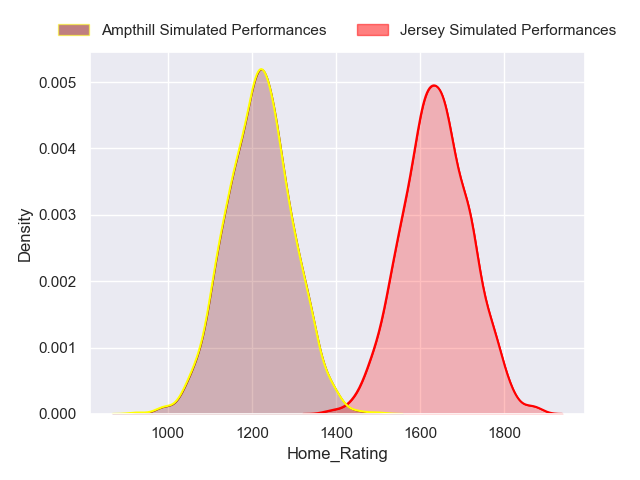

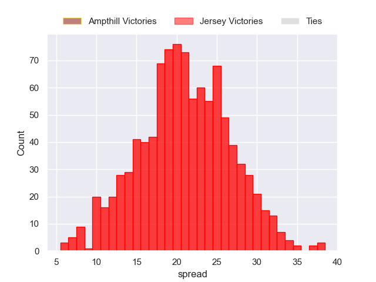

### Nottingham V Cambridge on 2023/12/02

Average Margin: Nottingham by 25.3

### Caldy V Bedford on 2023/12/02

Average Margin: Bedford by 10.8

### London Scottish V Ealing Trailfinders on 2023/12/02

Average Margin: Ealing Trailfinders by 25.3

## Week 7

### Doncaster V Jersey on 2023/12/15

Average Margin: Jersey by 11.0

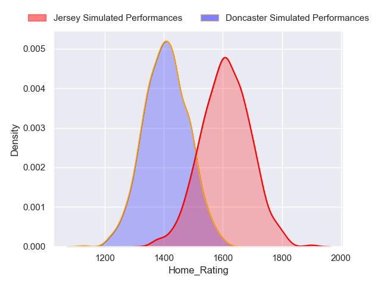

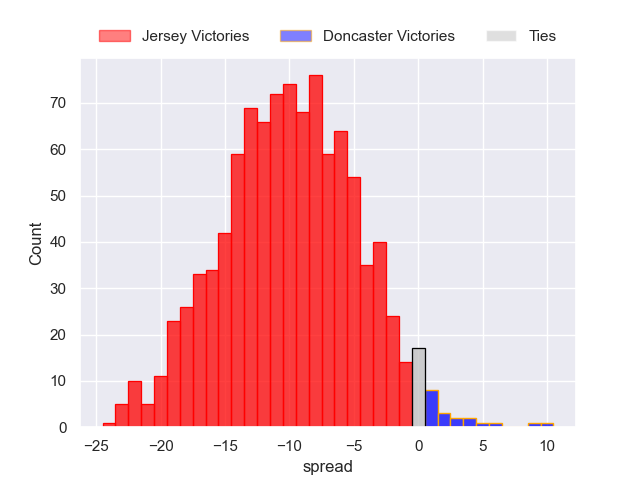

### Bedford V Nottingham on 2023/12/16

Average Margin: Bedford by 9.9

### Ampthill V Caldy on 2023/12/16

Average Margin: Ampthill by 6.8

### Hartpury College V London Scottish on 2023/12/16

Average Margin: Hartpury College by 9.2

### Ealing Trailfinders V Cornish Pirates on 2023/12/16

Average Margin: Ealing Trailfinders by 16.9

### Cambridge V Coventry on 2023/12/16

Average Margin: Coventry by 30.4

## Week 8

### Jersey V Ealing Trailfinders on 2023/12/22

Average Margin: Ealing Trailfinders by 0.5

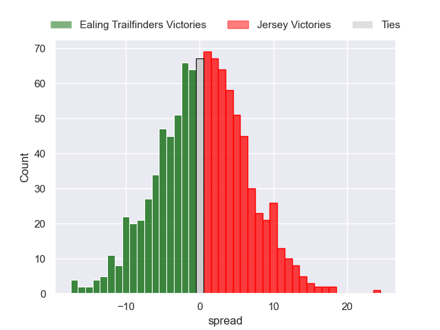

### Caldy V Doncaster on 2023/12/23

Average Margin: Doncaster by 5.3

### London Scottish V Cambridge on 2023/12/23

Average Margin: London Scottish by 16.6

### Coventry V Nottingham on 2023/12/23

Average Margin: Coventry by 14.8

### Ampthill V Bedford on 2023/12/23

Average Margin: Bedford by 6.9

### Cornish Pirates V Hartpury College on 2023/12/23

Average Margin: Cornish Pirates by 13.0

## Week 9

### Coventry V Nottingham on 2023/12/26

Average Margin: Coventry by 14.8

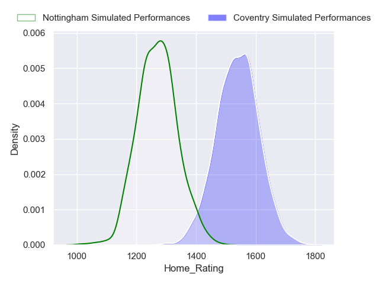

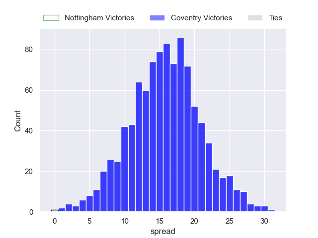

## Week 10

### Bedford V Coventry on 2024/01/01

Average Margin: Coventry by 1.5

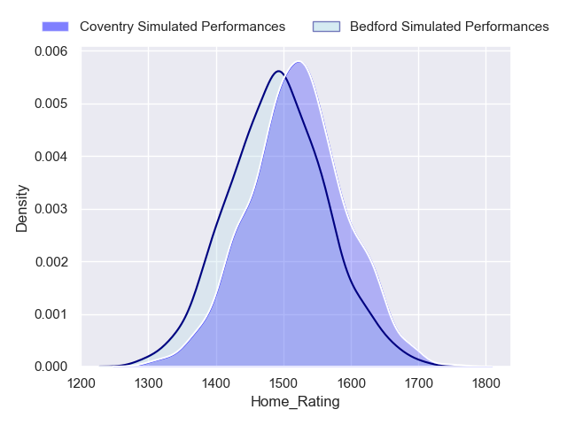

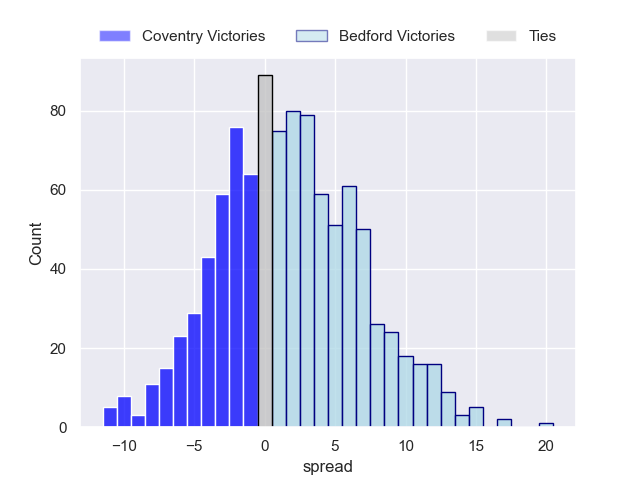

## Week 11

### Nottingham V London Scottish on 2024/01/13

Average Margin: Nottingham by 12.2

### Doncaster V Ampthill on 2024/01/13

Average Margin: Doncaster by 8.4

### Hartpury College V Jersey on 2024/01/13

Average Margin: Jersey by 15.2

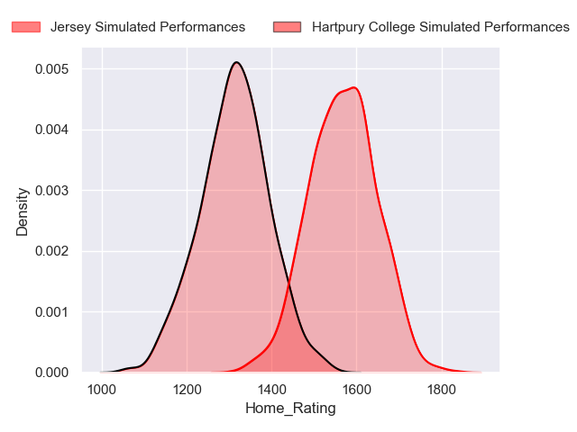

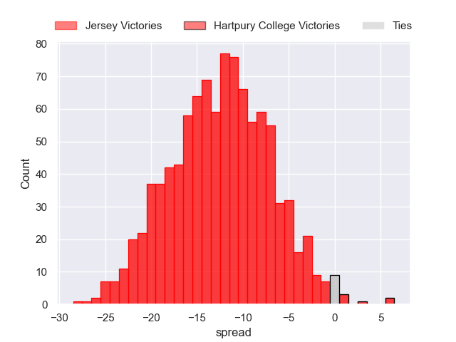

### Cambridge V Cornish Pirates on 2024/01/13

Average Margin: Cornish Pirates by 24.1

### Ealing Trailfinders V Caldy on 2024/01/13

Average Margin: Ealing Trailfinders by 30.7

### Bedford V Coventry on 2024/01/13

Average Margin: Coventry by 1.6

## Week 12

### Jersey V Cambridge on 2024/01/20

Average Margin: Jersey by 40.5

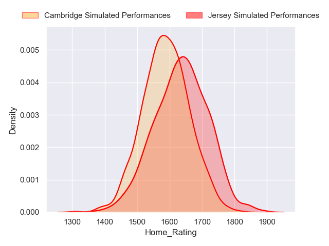

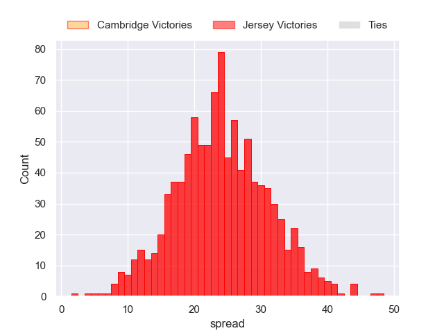

### Cornish Pirates V Nottingham on 2024/01/20

Average Margin: Cornish Pirates by 9.7

### Doncaster V Bedford on 2024/01/20

Average Margin: Bedford by 2.0

### Caldy V Hartpury College on 2024/01/20

Average Margin: Hartpury College by 0.5

### London Scottish V Coventry on 2024/01/20

Average Margin: Coventry by 16.3

### Ampthill V Ealing Trailfinders on 2024/01/20

Average Margin: Ealing Trailfinders by 20.4

## Week 13

### Nottingham V Jersey on 2024/01/26

Average Margin: Jersey by 12.5

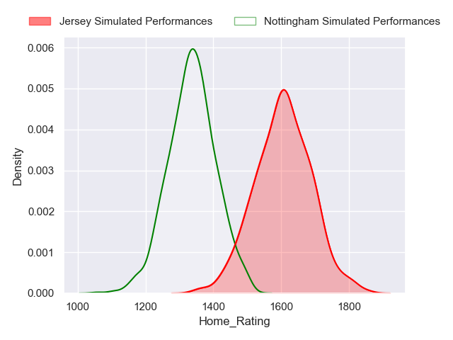

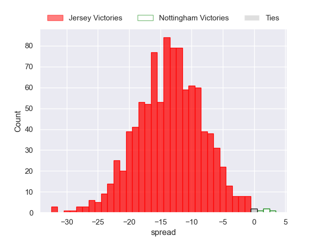

### Hartpury College V Ampthill on 2024/01/27

Average Margin: Hartpury College by 4.2

### Coventry V Cornish Pirates on 2024/01/27

Average Margin: Coventry by 8.4

### Bedford V London Scottish on 2024/01/27

Average Margin: Bedford by 18.5

### Cambridge V Caldy on 2024/01/27

Average Margin: Caldy by 11.0

### Ealing Trailfinders V Doncaster on 2024/01/27

Average Margin: Ealing Trailfinders by 21.8

## Week 14

### Caldy V Coventry on 2024/02/03

Average Margin: Coventry by 15.4

### Ampthill V Nottingham on 2024/02/03

Average Margin: Nottingham by 0.4

### Bedford V Cornish Pirates on 2024/02/03

Average Margin: Bedford by 3.6

### Ealing Trailfinders V Hartpury College on 2024/02/03

Average Margin: Ealing Trailfinders by 26.4

### Jersey V London Scottish on 2024/02/03

Average Margin: Jersey by 27.3

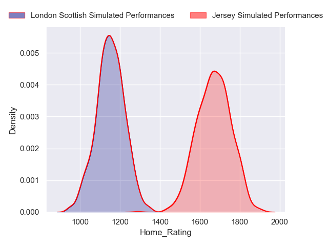

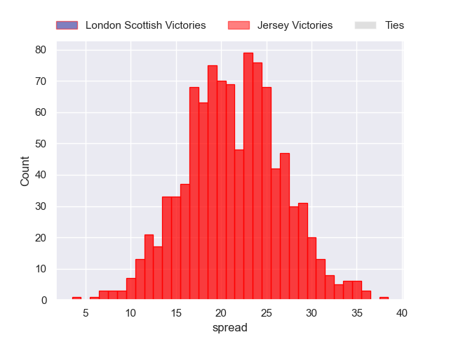

### Doncaster V Cambridge on 2024/02/03

Average Margin: Doncaster by 25.5

## Week 15

### Cornish Pirates V Jersey on 2024/02/23

Average Margin: Jersey by 5.9

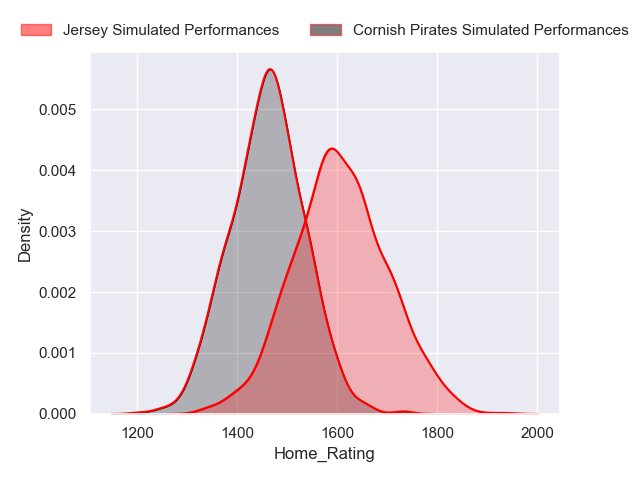

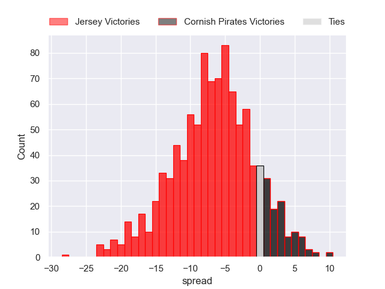

### Nottingham V Doncaster on 2024/02/24

Average Margin: Nottingham by 2.2

### Coventry V Ampthill on 2024/02/24

Average Margin: Coventry by 18.6

### Cambridge V Ealing Trailfinders on 2024/02/24

Average Margin: Ealing Trailfinders by 37.3

### Hartpury College V Bedford on 2024/02/24

Average Margin: Bedford by 6.3

### London Scottish V Caldy on 2024/02/24

Average Margin: London Scottish by 1.8

## Week 16

### Ealing Trailfinders V Nottingham on 2024/03/02

Average Margin: Ealing Trailfinders by 23.3

### Doncaster V Coventry on 2024/03/02

Average Margin: Coventry by 6.5

### Hartpury College V Cambridge on 2024/03/02

Average Margin: Hartpury College by 20.8

### Caldy V Cornish Pirates on 2024/03/02

Average Margin: Cornish Pirates by 9.7

### Bedford V Jersey on 2024/03/02

Average Margin: Jersey by 5.6

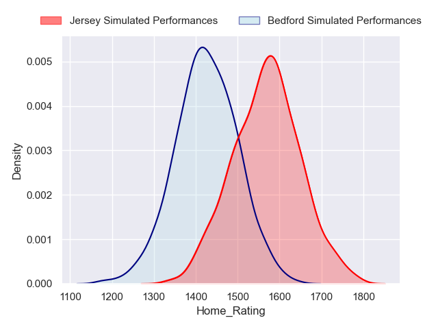

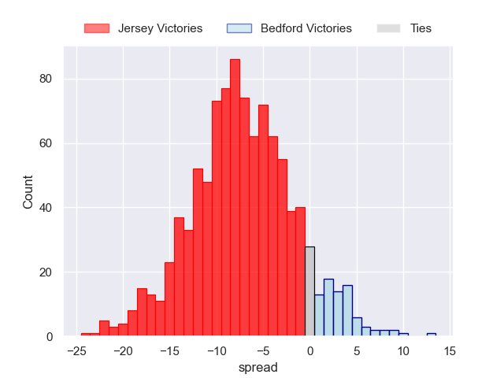

### Ampthill V London Scottish on 2024/03/02

Average Margin: Ampthill by 8.3

## Week 17

### Jersey V Caldy on 2024/03/09

Average Margin: Jersey by 25.8

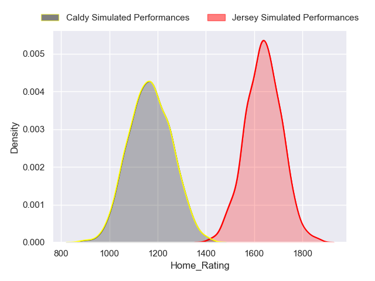

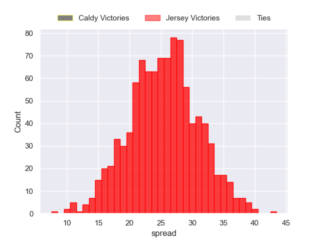

### Cornish Pirates V Ampthill on 2024/03/09

Average Margin: Cornish Pirates by 13.4

### Cambridge V Bedford on 2024/03/09

Average Margin: Bedford by 23.9

### Nottingham V Hartpury College on 2024/03/09

Average Margin: Nottingham by 6.5

### Coventry V Ealing Trailfinders on 2024/03/09

Average Margin: Ealing Trailfinders by 5.6

### London Scottish V Doncaster on 2024/03/09

Average Margin: Doncaster by 6.6

## Week 18

### Doncaster V Cornish Pirates on 2024/03/23

Average Margin: Cornish Pirates by 1.8

### Bedford V Caldy on 2024/03/23

Average Margin: Bedford by 17.0

### Ealing Trailfinders V London Scottish on 2024/03/23

Average Margin: Ealing Trailfinders by 31.9

### Cambridge V Nottingham on 2024/03/23

Average Margin: Nottingham by 17.4

### Hartpury College V Coventry on 2024/03/23

Average Margin: Coventry by 10.8

### Ampthill V Jersey on 2024/03/23

Average Margin: Jersey by 15.5

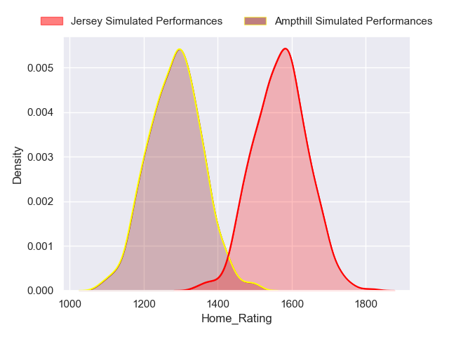

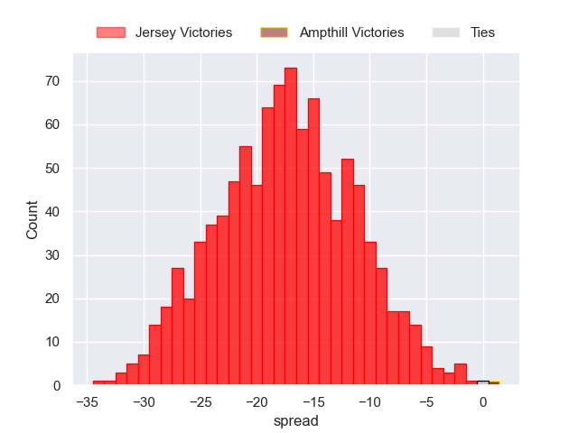

## Week 19

### Coventry V Cambridge on 2024/04/06

Average Margin: Coventry by 34.5

### Nottingham V Bedford on 2024/04/06

Average Margin: Bedford by 2.9

### London Scottish V Hartpury College on 2024/04/06

Average Margin: Hartpury College by 2.4

### Cornish Pirates V Ealing Trailfinders on 2024/04/06

Average Margin: Ealing Trailfinders by 10.4

### Jersey V Doncaster on 2024/04/06

Average Margin: Jersey by 17.3

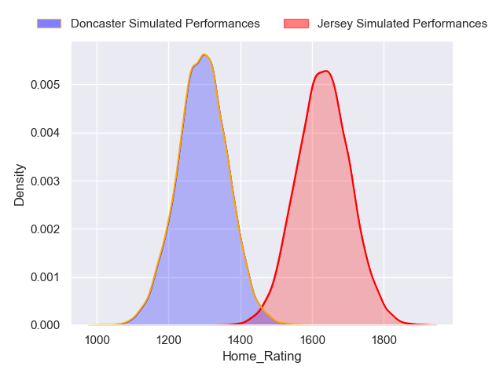

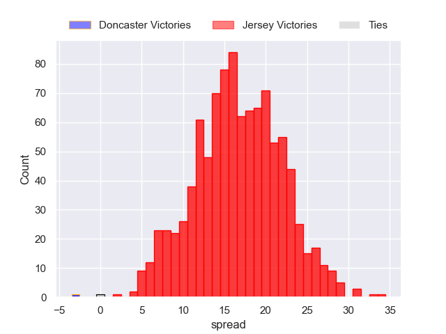

### Caldy V Ampthill on 2024/04/06

Average Margin: Ampthill by 0.0

## Week 20

### Hartpury College V Cornish Pirates on 2024/04/13

Average Margin: Cornish Pirates by 5.7

### Nottingham V Coventry on 2024/04/13

Average Margin: Coventry by 7.8

### Doncaster V Caldy on 2024/04/13

Average Margin: Doncaster by 11.6

### Cambridge V London Scottish on 2024/04/13

Average Margin: London Scottish by 7.6

### Ealing Trailfinders V Jersey on 2024/04/13

Average Margin: Ealing Trailfinders by 7.6

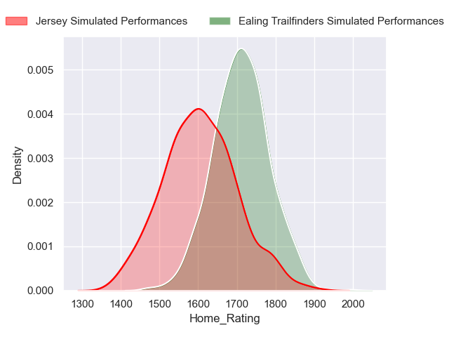

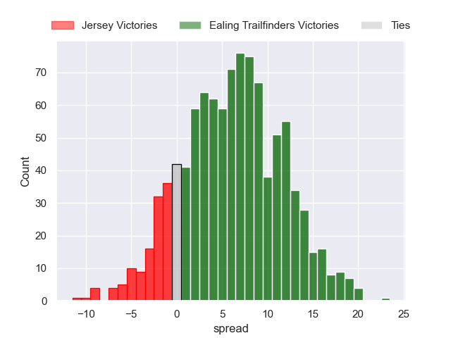

### Bedford V Ampthill on 2024/04/13

Average Margin: Bedford by 13.4

## Week 21

### Caldy V Ealing Trailfinders on 2024/04/20

Average Margin: Ealing Trailfinders by 23.6

### London Scottish V Nottingham on 2024/04/20

Average Margin: Nottingham by 5.3

### Cambridge V Cornish Pirates on 2024/04/20

Average Margin: Cornish Pirates by 22.9

### Jersey V Hartpury College on 2024/04/20

Average Margin: Jersey by 21.5

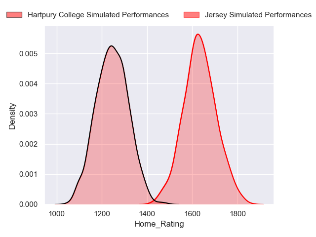

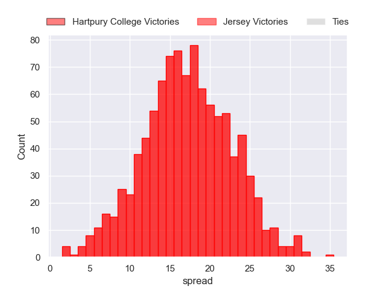

### Coventry V Bedford on 2024/04/20

Average Margin: Coventry by 8.1

### Ampthill V Doncaster on 2024/04/20

Average Margin: Doncaster by 1.6

### Cornish Pirates V Cambridge on 2024/04/21

Average Margin: Cornish Pirates by 29.7

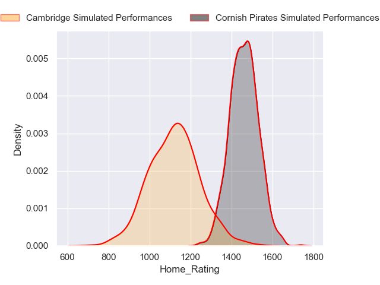

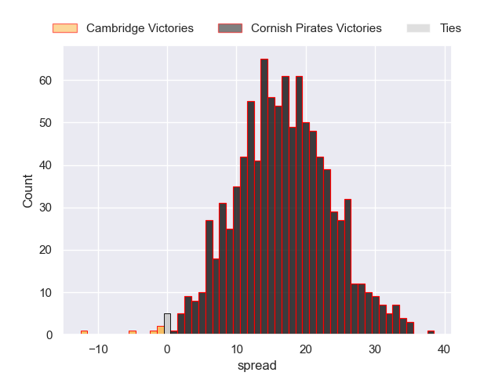

## Week 22

### Cambridge V Jersey on 2024/05/04

Average Margin: Jersey by 31.7

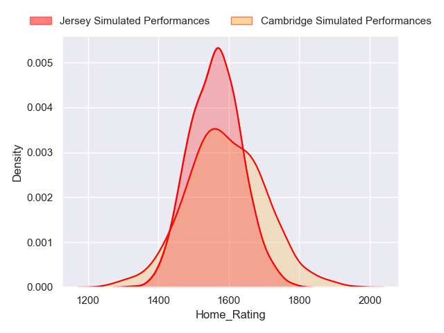

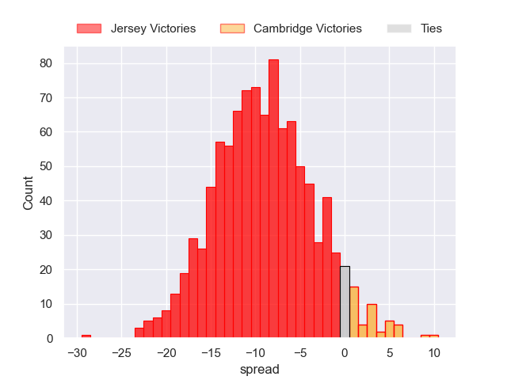

### Bedford V Doncaster on 2024/05/04

Average Margin: Bedford by 8.5

### Hartpury College V Caldy on 2024/05/04

Average Margin: Hartpury College by 7.4

### Coventry V London Scottish on 2024/05/04

Average Margin: Coventry by 23.4

### Nottingham V Cornish Pirates on 2024/05/04

Average Margin: Cornish Pirates by 2.7

### Ealing Trailfinders V Ampthill on 2024/05/04

Average Margin: Ealing Trailfinders by 26.7

## Week 23

### Caldy V Cambridge on 2024/05/11

Average Margin: Caldy by 16.3

### Doncaster V Ealing Trailfinders on 2024/05/11

Average Margin: Ealing Trailfinders by 15.1

### Ampthill V Hartpury College on 2024/05/11

Average Margin: Ampthill by 2.6

### London Scottish V Bedford on 2024/05/11

Average Margin: Bedford by 11.6

### Cornish Pirates V Coventry on 2024/05/11

Average Margin: Coventry by 1.6

### Jersey V Nottingham on 2024/05/11

Average Margin: Jersey by 18.7

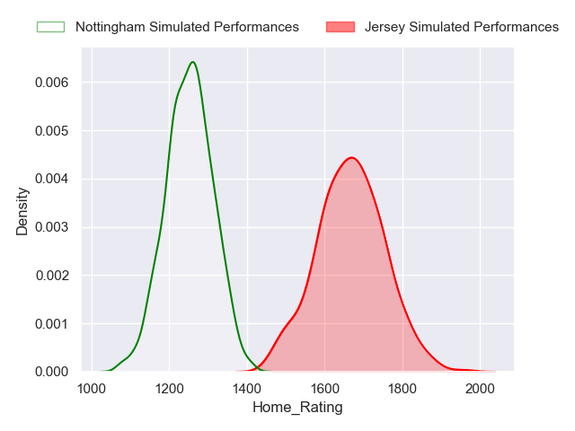

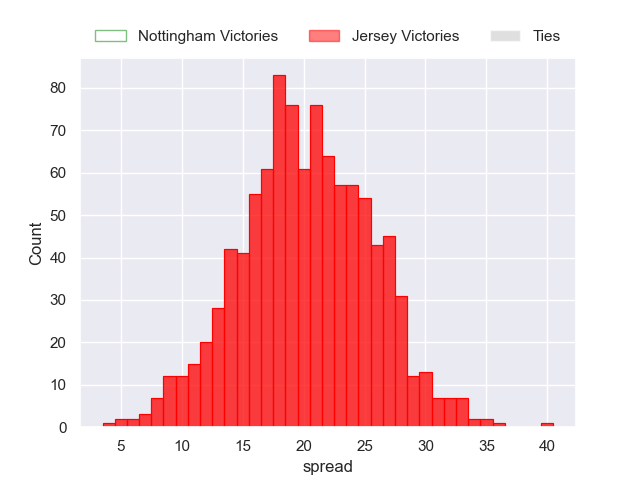

## Week 24

### Cambridge V Ampthill on 2024/05/25

Average Margin: Ampthill by 12.4

### Ealing Trailfinders V Bedford on 2024/05/25

Average Margin: Ealing Trailfinders by 16.7

### Nottingham V Caldy on 2024/05/25

Average Margin: Nottingham by 10.2

### Hartpury College V Doncaster on 2024/05/25

Average Margin: Doncaster by 1.0

### Coventry V Jersey on 2024/05/25

Average Margin: Jersey by 0.8

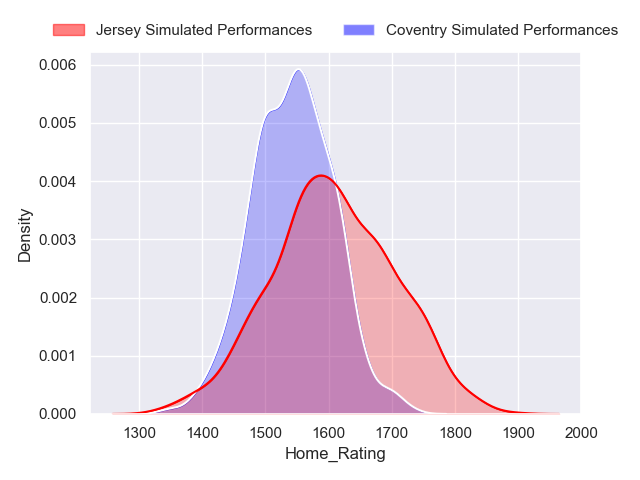

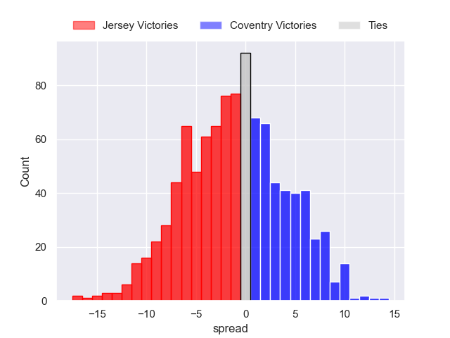

### London Scottish V Cornish Pirates on 2024/05/25

Average Margin: Cornish Pirates by 11.5

