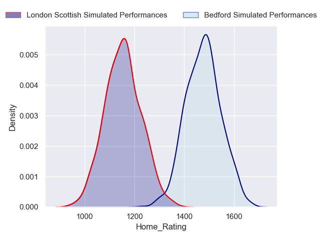
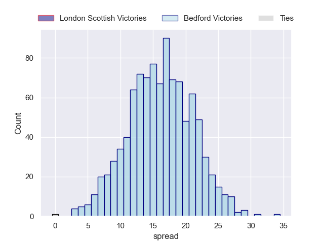

---  
title: "RFU Championship 2023 Status"  
date: 2024-01-22 6:00:00 -0500  
categories: model review projection  
layout: article  
aside:  
    toc: true  
---
# Current Team Rankings

# Standings

## Current Standings

| Club                |   Played |   Wins |   Point Differential |   Losing Bonus Points |   Try Bonus Points |   Competition Points |
|:--------------------|---------:|-------:|---------------------:|----------------------:|-------------------:|---------------------:|
| Ealing Trailfinders |        7 |      6 |                  139 |                     1 |                  6 |                   31 |
| Coventry            |        9 |      6 |                   85 |                     0 |                nan |                   31 |
| Cornish Pirates     |        8 |      6 |                   95 |                     1 |                nan |                   29 |
| Doncaster           |        9 |      6 |                   25 |                     1 |                nan |                   29 |
| Bedford             |        8 |      5 |                   76 |                     1 |                nan |                   25 |
| Hartpury College    |       10 |      5 |                   16 |                     2 |                nan |                   25 |
| Ampthill            |        8 |      4 |                   -3 |                     1 |                  5 |                   22 |
| Nottingham          |        9 |      4 |                  -47 |                     0 |                nan |                   22 |
| Caldy               |        9 |      3 |                 -134 |                     0 |                nan |                   16 |
| Cambridge           |        9 |      1 |                 -186 |                     3 |                  4 |                   11 |
| London Scottish     |        8 |      1 |                  -66 |                     4 |                nan |                   10 |

## Projected Remaining Table

| Club                |   Matches Remaining |   Wins |   Point Differential |   Losing Bonus Points |   Try Bonus Points |   Competition Points |
|:--------------------|--------------------:|-------:|---------------------:|----------------------:|-------------------:|---------------------:|
| Ealing Trailfinders |                  12 |   11.7 |            217.563   |                   0.3 |                8.8 |                 55.9 |
| Jersey              |                  12 |   10.6 |            170.536   |                   0.9 |                9.4 |                 52.7 |
| Coventry            |                  12 |    9.6 |             97.7567  |                   1.8 |                8.5 |                 48.6 |
| Bedford             |                  12 |    8.3 |             55.7311  |                   1.7 |                7.5 |                 42.4 |
| Cornish Pirates     |                  13 |    7.5 |             30.6139  |                   3.2 |                6.2 |                 39.3 |
| Hartpury College    |                  12 |    6.6 |             -1.15943 |                   2.8 |                4.5 |                 33.8 |
| Doncaster           |                  12 |    4.8 |            -35.0668  |                   3   |                4.5 |                 26.7 |
| Nottingham          |                  12 |    4.2 |            -58.3485  |                   3.5 |                5.2 |                 25.6 |
| Ampthill            |                  12 |    3.5 |            -82.0116  |                   2.9 |                3.8 |                 20.7 |
| Cambridge           |                  13 |    2.4 |           -140.54    |                   2.5 |                3   |                 15.2 |
| London Scottish     |                  12 |    2.1 |           -123.217   |                   3.2 |                2.3 |                 13.7 |
| Caldy               |                  12 |    1.7 |           -131.858   |                   2.4 |                3.7 |                 13   |

## Projected Total Table

| Club                |   Total Matches |   Wins |   Point Differential |   Losing Bonus Points |   Try Bonus Points |   Competition Points |
|:--------------------|----------------:|-------:|---------------------:|----------------------:|-------------------:|---------------------:|
| Ealing Trailfinders |              19 |   17.7 |             356.563  |                   1.3 |               14.8 |                 86.9 |
| Coventry            |              21 |   15.6 |             182.757  |                   1.8 |                8.5 |                 79.6 |
| Cornish Pirates     |              21 |   13.5 |             125.614  |                   4.2 |                6.2 |                 68.3 |
| Bedford             |              20 |   13.3 |             131.731  |                   2.7 |                7.5 |                 67.4 |
| Hartpury College    |              22 |   11.6 |              14.8406 |                   4.8 |                4.5 |                 58.8 |
| Doncaster           |              21 |   10.8 |             -10.0668 |                   4   |                4.5 |                 55.7 |
| Jersey              |              12 |   10.6 |             170.536  |                   0.9 |                9.4 |                 52.7 |
| Nottingham          |              21 |    8.2 |            -105.349  |                   3.5 |                5.2 |                 47.6 |
| Ampthill            |              20 |    7.5 |             -85.0116 |                   3.9 |                8.8 |                 42.7 |
| Caldy               |              21 |    4.7 |            -265.858  |                   2.4 |                3.7 |                 29   |
| Cambridge           |              22 |    3.4 |            -326.54   |                   5.5 |                7   |                 26.2 |
| London Scottish     |              20 |    3.1 |            -189.217  |                   7.2 |                2.3 |                 23.7 |

# Completed Match Review

| Model | Percent Correct Predictions | Spread Error |
| ------ | ------ | ------ |
| Club Level | 67.4% | 13.6 |
| Player Level: Lineup | 59.5% | 16.1 |
| Player Level: Minutes | 61.9% | 16.2 |

# Future Predictions

## Week 11

### Nottingham V Jersey on 2024/01/26

Average Margin: Jersey by 14.5

Average Scoreline: 36-21

### Bedford V London Scottish on 2024/01/26

Average Margin: Bedford by 16.1

Average Scoreline: 43-27

### Coventry V Cornish Pirates on 2024/01/27

Average Margin: Coventry by 7.8

Average Scoreline: 35-27

### Hartpury College V Ampthill on 2024/01/27

Average Margin: Hartpury College by 8.2

Average Scoreline: 37-28

### Cambridge V Caldy on 2024/01/27

Average Margin: Cambridge by 2.4

Average Scoreline: 29-26

### Ealing Trailfinders V Doncaster on 2024/01/27

Average Margin: Ealing Trailfinders by 20.7

Average Scoreline: 43-22

## Week 12

### Caldy V Coventry on 2024/02/03

Average Margin: Coventry by 14.1

Average Scoreline: 33-19

### Jersey V London Scottish on 2024/02/03

Average Margin: Jersey by 26.1

Average Scoreline: 45-19

### Doncaster V Cambridge on 2024/02/03

Average Margin: Doncaster by 14.5

Average Scoreline: 39-24

### Ampthill V Nottingham on 2024/02/03

Average Margin: Ampthill by 1.5

Average Scoreline: 32-31

### Ealing Trailfinders V Hartpury College on 2024/02/03

Average Margin: Ealing Trailfinders by 20.6

Average Scoreline: 40-20

### Bedford V Cornish Pirates on 2024/02/03

Average Margin: Bedford by 4.3

Average Scoreline: 33-28

## Week 13

### Cornish Pirates V Jersey on 2024/02/23

Average Margin: Jersey by 7.4

Average Scoreline: 34-27

### Cambridge V Ealing Trailfinders on 2024/02/24

Average Margin: Ealing Trailfinders by 24.4

Average Scoreline: 45-20

### Nottingham V Doncaster on 2024/02/24

Average Margin: Nottingham by 0.6

Average Scoreline: 35-34

### Hartpury College V Bedford on 2024/02/24

Average Margin: Bedford by 1.1

Average Scoreline: 33-32

### London Scottish V Caldy on 2024/02/24

Average Margin: London Scottish by 4.5

Average Scoreline: 27-23

### Coventry V Ampthill on 2024/02/24

Average Margin: Coventry by 16.5

Average Scoreline: 39-23

## Week 14

### Ealing Trailfinders V Nottingham on 2024/03/02

Average Margin: Ealing Trailfinders by 23.5

Average Scoreline: 48-25

### Hartpury College V Cambridge on 2024/03/02

Average Margin: Hartpury College by 13.9

Average Scoreline: 39-25

### Ampthill V London Scottish on 2024/03/02

Average Margin: Ampthill by 6.6

Average Scoreline: 31-24

### Caldy V Cornish Pirates on 2024/03/02

Average Margin: Cornish Pirates by 9.9

Average Scoreline: 33-24

### Doncaster V Coventry on 2024/03/02

Average Margin: Coventry by 4.9

Average Scoreline: 30-25

### Bedford V Jersey on 2024/03/02

Average Margin: Jersey by 6.4

Average Scoreline: 37-31

## Week 15

### Cornish Pirates V Ampthill on 2024/03/09

Average Margin: Cornish Pirates by 11.8

Average Scoreline: 38-26

### Nottingham V Hartpury College on 2024/03/09

Average Margin: Nottingham by 0.6

Average Scoreline: 36-36

### Cambridge V Bedford on 2024/03/09

Average Margin: Bedford by 11.9

Average Scoreline: 32-21

### Coventry V Ealing Trailfinders on 2024/03/09

Average Margin: Ealing Trailfinders by 5.2

Average Scoreline: 38-32

### Jersey V Caldy on 2024/03/09

Average Margin: Jersey by 27.2

Average Scoreline: 51-24

### London Scottish V Doncaster on 2024/03/09

Average Margin: Doncaster by 4.8

Average Scoreline: 30-25

## Week 16

### Cambridge V Nottingham on 2024/03/23

Average Margin: Nottingham by 4.1

Average Scoreline: 33-29

### Bedford V Caldy on 2024/03/23

Average Margin: Bedford by 17.1

Average Scoreline: 40-23

### Ealing Trailfinders V London Scottish on 2024/03/23

Average Margin: Ealing Trailfinders by 28.7

Average Scoreline: 48-20

### Ampthill V Jersey on 2024/03/23

Average Margin: Jersey by 15.8

Average Scoreline: 40-25

### Doncaster V Cornish Pirates on 2024/03/23

Average Margin: Cornish Pirates by 0.2

Average Scoreline: 31-30

### Hartpury College V Coventry on 2024/03/23

Average Margin: Coventry by 4.8

Average Scoreline: 30-25

## Week 17

### Cornish Pirates V Ealing Trailfinders on 2024/04/06

Average Margin: Ealing Trailfinders by 10.3

Average Scoreline: 35-25

### Jersey V Doncaster on 2024/04/06

Average Margin: Jersey by 17.8

Average Scoreline: 41-24

### Caldy V Ampthill on 2024/04/06

Average Margin: Ampthill by 1.3

Average Scoreline: 30-29

### London Scottish V Hartpury College on 2024/04/06

Average Margin: Hartpury College by 4.8

Average Scoreline: 30-26

### Nottingham V Bedford on 2024/04/06

Average Margin: Bedford by 4.1

Average Scoreline: 29-24

### Coventry V Cambridge on 2024/04/06

Average Margin: Coventry by 21.7

Average Scoreline: 44-22

## Week 18

### Doncaster V Caldy on 2024/04/13

Average Margin: Doncaster by 13.0

Average Scoreline: 38-25

### Ealing Trailfinders V Jersey on 2024/04/13

Average Margin: Ealing Trailfinders by 6.2

Average Scoreline: 32-26

### Bedford V Ampthill on 2024/04/13

Average Margin: Bedford by 12.8

Average Scoreline: 37-24

### Hartpury College V Cornish Pirates on 2024/04/13

Average Margin: Cornish Pirates by 0.5

Average Scoreline: 27-26

### Cambridge V London Scottish on 2024/04/13

Average Margin: Cambridge by 1.2

Average Scoreline: 27-25

### Nottingham V Coventry on 2024/04/13

Average Margin: Coventry by 7.8

Average Scoreline: 30-22

## Week 19

### London Scottish V Nottingham on 2024/04/20

Average Margin: Nottingham by 1.7

Average Scoreline: 27-26

### Caldy V Ealing Trailfinders on 2024/04/20

Average Margin: Ealing Trailfinders by 23.4

Average Scoreline: 38-14

### Ampthill V Doncaster on 2024/04/20

Average Margin: Doncaster by 1.5

Average Scoreline: 33-31

### Jersey V Hartpury College on 2024/04/20

Average Margin: Jersey by 17.6

Average Scoreline: 39-21

### Cambridge V Cornish Pirates on 2024/04/20

Average Margin: Cornish Pirates by 10.4

Average Scoreline: 34-24

### Coventry V Bedford on 2024/04/20

Average Margin: Coventry by 6.9

Average Scoreline: 35-28

### Cornish Pirates V Cambridge on 2024/04/21

Average Margin: Cornish Pirates by 17.0

Average Scoreline: 41-24

## Week 20

### Nottingham V Cornish Pirates on 2024/05/04

Average Margin: Cornish Pirates by 3.2

Average Scoreline: 30-27

### Ealing Trailfinders V Ampthill on 2024/05/04

Average Margin: Ealing Trailfinders by 25.3

Average Scoreline: 49-24

### Cambridge V Jersey on 2024/05/04

Average Margin: Jersey by 20.8

Average Scoreline: 28-7

### Coventry V London Scottish on 2024/05/04

Average Margin: Coventry by 19.8

Average Scoreline: 44-24

### Bedford V Doncaster on 2024/05/04

Average Margin: Bedford by 7.9

Average Scoreline: 40-32

### Hartpury College V Caldy on 2024/05/04

Average Margin: Hartpury College by 12.6

Average Scoreline: 38-26

## Week 21

### Ampthill V Hartpury College on 2024/05/11

Average Margin: Hartpury College by 1.4

Average Scoreline: 30-29

### Cornish Pirates V Coventry on 2024/05/11

Average Margin: Coventry by 1.1

Average Scoreline: 26-25

### London Scottish V Bedford on 2024/05/11

Average Margin: Bedford by 9.3

Average Scoreline: 38-28

### Caldy V Cambridge on 2024/05/11

Average Margin: Caldy by 3.4

Average Scoreline: 31-28

### Jersey V Nottingham on 2024/05/11

Average Margin: Jersey by 20.5

Average Scoreline: 42-22

### Doncaster V Ealing Trailfinders on 2024/05/11

Average Margin: Ealing Trailfinders by 13.7

Average Scoreline: 38-25

## Week 22

### Nottingham V Caldy on 2024/05/25

Average Margin: Nottingham by 9.8

Average Scoreline: 38-28

### Cambridge V Ampthill on 2024/05/25

Average Margin: Ampthill by 1.9

Average Scoreline: 32-30

### Ealing Trailfinders V Bedford on 2024/05/25

Average Margin: Ealing Trailfinders by 15.6

Average Scoreline: 40-24

### Hartpury College V Doncaster on 2024/05/25

Average Margin: Hartpury College by 3.2

Average Scoreline: 29-26

### London Scottish V Cornish Pirates on 2024/05/25

Average Margin: Cornish Pirates by 8.5

Average Scoreline: 35-27

### Coventry V Jersey on 2024/05/25

Average Margin: Jersey by 2.6

Average Scoreline: 28-25

