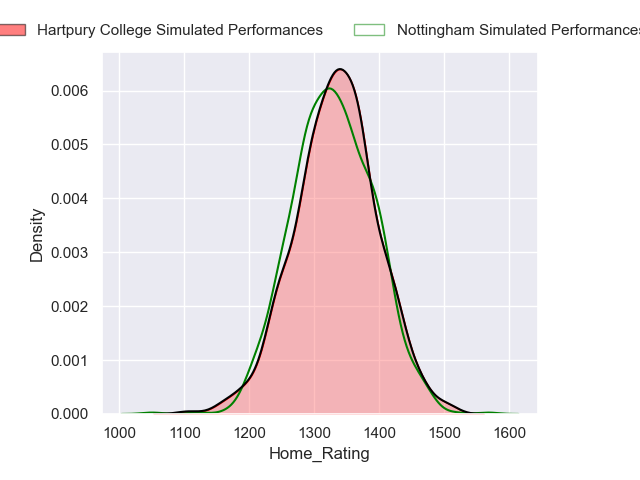
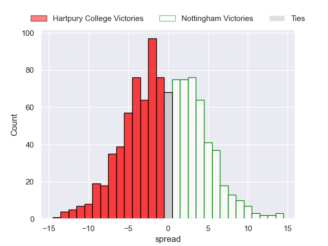

---  
title: "RFU Championship 2023 Status"  
date: 2024-03-04 6:00:00 -0500  
categories: model review projection  
layout: article  
aside:  
    toc: true  
---
# Current Team Rankings

# Standings

## Current Standings

| Club                |   Played |   Wins |   Point Differential |   Losing Bonus Points |   Try Bonus Points |   Competition Points |
|:--------------------|---------:|-------:|---------------------:|----------------------:|-------------------:|---------------------:|
| Ealing Trailfinders |       12 |     11 |                  277 |                     1 |                nan |                   54 |
| Coventry            |       13 |      8 |                  122 |                     2 |                nan |                   42 |
| Cornish Pirates     |       12 |      9 |                   93 |                     1 |                nan |                   42 |
| Hartpury College    |       14 |      8 |                   64 |                     2 |                nan |                   40 |
| Doncaster           |       13 |      8 |                    8 |                     1 |                nan |                   39 |
| Bedford             |       13 |      7 |                   69 |                     4 |                nan |                   38 |
| Ampthill            |       12 |      5 |                  -35 |                     2 |                nan |                   29 |
| Nottingham          |       12 |      5 |                  -72 |                     1 |                nan |                   28 |
| Caldy               |       13 |      4 |                 -147 |                     1 |                nan |                   24 |
| Cambridge           |       13 |      2 |                 -283 |                     3 |                nan |                   16 |
| London Scottish     |       11 |      1 |                  -96 |                     5 |                nan |                   14 |

## Projected Remaining Table

| Club                |   Matches Remaining |   Wins |   Point Differential |   Losing Bonus Points |   Try Bonus Points |   Competition Points |
|:--------------------|--------------------:|-------:|---------------------:|----------------------:|-------------------:|---------------------:|
| Ealing Trailfinders |                   8 |    7.7 |            125.653   |                   0.3 |                5.8 |                 36.8 |
| Jersey              |                   8 |    6.9 |            115.138   |                   0.6 |                5.5 |                 33.7 |
| Cornish Pirates     |                   9 |    6.8 |             54.1868  |                   1.5 |                4.9 |                 33.5 |
| Coventry            |                   8 |    5.4 |             47.4531  |                   1.8 |                4.8 |                 28.3 |
| Bedford             |                   8 |    5.4 |             21.3822  |                   1   |                4.2 |                 26.7 |
| Hartpury College    |                   8 |    4.6 |              3.21192 |                   2   |                3.1 |                 23.5 |
| Nottingham          |                   8 |    3.3 |            -21.8587  |                   2.6 |                3.4 |                 19.2 |
| Doncaster           |                   8 |    3.1 |            -25.3066  |                   2.2 |                3.1 |                 17.8 |
| Cambridge           |                   9 |    2   |            -79.0616  |                   2.1 |                2.6 |                 12.6 |
| Ampthill            |                   8 |    1.5 |            -73.1783  |                   2.2 |                3.8 |                 12.1 |
| Caldy               |                   8 |    1.4 |            -83.9222  |                   1.4 |                3.4 |                 10.5 |
| London Scottish     |                   8 |    0.9 |            -83.6979  |                   2.6 |                2.3 |                  8.6 |

## Projected Total Table

| Club                |   Total Matches |   Wins |   Point Differential |   Losing Bonus Points |   Try Bonus Points |   Competition Points |
|:--------------------|----------------:|-------:|---------------------:|----------------------:|-------------------:|---------------------:|
| Ealing Trailfinders |              20 |   18.7 |             402.653  |                   1.3 |                5.8 |                 90.8 |
| Cornish Pirates     |              21 |   15.8 |             147.187  |                   2.5 |                4.9 |                 75.5 |
| Coventry            |              21 |   13.4 |             169.453  |                   3.8 |                4.8 |                 70.3 |
| Bedford             |              21 |   12.4 |              90.3822 |                   5   |                4.2 |                 64.7 |
| Hartpury College    |              22 |   12.6 |              67.2119 |                   4   |                3.1 |                 63.5 |
| Doncaster           |              21 |   11.1 |             -17.3066 |                   3.2 |                3.1 |                 56.8 |
| Nottingham          |              20 |    8.3 |             -93.8587 |                   3.6 |                3.4 |                 47.2 |
| Ampthill            |              20 |    6.5 |            -108.178  |                   4.2 |                3.8 |                 41.1 |
| Caldy               |              21 |    5.4 |            -230.922  |                   2.4 |                3.4 |                 34.5 |
| Jersey              |               8 |    6.9 |             115.138  |                   0.6 |                5.5 |                 33.7 |
| Cambridge           |              22 |    4   |            -362.062  |                   5.1 |                2.6 |                 28.6 |
| London Scottish     |              19 |    1.9 |            -179.698  |                   7.6 |                2.3 |                 22.6 |

# Completed Match Review

| Model | Percent Correct Predictions | Spread Error |
| ------ | ------ | ------ |
| Club Level | 66.2% | 13.1 |
| Player Level: Lineup | 63.3% | 14.5 |
| Player Level: Minutes | 65.0% | 14.4 |

# Future Predictions

## Week 15

### Nottingham V Hartpury College on 2024/03/08

Average Margin: Hartpury College by 0.2

Average Scoreline: 30-30

### London Scottish V Doncaster on 2024/03/09

Average Margin: Doncaster by 5.4

Average Scoreline: 30-25

### Cambridge V Bedford on 2024/03/09

Average Margin: Bedford by 8.0

Average Scoreline: 34-26

### Cornish Pirates V Ampthill on 2024/03/09

Average Margin: Cornish Pirates by 14.1

Average Scoreline: 32-18

### Jersey V Caldy on 2024/03/09

Average Margin: Jersey by 25.4

Average Scoreline: 48-23

### Coventry V Ealing Trailfinders on 2024/03/09

Average Margin: Ealing Trailfinders by 5.6

Average Scoreline: 30-24

## Week 16

### Ealing Trailfinders V London Scottish on 2024/03/23

Average Margin: Ealing Trailfinders by 29.1

Average Scoreline: 43-14

### Ampthill V Jersey on 2024/03/23

Average Margin: Jersey by 16.6

Average Scoreline: 34-17

### Hartpury College V Coventry on 2024/03/23

Average Margin: Coventry by 3.2

Average Scoreline: 23-20

### Bedford V Caldy on 2024/03/23

Average Margin: Bedford by 13.5

Average Scoreline: 36-22

### Cambridge V Nottingham on 2024/03/23

Average Margin: Nottingham by 2.4

Average Scoreline: 37-35

### Doncaster V Cornish Pirates on 2024/03/23

Average Margin: Cornish Pirates by 2.1

Average Scoreline: 29-27

## Week 17

### Coventry V Cambridge on 2024/04/06

Average Margin: Coventry by 19.6

Average Scoreline: 35-16

### Cornish Pirates V Ealing Trailfinders on 2024/04/06

Average Margin: Ealing Trailfinders by 7.9

Average Scoreline: 32-24

### London Scottish V Hartpury College on 2024/04/06

Average Margin: Hartpury College by 6.0

Average Scoreline: 28-21

### Nottingham V Bedford on 2024/04/06

Average Margin: Bedford by 2.0

Average Scoreline: 28-26

### Caldy V Ampthill on 2024/04/06

Average Margin: Caldy by 1.1

Average Scoreline: 34-33

### Jersey V Doncaster on 2024/04/06

Average Margin: Jersey by 17.9

Average Scoreline: 39-21

## Week 18

### Doncaster V Caldy on 2024/04/13

Average Margin: Doncaster by 10.7

Average Scoreline: 33-23

### Nottingham V Coventry on 2024/04/13

Average Margin: Coventry by 6.9

Average Scoreline: 28-21

### Hartpury College V Cornish Pirates on 2024/04/13

Average Margin: Cornish Pirates by 1.3

Average Scoreline: 26-25

### Bedford V Ampthill on 2024/04/13

Average Margin: Bedford by 11.0

Average Scoreline: 42-31

### Cambridge V London Scottish on 2024/04/13

Average Margin: Cambridge by 3.0

Average Scoreline: 34-31

### Ealing Trailfinders V Jersey on 2024/04/13

Average Margin: Ealing Trailfinders by 5.6

Average Scoreline: 31-25

## Week 19

### Jersey V Hartpury College on 2024/04/20

Average Margin: Jersey by 17.0

Average Scoreline: 34-17

### Caldy V Ealing Trailfinders on 2024/04/20

Average Margin: Ealing Trailfinders by 20.6

Average Scoreline: 34-14

### Ampthill V Doncaster on 2024/04/20

Average Margin: Doncaster by 2.0

Average Scoreline: 30-28

### London Scottish V Nottingham on 2024/04/20

Average Margin: Nottingham by 2.6

Average Scoreline: 37-34

### Cambridge V Cornish Pirates on 2024/04/20

Average Margin: Cornish Pirates by 10.5

Average Scoreline: 31-20

### Coventry V Bedford on 2024/04/20

Average Margin: Coventry by 8.6

Average Scoreline: 32-24

### Cornish Pirates V Cambridge on 2024/04/21

Average Margin: Cornish Pirates by 17.7

Average Scoreline: 42-24

## Week 20

### Nottingham V Cornish Pirates on 2024/05/04

Average Margin: Cornish Pirates by 4.8

Average Scoreline: 30-25

### Hartpury College V Caldy on 2024/05/04

Average Margin: Hartpury College by 11.6

Average Scoreline: 34-23

### Coventry V London Scottish on 2024/05/04

Average Margin: Coventry by 19.5

Average Scoreline: 41-21

### Bedford V Doncaster on 2024/05/04

Average Margin: Bedford by 5.7

Average Scoreline: 33-28

### Cambridge V Jersey on 2024/05/04

Average Margin: Jersey by 19.6

Average Scoreline: 38-19

### Ealing Trailfinders V Ampthill on 2024/05/04

Average Margin: Ealing Trailfinders by 25.6

Average Scoreline: 47-21

## Week 21

### Doncaster V Ealing Trailfinders on 2024/05/11

Average Margin: Ealing Trailfinders by 13.4

Average Scoreline: 34-20

### Cornish Pirates V Coventry on 2024/05/11

Average Margin: Cornish Pirates by 1.2

Average Scoreline: 35-34

### Caldy V Cambridge on 2024/05/11

Average Margin: Caldy by 4.4

Average Scoreline: 33-29

### Jersey V Nottingham on 2024/05/11

Average Margin: Jersey by 20.7

Average Scoreline: 42-22

### London Scottish V Bedford on 2024/05/11

Average Margin: Bedford by 7.7

Average Scoreline: 28-21

### Ampthill V Hartpury College on 2024/05/11

Average Margin: Hartpury College by 2.6

Average Scoreline: 32-29

## Week 22

### Nottingham V Caldy on 2024/05/25

Average Margin: Nottingham by 7.7

Average Scoreline: 30-22

### London Scottish V Cornish Pirates on 2024/05/25

Average Margin: Cornish Pirates by 10.4

Average Scoreline: 32-22

### Cambridge V Ampthill on 2024/05/25

Average Margin: Cambridge by 0.1

Average Scoreline: 36-36

### Coventry V Jersey on 2024/05/25

Average Margin: Jersey by 3.6

Average Scoreline: 27-23

### Ealing Trailfinders V Bedford on 2024/05/25

Average Margin: Ealing Trailfinders by 17.8

Average Scoreline: 37-19

### Hartpury College V Doncaster on 2024/05/25

Average Margin: Hartpury College by 4.3

Average Scoreline: 34-30

